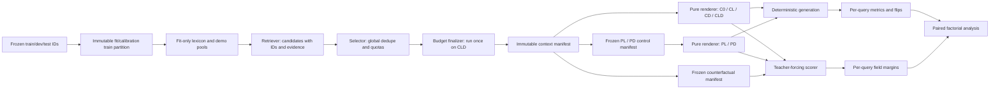

# Stage 1 P0 实施规格：四字段、无泄漏与可配对因果评测

> [!IMPORTANT]
> **实时执行状态、当前有效 refs、阻断项和可复制命令以 [Stage 1 P0 执行状态](stage1-p0-execution-status.md) 为准。**
> 本文是冻结的设计与验收规格；其中较早的 CLI 示例可能落后于当前实现，不能替代执行状态文档中的已核验命令。

> 状态：v1 决策已冻结，P0 工程实现已推进到外部/人工阻断边界；机器可读来源为 `config/stage1/decision_register.json`
> 上位计划：[声明式知识与检索示例的因果错误诊断：六阶段实验计划](causal-context-six-stage-plan.md)
> P0 目标：建立 Stage 1 正式实验所需的可复现基础设施；P0 本身不产生性能或因果结论。

## 0. 2026-08-23 实现收口说明

下表记录冻结设计在当前代码中的实际落地状态；若本文后续“建议实现”措辞与该表
冲突，以当前代码、schema 和 [执行状态](stage1-p0-execution-status.md)为准。

| 范围 | 当前实现 | 未闭环项 |
|---|---|---|
| WP1 数据审计与盲审 | data-audit validator 会对原始 std source、source inventory、split、34 条 blocking issues、99 条 warnings、rubric/template/report/provenance 与完整 payload 做深度重放。30 条 group–hate D14 首轮已封存为 10 auto accepted + 20 human corrected，另有 4 条 field-type human corrected；最终 34 行、签署 declaration 与 blind composition 已发布为正式 data `data-1e2fdc07cf916a7faad2a9f6586b0809ff825883d296527ef6b25ea68ab45843`，payload `7cadd0929c59481e82b3e0a1aff01830109dcca692860b73a44b287b1c6ce85d`。 | WP1 data freeze 已闭环；既有 D14 target 不应重复调用 API。 |
| WP1 train partition | full-information-isolated partition `tpart-dc73828edb28d36b4da72268914bea6b0ee94c2fa0e2bd37762829e6523eeb19` 已发布并重放；payload `c98edd5243b1c7153d583937a20444d5d7b1eca4a2d4f100e3c884672e7c788c`，5781 train 完整分为 5165 fit / 616 calibration，跨区 content hash 交集为 0。 | WP1 partition 已闭环；后续必须显式绑定该 immutable ref。 |
| WP3 fit-only 术语理解库 | 主实验资源已改为 `terminology-understanding-library/v1`。正式 builder 使用同进程一次性 preflight capability，精确绑定 `dataset=full`、config/data/partition/fit、主 builder/protocol source；候选只来自 fit utterance content，不读取 `target/argument/targeted_group/hateful`，calibration 对 candidate/support/LLM input 的贡献必须为 0。候选目标是“解释是否有助于理解”，中性身份简称、网络俚语、贬义/回收用法、隐语和语境依赖表达均可进入；正式条目禁止 `category/categories`。当前 canonical config hash 为 `e95d01ec695402299fe61230fb8c97c582c3f54d8d5e4b3fcc9f0dcfa447e811`，名义上限仍为 1000 候选、3000 web query 与 3000 LLM candidate judgements。 | 旧“群体损贬词典”attempt 1/2 及其 checkpoint、额度估计和授权不属于新资源协议，不能恢复或发布为主实验库。新术语理解库尚未进行正式付费 build；执行前必须重新 preflight、重新授权并确认 Web 额度。 |
| WP5 formal context/control | context ID 现精确绑定 system/user/example prompt bytes、prompt/context/retrieval renderer code 与 thinking mode；术语库条目从数据层即不存在 `category/categories`，模型可见 block 与 semantic retrieval text 统一采用 `category-free-terminology-evidence/v1`，包含 term/definition、可选 usage_notes/ambiguity_notes/variants。formal tokenizer 和 embedding scorer 均冻结完整 regular-file tree、`local_files_only=true`、`trust_remote_code=false`，并在 constructor、encode、render、build/validate 全操作期间持有验证 lease。control 不再按任务类别匹配词典项，而以统一 `terminology` evidence kind 配额并匹配条目数、token 长度、低相似与无词面重合。builder 会从正式 data、partition 与 terminology target 重建完整 source frame。 | 2026-08-26 category-free terminology 改动使此前 prompt/context/control/receipt 只具历史意义；正式 data/partition 已就绪，仍等待新术语库、新 context 与新 receipt，真实 frozen sealed integration 尚未执行。 |
| WP6 训练 | training evidence 现显式绑定 `base_model_ref`，从注册 base 解析完整 tokenizer tree，并让 evidence build/validate 与 schedule build/validate 的所有 tokenizer 操作始终处于同一 source lease 内；禁止返回 lease 外 tokenizer。plan/runtime 强绑定 partition、evidence/base lineage、environment、slot config、schedule 与 runtime code hash。DeepSpeed 逻辑路径、plan resolved object 与 hash 必须三者相等；正式 runtime 只向 `TrainingArguments` 注入经验证的独立 dict，并以 marker hash 复核，cwd 同名文件或路径回退均无效。canonical early stop 为 `eval_loss/min`、1–5 epochs、patience 3、threshold 0.001、同分最早 global step；receipt 保存逐 epoch history，registry 独立 replay winner、patience 与停止边界。 | 正式 partition 已生成；evidence/plan/schedule/checkpoint 尚未生成，正式训练未启动。 |
| WP8 generation/evaluation | formal vLLM 强制并审计 V1；保存 raw token IDs 与 backend stop reason。EOS 必须由注册 tokenizer 的末尾 EOS token 证明，文本须用 `skip_special_tokens=true, clean_up_tokenization_spaces=false` 独立 decode 重放；length 仅在恰达 token 上限且无 EOS 时成立，并作为 invalid 留在固定分母。当前 `gen-968a…` 在同一命令内对 120-row 冻结 frame **完整执行 2 次**、共 240 次真实 inference，逐记录/raw output/token/stop projection 全等、0 mismatch；`eval-4bda…` 精确消费该 target。 | 62/120 条输出为 length stop，strict format rate 仅 0.15–0.40；该 legacy engineering 链 `scientific_eligible=false`，只验证 plumbing、可追溯性与确定性，不是性能或因果结果。 |
| WP10 验收 | P0 validator 除逐 target 语义/hash 校验外，还要求 evaluation 精确消费所选 generation、generation/margin 精确共用 registry/context/control、analysis 精确包含所选 evaluation/margin refs；sealed boundary 使用递归 metadata-only 扫描。`vrec-feca…` 已证明冻结清单 17/17 实际 subprocess、Python compile、JSON parse/schema check 全部为 0、0 timeout，229-file Stage1 source/config/schema inventory 执行前后未变化；model-registry 22 个节点被精确覆盖一次。engineering/formal 报告的 `20 PASS / 1 BLOCKED / 8 PENDING / 0 FAIL` 与 `12 PASS / 0 BLOCKED / 18 PENDING / 0 FAIL` 仍是上一 receipt 下的历史快照，进入 WP4 前须按当前 receipt 重建。 | 正式 lexicon/CF/training/margin/analysis 等未闭环；engineering receipt 与阻断报告不能替代正式 DoD。 |

正式训练与正式 test 均未启动。当前 engineering smoke 已发布 2-repetition determinism
proof、严格 evaluation 与 verification receipt，但只证明失败路径、可追溯性和机制接口，
不是科学实验结果。

## 1. 执行摘要

Stage 1 的核心比较要求在**同一冻结 checkpoint、同一批 query、同一份检索结果**上，仅切换词典证据 $L$ 与示例证据 $D$，得到 C0、CL、CD、CLD 四个条件。P0 启动审计时，代码和历史产物尚不能满足这个可比性要求：正式链路仍以三字段为主，group 会被 parser 用来推断 hateful；完整词典直接使用了 test；验证/测试检索池没有严格限制为真实训练子集；检索结果缺少可审计 ID、分数与裁剪记录；四条件也不是从同一份最终上下文派生。上述工程契约现已实现并加入 fail-closed 校验，正式 data/partition 已闭环；但 lexicon/context/training/downstream artifacts 仍未闭环，因此尚不能据此报告科学结果。

因此，P0 的正确终点不是“跑出一张新指标表”，而是交付以下闭环：

1. 一个没有分隔符歧义的 canonical 四字段协议；
2. 一份冻结的 train/dev/test 数据谱系、独立 `train-partition`，以及只消费 fit 的词典与 demo pool；
3. 一份在 train/dev 上记录候选、选择、顺序、去重、预算裁剪和来源的 context manifest，以及 sealed-test builder；
4. 从 dev manifest 纯函数派生的 C0、CL、CD、CLD，以及独立冻结的 PL/PD control manifest；
5. 确定性推理、严格格式评测、四字段指标和 paired factorial 统计；
6. 冻结的 dev counterfactual manifest、foil quality artifact 与字段级 teacher-forcing scorer；
7. 阻断式自动验收，使任何泄漏、条件错位或静默容错都不能进入正式实验。

现有三字段 checkpoint `exps/full/llm_lexicon/exp_llm_lexicon_k10_2d2cf2a8ef/model/checkpoint-1446` 只用于 20–50 条工程 smoke，并统一记作 $M_{legacy}$。通过 P0 后，重新训练的四字段、fit-only-loss 模型才可被记作正式 $M_{LD}$；随后再进入 $M_{drop}$ 与完整 Stage 1。

## 2. P0 边界

### 2.1 P0 包含

- 数据语义、异常处理和 split 的版本化契约；
- 四字段 normalizer、serializer、strict/recover parser；
- full-information-isolated fit/calibration train partition lifecycle；
- fit-only 无类别术语理解库重建与 provenance 审计；
- 返回结构化 hit 的检索接口、跨类别全局去重、集合选择与顺序分离；
- 只在完整 CLD 上执行一次的预算裁剪；
- context manifest、condition renderer 和一致性 validator；
- 独立的 placebo control manifest、PL/PD renderer 与 validator；
- deterministic runner profile 与逐样本原始输出保存；
- 自由生成指标、flip、paired bootstrap、McNemar；
- counterfactual manifest 与 teacher-forcing margin scorer；
- 单元测试、fixture 集成测试和真实小样本 smoke。

### 2.2 P0 不包含

- 用旧三字段 checkpoint 得出正式 Stage 1 结论；
- 在完整 test 上调阈值、改 prompt、选 checkpoint 或决定是否补 seed；
- 正式训练 $M_{LD}$、$M_{drop}$，或资源扩展项 $M_0/M_L/M_D$；
- Stage 2 的 definition/category/demo 内容腐化实验；
- 对整个数据集重新标注 targeted group 语义；
- 以性能提升作为 P0 通过条件。

### 2.3 Test sealing

P0 的所有策略开发、coverage/overflow 调试和 smoke 只使用 train/dev。test 的原始文件与 ID/hash 可以在 split manifest 中登记并做盲数据质量裁决，但 P0 不生成可供查看和反复修改的 test context/control/CF/prediction artifact。待数据政策、context/control/CF policy、代码 hash、checkpoint、指标和统计计划全部在 dev 冻结后，再执行一次 sealed test build；test 上的 degenerate context、control/CF 缺失或预注册 overflow 按冻结规则报告，不能据此回改选择策略。

## 3. P0 启动时的基线审计与阻塞项

| 阻塞项 | 当前证据 | 对 Stage 1 的影响 | P0 处理 |
|---|---|---|---|
| 训练答案仍为三字段 | `src/data/build_data.py` 只拼接 target、argument、targeted_group | hateful 无法独立训练或干预 | 改用唯一四字段 serializer |
| prompt/demo 仍称“三元组” | `src/prompt.py` 的主 RAG 模板及示例模板 | 任务说明与研究变量不一致 | 新建固定四字段模板，旧模板保留为 legacy |
| parser 从 group 推断 hate | `src/utils/parser.py::parse_llm_output_trip` | group/hate 效应不可分，且 mixed tuple 会串值 | strict parser 禁止字段推导与三字段 fallback |
| pipe 协议已有真实碰撞 | train 中存在 argument `排外歧视很严重啊:-|` | `split("|")` 会误切字段 | 推荐 compact JSON wire format |
| 完整词典看过 test | `config/lexicon/full_llm.json` 同时列出 train 和 test | test 泄漏进入 term、support、定义和阈值 | 从真实 train 子集完整重建，不做事后过滤 |
| eval demo pool 包含 val | `src/data/build_data.py` 用全部 `raw_datas` 创建 eval retriever | dev 可检索 dev gold，形式上泄漏 | train/dev/test query 均只从真实 train pool 检索 |
| 跨类别 demo 未全局去重 | 当前 test prompt 约 30.4% 含重复 demo | 数量、类别配额与注意力位置失真 | merge evidence 后再全局选择与补位 |
| 长度处理改变 demo 数 | 当前 1605 个 test 中 312 个少于目标 10 demos | 各条件若各自裁剪，会改变干预对象 | 只对 CLD 裁剪一次，其余条件做保序子集删除 |
| 推理非确定 | 历史 runner 使用 temperature 0.7；多 seed 有输出差异 | 同 checkpoint 的条件差异混入采样噪声 | greedy、n=1、validation retry=0，并做逐字重跑测试 |
| base model 路径漂移 | 历史 finetune config 的路径与 workspace 实际 `models/base/*` 布局不一致 | 仅凭字符串无法证明训练/推理加载同一 base | 主实验冻结本地 `models/base/Qwen3-8B` 的完整 file-tree 与 tokenizer；源 recipe 只引用其 portable dependency |
| 指标只平均匹配 pair | 当前 target/argument similarity 不惩罚未匹配 tuple | 缺失预测可能反而抬高字段分数 | 最大权重匹配，未匹配项显式计零/FP/FN |
| group–hate 数据高度耦合 | `hate = (group != non-hate)` 在 train/test tuple 均约 99.69% 命中 | “可独立输出”不等于“存在独立语义通路” | hateful 预注册为次要字段，限制机制表述 |

已审计的数据规模为：train 原文件 6424 samples / 7630 tuples，test 1605 samples / 1902 tuples；非典型 group–hate tuple 为 train 24、test 6；mixed hateful-state samples 为 train 71、test 16。target/argument 也并非始终是输入文本的精确子串，因此 substring 检查只记录 warning，不能自动改写 gold 或直接判非法。

## 4. 不可妥协的实验不变量

| ID | 不变量 | 机器检查 |
|---|---|---|
| I1 | C0/CL/CD/CLD 的 query ID、顺序、content、gold 完全相同 | ID 集、ordinal 和 SHA-256 全等 |
| I2 | 四条件只从一份最终 CLD manifest 派生 | CL.L = CLD.L；CD.D = CLD.D；C0 两者为空 |
| I3 | 删除某类上下文后不得重新检索、补位、重排或恢复已裁剪项 | renderer 不持有 retriever；drop-tail 策略做精确前缀校验 |
| I4 | 词典与所有 query 的 demo 候选只能源于冻结 fit partition；calibration 对 loss、demo、lexicon 的贡献均为 0 | partition/内容 hash 交集审计为 0，provenance 全覆盖 |
| I5 | test 不参与生成、阈值、选择、checkpoint 或 counterfactual policy 调参 | resolved config 与输入 hash 审计 |
| I6 | targeted_group 与 hateful 独立解析、保存、替换和评分 | 禁止任何 group→hate 推导；独立反事实测试 |
| I7 | 已取得 completion 的 malformed/truncated output 始终留在分母；基础设施缺测不得伪装成模型错误 | invalid 按空预测；持续 transport/OOM 使 paired block 不完整并阻断分析 |
| I8 | 相同输入、manifest、checkpoint 和配置的运行逐字一致 | 单次 publication 内完整冻结 frame 重复 2 次；逐记录、raw output 与语义字段全等，`determinism.json` 可重放 |
| I9 | 稳定 ID 只由内容与稳定配置决定 | 各 lifecycle ID 不含时间戳；canonical JSON hash |
| I10 | query、prompt skeleton 和答案不能被字符串 tail truncation | overflow 显式失败；正式记录 `tail_truncated=false` |

## 5. 目标架构



模块边界必须保持：

- retriever 只返回候选，不拼 prompt；
- selector 不渲染文本；
- budget finalizer 只处理一次完整 CLD；
- control/CF builders 只读取 frozen context 和各自配置，分别写独立 artifact，不能读取正式 condition predictions；
- renderer 是无 IO、无检索模型的纯函数；
- runner 只消费 condition 文件，不再加载 embedding 模型或词典检索器；
- evaluator 只消费已冻结预测与 manifest，不修改预测或 gold。

## 6. 数据版本、split 与异常处理

### 6.1 固定 split

建议 v1 延续当前 90/10 前缀切分以减少无关变化，但不再在运行时按位置临时切分：

- train：原 `data/full/std/train.json` 的前 5781 条；
- dev：同一文件的后 643 条；
- test：`data/full/std/test.json` 的 1605 条。

P0 首先生成 `split_manifest.json`，逐条保存：

```json
{
  "schema_version": "stage1-split/v1",
  "source_sha256": "...",
  "policy": "prefix-90-10/v1",
  "train_ids": ["..."],
  "dev_ids": ["..."],
  "test_ids": ["..."],
  "train_ids_sha256": "...",
  "dev_ids_sha256": "...",
  "test_ids_sha256": "..."
}
```

之后任何组件只能读取 manifest 中的 ID，不再自行计算 `split_idx`。正式六阶段实验期间不把 dev 合并回 train，否则词典与 demo pool 的定义会在阶段间改变。

### 6.2 数据规范化层

原始文件只读。规范化数据本身也是 content-addressed 输入，不使用会被原地覆盖的 `data/full/stage1_v1/` 目录：

```text
exps/causal_context/stage1_p0/data/<data_build_id>/
  audit_ref.json
  data_blind_review_ref.json
  train.json
  dev.json
  test.json
  split_manifest.json
  adjudication_rows.jsonl
  adjudication_log.jsonl
  human_adjudication_queue.jsonl
  adjudication_frame.json
  reviewer_declaration.json
  audit_report.json
  provenance.json
  payload_manifest.json
```

外部 `data_ref.json` 锚定该 target；lexicon、context 和后续 builder 必须显式消费 `--data-ref`，不得按约定路径猜最新版本。每次修改必须在 `adjudication_log.jsonl` 保存 record ID、tuple index、旧值、新值、reason、reviewer 和时间，并产生新的 `data_build_id`；正式 hash 指向规范化 target，不覆盖原始数据。

数据落盘采用与 CF 相同的“proposal 不可变、人工文件可填写、final target 不可变”协议。`audit-data` 只读原始 train/test，建立 `stage1-data-audit/v1` target 与 `data_audit_ref.json`；随后由只读 `export-data-adjudication` 把 target 内的空模板复制到人工工作区，此时不得写 `data_ref.json`：

```text
data_audits/<data_audit_id>/
  config.resolved.json
  source_inventory.json
  split_manifest.proposed.json
  audit.meta.json
  issues.jsonl
  adjudication_rubric.md
  adjudication_rubric.meta.json
  adjudication_template.jsonl
  audit_report.json
  provenance.json
  payload_manifest.json
```

canonical rubric 来自 `config/stage1/data_adjudication_rubric.md`，正文只做 `CRLF→LF` 后按原始 UTF-8 bytes 求 hash；meta 固定为 `stage1-data-adjudication-rubric-meta/v1`，保存允许的 issue/decision/reason codes、`accept_allowed`、可编辑 JSON pointer、正文 hash 与 declaration schema version。`source_inventory.json` 按 logical source key 保存 repo-relative path、size 和 SHA-256，不含绝对路径。`data_audit_id = "daudit-" + sha256(canonical_json({schema_version, source_inventory_sha256, split_policy_sha256, audit_config_sha256, audit_rule_version, normalization_schema_version, rubric_body_sha256, rubric_meta_sha256, audit_code_sha256}))`。

公开 validator 不能只验证上述文件彼此自洽。它必须重新打开 hash-verified std source，按
冻结的 audit primitive/version 重建 source inventory、split、全部 issue/warning、adjudication
template、report、provenance、rubric/meta 与精确 payload file set，再与 target 逐字比较；
34 条 blocking issues 与 99 条 informational substring warnings 的 scope、顺序和 hash 均须
可重放。仅复制合法 meta、issue counts 和 payload manifest 组成的“自洽伪 artifact”必须
失败。audit ID 继续使用首次构建时已冻结的 audit-code 输入；后续同模块内与 audit 无关的
blind-review 功能变化不能事后重写历史 ID，但也不能绕过上述语义重放。

所有 JSONL hash 统一使用 `canonical-jsonl/v1`：按主键排序，每行 compact canonical JSON 和一个 `\n`，非空文件末尾也保留 `\n`，拒绝 NaN/Inf。每个 issue 的稳定主键不依赖建议修复值：`issue_id = "dissue:v1:" + sha256(canonical_json({issue_code, issue_rule_version, locations}))`；`locations` 是按 `(source_key,source_ordinal,tuple_index,json_pointer)` 排序的非空数组，因而 duplicate ID 等跨记录问题也能由一行稳定表达。同一 tuple 触发不同 issue code 时仍是多行，不能合并成顺序不稳定的字符串。`issues.jsonl` 每行至少是：

```json
{
  "schema_version": "stage1-data-audit-issue/v1",
  "data_audit_id": "daudit-...",
  "issue_id": "dissue:v1:aaaaaaaaaaaaaaaaaaaaaaaaaaaaaaaaaaaaaaaaaaaaaaaaaaaaaaaaaaaaaaaa",
  "issue_code": "group-hate-atypical",
  "issue_rule_version": "group-hate-audit/v1",
  "severity": "blocking",
  "locations": [
    {
      "source_key": "raw-train",
      "source_file_sha256": "...",
      "source_ordinal": 217,
      "split": "train",
      "source_record_id": "217",
      "source_record_sha256": "...",
      "tuple_index": 0,
      "json_pointer": "/quadruples/0/hateful",
      "observed_value_sha256": "..."
    }
  ],
  "accept_allowed": true,
  "allowed_edit_paths": ["/quadruples/0/targeted_group", "/quadruples/0/hateful"],
  "review_context": {
    "content": "示例文本",
    "tuple_before": {"target": "河南人", "argument": "偷井盖", "targeted_group": ["Region"], "hateful": "non-hate"}
  }
}
```

`review_context` 只是 audit 时冻结的只读 snapshot；finalizer 必须从 hash-verified raw source 重建，不能信任 reviewer 副本。`audit.meta.json` 保存 ordered issue-IDs SHA-256、总数、按 split/issue code 的计数和所有 ID 输入 hash。

reviewer 必须对 proposal 中每个 `issue_id` 恰好提交一行，不能漏、增或重复：

```json
{
  "schema_version": "stage1-data-adjudication-row/v1",
  "data_audit_id": "daudit-...",
  "issue_id": "dissue:v1:aaaaaaaaaaaaaaaaaaaaaaaaaaaaaaaaaaaaaaaaaaaaaaaaaaaaaaaaaaaaaaaa",
  "issue_kind": "group-hate",
  "decision": "accepted",
  "edits": [],
  "reason_code": "valid-independent-label-combination",
  "reason": "人工确认 group 与 hateful 标注可独立成立",
  "reviewer_id": "dual-blind-panel-v1",
  "reviewed_at": "2026-08-21T10:00:00+08:00"
}
```

`decision` 只能是 `accepted/corrected`。`accepted` 只在 issue 的 `accept_allowed=true` 时合法且 `edits=[]`；缺字段、未知标签或错误类型必须由 `corrected` 处理。`corrected` 的 edits 非空，只支持 `{"location_index":0,"op":"set","json_pointer":"...","value":...}`；path 必须属于 issue 的 allowlist，并按 `(location_index,json_pointer)` canonical 排序。对同一路径的冲突赋值 hard-fail；应用全部 edits 后必须重新跑完整 strict data/schema audit。reason code 必须来自 rubric 对 `issue_code × decision` 的 allowlist，reason/reviewer/reviewed_at 非空。

reviewer declaration 固定为 `stage1-data-reviewer-declaration/v1`，保存
`data_audit_id`、panel reviewer ID、rubric body/meta SHA-256、ordered issue-IDs
SHA-256、completed rows SHA-256，以及 `saw_condition_outputs=false`、
`saw_model_scores=false`、`attestation_confirmed=true`；任一不满足则不能用于正式数据，
且所有 row 的 reviewer ID 必须与声明一致。最终 review ID 还必须绑定 sealed 首轮盲审及其
精确自动/人工组成：

```text
data_review_id = "dreview-" + sha256(canonical_json({
  data_audit_id,
  data_blind_review_dependency,
  adjudication_rows_sha256,
  human_adjudication_queue_sha256,
  adjudication_frame_sha256,
  declaration_sha256
}))
```

`finalize-data --audit-ref --data-blind-review-ref --adjudication-file --reviewer-declaration` 校验 issue-ID 集精确相等、rubric/declaration hash 完整、越权/冲突 edit 为 0，并要求 blind artifact 精确覆盖 30 条 group-hate：sealed auto 行必须逐字段原样进入最终裁决，sealed human queue 必须逐条有人类完成；blind scope 之外仅允许由 audit 冻结的 4 条 field-type human-only queue，且不得自动代填。target 保存 `data_blind_review_ref.json`、canonical `adjudication_rows.jsonl`、`human_adjudication_queue.jsonl` 与 `adjudication_frame.json`。`data_build_id` 的 canonical inputs 同时绑定 audit/review dependency、final rows/log、queue/frame、split manifest、train/dev/test 文件内容、人工输入与 declaration/code hashes；因此 payload 改变不能保留原 ID。`validate-data` 从实际 target 文件重算这些 hash；依赖 target 可解析时还会重放 blind composition，原始 std source 可用时进一步重放 source + adjudication。无法携带原始 source 的可移植副本仍由全部输出内容 hash 强绑定。train/dev 冻结的同一 rubric hash 必须覆盖 test issue；不能因 test 内容另换 rubric。

### 6.3 非典型 group–hate 标注

当前 30 个非典型 tuple 大致包括 27 个“具体 group + non-hate”、2 个 hateful 缺失和 1 个 `group=non-hate, hateful=hate`。默认政策为：

1. 不用 group 自动补 hateful；
2. 两个高参数模型按冻结 rubric 独立完成第一轮盲审，彼此不可见，也不看任何实验模型输出、condition 或 split 名；
3. 两模型只有在结构化结论与修订值完全一致且均非低置信时才自动形成 consensus；分歧、解析失败、低置信项以及按 item ID 确定性抽取的 10% 一致项进入人类第二轮盲审；
4. 经确认的“具体 group + non-hate”原样保留，它们是字段解耦的重要自然样本；
5. 缺失与逻辑冲突必须形成最终人类/consensus 裁决；`quarantine` 只允许 P0 工程 smoke，不能解锁正式训练；
6. mixed-state 多 tuple 样本按 tuple 保留，用作 parser 串值测试；
7. 所有 accepted warning 也要有显式 reason，P0 只禁止“未裁决 warning”。

D14 的机器可验证合同固定为：`glm_high_parameter →
https://open.bigmodel.cn/api/paas/v4 + glm-5.3`，`deepseek_flash →
https://api.deepseek.com + deepseek-v4-flash`；policy 必须与
`config/stage1/blind_review.json` 全对象相等，包括 shuffle seed `42`、低置信阈值
`0.8`、一致项 QC `0.1`、temperature `0` 与单次请求。每条模型记录必须保留非空
`requested_model`/`returned_model`，二者经 NFKC、首尾空白去除和 case-fold 后精确
相等；provider base、完整 system/user prompt、request payload 与 prompt SHA-256 均由
validator 重建，raw response 中的 model/choice/judgement 也必须与规范化行一致。已有
30 条 sealed artifact 保持原字节不变；其中早期 DeepSeek 请求选项的兼容分支仅绑定
该 immutable retry lineage，不能被新 run 复用。

adjudication rubric 先在 train/dev 冻结，再由不知道任何 condition/model 输出的 reviewer 原样应用到 test；不能因 test 上某一异常模式修改 ontology 或实验 policy。test 的所有 change 进入 sealed audit log。

v1 不提供“只遮住 JSON 中 hateful token、其余字段继续训练”的隐式降级路径，因为当前 SFT pipeline 不能在保持 canonical response 的同时表达 partial gold。若暂时没有人工复核资源，`unknown` 只能停留在 adjudication 中间层，相关完整 tuple/sample 可进入工程 smoke 专用 quarantine，但正式训练保持阻塞。30 个非典型 tuple 必须全部达到 `accepted` 或 `corrected`，且 change log 完整，才允许正式训练；若要保留其他字段，需要另行设计显式 partial-loss protocol、metric eligibility 与敏感性分析，不能在本 P0 中临时实现。

当前执行状态是：30 条双模型首轮已封存在内容寻址的 `data-blind-review` target 中；
10 条严格一致 auto accepted、20 条人类二轮 corrected，另有 4 条 field-type human
corrected。精确 34 行与人类 declaration 已签署，正式 data artifact 已发布并通过
source + upstream adjudication 重放。该状态不授权重新调用模型或改写既有裁决。

### 6.4 Full-information-isolated train partition

`data_ref.json` 冻结后、任何词典/检索/训练 evidence 之前，必须先建立独立、
content-addressed 的 `stage1-train-partition/v1` target，并由外部
`train_partition_ref.json` 定位。它不是写回 data target 的临时字段，也不能由
lexicon/context/trainer 各自重新抽样。冻结策略为：

1. 覆盖正式 train 的全部 5781 条 canonical 数字 query ID；content 唯一允许的
   normalization 是 `CRLF→LF`，不做 strip、NFC 或其他 Unicode 改写；
2. 对 normalize 后的 UTF-8 content 求 SHA-256，并以相同 hash 组成 content cluster；
   一个 cluster 的代表 ID 是该簇最小的 canonical 数字 query ID，同内容记录必须整体
   落入同一 partition；
3. 对代表 ID 计算
   `sha256(canonical_json({assignment:"sha256-query-id-v1", query_id, salt:"stage1-train-calibration-v1"})) mod 10000`；
   bucket `<1000` 为 calibration，bucket `>=1000` 为 fit。这是名义 10% hash
   threshold，不要求恰好 578 条；
4. 当前冻结 5781 条 ID frame 的确定性重放结果是 **5165 fit / 616 calibration**；
   已发布 `tpart-dc73828edb28d36b4da72268914bea6b0ee94c2fa0e2bd37762829e6523eeb19`，
   payload `c98edd5243b1c7153d583937a20444d5d7b1eca4a2d4f100e3c884672e7c788c`；
5. validator 必须证明全覆盖、互斥、两侧非空、fit/calibration normalized-content
   hash 交集为 0，并从正式 data、config、builder code 重放每个 cluster 代表、bucket、
   partition、ordered-ID hash 与 payload hash。

该 partition 的信息隔离语义已经冻结为 `full-information-isolated`：只有 fit 记录进入
梯度 loss，词典 candidate/support/LLM input 和所有 query 的 demo 候选也只能来自
fit；616 条 calibration 的上述贡献都必须精确为 0。calibration 仅用于 early-stop
`eval_loss`，且其 prompt presentation 固定：demo order 与 $M_{drop}$ 的 L/D mask 均按
`presentation_epoch=1` 生成，在不同训练 epoch 不得改变。fit query 的 presentation
仍按实际 epoch 使用无状态随机流。partition policy、data dependency、配置/代码 hash、
逐行 `query_id/content_sha256/cluster_representative_query_id/bucket/partition` 和三组
ID hashes 都进入 immutable lifecycle；任何改变产生新的 `train_partition_id`，不得
覆盖旧 target。

### 6.5 fit-only 无类别术语理解库

当前 `data/lexicon/generated/full/lexicon.json` 及旧 WP3 群体损贬词典不能用于正式实验。P0 主资源必须从冻结 train partition 的 5165 条 fit 记录重建为无类别术语理解库：

- candidate term、频次、support examples 和 LLM 输入只来自 fit 的原始 utterance content；不得读取四元组标签或 target/argument/category 字段，calibration 贡献必须为 0；
- dev/test 不用于 inclusion threshold、候选筛选或人工挑选；
- 若使用网页检索，保存 query、URL、响应快照或内容 hash；
- 保存 builder config、代码版本、模型/API 版本、输入 ID hash、raw response hash；
- 每个词条生成基于模型可见语义字段的稳定 `lexicon_id`；
- provenance 不完整的历史/人工词典默认不进入正式 pool，除非单独完成来源审计。

术语理解库在 schema 层禁止 `category/categories/targeted_group/hateful` 以及
`primary_category/hate_count/label` 等任务标签派生字段，并非把这些字段藏到审计区。
正式 context 只把 `term`、`definition`、可选 `usage_notes`、
`ambiguity_notes` 和 `variants` 渲染为理解证据，semantic embedding 使用完全相同的
category-free block。`definition` 只陈述有证据支持的词义；`usage_notes` 陈述语域和典型
用法；`ambiguity_notes` 陈述中性、贬义、回收或非字面等可能解释，三者都不得预先给出
targeted_group/hateful 判断。支持频次和 provenance 可留在审计 metadata，但不得参与
类别型排序或注入模型。

准入问题不再是“它是否稳定损贬某群体”，而是“解释该表达是否实质帮助读者理解句意或
语用”。因此 `男同`、`基佬`、`舔狗` 都是**可候选**而非预设标签：前者可作为中性身份
简称，后两者可有俚语、贬义、回收或语境依赖用法。是否收录由 fit 上下文与独立词义证据
决定；收录也不意味着最终句子必然 hate 或指向某一类别。

不能只删除“仅在 test 出现”的词，因为已有词条的支持频次、示例和定义也可能被 test 影响。

当前正式配置已明确采用 clean build：`cache_enabled=false`、`cache_path=null`，
不再继承 legacy SQLite。formal CLI 必须在同一进程内用一次性 preflight
capability 将 config/data/partition/ref/fit、主 builder 与 formal protocol source 精确
绑定，且在任何目录创建、候选挖掘或网络请求前失败。当前 category-free canonical
config hash 为 `e95d01ec695402299fe61230fb8c97c582c3f54d8d5e4b3fcc9f0dcfa447e811`；
旧 preflight、付费授权和 partial checkpoint 均因资源角色、候选目标、响应 schema 与代码
hash 改变而失效，新协议尚未执行正式 preflight/build。Web evidence 限制为每候选最多 9 条、title 180 / snippet 320 /
URL 2048 / source 80 字符，DeepSeek returned model 与 token usage 必须进入可重放审计。
名义调用量为 3000 web / 3000 LLM，LLM 重试上限为 9000 attempts。可用 Tavily 额度
必须在新 preflight 前重新确认；完整外发/计费必须单独授权。旧
[WP3 正式付费 build 准备包](stage1-p0-wp3-paid-build-readiness.md)仅作历史记录。

## 7. Canonical 四字段协议

### 7.1 内部对象

```python
@dataclass(frozen=True)
class Quadruple:
    target: str | None
    argument: str | None
    targeted_group: tuple[str, ...]
    hateful: Literal["hate", "non-hate"]
```

外部旧数据中的 `targeted_group: "Sexism, Racism"` 由 adapter 转成 tuple；模型协议和内部计算不再依赖逗号字符串。

legacy ingest 与模型输出必须采用单向规则：source adapter 把 target/argument 中去除首尾空白后恰好等于字符串 `"NULL"` 的值映射为 Python `None`，把 source hateful=`"NULL"` 标成 `unknown_annotation` 并送入 adjudication，绝不猜标签；strict 模型输出中的字符串 `"NULL"` 一律报 `legacy_null_sentinel`，模型必须输出 JSON `null`。label alias（如 `non_hate`）也只能由 source adapter 处理，strict 输出不得使用。

### 7.2 推荐 wire format：compact JSON

```json
[{"target":"小黑","argument":"黑不拉几的看一眼都嫌脏","targeted_group":["Racism"],"hateful":"hate"},{"target":"同性伴侣抚养的孩子","argument":"学校表现更好","targeted_group":["LGBTQ"],"hateful":"non-hate"}]
```

推荐 JSON 而不是继续扩展 `| / [SEP] / [END]`，原因是数据已经存在真实 `|` 字符；转义版 pipe 会继续把复杂性留给 prompt、parser、hash 与 teacher forcing。JSON v1 不使用 Markdown fence、解释文本或额外 `[END]`，完整回复必须恰好是一个 JSON array，以 EOS 或 `max_new_tokens` 结束。

固定 serializer 规则：

- `ensure_ascii=False`，compact separators `(',', ':')`；
- key 顺序固定为 target、argument、targeted_group、hateful；
- target/argument 做 Unicode NFC，只去首尾空白；空字符串非法，缺失用 JSON `null`；
- group 原子顺序固定为 `Racism, Region, LGBTQ, Sexism, others, non-hate`；
- group 数组非空、无重复；`non-hate` 不能与其他 group 原子共存；
- hateful 只允许 `hate` 或 `non-hate`；
- group 与 hateful 的跨字段组合只产生语义 warning，不自动改写；
- 保留 gold 的 tuple 顺序，不静默排序或去重；指标层对 tuple 顺序不敏感；
- 未知 key、未知 label、alias 和重复 JSON key 在 strict 模式均非法。

建议接口：

```python
def canonicalize_quadruple(raw: Mapping[str, Any]) -> Quadruple: ...
def canonicalize_quadruples(raw: Sequence[Mapping[str, Any]]) -> list[Quadruple]: ...
def serialize_quadruples(quads: Sequence[Quadruple]) -> str: ...
def serialize_with_spans(
    quads: Sequence[Quadruple],
) -> tuple[str, dict[tuple[int, str], tuple[int, int]]]: ...

def parse_quadruples(
    raw: str,
    *,
    mode: Literal["strict", "recover"] = "strict",
) -> ParseResult: ...
```

### 7.3 ParseResult 与两种模式

`ParseResult` 至少包含：

```python
raw: str
quadruples: list[Quadruple]
syntax_valid: bool
schema_valid: bool
strict_format_valid: bool
recoverable_parse_valid: bool
canonical_wire_equal: bool
canonical_text: str | None
errors: list[ParseIssue]
warnings: list[ParseIssue]
```

strict 模式要求：

- 整个输出只能是一个 JSON 数组；
- 每个元素只能是恰好四个字段的 JSON object；
- 不接受 fence、前后解释、尾随文本、alias、错误类型或重复 key；
- `[]` 可视为格式合法，但会产生任务错误和 tuple-count 错误；
- 三字段 legacy 输出必须 invalid，不允许退回旧 parser。

布尔量定义必须互不混淆：`syntax_valid` 表示整个回复可被严格 JSON decoder 消费；`schema_valid` 表示字段、类型和 ontology 合法；`strict_format_valid = syntax_valid && schema_valid`，且要求没有 fence/前后文本；`canonical_wire_equal` 另行表示原始字节在解析后是否已经等于 compact canonical serializer 的输出。合法但带额外 JSON 空白或 key 顺序不同的输出可参与任务评分，但 canonical wire rate 会下降。

recover 模式只用于诊断旧 checkpoint，可去 fence、提取第一个数组和规范化少量 alias，但它不能把 `strict_format_valid` 改为 true，也不能覆盖 raw output。主任务评分可保存 recover 结果作 error analysis；正式预测仍按 strict 结果，invalid 时按空预测处理。

必须满足：

```python
parse_quadruples(serialize_quadruples(x), mode="strict").quadruples \
    == canonicalize_quadruples(x)
```

## 8. 检索、选择与 context manifest

### 8.1 一次检索原则

每个 query 只执行一次完整 CLD 检索：

```python
demo_hits = demo_retriever.retrieve_hits(query, oversampled_k)
exact_lex_hits = lex_retriever.including_retrieve_hits(query)
semantic_lex_hits = lex_retriever.similarity_retrieve_hits(query)
```

hit 必须返回 ID、内容 hash、score、rank、source class、method 和 provenance，不能只返回已经渲染的文本。旧 `retrieve()` API 可作为 wrapper 保留，Stage 1 只能调用 trace API。

### 8.2 Demo 全局去重与补位

默认且必须实现的选择策略为 `class-quota-round-robin-global-dedup/v1`：

1. 对每个类别的一次完整打分结果，先拒绝 non-finite raw score，再按 half-even 写成 8 位 `written_similarity`，以 `written_similarity >= similarity_threshold` 判 eligible，随后对**全部 eligible 候选**按 `(-written_similarity, demo_id)` 稳定排序、从 0 重新赋 `source_rank`，最后才截取前 `quota × candidate_multiplier`；不得沿用 backend/ANN 返回顺序或未写盘浮点的 rank；
2. 按稳定 `demo_id` 合并跨类别重复，并验证同 ID 的 content/gold hash 一致；各类别 rank/score 全部保留为 evidence；
3. 候选顶层 `selection_score=max(eligible_evidence.written_similarity)`；在达到该最大值的 eligible evidence 中按 `(source_class_index, source_rank)` 最小者确定唯一 `tie_source_class/tie_source_rank`；
4. 按 round `r=0..max(quota)-1`、再按 `source_class_order` 枚举 quota slot；若该 class 的 `r>=quota` 则跳过；
5. 对每个 slot，从该 class 的排序列表中顺序扫描，选择第一个尚未全局选中的 candidate，并保存 `assigned_quota_class` 与 `quota_round`；被早先 class 选中的多标签 demo 只占早先那个 slot，后续 class 继续向下扫描，这就是唯一的去重补位规则；
6. 任一 class 扫完整个 oversampled list 仍不能填满 quota 时 build hard-fail，不得跨类冒充、运行时重检索或缩小 top-k；可以在查看任何预测前修改 `candidate_multiplier` 并产生新的 build ID；
7. 集合冻结后，prompt order 独立按 `(-selection_score, tie_source_class_index, tie_source_rank, demo_id)` 排序。

P0 的 resolved retrieval config 必须保存而不是运行时隐式推导以下字段：

```json
{
  "source_class_order": ["non-hate", "Region", "Racism", "Sexism", "LGBTQ", "others"],
  "class_weights": {"non-hate": 36.9, "Region": 13.8, "Racism": 12.9, "Sexism": 17.1, "LGBTQ": 6.7, "others": 12.6},
  "weights_reverse": false,
  "allocated_class_top_k": {"non-hate": 4, "Region": 1, "Racism": 1, "Sexism": 2, "LGBTQ": 1, "others": 1},
  "similarity_threshold": 0.0,
  "threshold_comparator": ">=",
  "candidate_multiplier": 3,
  "source_rank_policy": "round-filter-sort-rerank/v1",
  "selection_score_policy": "eligible-written-cosine-max/v1"
}
```

上表是沿用当前 `TARGETED_GROUPS`、`DEFAULT_WEIGHTS` 和 `top_k=10` 的建议默认；若在 WP0 decision register 修改，必须把解析后的实际数值写入 meta。阈值比较、stable rerank、candidate-level projection 与 quota assignment 严格使用上述 v1 算法；若近似检索 backend 不能枚举 boundary ties，就不能用于正式 P0 build。`allocated_class_top_k` 是 builder 已解析的最终配额，selector 不得再次依赖字典遍历顺序计算。

train query 还必须排除 `candidate.source_record_id == query.id` 和相同 content hash；不能把 raw query ID 与 hashed `demo_id` 直接比较。dev/test 的每一个 candidate `source_record_id` 必须属于 train manifest。

### 8.3 无类别术语理解 evidence 合并

- exact 与 semantic retrieval 分别保留 evidence；
- 同一 `lexicon_id` 被两种方法命中时只渲染一个 block；
- 默认 exact 在前，semantic 仅补尚未选择的词条；
- 模型可见 block 固定为 `术语 + 词义说明 + 可选用法提示 + 可选歧义提示 + 可选词形变体`；entry schema 直接禁止 `category/categories`；
- semantic retrieval 使用同一 category-free block，不能用任务标签参与 embedding、候选排序或 tie-break；
- 真实 catalog 顺序以模型可见 block hash 决定；相同模型可见 block 必须在发布前裁决为一个词义证据，不能重复注入；
- 选择集合、最终顺序、render policy、`task_label_visibility=absent` 与 token 数都写入 manifest；
- exact evidence 的 similarity 为 null，不伪造数值分数。

这里的 CL/CLD 仍是**一次调用中的词义证据干预**，只能回答“提供无类别词义信息
是否改变抽取结果”，不能称为严格 verifier。真正的 verify 流程必须另建两阶段 lifecycle：
第一阶段在完全看不到 L 的条件下冻结 base prediction；第二阶段只读取该 prediction、查询
原文和 category-free terminology evidence，输出 `keep/revise/abstain`、修改后的四元组、使用的
`lexicon_id` 与 reason code。第二阶段不得看 gold、任务类别元数据或正式条件预测，也不能把
第一阶段重跑一遍。其 correction rate、regression rate、abstention rate、延迟与费用属于新的
estimand，不能混入当前 C0/CL/CD/CLD 的 $L$ 主效应。

“异常/需额外理解词”发现可以作为 verifier 的上游解析层，建议冻结为三级升级：先让模型
在**不看任务标签和既有类别**的条件下标出可能需要解释的 span 并给出自有解释；仅当解释
置信不足或多义未决时，查询版本化、可缓存的 Web 证据；Web 仍不能解决时生成
`human_terminology_queue` 供人工补充。人工确认后的内容只有在形成新版本术语库、重新计算
`lexicon_id/context_build_id` 后才能进入下一轮实验。正式主实验推理期间不得临时联网或边跑
边补库，否则不同 query/条件会看到随时间变化的证据，破坏 train-only、配对性与可复现性。

### 8.4 预算只在 CLD 上冻结一次

默认兼容策略为 `drop-demo-tail-then-fail/v1`：

```python
L = selected_lexicon_order
D = selected_demo_order

while D and token_count(render(CLD, L, D)) + completion_reserve > max_sequence_tokens:
    D = D[:-1]

if token_count(render(CLD, L, D)) + completion_reserve > max_sequence_tokens:
    raise ContextOverflow(...)
```

要求：

- token count 使用真实 system+user chat template 和 `add_generation_prompt=True`；
- `max_sequence_tokens` 是 train、manifest 和 serving 的单一事实源；validator 强制 `manifest.max_sequence_tokens == train.max_length`、`manifest.completion_reserve_tokens == runner.max_new_tokens`、`vllm.max_model_len >= max_sequence_tokens`；
- inference reserve 等于 `max_new_tokens` 并包含 EOS 可占用的位置；训练则逐条使用 actual gold token 数再加 EOS；
- 每个 condition 保存完整 chat-template 后的 `chat_prompt_tokens`；各 block 的单独 token 数只用于诊断，不能相加替代整条 prompt 的重新 tokenization；
- 不允许字符串 tail truncation；
- query、instruction 和输出 schema 永不裁剪；
- 被裁掉的 demo 不因 CL/CD 删除另一来源而恢复；
- CL、CD、C0 不再独立执行预算逻辑；
- 训练 manifest 另行验证 `chat prompt + actual gold output + eos <= max_sequence_tokens`；
- 若“base prompt + lexicon”仍超长则显式失败，不能切 query 或偷偷删除词典。

该策略刻意把“完整方法实际能容纳的最终证据集”作为四条件共同干预对象。若未来研究独立来源的最大容量，应另建实验，不能修改本 manifest。

### 8.5 文件组织

run-level meta 与逐 query JSONL 分开，避免同一 JSONL 出现两种行结构：

```text
catalogs/
  query_pool.{split}.jsonl
  demo_pool.train.jsonl
  lexicon_pool.jsonl
  context_blocks.jsonl
context_manifest.train.meta.json
context_manifest.train.jsonl
context_manifest.dev.meta.json
context_manifest.dev.jsonl
conditions/
  sft/<C0,CL,CD,CLD>/train.jsonl
  sft/<C0,CL,CD,CLD>/val.jsonl
  runner/<C0,CL,CD,CLD>/dev.json
payload_manifest.json
```

P0 只物化上述 train/dev context target。test context 在 policy/code/checkpoint 全冻结后写入独立 `test_contexts/<test_context_build_id>/` lifecycle（见第 14.4 节），绝不能附加到已冻结 dev context 或在 P0 循环中反复生成。

manifest record 可以只引用 hash，但 pure renderer 必须同时接收上述 frozen content-addressed catalogs；其接口为 `(record, frozen_catalog_snapshot, condition) -> rendered_item`，函数内部仍不做文件 IO。catalog 明文保存 query content/canonical gold、demo content/canonical output，以及术语库的 term/definition/usage_notes/ambiguity_notes/variants、`evidence_kind=terminology`、`task_label_visibility=absent`、render policy 与最终 category-free rendered block；任何 `category/categories` 字段都会使构建失败。这样仅凭 context artifact 即可重建 condition、复算 block token 并审计 hash。

SFT adapter 输出 JSONL，每行至少含 `id/instruction/input/output/content/metadata/context_manifest`；runner adapter 输出 JSON array，每项至少含 `id/content/gt_quadruples/messages_list/context_manifest`。二者来自同一 renderer 结果，但以当前 `train.py` 与 `run.py` 实际消费的格式分别落盘，不能让一个文件同时服务两种 loader。静态 SFT 文件只用于 fixed-condition smoke/$M_{LD}$ 兼容检查；正式含 per-epoch order/dropout 的训练由 schedule-aware loader 消费 `training-evidence + training_schedule`，不能假装一个静态 `train.jsonl` 实现了动态干预。

`context_build_id` 由 resolved config、所有输入 hash（含 `lexicon_build_id`）、完整
`rendering_identity`、runtime source identity、tokenizer revision、retriever revision 与
policy version 的 canonical JSON 计算，不包含时间戳。`rendering_identity` 逐项保存
system/user/example prompt 的常量名与 UTF-8 SHA-256、prompt module、context renderer、
retrieval renderer code SHA-256，以及 thinking mode；因此只改 prompt 文字或 renderer
实现都会产生新 ID。路径使用 repo-relative path，文件内容使用完整 SHA-256 锚定。同一
`context_build_id` 若产生不同 `records_sha256` 必须作为非确定性碰撞失败，不能覆盖旧
artifact。

formal runtime source identity 必须同时冻结 tokenizer 与 embedding scorer 的
`all-regular-files/v1` inventory 和 constructor policy。两者均要求 local-only、
`trust_remote_code=false`；builder/validator 不接受调用者注入 tokenizer、score replayer
或替代模型路径。正式 build/validate 从 constructor 开始，跨越 tokenizer 的全部
token/render 操作和 SentenceTransformer 的全部 `encode`，直到最终 payload/replay
比较结束，始终持有 full-tree verified lease；constructor 返回后立即释放再继续工作不
构成合格证明。engineering injection 只能产生 `scientific_eligible=false` identity。

稳定 unit ID 是强制的 wire contract，不使用可变长度前缀：`demo_id = "demo:v1:" + sha256(canonical_json({source_record_id, content_sha256, gold_sha256}))`；主实验术语条目使用 `lexicon_id = "lex:v2:" + sha256(canonical_json({term, definition, variants, usage_notes, ambiguity_notes}))`。`lex:v1` 仅是旧 category-based 词典兼容 ID，不得进入新 context。canonical JSON 固定为 UTF-8、key 字典序、`ensure_ascii=false`、分隔符 `(',', ':')`；JSON Schema regex 分别为 `^demo:v1:[0-9a-f]{64}$` 与 `^lex:v2:[0-9a-f]{64}$`。原始 ID 只存于独立 `source_record_id`，不得拼入 wire ID；术语库 artifact 的 `lexicon_build_id=lex-...` 是另一 lifecycle ID，不是 entry ID。

content hash 对原始 UTF-8 文本只统一 `CRLF→LF`，不做 strip 或 Unicode 改写；gold hash 对 canonical 四字段 JSON 计算。浮点 retrieval score 写盘前统一保留 8 位，排序使用写盘后的值和固定 tie-break。`record_sha256` 对移除自身字段后的 canonical record 计算。任何缩写 hash 只能出现在 UI label，不能进入 manifest、condition 或 ref。

### 8.6 Run-level meta 最小 schema

```json
{
  "schema_version": "stage1-context-manifest/v1",
  "context_build_id": "ctx-<sha256>",
  "code": {"git_commit": "...", "dirty_diff_sha256": "..."},
  "sources": {
    "data": {"data_build_id": "data-...", "payload_manifest_sha256": "..."},
    "queries": {"split": "dev", "logical_path": "data/<data_build_id>/dev.json", "sha256": "...", "count": 643},
    "demo_pool": {
      "split": "train",
      "logical_path": "data/<data_build_id>/train.json",
      "sha256": "...",
      "ids_sha256": "...",
      "count": 5781
    },
    "lexicon_pool": {
      "path": "exps/causal_context/stage1_p0/lexicons/lex-.../lexicon.json",
      "lexicon_build_id": "lex-...",
      "sha256": "...",
      "derived_from_train_data_sha256": "...",
      "derived_from_ids_sha256": "...",
      "train_only_verified": true
    }
  },
  "retrieval": {
    "embedding_model_revision": "...",
    "demo_policy": "class-quota-round-robin-global-dedup/v1",
    "demo_top_k": 10,
    "candidate_multiplier": 3,
    "source_class_order": ["non-hate", "Region", "Racism", "Sexism", "LGBTQ", "others"],
    "class_weights": {"non-hate": 36.9, "Region": 13.8, "Racism": 12.9, "Sexism": 17.1, "LGBTQ": 6.7, "others": 12.6},
    "weights_reverse": false,
    "allocated_class_top_k": {"non-hate": 4, "Region": 1, "Racism": 1, "Sexism": 2, "LGBTQ": 1, "others": 1},
    "similarity_threshold": 0.0,
    "threshold_comparator": ">=",
    "source_rank_policy": "round-filter-sort-rerank/v1",
    "selection_score_policy": "eligible-written-cosine-max/v1",
    "lex_exact_top_k": 5,
    "lex_semantic_top_k": 5,
    "score_round_digits": 8,
    "seed": 42
  },
  "rendering": {
    "prompt_template_sha256": "...",
    "example_template_sha256": "...",
    "system_prompt_sha256": "..."
  },
  "budget": {
    "tokenizer_revision": "...",
    "max_sequence_tokens": 2048,
    "completion_reserve_tokens": 256,
    "trim_policy": "drop-demo-tail-then-fail/v1"
  },
  "records_sha256": "..."
}
```

其中 2048/256 是本草案的建议初值，需在第 16 节确认；冻结后不得通过查看 test 输出再修改。

### 8.7 每条 context record

下面只展示字段形状，candidate 与 selected arrays 为缩略示例；真实 record 不能省略任何候选、quota assignment 或最终 ID，且数量必须与 meta/policy 一致。

```json
{
  "schema_version": "stage1-context-record/v1",
  "context_build_id": "ctx-...",
  "query": {
    "id": "6429",
    "ordinal": 0,
    "split": "dev",
    "content_sha256": "...",
    "gold_sha256": "...",
    "eligible": true,
    "issues": []
  },
  "retrieval": {
    "pass_id": "ret-...",
    "demo_candidates": [
      {
        "demo_id": "demo:v1:1111111111111111111111111111111111111111111111111111111111111111",
        "source_record_id": "2448",
        "content_sha256": "...",
        "gold_sha256": "...",
        "rendered_block_sha256": "...",
        "block_tokens": 41,
        "selection_score": 0.81234567,
        "tie_source_class": "Sexism",
        "tie_source_class_index": 3,
        "tie_source_rank": 0,
        "evidence": [
          {"source_class": "Sexism", "source_class_index": 3, "method": "cosine", "source_rank": 0, "written_similarity": 0.81234567, "eligible": true}
        ]
      }
    ],
    "lexicon_candidates": [
      {
        "lexicon_id": "lex:v2:aaaaaaaaaaaaaaaaaaaaaaaaaaaaaaaaaaaaaaaaaaaaaaaaaaaaaaaaaaaaaaaa",
        "rendered_block_sha256": "...",
        "block_tokens": 24,
        "evidence": [
          {"method": "substring", "rank": 0, "similarity": null, "match_spans": [[3, 5]]}
        ]
      }
    ]
  },
  "selection": {
    "demos": {
      "selected_ids": ["demo:v1:1111111111111111111111111111111111111111111111111111111111111111", "demo:v1:2222222222222222222222222222222222222222222222222222222222222222"],
      "quota_assignments": [
        {"demo_id": "demo:v1:2222222222222222222222222222222222222222222222222222222222222222", "assigned_quota_class": "non-hate", "quota_round": 0},
        {"demo_id": "demo:v1:1111111111111111111111111111111111111111111111111111111111111111", "assigned_quota_class": "Sexism", "quota_round": 0}
      ],
      "prompt_order_before_budget": ["demo:v1:1111111111111111111111111111111111111111111111111111111111111111", "demo:v1:2222222222222222222222222222222222222222222222222222222222222222"],
      "prompt_order_final": ["demo:v1:1111111111111111111111111111111111111111111111111111111111111111"],
      "budget_dropped_ids": ["demo:v1:2222222222222222222222222222222222222222222222222222222222222222"]
    },
    "lexicons": {
      "selected_ids": ["lex:v2:aaaaaaaaaaaaaaaaaaaaaaaaaaaaaaaaaaaaaaaaaaaaaaaaaaaaaaaaaaaaaaaa", "lex:v2:bbbbbbbbbbbbbbbbbbbbbbbbbbbbbbbbbbbbbbbbbbbbbbbbbbbbbbbbbbbbbbbb"],
      "prompt_order_before_budget": ["lex:v2:aaaaaaaaaaaaaaaaaaaaaaaaaaaaaaaaaaaaaaaaaaaaaaaaaaaaaaaaaaaaaaaa", "lex:v2:bbbbbbbbbbbbbbbbbbbbbbbbbbbbbbbbbbbbbbbbbbbbbbbbbbbbbbbbbbbbbbbb"],
      "prompt_order_final": ["lex:v2:aaaaaaaaaaaaaaaaaaaaaaaaaaaaaaaaaaaaaaaaaaaaaaaaaaaaaaaaaaaaaaaa", "lex:v2:bbbbbbbbbbbbbbbbbbbbbbbbbbbbbbbbbbbbbbbbbbbbbbbbbbbbbbbbbbbbbbbb"],
      "budget_dropped_ids": []
    }
  },
  "budget": {
    "cld_chat_tokens_before": 2164,
    "cld_chat_tokens_after": 1750,
    "tail_truncated": false,
    "status": "ok"
  },
  "conditions": {
    "C0": {"lexicon_ids": [], "demo_ids": [], "chat_prompt_tokens": 178, "chat_prompt_sha256": "..."},
    "CL": {"lexicon_ids": ["lex:v2:aaaaaaaaaaaaaaaaaaaaaaaaaaaaaaaaaaaaaaaaaaaaaaaaaaaaaaaaaaaaaaaa", "lex:v2:bbbbbbbbbbbbbbbbbbbbbbbbbbbbbbbbbbbbbbbbbbbbbbbbbbbbbbbbbbbbbbbb"], "demo_ids": [], "chat_prompt_tokens": 228, "chat_prompt_sha256": "..."},
    "CD": {"lexicon_ids": [], "demo_ids": ["demo:v1:1111111111111111111111111111111111111111111111111111111111111111"], "chat_prompt_tokens": 253, "chat_prompt_sha256": "..."},
    "CLD": {"lexicon_ids": ["lex:v2:aaaaaaaaaaaaaaaaaaaaaaaaaaaaaaaaaaaaaaaaaaaaaaaaaaaaaaaaaaaaaaaa", "lex:v2:bbbbbbbbbbbbbbbbbbbbbbbbbbbbbbbbbbbbbbbbbbbbbbbbbbbbbbbbbbbbbbbb"], "demo_ids": ["demo:v1:1111111111111111111111111111111111111111111111111111111111111111"], "chat_prompt_tokens": 1750, "chat_prompt_sha256": "..."}
  },
  "audit": {
    "query_source_record_id_overlap": false,
    "query_demo_content_overlap": false,
    "duplicate_demo_occurrences_merged": 1,
    "degenerate_conditions": []
  },
  "record_sha256": "..."
}
```

完整 schema 还必须验证：ID regex/唯一性、ordinal 连续、score 有限、每条 candidate 的 `selection_score/tie_source_*` 可从 evidence 按 meta 中的固定公式复算、quota slot/assignment 可由 round-robin 算法逐项重放、candidate 属于声明 pool；在 `drop-demo-tail-then-fail/v1` 下，demo final order 必须是 pre-budget order 的**精确前缀**，lexicon final order 必须与 pre-budget order 完全相同，dropped 与 final 不相交。

若某 query 最终没有 L 或没有 D，相关条件可能退化为相同 prompt，必须记录 `degenerate_conditions`。这类 query 仍保留在 primary ITT/policy estimand 的全集中，并标记 `effective_treatment=false`：对 accuracy/rate/similarity/margin 等可逐 query 分解的 endpoint，其 paired contribution 为 0；对 micro-F1 等非线性 aggregate，必须把两臂相同的 sufficient stats 都保留后在全集重算，不能虚构一个 per-query F1=0 再求平均。只有第 13 节事先固定的 nondegenerate/TOT sensitivity mask 可以排除它们，不能看见结果后再删样本。

### 8.8 Evaluation manifest 与 training schedule 分离

上述 `evaluation-context/v1` 为 dev/test 固定最终顺序，供 C0/CL/CD/CLD 配对评测；训练不能直接把它既当静态 prompt、又宣称 per-epoch 随机顺序。训练另建独立、content-addressed 的 `training-evidence/v1` target：覆盖全部 5781 条 train query 并保存每条 query 的 `fit/calibration` 身份，但其 L/D evidence catalog 一律只来自 5165 条 fit；同时冻结 actual gold token 数、budget 上限、context/data/partition/lexicon hashes，以及注册 `base_model_ref` 的 portable dependency，不把某一个顺序当作所有 epoch 的实际顺序。`training_evidence_build_id` 由这些输入、base-model dependency 与 policy/code hash 计算，并由 `training_evidence_ref.json` 锚定。evidence builder/validator 只能从该注册 base 的完整 tokenizer inventory 解析 tokenizer；constructor、全部 5781 行 token/render replay 与结束后的 fresh inventory 都处于同一 source lease，不能把 tokenizer 对象返回到 lease 外。trainer 只对 `partition=fit` 行计算梯度 loss；`partition=calibration` 行只进入 checkpoint-selection eval。

P0 先在训练前捕获 immutable `environment_ref`、注册 `base-frozen` model ref，再把 `exps/specs/stage1_context_factorial.json` 这个**源 recipe**冻结为独立 `stage1-training-plan/v1` target。源 recipe 之后不再被正式命令读取，更不能在训练后写回 model refs：

```text
training_plans/<training_plan_id>/
  source_spec.json
  plan.resolved.json
  protocol_snapshot.json
  decision_register.json
  training_evidence_ref.json
  train_partition_ref.json
  base_model_ref.json
  environment_ref.json
  provenance.json
  payload_manifest.json
```

`training_plan_id = "tpl-" + sha256(canonical_json({schema_version, scope, source_spec_sha256, protocol_snapshot_sha256, decision_register_sha256, context_dependency, training_evidence_dependency, train_partition_dependency, base_model_dependency, environment_dependency, non_training_model_dependencies, ordered_model_slots, pilot_slot_keys, per_slot_train_config_sha256, epoch_and_checkpoint_selection_policy, order_dropout_rng_policy, train_code_sha256, runtime_code_sha256, plan_builder_code_sha256, train_context_policy, train_context_policy_sha256}))`。formal/pilot logical slot 至少固定 `model_key/role/seed/train_config/epochs/final_checkpoint_rule`；默认 `pilot_slot_keys=["M_LD/seed-42","M_drop/seed-42"]`，必须是 ordered formal-slot 子集。engineering-smoke slot 必须显式 `training_required=false`，其训练字段为 null。plan 不包含 schedule ID、未来 checkpoint 路径或未来 model ref，避免 `plan→schedule→model→plan` 循环。`protocol_snapshot` 同时冻结 canonical 四字段版本、ordered generation/margin conditions 与 profile hashes，供下游验证。

formal plan 的 `base_model_dependency` 必须与 training evidence 内嵌的
`base_model_ref.json` 精确相等；plan builder 不接受“evidence 用 tokenizer A、plan 再声明
base B”的拼接。schedule 同时重放 evidence/plan/base 三方 lineage，并从 evidence 解析
tokenizer revision；正式 CLI 不再接受任意 tokenizer root。

随后只从 evidence 与 plan 物化独立 `training-schedule/v1` target：

```text
training_schedules/<schedule_build_id>/
  config.resolved.json
  training_plan_ref.json
  training_evidence_ref.json
  train_partition_ref.json
  schedules/<model_name>/<seed>/schedule.meta.json
  schedules/<model_name>/<seed>/epoch-<n>.jsonl
  payload_manifest.json
```

`schedule_build_id = "sch-" + sha256(canonical_json({training_plan_dependency, training_evidence_dependency, train_partition_dependency, schedule_schema_version, renderer_revision, tokenizer_revision, schedule_builder_code_sha256}))`，外部 `schedule_ref.json` 指向它。每条 schedule record 保存 query ID、partition、epoch、presentation epoch、ordered demo IDs、`use_lexicon/use_demos` mask、rendered prompt hash 和 token count。$M_{LD}$ 与 $M_{drop}$ 对同一 seed/presentation-epoch/query 共享 demo permutation；只有后者的两个独立 dropout mask 不同。fit 行令 `presentation_epoch=epoch`，calibration 行固定 `presentation_epoch=1`，因此同一 checkpoint-selection query 在所有 epoch 看到完全相同的 demo 顺序和 L/D mask。validator 在任何梯度更新前遍历 plan 中的完整 slot×epoch registry，确认 `prompt + gold + eos` 全部可容纳，并核对 partition 全覆盖、互斥及固定 presentation；schedule build/validate 的完整重渲染也必须保持在 evidence-bound tokenizer/base lease 中。`train.py` 必须显式消费 `--training-plan-ref`、`--training-evidence-ref`、`--schedule-ref`、`--base-model-ref`、`--environment-ref` 与 `--model-key`。runtime 只能从已注册 base inventory 解析 model/tokenizer 路径，并在模型加载前后重新验证 base file-tree/tokenizer、environment critical snapshot、slot config、partition、schedule 与 plan 中的 `runtime_code_sha256`；CLI 路径或可变源 recipe 不能覆盖它们。DeepSpeed 的 source config 仍以 portable logical path 进入 plan，但 resolver 必须先验证 workspace 文件、plan 内 resolved object 与 canonical hash 三者完全一致，随后把独立深拷贝的 object 写入运行态 `training.deepspeed`；runtime marker 保存该 object 的 canonical hash，`build_training_args` 只接受 hash 匹配的 dict。正式 Stage1 不得把路径交给 Hugging Face/DeepSpeed 二次解析，因此从 repo root 或其他 cwd 启动、cwd 下存在同名配置文件时行为都必须一致；非 Stage1 recipe 继续兼容既有路径配置。

canonical checkpoint policy 固定为 full-information-isolated、名义 10% hash calibration 上的
`eval_loss/min`、最少 1/最多 5 epochs、patience 3、threshold 0.001、同分取最早
global step，科学 dev 不参与选择。训练结束时 `training_receipt.json` 保存每个已完成
epoch 的精确 eval history、history hash、threshold-aware improvement/patience 轨迹、
Trainer best state、selected/exit step 和 stop reason；model registry 注册时不信任
receipt 的结论，而是独立 replay 最早 winner 与首次 patience boundary。

冻结协议要求 calibration 不能进入 fit loss、任何 demo 候选或词典构建，fit 与
calibration 之间也不得
存在 normalized-content overlap；它只用于固定 presentation 的 early-stop evaluation。
任何放宽都必须在首次正式训练前形成新的 partition/config/evidence/plan/schedule IDs，
不能在 trainer 内部临时切换。

若预检失败，只能修改训练 evidence/policy 并产生新的 training plan/schedule ID；绝不能修改已冻结 evaluation/test manifest，也不能在 train loop 内临时删项或覆盖旧 schedule 路径。训练后实际 checkpoint 只绑定到第 14.4 节的 model registry，不反向改 plan 或 schedule。

### 8.9 Formal production-frame 深验

formal context 不能由操作者提交一份自洽但伪造的 precomputed bundle。builder 在写
target 前会深验 data/partition/lexicon locator 与 payload，确认 lexicon 的
`source_mode=data_ref+train_partition`、`source_partition=fit`，并精确绑定同一个
data/partition dependency；随后从正式 target 重新构造完整 train/split query pools、
fit-only demo 与 lexicon catalogs，与 bundle 逐项比较。dev production-frame 必须覆盖
5781 条 train query lineage、5165 条 fit demo source、616 条 calibration exclusion 和
643 条 dev query；retrieval provenance 必须声明冻结 cosine scorer backend，并重算
workspace 内无 symlink 的 embedding model file-tree。构建前后的
data/partition/lexicon/model hashes 也必须相同。

正式 prepared bundle 不是可丢弃的中间缓存：context target 保存 canonical
`prepared_bundle.json` 及其文件/content hash。两份 cosine score matrix 以
`base64-little-endian-float64-c-order/v1` 保存原始位模式，并绑定 query/demo/lexicon
有序 frame、shape 与 bytes hash。validator 从冻结的本地 embedding model、相同文本
顺序、device class 与 batch size 重新计算分数，逐 bit 比较 score evidence，再重放
candidate、selector trace、最终 records 与完整 bundle；只保存四舍五入后的 written
score、自洽 records 或 bundle hash 均不能代替这条证明。

训练侧也不只校验摘要 hash。training-evidence validator 用其内嵌
`base_model_ref` 所注册、并与正式 train context tokenizer revision 精确匹配的本地
tokenizer 重放 catalogs、四字段 gold、prompt 与全部 5781 条 evidence rows；
schedule validator 再按每个 slot×epoch 重渲染并逐行比较，且 616 条 calibration 的
`presentation_epoch` 必须始终为 1。正式 validator 不接受调用者提供 tokenizer path；
tokenizer 只能由 evidence/base lineage 解析，并在完整 replay 期间持有 full-tree lease。

过去使用 3-row synthetic data 冒充 formal/sealed workflow 的测试已退役；小 fixture
只保留 engineering/结构测试用途。真实 frozen dev + sealed test 的 replay 集成测试
只有在 `STAGE1_REAL_FROZEN_DEV_CONTEXT_REF`、
`STAGE1_REAL_SEALED_TEST_CONTEXT_REF`、`STAGE1_REAL_DATA_REF`、
`STAGE1_REAL_WORKSPACE_ROOT` 全部显式提供时才运行；tokenizer 由冻结 context lineage
解析，不再由环境变量注入。
在正式 refs 尚未生成时 skip 是正确状态，不能以旧 3-row PASS 代替 production-frame
证据。

## 9. 条件渲染与 placebo

### 9.1 固定 prompt skeleton

所有条件使用同一个模板，空 context 只把对应内容块渲染为空，不删除 section heading：

```text
任务说明：先按完整语境形成判断，再用词义信息核验术语理解；只输出 compact JSON array。

词义核验信息（不含任务类别）：
{lexicons}

约束：词条命中或通常带贬义都不等于当前句为 hate；结合实际指向独立判断 targeted_group 与 hateful。

示例：
{examples}

待分析文本：
{text}

输出：
```

以上仅展示固定 section 结构；正式逐字节身份以
`STAGE1_QUAD_JSON_SYSTEM_PROMPT_V2` 与
`STAGE1_QUAD_JSON_EVIDENCE_PROMPT_USER_V2` 为准。

四条件定义：

```python
C0  = render(lexicons=[],      demos=[])
CL  = render(lexicons=L_final, demos=[])
CD  = render(lexicons=[],      demos=D_final)
CLD = render(lexicons=L_final, demos=D_final)
```

除两个 context span 和由其引起的 token 数/hash 外，instruction、heading、query 与 generation prefix 必须逐字相同。

### 9.2 Placebo/neutral

单一“等长无关文本”无法判断形态效应来自词典块还是示例块。建议 P0 实现并冻结来源特异 placebo 的构造能力，正式 Stage 1 至少加入：

- PL：用 fit-only、低相似且无 query 词面重合的术语项替换 L；匹配条目数、统一 `terminology` evidence-kind 配额与 token 长度，不匹配任何任务类别分布；
- PD：用 fit-only、低相似 demo 替换 D；匹配示例数、输出标签配额与 token 长度；
- NLD：任务无关的等长自然文本，仅作为 sensitivity，因为它可能是明显 OOD。

查询相关检索优势 contrasts 为 `CL−PL` 与 `CD−PD`；`PL−C0`、`PD−C0` 反映 schema、标签先验或一般长度效应。placebo 必须由确定性规则在查看任何预测前生成和冻结，目标 block 总 token 差建议不超过 1%。

P0 的核心四条件 smoke 不因尚未运行 placebo 而阻塞，但在得出“利用了查询相关证据”的正式 Stage 1 结论前，PL/PD 是必需控制。

### 9.3 Control manifest 与生命周期

placebo 不属于 context manifest 的可变附属字段，而是独立、content-addressed 的 `stage1-control/v1` artifact。`control_build_id` 由 `context_build_id`、control resolved config、train-pool hash、tokenizer revision、完整 tokenizer source identity 与 builder code hash 计算；构建后写 `control_ref.json`，generation runner 只能读 ref，不能在运行时现选替代项。formal control 从 context/config 的 portable logical path 解析 tokenizer，冻结 `all-regular-files/v1` inventory 与 `local_files_only=true, trust_remote_code=false` constructor policy，并在 constructor、全部候选 token 计数、匹配、条件渲染及最终重放期间持有 full-tree lease；正式 build/validate/seal-test 禁止 CLI tokenizer path/revision override。每条 query 至少保存：

```json
{
  "schema_version": "stage1-control-record/v1",
  "control_build_id": "ctl-...",
  "context_record_sha256": "...",
  "query_id": "6343",
  "PL": {
    "target_ids": ["lex:v2:aaaaaaaaaaaaaaaaaaaaaaaaaaaaaaaaaaaaaaaaaaaaaaaaaaaaaaaaaaaaaaaa", "lex:v2:bbbbbbbbbbbbbbbbbbbbbbbbbbbbbbbbbbbbbbbbbbbbbbbbbbbbbbbbbbbbbbbb"],
    "candidate_evidence": [{"lexicon_id": "lex:v2:cccccccccccccccccccccccccccccccccccccccccccccccccccccccccccccccc", "similarity": 0.04, "lexical_overlap": false, "source_class": "terminology"}],
    "replacement_ids": ["lex:v2:cccccccccccccccccccccccccccccccccccccccccccccccccccccccccccccccc", "lex:v2:dddddddddddddddddddddddddddddddddddddddddddddddddddddddddddddddd"],
    "replacement_order": ["lex:v2:cccccccccccccccccccccccccccccccccccccccccccccccccccccccccccccccc", "lex:v2:dddddddddddddddddddddddddddddddddddddddddddddddddddddddddddddddd"],
    "rendered_block_sha256": "...",
    "target_block_tokens": 50,
    "replacement_block_tokens": 50,
    "token_delta_ratio": 0.0,
    "status": "ok",
    "failure_reason": null
  },
  "PD": {
    "target_ids": ["demo:v1:1111111111111111111111111111111111111111111111111111111111111111"],
    "candidate_evidence": [{"demo_id": "demo:v1:3333333333333333333333333333333333333333333333333333333333333333", "similarity": 0.03, "source_class": "Sexism"}],
    "replacement_ids": ["demo:v1:3333333333333333333333333333333333333333333333333333333333333333"],
    "replacement_order": ["demo:v1:3333333333333333333333333333333333333333333333333333333333333333"],
    "rendered_block_sha256": "...",
    "target_block_tokens": 41,
    "replacement_block_tokens": 41,
    "token_delta_ratio": 0.0,
    "status": "ok",
    "failure_reason": null
  },
  "record_sha256": "..."
}
```

resolved control config 必须写出 low-similarity threshold、lexical-overlap normalizer、candidate expansion tiers、source-class order、匹配损失与 tie-break。默认求解顺序为：先满足 fit-only、无 query 词面重合、条目/示例数相同和类别/输出标签配额相同，再最小化 `(|token_delta|, similarity_sum, replacement_id_list)`；最终整块 token 差必须 `≤1%`。validator 强制：

D10 的建议可执行默认是 `placebo-match/v1`：对每个 query/class 的全部 train candidates 使用与主检索相同的 8 位 written cosine，依次尝试 bottom 10%、20%、30% 三个预注册 quantile tiers（边界按 `<=` 纳入，tie 按 stable unit ID）；不能在 test 新增 tier。词面 normalizer 独立版本化为 `lexical-overlap-v1`：NFKC、ASCII lowercase、删除 Unicode punctuation/separator；PL 拒绝任一 normalized term/variant 是 query 子串，PD 拒绝与 query 共享任何 normalized 4-character gram（长度不足 4 时用完整 normalized string）。非空 target 的 token ratio 固定为 `abs(replacement_tokens-target_tokens)/max(target_tokens,1)`，要求 `≤0.01`。这些值若不合适，只能在首次 dev prediction 前修改 D10、生成新 control build；不得根据效果大小调整。

- target IDs 与 `context_record` 的 frozen `L_final/D_final` 完全相同；空 target 对应空 placebo，构成 ITT 中的零效应，而不是失败；
- 所有 replacement 属于 train catalog；demo replacement 用 `source_record_id` 与 raw `query.id` 做 self-overlap 检查，并另查 content hash；target/replacement/彼此之间使用同一 unit-ID 命名空间与 content hash 双重检查；
- PL 保持词条数和类别配额，PD 保持 demo 数和输出标签配额；最终顺序、block hash、token 数和候选证据均可复算；
- 对非空 target，dev 构建必须达到 `status=ok` 才能冻结正式 control artifact；找不到匹配项时扩展预注册 fit-only candidate tier，不能在看预测后放宽阈值；
- sealed test 使用完全相同的 frozen config/tier 顺序另建 `test_control_build_id`。若所有预注册 tier 都耗尽，记录 `unavailable`，在任何预测前冻结 control-availability mask，并按全集 coverage 与固定 complete-case sensitivity 同时报告；不得修改 policy 后重建。

`generate.py` 在包含 PL/PD 的冻结 profile 下必须显式接收 `--control-ref`，并验证它引用同一个 `context_build_id`。这使 context、control 和 prediction 各自拥有清晰的不可变生命周期。

## 10. 确定性推理契约

正式 profile：

```json
{
  "temperature": 0,
  "top_p": 1,
  "top_k": -1,
  "n": 1,
  "seed": 42,
  "enable_thinking": false,
  "max_new_tokens": 256,
  "max_retries": 0,
  "transport_max_retries": 2,
  "per_parallel_attempts_num": 1
}
```

要求：

- `temperature=0` 在 Stage 1 中语义上等价于 `do_sample=false`；adapter 必须把上表全部字段传到实际 backend，不能只把未消费字段写进 config；
- checkpoint revision、tokenizer、chat template、dtype、backend 版本全部写入 provenance；
- 256 是建议初值；必须先在 train/dev canonical gold 上验证全部答案可容纳，否则提高 reserve 或 sequence budget，绝不截断答案；
- `max_retries=0` 专指 validation/model-output retry：malformed JSON、空数组、错误 schema 或 `finish_reason=length` 直接记模型错误，不再次请求；
- transport retry 与模型 retry 分离：仅对尚未取得 completion 的 timeout/429/5xx 做至多 2 次完全相同的幂等重试；持续失败、OOM 或 backend crash 表示实验 block 不完整，必须中止/修复后补齐所有 paired 条件，不能把 infrastructure missingness 当空预测；
- 不使用 constrained decoding 掩盖真实格式遵循能力；若未来使用，必须作为另一条件；
- formal vLLM 在首次 import 前强制 `VLLM_USE_V1=1`，executor descriptor 与 run meta 同时审计该值；每条请求返回结构化 `GenerationResult{raw_output, finish_reason, generated_token_ids, backend_stop_reason}`，formal 路径只接受 backend 原始的非 bool、非负整数 token IDs，不做字符串重编码后冒充原始 IDs；
- vLLM 的 `finish_reason=stop` 只有在 `backend_stop_reason=null` 且最后一个 token 是注册 tokenizer 的 EOS ID 时才能规范化为 `finish_reason=eos`；显式 stop string/token、末尾无 EOS、EOS 后仍有 token 或非法 stop reason 一律 hard-fail；
- 每条 completion 都必须用注册 tokenizer 按 `skip_special_tokens=true, clean_up_tokenization_spaces=false` 从 token IDs 独立 decode，结果与 backend text 逐字相等。`finish_reason=length` 必须恰好达到冻结 `max_new_tokens` 且不得含 EOS；它作为 malformed/invalid 模型输出保留在固定 query 分母，不触发 model-output retry；
- 每条输出保存 raw text/hash、原始 token IDs、token count、normalized finish reason、backend stop reason 与 runner status；strict invalid 也必须保存；
- 禁止 majority vote：`n=1` 且 `per_parallel_attempts_num=1`；
- 可发布的 engineering/formal real inference 必须设置 `determinism_repetitions=2`：executor 在一次命令内对完整 ordered query×condition frame 连续执行两遍，逐记录比较 raw output、token IDs、finish reason、backend stop reason 与 canonical semantic projection；任一差异立即中止且不写 final target/ref；
- target 内的 `determinism.json` 保存 repetition count、两次 ordered-frame hash、比较策略和 exact-match 结论，validator 独立重放。fixture publication 只能声明单次 synthetic frame，不能把复制的 fixture rows 冒充两次真实推理；
- 若 backend 本身不能保证上述逐字一致，应先解决确定性配置，而不是多 seed 平均；
- 旧 checkpoint 只能验证 runner 能消费新 condition 文件，不能以其 JSON 格式率评价 P0。

## 11. 自由生成评测

### 11.1 每 query artifact

每个条件、每个 ID 输出一条未聚合记录：

```json
{
  "id": "6343",
  "condition": "CL",
  "content_sha256": "...",
  "gold_sha256": "...",
  "prompt_sha256": "...",
  "context_record_sha256": "...",
  "raw_output": "...",
  "runner_status": "ok",
  "syntax_valid": true,
  "schema_valid": true,
  "strict_format_valid": true,
  "recoverable_parse_valid": true,
  "canonical_wire_equal": true,
  "pred_tuple_count": 2,
  "gold_tuple_count": 2,
  "tuple_count_correct": true,
  "hard": {"tp": 1, "fp": 1, "fn": 1, "correct": false},
  "soft": {"tp": 2, "fp": 0, "fn": 0, "correct": true},
  "field_unbound": {},
  "field_bound": {},
  "errors": []
}
```

任何 strict invalid 输出在任务指标中视为空预测；recover 结果只作诊断。禁止删除失败样本或把 runner `status=success` 当成格式有效率。

### 11.2 字段独立与 tuple 绑定对齐

评测必须区分两层，不能用同一个“已匹配 pair 平均”代替：

1. **字段独立层**：把每个 query 的某一字段值视为 multiset。exact TP 使用最大基数相等匹配，多余/缺失值计 FP/FN；target/argument similarity 单独做该字段的最大权重匹配，并用 `max(pred_count, gold_count, 1)` 作分母。
2. **tuple 绑定层**：判断四个字段是否被组合到正确 tuple。Hard 使用 canonical full-tuple exact edge；Soft 只有在 group set、hateful exact，且 target/argument similarity 都 `>0.5` 时才允许一条边。

最大 tuple 数当前为 6，因此可用标准库动态规划实现确定性的最大权重二分匹配，无需新增重依赖。对 group/hate 的绑定后字段诊断，先只按 span 对齐，避免用待评测的 group/hate 帮助自身对齐：

\[
w(p,g)=\frac{S_t(p_t,g_t)+S_a(p_a,g_a)}{2}.
\]

`similarity-v1` 冻结为对 canonical Unicode code point 序列调用 `SequenceMatcher(None, pred, gold, autojunk=False).ratio()`；`None/None=1`，`None/string=0`。不得再做 lower、内部空白折叠或同义词替换。写入 assignment 前把 weight round 到 12 位。

span-based 诊断对齐只有在 target 与 argument 均超过预注册 soft threshold 时才允许边；默认阈值沿用 `>0.5`。Hard、Soft 与 bound-field matching 的目标依次为：最大匹配数、最大总 weight、按升序排列的 pair list 字典序最小；unbound similarity 固定匹配 `min(pred_count, gold_count)` 个值并最大化总 weight，再使用同一字典序 tie-break。未匹配 pred/gold 分别计 FP/FN。

### 11.3 指标集合

artifact 必须把口径写入 key，禁止使用裸 `fields.targeted_group`：

```json
{
  "field_unbound": {
    "target": {"exact_tp": 0, "exact_fp": 0, "exact_fn": 0, "similarity": 0.0},
    "argument": {"exact_tp": 0, "exact_fp": 0, "exact_fn": 0, "similarity": 0.0},
    "targeted_group": {},
    "hateful": {}
  },
  "field_bound": {
    "targeted_group": {"tp": 0, "fp": 0, "fn": 0, "correct": false},
    "hateful": {"tp": 0, "fp": 0, "fn": 0, "correct": false},
    "group_hate_joint": {"tp": 0, "fp": 0, "fn": 0, "correct": false}
  },
  "tuple": {"hard": {}, "soft": {}}
}
```

保持兼容指标，但修正实现与命名：

- tuple：Hard micro P/R/F1、Soft micro P/R/F1、Avg F1；其中 `tuple/f1_avg = (tuple/hard_micro_f1 + tuple/soft_micro_f1) / 2`，两个 F1 都先从全体 query 汇总的 TP/FP/FN 计算；
- target/argument：exact micro P/R/F1、样本宏平均 similarity，未匹配项计 0；
- targeted_group：label-combination micro P/R/F1、atom-level micro F1、bound query exact rate；
- hateful：micro/macro F1、bound tuple accuracy、bound query exact rate；
- joint `(targeted_group, hateful)` exact/F1；
- format：strict format rate、recoverable parse rate、canonical wire rate、error-code 分布；
- tuple count：accuracy、MAE、多 tuple 子集 all-gold-recovered rate 与 exact-structure rate。

预注册主字段口径为：target/argument 使用 `field_unbound` exact F1 与 similarity；targeted_group/hateful/joint 使用 span-aligned `field_bound` 结果，保证标签必须绑定到正确对象/论点。四个字段的 unbound 结果都作为诊断附表。tuple 主指标单独使用 `tuple/hard` 与 `tuple/soft`，三种口径不得混合聚合。

bound label counts 的单位是一条 span-aligned tuple pair：字段 exact 时计 1 TP，不同时计 1 FP+1 FN；未匹配预测计 FP，未匹配 gold 计 FN。group atom-level 指标在 matched pair 内按 set intersection 累积 TP、`pred−gold` 累积 FP、`gold−pred` 累积 FN；每条 unmatched predicted tuple 的每个 group atom 各计 1 FP，每条 unmatched gold tuple 的每个 group atom 各计 1 FN，因此 strict-invalid/空预测不会逃避 gold-atom FN。atom precision/recall 分母为 0 时记 0，`atom_f1 = 2TP/(2TP+FP+FN)`，总分母为 0 时记 0。hateful macro F1 按 `hate`/`non-hate` 两类分别 one-vs-rest 后平均。query-level bound correct 要求无 unmatched tuple 且每个 pair 的该字段 exact。

`bound_tuple_accuracy` 明确定义为 `TP / (TP + FP + FN)`；`bound_query_exact_rate` 定义为 `bound_correct_queries / all_evaluated_queries`。不再输出含义不明的裸 `accuracy` 或 `set_exact_rate`。

query-level `Hard correct` 要求预测与 gold 的 full-tuple multiset 完全相等；`Soft correct` 要求 tuple 数相同且存在覆盖所有 tuple 的合法 Soft matching。target/argument 的 unbound exact correct 要求对应字段 multiset 完全相等；group/hate 主 correctness 使用上文 span-aligned bound correct。strict invalid 时这些 correctness 全部为 false。

target/argument 样本分数为：

\[
S_f(i)=\frac{\sum_{(p,g)\in A_i}s(p_f,g_f)}
{\max(n_i^{pred},n_i^{gold},1)},
\]

不能再只除 matched pair 数。多标签 group 按 canonical set 比较，不受字符串或标签顺序影响。现有 bootstrap 中的 `f1_target` 实际指 targeted_group，应改名为 `f1_targeted_group`，旧名称只做兼容 alias。

### 11.4 Flip

对 Hard、Soft、四个字段、strict format 和 tuple count 分别计算 query-level correctness。主 flip 沿用上一节主口径：target/argument 为 unbound exact correct，group/hate 为 bound correct；其余口径标成 sensitivity：

| | B wrong | B correct |
|---|---:|---:|
| A wrong | $n_{00}$ | $n_{01}$ |
| A correct | $n_{10}$ | $n_{11}$ |

报告：

- wrong-to-correct：$n_{01}/N$；
- correct-to-wrong：$n_{10}/N$；
- conditional recovery：$n_{01}/(n_{00}+n_{01})$；
- conditional harm：$n_{10}/(n_{10}+n_{11})$；
- net flip：$(n_{01}-n_{10})/N$；
- exact McNemar p-value与 paired risk-difference CI。

strict invalid 时所有任务 correctness 为 false；不同字段的 flip 不混成一个总体数字。

## 12. Counterfactual manifest 与 teacher forcing

### 12.1 Counterfactual 先冻结

同一 query/tuple/field 在所有条件、所有正式 checkpoint 上必须引用同一个 counterfactual manifest。禁止根据 CL、CD、CLD 的输出重新选择反事实。

CF 是独立生命周期的 `stage1-cf/v1` artifact，不嵌在 context 目录里；涉及人工盲审，因此必须使用两阶段协议，不能用一次性 build 形成循环依赖：

1. `propose-cf` 只按冻结 context、foil config、sampling frame、canonical review rubric 和 builder code 生成不可变 `cf_proposal_id`、候选 bundle、cohort、`review_rubric.md`、`review_rubric.meta.json`、`review_template.jsonl` 与 `cf_proposal_ref.json`；rubric SHA-256 是 proposal ID 输入，proposal 不含 condition/model prediction，也不含 primary 选择结果。
2. 两个冻结高参数 reviewer 只接收 proposal 中的 query/gold/candidate 与 rubric，不接收任何正式 condition output；首轮结果、严格共识、自动行与冻结人审队列先封存为内容寻址 `cf-blind-review`。人类只完成该 artifact 的冻结队列；merged review 必须恰好等于自动行的逐行副本与全部队列完成行的并集，不允许自动替代人审。
3. `finalize-cf --proposal-ref --blind-review-ref --review-file` 深验 blind artifact、要求其 proposal dependency 与 selected proposal 全等，并把 blind dependency、human-queue hash、auto-row hash 写入 declaration、`review_id`、review target 与 provenance。随后按冻结 selection policy 选择通过质量门的 foil；`cf_build_id` 继续精确绑定 `review_id`、selection-policy hash、reference-model hash（仅 sensitivity 使用）和 finalizer code hash。内部 validator 全绿并原子落盘后才写 `cf_ref.json`；scorer 只接受 final ref。

其中 `review_id = "review:v1:" + sha256(canonical_json(...))` 的精确输入为
`{schema_version, proposal_dependency, cf_blind_review_dependency,
review_rows_sha256, human_queue_rows_sha256, auto_review_rows_sha256,
human_completed_rows_sha256, declaration_sha256, publisher_code_sha256}`。
因此一份内容合法但来自 sibling proposal/blind run 的 review 不能复用同一 ID。

canonical rubric 正文来自 `config/stage1/cf_review_rubric.md`：只做 `CRLF→LF` 后按原始 UTF-8 bytes 求 SHA-256，不 trim、不改 Unicode。`review_rubric.meta.json` 固定使用 `stage1-cf-rubric-meta/v1`，至少保存正文 hash、rubric/policy version、允许的 decision/reason codes、field-specific pass/reject 标准和 reviewer declaration schema version；meta 本身再按 canonical JSON 求 hash。`cf_proposal_id = "cfp-" + sha256(canonical_json({context_dependency, foil_config_sha256, sampling_frame_sha256, review_rubric_sha256, review_rubric_meta_sha256, candidate_policy_version, proposal_code_sha256}))`。proposal target 必须内嵌逐字 rubric 与 meta；test proposal 从 frozen dev CF policy 复制相同 bytes/hash，任何差异在生成 review template 前 hard-fail。这样 reviewer 实际看到的规则、声明中签署的规则与 proposal ID 中冻结的规则是同一个对象。

dev 与 sealed test 分别产生 proposal/final artifact。test 的 `propose-cf` 只复用 dev 已冻结 policy，不复用 dev 候选结果；同样完成不看模型输出的盲审和 `finalize-cf` 后才能预测，不能根据 test score 调整候选或 review。

这是 fail-closed schema 迁移：不含 `cf_blind_review_dependency`、human-queue hash
与 auto-row hash 的旧 declaration/review target 不再科学有效，必须从原 proposal
重新执行 blind review、冻结队列合并、人工签署和 finalize；不得原地补字段或重写旧 target。

proposal candidate JSONL 每行固定为 `stage1-cf-proposal-row/v1`，主键是 `(cf_proposal_id, candidate_id)`。稳定 ID 定义为 `candidate_id = "cf:v1:" + sha256(canonical_json({query_id, gold_sha256, tuple_index, field, candidate_value, family, source, source_id}))`，regex 为 `^cf:v1:[0-9a-f]{64}$`；`candidate_value` 必须已按字段 canonicalizer 规范化。最小行形状为：

```json
{
  "schema_version": "stage1-cf-proposal-row/v1",
  "cf_proposal_id": "cfp-...",
  "candidate_id": "cf:v1:eeeeeeeeeeeeeeeeeeeeeeeeeeeeeeeeeeeeeeeeeeeeeeeeeeeeeeeeeeeeeeee",
  "context_record_sha256": "...",
  "query_id": "6343",
  "gold_sha256": "...",
  "tuple_index": 0,
  "field": "argument",
  "gold_value": "说河南人偷井盖的",
  "candidate_value": "说河南人偷井盖",
  "candidate_value_sha256": "...",
  "family": "query-local-boundary",
  "source": "deterministic-boundary-edit",
  "source_id": "6343",
  "review_required": true
}
```

`review_template.jsonl` 与完成后的 review 均逐 candidate 一行，不允许省略、增加或重复 candidate；完成行 schema 为：

```json
{
  "schema_version": "stage1-cf-review-row/v1",
  "cf_proposal_id": "cfp-...",
  "candidate_id": "cf:v1:eeeeeeeeeeeeeeeeeeeeeeeeeeeeeeeeeeeeeeeeeeeeeeeeeeeeeeeeeeeeeeee",
  "decision": "pass",
  "reason_code": "valid-local-foil",
  "note": "",
  "reviewer_id": "dual-blind-panel-v1"
}
```

`decision` 只能是 `pass/reject/not_required`；`not_required` 只允许 proposal 中
`review_required=false` 的自动 group/hate 候选，`review_required=true` 不得为空或跳过。
最终 review 文件是 sealed auto rows 与冻结 human queue 完成行的精确并集，所有行统一使用
panel reviewer ID `dual-blind-panel-v1`。reviewer declaration 固定绑定 proposal ID、
`cf_blind_review_dependency`、human-queue/auto/completed rows hashes、rubric body/meta hashes，
并要求 `saw_condition_outputs=false`、`saw_model_scores=false`、
`attestation_confirmed=true`；任一不满足则 primary review 无效。`review_id` 使用本节前述
包含 blind dependency、人工/自动组成与 publisher code hash 的完整 current projection，
不能退回只绑定 proposal、rows 与 declaration 的旧公式。finalizer 必须校验 candidate-ID
集精确相等、自动行逐字保留、人审行精确覆盖冻结队列、字段未被 review 文件篡改、
declaration 的 rubric hash 与 proposal `review_rubric.meta.json` 精确相等，再应用 selection
policy。sealed test proposal 还必须校验 rubric hash 等于 dev frozen CF policy 中登记的
hash，不允许换 rubric。

每条记录至少包含：

```json
{
  "schema_version": "stage1-cf/v1",
  "cf_build_id": "cf-...",
  "cf_proposal_id": "cfp-...",
  "review_id": "review:v1:ffffffffffffffffffffffffffffffffffffffffffffffffffffffffffffffff",
  "context_record_sha256": "...",
  "query_id": "6343",
  "gold_sha256": "...",
  "tuple_index": 0,
  "field": "argument",
  "gold_value": "说河南人偷井盖的",
  "candidates": [
    {
      "candidate_id": "cf:v1:eeeeeeeeeeeeeeeeeeeeeeeeeeeeeeeeeeeeeeeeeeeeeeeeeeeeeeeeeeeeeeee",
      "value": "说河南人偷井盖",
      "family": "query-local-boundary",
      "source": "deterministic-boundary-edit",
      "source_id": "6343",
      "quality_status": "blind-review-pass",
      "reference_c0_mean_logprob": -1.234
    }
  ],
  "selected_cf_id": "cf:v1:eeeeeeeeeeeeeeeeeeeeeeeeeeeeeeeeeeeeeeeeeeeeeeeeeeeeeeeeeeeeeeee",
  "selection_policy": "query-local-valid-first/v1",
  "construction_status": "ok",
  "reference_model_sha256": "...",
  "record_sha256": "..."
}
```

默认候选规则：

- hateful：固定为另一二元标签；
- targeted_group：使用 train 中出现过的 canonical group combinations，排除 gold；primary 按 `(set_symmetric_difference_size, cardinality_difference, -train_frequency, canonical_label_order)` 取最小项，完整候选集与频次冻结；
- target/argument primary 只使用同 query 且语义上可成立的 foil，按 `boundary edit`、`multi-tuple binding swap`、`query-local distractor span` 分 family 保存，并进行不知道 condition 输出的盲审；
- 跨 query fit-only span 与 `null` fallback 只进入 sensitivity family，不能为了 coverage 混入 primary；
- canonical 后 candidate 必须与 gold 不同；替换后 validator 必须证明只有目标字段变化；
- primary 在通过质量门的同 query family 内按预注册的 model-independent rule 选择，例如最小合法 boundary edit、固定 binding 顺序或 frozen embedding similarity；reference-C0 hardest 作为单独 sensitivity，不决定 primary；
- 若运行 reference-hardest sensitivity，candidate 先按 canonical value hash 去重并按 `(family_order, candidate_id)` 排序，再在冻结 C0 prompt skeleton 下用同一个 `stage1-margin/v1` scorer 的 token-mean `argmax` 选择；分数、scorer version、C0 prompt hash 与 candidate-ID tie-break 全写入 manifest；
- reference model 必须是正式训练前冻结的 base checkpoint；$M_{legacy}$ 使用过受污染上下文，不可使用；
- 缺失时记录固定 `construction_status/reason`，不能在某个 condition 内临时补造或通过随意标记 ineligible 缩小分母。

coverage 分母固定为所有已裁决、通过 canonical schema 的 gold tuples，分别报告 `cf_construction_coverage`；selected CF 之后的 tokenizer/scorer 失败另报 `cf_scoring_coverage`。group/hate construction 必须 100%。target/argument 不设置会激励低质量 fallback 的 95% 人为门槛：先从完整 sampling frame 预注册约 400 条分层 cohort，记录各 family 的可构造率与盲审通过率，primary margin 只对冻结 cohort 的有效同 query foil 推断并明确限定外推范围；其 complete-case query mask 在所有条件和 checkpoint 间固定。free-generation 指标仍跑全集。

### 12.2 Scorer 定义

新增独立的本地 HF scorer，并新增字段字符 span 和 token mask；数学与 batching 可参考现有 DPP prototype 的 forward/log-softmax，实现分段 tokenization 时对齐 `src/finetune/train.py` 的 prompt/response 边界，但不得假设或复用 runner 中已加载的 model/engine 对象。对 tuple $i$、字段 $f$：

scorer profile 将 `runtime.batch_unit` 冻结为 `gold-cf-pair`，因此 `runtime.batch_size=1` 表示每次主评分调用恰好处理一个按 `[gold,counterfactual]` 排列的 pair（两条 sequence），不是“一条 sequence”。批/非批校准固定比较该 pair 调用与两个独立 singleton 调用；profile 缺失该单位、使用其他解释，或产物中的 profile/runtime/meta 三处 batch contract 不一致时均 hard-fail。

\[
m_{if}(C)=s(y_{if}^{gold}\mid x,C)-s(y_{if}^{cf}\mid x,C).
\]

实现要求：

1. serializer 返回 canonical response 及每个完整 JSON value literal（含引号/数组括号）的 normalized half-open 字符区间 `[start,end)`；
2. 严格复用当前 SFT/真实 generation 的分段边界：先得到 `prompt_ids=tokenize(rendered_chat_prompt, add_special_tokens=False)`，再把**完整 canonical response** 单独一次性 tokenize 为 `response_ids` 并取得 response-local offset mapping，最后拼接两组 IDs；禁止在 value 末尾截断字符串后重新 tokenize，也禁止让 response 重新分词 prompt/response 边界；
3. token mask 使用冻结的 `minimal-overlap-cover/v1`：在完整 response 的 offsets 中包含所有字符区间与 value span 有非空交集的 token，再把 token index 加 `len(prompt_ids)`；跨 value 左右边界的 response token 仍按此规则纳入，并显式记录 `left/right_boundary_crossing`，不做条件特异排除。为节省 forward 成本，只能在完整 response 已 tokenized、mask 已确定后，把 ID 序列裁到最后一个 masked token（含）的位置；不得在字符层预裁；
4. causal shift 固定为用 `logits[:, :-1]` 评分 `input_ids[:, 1:]`；scorer 固定 right-padding，padding token 不计分，attention mask 显式构造，`position_ids=(cumsum(mask)-1).masked_fill(mask==0, 0)`；
5. 只评分当前字段 value span，不评分其后的 suffix；
6. gold/cf 只替换当前字段，其他 tuple、字段和此前 prefix 完全相同；
7. 四个字段统一以 token-mean log-probability 为 primary，sum 只作 sensitivity；这避免 hate/non-hate 与单/多 group 的 token 长度直接决定标尺；
8. `log_softmax` 前转 fp32；
9. scorer 不得自行截断，overflow 必须显式报错并使用所有条件共同的 complete-case mask；
10. 保存 token IDs/count、字符 span、token span、sum/mean logprob 和 boundary-crossing 状态；
11. 每 query 先对其 gold tuples 等权平均，再对 query 等权平均，不能让多 tuple 样本获得更大权重。

每个 query 直接保存：

\[
TE_L=m(CL)-m(C0),\qquad TE_D=m(CD)-m(C0),
\]

\[
I_{L,D}=m(CLD)-m(CL)-m(CD)+m(C0).
\]

若存在冻结 control artifact，还必须保存同一 CF 下的：

\[
TE_{L,rel}=m(CL)-m(PL),\qquad TE_{D,rel}=m(CD)-m(PD),
\]

并校验 PL/PD 的 `control_build_id`、CF 的 `cf_build_id` 与所有 condition 的 context hash 一致。

teacher forcing 是在 gold prefix 下的局部诊断，不能替代自由生成行为结果。尤其 hateful 位于 targeted_group 之后，其 margin 条件于 gold group prefix，只能称为 `gold-prefix-conditional hateful preference`，不能据此声称独立 hate 通路。raw margin 只在同一字段、同一 foil family 内比较 condition；跨字段幅度不直接排序。

## 13. 配对统计契约

运行任何比较前强校验：

- ID 集与 ordinal 完全一致；
- content/gold/context record/counterfactual hash 完全一致；
- checkpoint hash 相同（同模型条件比较时）；
- 不允许静默取 ID 交集。

主 estimand 固定为 frozen eligible query 全集上的 ITT/policy effect。对某来源为空的 query，相关 prompts 相同并保留在分母：可逐 query 分解的 endpoint 记 paired contribution 0；micro-F1 仍在两臂分别纳入相同 TP/FP/FN 后重算总体差，不能平均伪造的 per-query F1。预先从 context manifest 派生三个不可变 sensitivity mask：`L_nondegenerate = len(L_final)>0`、`D_nondegenerate = len(D_final)>0`、`LD_nondegenerate = len(L_final)>0 and len(D_final)>0`；分别只用于 L、D 和 interaction 的 treated-set/nondegenerate sensitivity，不能按预测结果或显著性改 mask。四条件、所有 checkpoint 和所有 seed 共用这些 mask。

PL/PD 的 confirmatory policy estimand 也保留 source-empty query 的零效应，并要求所有 source-nonempty query 在冻结前已有有效 replacement；若 sealed test 出现预注册 tiers 耗尽，则该 source 的 confirmatory placebo contrast 判为不可估计，只能报告全集 control coverage 和预测前冻结的 complete-case sensitivity，不能静默取交集或把 unavailable 记为空文本。

四条件在每个 bootstrap replicate 中使用同一组 query 下标重采样：

```text
L = metric(CL)  - metric(C0)
D = metric(CD)  - metric(C0)
I = metric(CLD) - metric(CL) - metric(CD) + metric(C0)
```

若运行 placebo：

```text
L_relevance_advantage = metric(CL) - metric(PL)
D_relevance_advantage = metric(CD) - metric(PD)
L_shape   = metric(PL) - metric(C0)
D_shape   = metric(PD) - metric(C0)
```

`CL−PL`/`CD−PD` 只能称为“相对匹配无关上下文的查询相关检索优势”，不能单独证明模型读取了定义语义或做了结构类比；这些更强主张需要 Stage 2 的语义保持/腐化干预。$CLD-CL-CD+C0$ 只表示**所选指标尺度上的非加性**，负值本身不能证明来源冲突或注意力竞争。

默认：10,000 次 paired query bootstrap、bootstrap seed 42、percentile 95% CI。F1 必须在每个 replicate 内重新聚合 TP/FP/FN 后计算，不能平均 per-query F1；margin、format rate 和 tuple rate 可直接 bootstrap 样本值。Flip 的主检验使用 exact McNemar，bootstrap 只用于效应量 CI。多字段推断应预注册 family 并用 Holm 校正。

### 13.1 Dev 科学 gate 的建议预注册

下面是需在查看首个 dev 结果前写入 decision register 的建议默认。为避免“看图判断”，实现必须逐项输出 machine-readable `pass/fail/reason`：

1. **Confirmatory 对象**：$M_{drop}$ 是主模型，因为 C0/CL/CD/CLD 都在其训练支持范围内；$M_{LD}$ 使用相同算法作独立 secondary family，用于描述训练上下文依赖，不能补救 $M_{drop}$ 的主 gate。checkpoint 固定使用 D13 预注册、由 full-information-isolated calibration `eval_loss` 和 threshold/patience 轨迹选出的最早 winner；registry 必须独立重放该选择，绝不根据任一科学 dev context cell 指标挑选。
2. **自由生成 corroboration family**：endpoints 固定为 `tuple/f1_avg`、`field_unbound/target/similarity`、`field_unbound/argument/similarity`、`field_bound/targeted_group/f1`，其中 `tuple/f1_avg` 严格使用第 11.3 节公式；contrasts 固定为 CL−PL 与 CD−PD，共 8 个双侧检验，作为一个 Holm family。hateful、joint、format、tuple count、C0 主效应和 factorial interaction 均为 secondary。该 family 判定 `behavior_support_L/D`，用于说明效果是否传播到自由生成，但不替代上位计划以 gold margin 定义的 H1.1。
3. **通用显著性算法**：行为 endpoint 的 SESOI 为绝对差 0.01。每个 test 同时保存 point delta、percentile 95% CI 和 bootstrap 双侧 `p = min(1, 2 × min((1+#(delta_b≤0))/(B+1), (1+#(delta_b≥0))/(B+1)))`；按 `(p, contrast_order, endpoint_order)` 排序为 $p_{(1)},\ldots,p_{(m)}$，并计算 `holm_p_(j) = min(1, max_{k≤j}((m-k+1) × p_(k)))`。行为 family 的 `stat_positive(e)` 当且仅当 point delta `≥0.01`、95% CI lower `>0` 且 `holm_p<0.05`；`stat_harm(e)` 当且仅当 point delta `≤−0.01`、95% CI upper `<0` 且同一 Holm 判定通过。`behavior_support_L/D = any confirmatory_positive`；另存 `behavior_harm_L/D = any confirmatory_harm` 作为 tradeoff qualifier，不用负字段抹掉已存在的正字段。
4. **H1.1 gold-margin family**：严格按上位计划，用 `TE_L=m(CL)−m(C0)`、`TE_D=m(CD)−m(C0)` × target/argument/targeted_group/hateful 构成 8 个 tests，并单独 Holm 校正。每个 seed 内以 query-level paired margin delta 定义 `raw_s=mean(delta_i)` 与 `d_{z,s}=mean(delta_i)/sample_sd(delta_i)`；跨 seed points 分别为 `raw_point=mean_s(raw_s)` 和 `dz_point=mean_s(d_{z,s})`。每个 paired-query replicate 必须同时保存 `raw_b=mean_s(mean_i(delta_{s,i,b}))` 与 `dz_b=mean_s(mean_i(delta_{s,i,b})/sd_i(delta_{s,i,b}))`；`sd=0, mean=0` 时该 seed 的 `d_z` 记 0，`sd=0, mean≠0` 时数据/实现退化并阻断 gate。**只有 `raw_b`** 进入 raw percentile CI、第 3 项双侧 p 和 Holm；`dz_point` 只作 SESOI，`dz_b` 只报 sensitivity CI。margin 的 `stat_positive` 要求 raw CI lower `>0`、raw-based `holm_p<0.05` 且 `dz_point≥0.10`；`stat_harm` 方向相反。`margin_support_L = any confirmatory_positive(TE_L field)`，D 同理；`margin_harm_L/D = any confirmatory_harm` 单独记录。只有同一个 $M_{drop}$ 同时满足 L 与 D support，H1.1 才成立：两来源均无 harm 时记 `supported`，任一来源另有 harm 时记 `supported_with_tradeoff`；只满足一个来源记 `partial`，都不满足记 `not_supported_on_dev`，但不等于证明零效应。若 H1.1 通过而行为 family 不通过，结论必须限定为 gold-prefix-conditional margin，不得声称自由生成任务收益。
5. **Relevance-margin family**：另对 CL−PL、CD−PD × 四字段构成 8 个 mechanistic tests，使用同一 `d_z=0.10` SESOI、通用显著性算法和跨 seed gate，但作为独立 Holm family；它回答 matched irrelevant control 之上的查询相关优势，不能与 H1.1 total effect family 混在一次校正中。PL−C0、PD−C0 只报告 shape/label-prior sensitivity。
6. **多 seed estimand**：1+1 matched seed 只做工程 pilot；只要工程 gate 通过，就按 D7 预先批准的预算完成 3+3，不能按首 seed 效应决定是否补 seed。建议默认把三个预注册训练 seed 视为**固定 checkpoint 集**，正式 point effect 为三个 seed-level paired effects 的算术平均；每个 seed 先独立聚合 query sufficient stats 和 metric，再平均 delta，绝不 pool `seed×query` records。该 gate 只对这三个固定 seed 的平均行为作条件推断，不声称推广到任意训练 seed 分布。
7. **固定 seed 的 paired query CI**：每个 Holm family 使用 10,000 次 bootstrap。每个 replicate 只从该 family 的 frozen master query frame 抽一次有放回 ordinal 向量 $Q_b$；同一个 $Q_b$ 交叉应用于全部三个固定 seeds、该 family 的所有 conditions/endpoints，并在需要时同样应用于两个模型。每个 seed 在 $Q_b$ 上重算 metric/delta，最后对三个 seed deltas 求平均并取 percentile CI；不重采样 seed。行为 family 的 master frame 是完整 eligible dev；两个 margin family 也以完整 eligible dev 为 master frame，再在抽样后应用预测前冻结的 field eligibility mask（group/hate 全集，target/argument 为冻结 cohort），并保存每个 replicate 的有效 N。不同 family 使用 `sha256(bootstrap_seed, family_name, replicate)` 产生各自 stream，不要求不同行为/CF sampling frame 共享不可能一致的索引。行为 Holm p 使用 fixed-seed-average metric-delta replicates；两个 margin Holm families 只使用第 4 项定义的 `raw_b`，绝不使用 `dz_b`。
8. **跨 seed 稳定性与边界**：`confirmatory_positive = stat_positive and 至少 2/3 seed-level effects >0 and 不存在 seed effect ≤−SESOI`；`confirmatory_harm = stat_harm and 至少 2/3 seed-level effects <0 and 不存在 seed effect ≥SESOI`。行为 family 的 per-seed effect 用 raw metric delta，margin family 用该 seed 的 `d_z`。每个 seed、均值/SD、conditional paired-query CI 和方向计数必须一并报告。只有一个 seed 时所有科学结论标 `exploratory`；若要对训练-seed population 作 confirmatory 推断，必须在查看结果前另行增加 seed 数并预注册小样本层级/随机效应方法，三 seed query-bootstrap 不能支撑该外推。
9. **诊断推进**：达到稳定负向 SESOI 或 harm flip 可进入 shortcut/冲突诊断，但不支持“有益利用”。$M_{LD}$ 在缺上下文条件无效不能阻止训练 $M_{drop}$，因为该条件对 $M_{LD}$ 可能是 OOD。

这套 gate 在 D9 确认前只是建议；任何 model role、endpoint、SESOI、family、checkpoint、bootstrap 或 seed 扩展规则都必须先冻结，不能在 dev 结果出现后补写。

## 14. 代码改动图与 artifact 布局

### 14.1 当前实现的关键文件

| 文件 | 职责 |
|---|---|
| `src/utils/quadruple.py` | 四字段 normalizer、serializer、strict/recover parser、标签常量 |
| `src/rag/types.py` | `DemoCandidate`、`LexiconCandidate`、`RetrievalEvidence` |
| `src/data/train_partition.py` | data-bound content-cluster hash partition、immutable target/ref 与深度重放 validator |
| `src/data/context_selector.py` | 全局去重、配额补位、集合选择与排序 |
| `src/data/context_manifest.py` | schema、stable hash、JSONL IO、validator，以及从 frozen manifest 纯函数渲染各条件 |
| `src/data/build_context_manifest.py` | fit-only evidence audit、一次检索、选择与预算冻结 |
| `src/data/training_evidence.py` | 从 train context 派生独立 evidence artifact 与预算预检 |
| `src/data/training_schedule.py` | 无状态 model×seed×epoch order/dropout schedule 与 validator |
| `src/data/test_receipt.py` | 实际执行冻结命令清单、锁定 Stage1 source/config/schema inventory，并只在全通过时发布 verification receipt |
| `src/data/control_manifest.py` | PL/PD 候选匹配、独立 control artifact 与 validator |
| `src/data/counterfactual_manifest.py` | foil 构造、盲审导入、独立 CF artifact 与 validator |
| `src/metrics/stage1_metrics.py` | strict free-generation 指标、最优对齐与 flip |
| `src/metrics/stage1_margin.py` | 独立本地 HF 字段 margin scorer |
| `scripts/stage1/build_train_partition.py` | `build/validate` immutable fit/calibration partition CLI |
| `scripts/stage1/preflight_lexicon.py` | data + partition + fit-only config 的只读离线门禁 |
| `scripts/stage1/build_contexts.py` | data lifecycle、partition-bound `prepare-retrieval/build/render/validate/seal-test` CLI |
| `scripts/stage1/capture_environment.py` | 生成无 hostname/time 的 content-addressed 训练环境快照/ref |
| `scripts/stage1/build_training_plan.py` | 把源 recipe 与 evidence/base/environment 冻结为 immutable training plan |
| `scripts/stage1/build_training_schedules.py` | `build-evidence/build-schedule/validate-*` CLI |
| `scripts/stage1/build_controls.py` | `build-controls/validate-controls/seal-test` CLI |
| `scripts/stage1/build_counterfactuals.py` | `propose-cf/finalize-cf/validate-cf` CLI，dev/test 共用冻结 policy |
| `scripts/stage1/register_model.py` | 注册 base/legacy、封存 training receipt、注册正式 checkpoint，并把完整 logical slots finalize 为 model registry |
| `scripts/stage1/generate.py` | 按 frozen condition/profile 预检、执行或验证，只写完整 immutable `generation_run_id/ref` |
| `scripts/stage1/evaluate.py` | `free/margin/factorial` 分别写 evaluation、margin、analysis targets/refs |
| `scripts/stage1/run_test_receipt.py` | `run/validate` immutable P0 verification receipt，以及 compile/JSON/schema checks |
| `schemas/stage1_data_audit_v1.schema.json` | audit target/meta、source inventory 与 ordered issue-set 契约 |
| `schemas/stage1_data_audit_issue_v1.schema.json` | stable multi-location issue row 与 edit allowlist 契约 |
| `schemas/stage1_data_adjudication_v1.schema.json` | completed adjudication row 与 exact-set 契约 |
| `schemas/stage1_data_reviewer_declaration_v1.schema.json` | 数据盲审声明与 rows/rubric hash 绑定 |
| `schemas/stage1_data_rubric_meta_v1.schema.json` | 数据裁决 rubric 版本、正文 hash 与 code 契约 |
| `schemas/stage1_data_manifest_v1.schema.json` | finalized normalized data、split 与 review dependency 契约 |
| `schemas/stage1_context_manifest_v1.schema.json` | 机器可读 manifest 契约 |
| `schemas/stage1_environment_manifest_v1.schema.json` | Python/package/CUDA/container 的确定性环境快照契约 |
| `schemas/stage1_training_evidence_v1.schema.json` | train evidence target 契约 |
| `schemas/stage1_training_plan_v1.schema.json` | 训练前 logical slots、依赖与 protocol snapshot 契约 |
| `schemas/stage1_training_schedule_v1.schema.json` | model×seed×epoch schedule 契约 |
| `schemas/stage1_control_manifest_v1.schema.json` | PL/PD control manifest 契约 |
| `schemas/stage1_cf_proposal_v1.schema.json` | proposal candidate/review-template 契约 |
| `schemas/stage1_cf_review_v1.schema.json` | completed review row 与 exact-set 契约 |
| `schemas/stage1_cf_reviewer_declaration_v1.schema.json` | 盲审声明与 review hash 绑定 |
| `schemas/stage1_cf_rubric_meta_v1.schema.json` | review rubric 版本、正文 hash 与 reason-code 契约 |
| `schemas/stage1_cf_manifest_v1.schema.json` | counterfactual manifest 契约 |
| `schemas/stage1_artifact_ref_v1.schema.json` | 外部 locator ref 与 portable dependency ref 契约 |
| `schemas/stage1_model_artifact_v1.schema.json` | checkpoint/tokenizer/template file-tree 与训练依赖契约 |
| `schemas/stage1_training_receipt_v1.schema.json` | 实际训练输入、slot 坐标与完成 checkpoint 契约 |
| `schemas/stage1_training_receipt_artifact_v1.schema.json` | 封存后 receipt target、ID inputs 与 portable dependencies 契约 |
| `schemas/stage1_test_receipt_v1.schema.json` | verification receipt、冻结 command/result/source inventory 与全通过契约 |
| `schemas/stage1_model_registry_v1.schema.json` | plan slots 到 immutable model refs 的完整一一绑定契约 |
| `schemas/stage1_generation_run_v1.schema.json` | generation run meta、依赖与完成状态契约 |
| `schemas/stage1_evaluation_v1.schema.json` | free-generation evaluation meta 与 sufficient-stat 契约 |
| `schemas/stage1_margin_run_v1.schema.json` | margin scorer meta、mask 与依赖契约 |
| `schemas/stage1_analysis_v1.schema.json` | factorial/bootstrap/gate analysis meta 契约 |
| `config/stage1/context_factorial.json` | 独立 Stage 1 resolved-config 源文件 |
| `config/stage1/data_adjudication_rubric.md` | train/dev/test 共用、进入 data audit hash 的裁决规则 |
| `config/stage1/cf_review_rubric.md` | dev/test 共用、进入 proposal hash 的 canonical 盲审规则 |
| `config/stage1/generation_greedy.json` | generation/backend deterministic runtime contract |
| `config/stage1/evaluation_strict.json` | parser、assignment、metric 与分母 policy |
| `config/stage1/margin_scorer.json` | tokenizer、span mask、aggregation 与数值 contract |
| `config/stage1/analysis_smoke.json` | 与正式 reducer 同实现、但禁止产生科学结论的 P0 profile |
| `config/stage1/analysis_pilot.json` | seed-42 exact-subset 的 dev exploratory profile，不产生 confirmatory gate |
| `config/stage1/analysis_confirmatory.json` | estimand、endpoint、SESOI、Holm、bootstrap 与 gate policy |
| `config/stage1/train_m_ld.json` | 从当前主配置迁移的四字段 full-context training recipe |
| `config/stage1/train_m_drop.json` | 与 M_LD 相同、仅增加独立 L/D dropout 的 training recipe |
| `exps/specs/stage1_p0_smoke.json` | 单一 legacy logical slot、dev-only、`scientific_eligible=false` 的源 recipe |
| `exps/specs/stage1_context_factorial.json` | 训练前 model slots、条件、profiles、统计和 checkpoint 选择规则的源 recipe；不存未来 ref/path |

### 14.2 必需修改

| 文件 | 改动 |
|---|---|
| `src/rag/core.py` | 新增 `retrieve_hits/retrieve_batch_hits`；旧 API wrapper；返回 ID/rank/score/source class |
| `src/data/config.py` | 解析 strict pool、manifest、selection、order 和 budget policy |
| `src/data/build_data.py` | Stage 1 路径改为 builder/renderer；旧实验路径默认不变 |
| `src/prompt.py` | 新增唯一 quad JSON prompt/demo 模板，不复用三元组模板 |
| `src/tools/convert.py` | 旧转换函数包装到统一 serializer；Stage 1 禁止 `output2triple` |
| `src/utils/parser.py` | legacy wrapper 调用新模块；Stage 1 禁止 trip fallback |
| `src/build_lex/llm_lexicon_builder.py` | stable lexicon ID、输入 hash、strict fit-only partition mode |
| `src/finetune/train.py` | cache key 加 partition/plan/evidence/schedule hash；强制 refs + `model-key`；验证环境/base、fit-only loss、calibration eval、gold 不截断、按 epoch 消费 schedule，并写 training receipt |
| `src/runner/run.py` | strict quad mode、deterministic profile、透传 provenance 与 raw failure；禁止 fallback/投票 |
| `src/engine/api.py` | 返回结构化 `GenerationResult`，保留 finish reason、usage 和 backend token IDs（若可用） |
| `src/utils/protocol.py` | 定义稳定 generation response/status schema |
| `scripts/exps/run_one_exp.sh` | 同步 Stage 1 data adapter 路径、`max_model_len` 和 generation artifact 目录 |

### 14.3 关键测试文件

- `src/tests/test_stage1_quadruple.py`
- `src/tests/test_stage1_retrieval_hits.py`
- `src/tests/test_stage1_context_selector.py`
- `src/tests/test_stage1_context_manifest.py`
- `src/tests/test_stage1_metrics.py`
- `src/tests/test_stage1_margin.py`
- `src/tests/test_stage1_context_build.py`
- `src/tests/test_stage1_counterfactual_lifecycle.py`
- `src/tests/test_stage1_model_registry.py`
- `src/tests/test_stage1_generation_lifecycle.py`
- `src/tests/test_stage1_evaluation_analysis_artifacts.py`
- `src/tests/test_stage1_margin_lifecycle.py`

同时扩展现有：

- `src/tests/test_prompt_truncation.py`
- `src/tests/test_baseline_self_contained.py`
- `src/tests/test_llm_lexicon_builder.py`

历史三字段配置保持 legacy 行为，避免破坏已有结果；只有 `config/stage1/*` 强制 strict v1。

### 14.4 输出目录

```text
exps/causal_context/stage1_p0/
  refs/
    data_audit_ref.json
    data_blind_review_ref.json
    data_ref.json
    train_partition_ref.json
    lexicon_ref.json
    train_context_ref.json
    dev_context_ref.json
    environment_ref.json
    base_model_ref.json
    training_evidence_ref.json
    training_plan_ref.json
    schedule_ref.json
    control_ref.json
    cf_proposal_ref.json
    cf_blind_review_ref.json
    cf_review_ref.json
    cf_ref.json
    test_context_ref.json
    test_control_ref.json
    test_cf_proposal_ref.json
    test_cf_blind_review_ref.json
    test_cf_review_ref.json
    test_cf_ref.json
    legacy_model_ref.json
    smoke_plan_ref.json
    smoke_model_registry_ref.json
    pilot_model_registry_ref.json
    model_registry_ref.json
    models/<model_name>/<seed>.json
    generation_run_ref.json
    evaluation_ref.json
    margin_ref.json
    analysis_ref.json
    test/<model_name>/<seed>/{generation,evaluation,margin}_ref.json
    test_analysis_ref.json
  review_inputs/  # 人工工作区；finalize 后由对应 review hash/ID 固化
    group_hate_human_adjudication.jsonl
    field_type_human_adjudication.jsonl
    data_adjudication.jsonl
    data_reviewer_declaration.json
    dev_cf_review.jsonl
    dev_reviewer_declaration.json
    test_cf_review.jsonl
    test_reviewer_declaration.json
  registry_inputs/  # 后置构建输入；内容规范化进 registry/analysis target，不回写 plan
    smoke_run_refs.json
    test_run_refs.json
  data_audits/<data_audit_id>/
    config.resolved.json
    source_inventory.json
    split_manifest.proposed.json
    audit.meta.json
    issues.jsonl
    adjudication_rubric.md
    adjudication_rubric.meta.json
    adjudication_template.jsonl
    audit_report.json
    provenance.json
    payload_manifest.json
  data_blind_reviews/<data_blind_review_id>/
    data_audit_ref.json
    policy.resolved.json
    model_resolution.json
    model_reviews/{glm_high_parameter,deepseek_flash}.jsonl
    consensus.jsonl
    auto_adjudication.jsonl
    human_queue.jsonl
    human_adjudication_template.jsonl
    run.meta.json
    summary.json
    provenance.json
    payload_manifest.json
  data/<data_build_id>/
    audit_ref.json
    data_blind_review_ref.json
    train.json
    dev.json
    test.json
    split_manifest.json
    adjudication_rows.jsonl
    adjudication_log.jsonl
    human_adjudication_queue.jsonl
    adjudication_frame.json
    reviewer_declaration.json
    audit_report.json
    provenance.json
    payload_manifest.json
  train_partitions/<train_partition_id>/
    config.resolved.json
    data_ref.json
    partition.meta.json
    partition.jsonl
    payload_manifest.json
  lexicons/<lexicon_build_id>/
    data_ref.json
    train_partition_ref.json
    lexicon.json
    manifest.json
    provenance.json
    payload_manifest.json
  contexts/<context_build_id>/  # 每个 target 只含 train 或 dev 一个 split
    config.resolved.json
    prepared_bundle.json
    prepared_bundle.meta.json
    data_ref.json
    train_partition_ref.json
    lexicon_ref.json
    provenance.json
    catalogs/
      query_pool.train.jsonl
      query_pool.<split>.jsonl  # split=dev 时存在；train 时与上一行同一文件
      demo_pool.train.jsonl
      lexicon_pool.jsonl
    context_manifest.<split>.meta.json
    context_manifest.<split>.jsonl
    conditions/runner/<C0,CL,CD,CLD>/<split>.json
    payload_manifest.json
  training_evidence/<training_evidence_build_id>/
    config.resolved.json
    context_ref.json
    train_partition_ref.json
    base_model_ref.json
    provenance.json
    training_evidence.meta.json
    training_evidence.train.jsonl
    payload_manifest.json
  environments/<environment_build_id>/
    environment.json
    provenance.json
    payload_manifest.json
  training_plans/<training_plan_id>/
    source_spec.json
    plan.resolved.json
    protocol_snapshot.json
    decision_register.json
    training_evidence_ref.json
    train_partition_ref.json
    base_model_ref.json
    environment_ref.json
    provenance.json
    payload_manifest.json
  training_schedules/<schedule_build_id>/
    config.resolved.json
    training_plan_ref.json
    training_evidence_ref.json
    train_partition_ref.json
    schedules/<model_name>/<seed>/schedule.meta.json
    schedules/<model_name>/<seed>/epoch-<n>.jsonl
    provenance.json
    payload_manifest.json
  training_receipts/<training_receipt_id>/
    receipt.json
    receipt_artifact.json
    training_plan_ref.json
    schedule_ref.json
    train_partition_ref.json
    base_model_ref.json
    environment_ref.json
    payload_manifest.json
  verification_receipts/<verification_receipt_id>/
    command_manifest.json
    source_inventory.json
    results.json
    receipt.json
    logs/
    payload_manifest.json
  controls/<control_build_id>/
    config.resolved.json
    context_ref.json
    provenance.json
    control_manifest.meta.json
    control_manifest.dev.jsonl
    conditions/runner/<PL,PD>/dev.json
    payload_manifest.json
  cf_proposals/<cf_proposal_id>/
    config.resolved.json
    context_ref.json
    cohort.json
    candidates.dev.jsonl
    review_rubric.md
    review_rubric.meta.json
    review_template.jsonl
    provenance.json
    payload_manifest.json
  blind_reviews/<scope>/<cf_blind_review_id>/
    proposal_ref.json
    run.meta.json
    policy.resolved.json
    model_resolution.json
    model_reviews/<reviewer>.jsonl
    consensus.jsonl
    auto_review.jsonl
    human_queue.jsonl
    human_review_template.jsonl
    summary.json
    provenance.json
    payload_manifest.json
  reviews/<review_id>/
    proposal_ref.json
    cf_blind_review_ref.json
    foil_review.jsonl
    reviewer_declaration.json
    review.meta.json
    review.provenance.json
    payload_manifest.json
  counterfactuals/<cf_build_id>/
    config.resolved.json
    context_ref.json
    proposal_ref.json
    review_ref.json
    provenance.json
    cf_manifest.meta.json
    cf_manifest.dev.jsonl
    payload_manifest.json
  test_contexts/<test_context_build_id>/
    config.resolved.json
    prepared_bundle.json
    prepared_bundle.meta.json
    data_ref.json
    train_partition_ref.json
    lexicon_ref.json
    frozen_policy_ref.json
    provenance.json
    catalogs/{query_pool.train,query_pool.test,demo_pool.train,lexicon_pool}.jsonl
    context_manifest.test.meta.json
    context_manifest.test.jsonl
    conditions/runner/<C0,CL,CD,CLD>/test.json
    payload_manifest.json
  test_controls/<test_control_build_id>/
    config.resolved.json
    frozen_policy_ref.json
    test_context_ref.json
    provenance.json
    control_manifest.test.meta.json
    control_manifest.test.jsonl
    runner/<PL,PD>/test.json
    payload_manifest.json
  test_cf_proposals/<test_cf_proposal_id>/
    config.resolved.json
    frozen_policy_ref.json
    test_context_ref.json
    cohort.test.json
    candidates.test.jsonl
    review_rubric.md
    review_rubric.meta.json
    review_template.jsonl
    provenance.json
    payload_manifest.json
  test_counterfactuals/<test_cf_build_id>/
    config.resolved.json
    frozen_policy_ref.json
    test_context_ref.json
    proposal_ref.json
    review_ref.json
    provenance.json
    cf_manifest.test.meta.json
    cf_manifest.test.jsonl
    payload_manifest.json
  models/<model_artifact_id>/
    model.json  # checkpoint/tokenizer/base inventories 与全部 ID inputs；不复制权重
    training_plan_ref.json     # trained model 必需
    schedule_ref.json          # trained model 必需
    training_receipt_ref.json  # trained model 必需，指向独立 receipt target
    train_partition_ref.json   # trained model 必需
    base_model_ref.json        # trained model 必需
    environment_ref.json       # 所有 model 类型必需
    payload_manifest.json
  model_registries/<model_registry_id>/
    training_plan_ref.json
    registry.json
    payload_manifest.json
  reports/<artifact_kind>/<build_id>/<validator_revision>/
    report.json
    report.md
  generations/<generation_run_id>/
    training_plan_ref.json  # formal/pilot；engineering 省略
    model_registry_ref.json
    context_ref.json
    control_ref.json
    generation_profile.resolved.json
    generation.meta.json
    provenance.json
    generations.jsonl
    payload_manifest.json
  evaluations/<evaluation_id>/
    generation_run_ref.json
    context_ref.json
    evaluation_profile.resolved.json
    evaluation.meta.json
    provenance.json
    per_query_metrics/<condition>.jsonl
    summary.json
    payload_manifest.json
  margin_runs/<margin_run_id>/
    training_plan_ref.json
    model_registry_ref.json
    model_ref.json
    context_ref.json
    control_ref.json
    cf_ref.json
    scorer_profile.resolved.json
    margin.meta.json
    provenance.json
    margins/<condition>.jsonl
    summary.json
    payload_manifest.json
  analyses/<analysis_id>/
    training_plan_ref.json
    model_registry_ref.json
    evaluation_refs.json
    margin_refs.json
    decision_register.json
    analysis_profile.resolved.json
    analysis.meta.json
    provenance.json
    factorial.json
    bootstrap.json
    scientific_gate.json
    payload_manifest.json
```

`data_build_id`、`train_partition_id`、`lexicon_build_id`、train/dev `context_build_id`、`environment_build_id`、`training_evidence_build_id`、`training_plan_id`、`schedule_build_id`、`control_build_id`、`cf_proposal_id`、`review_id`、`cf_build_id`、`model_artifact_id`、`model_registry_id`、sealed test 的对应 IDs，以及 `generation_run_id/evaluation_id/margin_run_id/analysis_id` 分属不同生命周期：data 是 partition 的显式根输入；partition 是所有 fit-only lexicon/demo/training builder 的唯一分配依据；lexicon 精确引用 data + partition，train/dev context 再引用 data + partition + lexicon；training evidence 引用 train context + partition + registered base model，training plan 冻结 evidence/partition/base/environment 和 slots，schedule 再只引用 plan/evidence/partition并继承 evidence-bound tokenizer；control 与 CF proposal 各自只引用冻结 dev context；final CF 引用 proposal/review；每个 model target 锚定 checkpoint file-tree、plan、schedule 和训练收据，完整 registry 再把 plan slots一一绑定到 model；generation/margin 只按 registry 的 model key 取模型，generation 只写 raw predictions；free evaluator、HF margin scorer 和 factorial analyzer 各写新 target，绝不回写任何上游 artifact。sealed test context/control/CF 是**模型无关** artifact，只引用对应 dev frozen policy/code/data/partition lineage 并分别写入新目录；plan/registry 在后续 generation/margin/analysis 才与它们共同绑定。这样同一组 sealed test 输入可供多个 checkpoint run 复用。

`verification_receipt_id` 也是独立生命周期：它绑定冻结 command manifest、实际
subprocess 结果/规范化日志、Python runtime，以及 `src/**/*.py`、
`scripts/stage1/**/*.py`、schemas JSON、`config/stage1` 配置/文档和
`environment/stage1-p0.yml` 的完整 inventory。任何命令非零、超时、manifest 非法或
执行前后 source inventory 漂移都不得写 receipt/ref；P0 双模式 validator 的
`tests.receipt` 必须深验这个 target，不能接受聊天记录中的测试数字或预计算结果。

#### 环境快照契约

P0 使用新的 `.conda/stage1-p0` 环境，声明性规格为 `environment/stage1-p0.yml`；不得把创建它所参考的其他环境路径写成正式训练 lineage。`capture_environment.py` 必须在训练前生成 `stage1-environment/v1` target；`environment_build_id = "env-" + sha256(canonical_json({schema_version, python_implementation_version, sorted_installed_distributions, torch_build, cuda_runtime_driver, gpu_architecture, container_image_digest_or_null, critical_backend_versions, environment_spec_sha256, capture_policy_version, capture_code_sha256}))`。package 列表按 normalized name 排序并保留 direct-URL/VCS commit（若有）；hostname、GPU serial、当前时间和 job ID 禁止进入 payload。没有 container digest 时标 `reproducibility_grade=isolated-conda-environment`，并保存环境 spec hash、完整 package/runtime snapshot；训练启动时校验 critical subset，注册时再校验 receipt 中的 environment dependency 与 plan 相等。

#### 模型注册契约

`register_model.py` 必须先建立不可变的 `stage1-model-artifact/v1` target，不能让
`model_ref.json` 直接指向一个可被继续训练或覆盖的 checkpoint 目录。checkpoint、
tokenizer 与适用的 base root 下全部 regular files 按相对 POSIX path 排序，对每项保存
`{path,size,sha256}`，并保存 logical repo path、file count、total bytes 与 file-tree
SHA-256；symlink、特殊文件、缺 shard、未解析 tokenizer/template revision 或扫描期间
发生变化均 hard-fail。科学 trained/base artifacts 的 tokenizer inventory 必须是
`all-regular-files/v1`；早期 `tokenizer-files/v1` 子集只保留给已有 pilot/legacy artifact
的兼容读取，不能注册或升级为 scientific model。当前 `model_artifact_id` 精确定义为：

```text
"mdl-" + sha256(canonical_json({
  schema_version,
  artifact_type,
  scope,
  scientific_eligible,
  model_name,
  model_key,
  role,
  seed,
  checkpoint_format,
  checkpoint_inventory,
  tokenizer_inventory,
  base_inventory,
  tokenizer_contract,
  training_plan_dependency,
  schedule_dependency,
  training_receipt_dependency,
  base_model_dependency,
  environment_dependency,
  train_partition_dependency,
  legacy_source_tree_sha256
}))
```

最后两个字段按 artifact type 条件出现：trained model 必须含
`train_partition_dependency`；legacy 额外含 `legacy_source_tree_sha256`。正式 trained model
的实际枚举字段是 `checkpoint_format=full|adapter`，不是旧的 `composition_mode`；base target
使用 `checkpoint_format=base`。两种正式训练格式都保存注册 base 的完整
`base_inventory`，full model 也不能把它记为 null。role、seed 与 selected global step 由
plan slot 和 receipt 推导，不能由操作者重复填写。

训练完成先产生 raw `training_receipt.json`。receipt 除 plan/evidence/schedule/base/
environment dependencies、model key、消费过的 epoch/step/record hashes、逐 epoch
`eval_loss`、threshold/patience、selected/exit step 与 stop reason 外，还必须保存
`selected_checkpoint_inventory`：所选 `checkpoint-<global_step>` 的完整
`all-regular-files/v1` inventory。随后 `register-receipt` 把它封存为独立、可移植的
`stage1-training-receipt` target/ref；`register-formal` 只接受该 receipt ref，并要求显式
checkpoint 在计算 model ID 前、发布 model target 后的 fresh inventory 都与 receipt
逐字段相同。registry 仍独立重放 early-stop history，不能只信 receipt 自报 winner。

model target 的 canonical payload 是 `model.json` 加适用的 portable dependency refs；
外部 `stage1-locator-ref/v1` 只保存 artifact ID/kind、payload hash 与 target path，不携带
caller 提供的 checkpoint/tokenizer/base 运行路径。resolver 从 `model.json` 的 logical
inventories重新解析本机根目录，因此 runner/scorer 不能在同一 `model_artifact_id` 下
替换 base、adapter、tokenizer、chat template 或 full checkpoint。`register-base`、
`register-legacy`、`register-receipt`、`register-formal` 分属显式子命令；legacy 永远是
`scientific_eligible=false`。

#### 模型源加载 lease

注册时的 file-tree hash 还不足以保护“验证完成到 backend 实际打开文件”之间的路径
窗口。resolver 因而只构造 typed `ResolvedModelSourceContract`：它包含 workspace root
和 checkpoint/tokenizer/base 的冻结 inventories，不接受 caller-selected load path。
每次真正加载必须进入一次性的 `VerifiedModelSourceLease`：在 backend constructor 前后
各做 fresh full-tree hash，并对 workspace root 到 source 的每一级祖先、source 下所有
目录和 regular file 保存
`(dev,ino,mode,nlink,size,mtime_ns,ctime_ns)`；以 `O_NOFOLLOW` 打开的 read-only FD
固定 inode，并在整个 constructor 窗口持有 non-blocking shared `flock`。即使 constructor
抛错也执行 post-load signature 与 full-inventory 复验；pathname、ancestor 或 shard 的
swap-and-restore 均 hard-fail。

该 lease 覆盖 formal training 的 replay tokenizer、Trainer tokenizer/model constructor、
HF/vLLM generation 与 HF margin scorer；training evidence/schedule、formal context 与
control 的 tokenizer/scorer 也以相同 full-tree/祖先签名原则覆盖各自完整构建或重放
操作，而不是仅覆盖 constructor。正式 tokenizer 还固定
`local_files_only=true, trust_remote_code=false`。这是一条明确的 POSIX fail-closed
边界：`flock` 阻止协作写者，非协作写者由 post hash/signature 检出；不声称抵御有权
更换 mount namespace/raw device 的特权攻击者，并假设 constructor 在返回前读完本次
加载所需文件。正式 source 应尽量使用仅含推理/训练所需文件的冻结 checkpoint 与
tokenizer root；把大型 optimizer state 一并注册会使每次 fresh inventory 都按其真实
体积付出 IO 成本，但不能因此跳过 lease。

#### Model registry 契约

全部 checkpoint 注册后，`finalize-registry` 才建立 `stage1-model-registry/v1`。
`registry.json` 严格按 training plan 的 slot 顺序保存 `ordered_model_keys` 与 entries
`{model_key,role,seed,model_dependency}`；当前
`model_registry_id = "mreg-" + sha256(canonical_json({schema_version, scope, scientific_eligible, training_plan_dependency, ordered_model_keys, entries}))`。

`registry_scope=formal` 时，plan 中每个正式 slot 必须恰有一个 `scientific_eligible=true` model，不能缺失、额外或重复；`scope=pilot` 则必须与 plan 的 ordered `pilot_slot_keys` **精确相等**，同样不得少绑、多绑或替换 seed。model 的 plan/schedule/model-key/role/seed/checkpoint rule/base/environment 必须与 slot 完全一致。pilot 与 engineering smoke 必须创建独立 registry ID；smoke 可绑定 legacy 且 schedule 为 null，但不能扩写成 pilot/formal registry。外部 registry locator ref 可保存 `model_key→外部 model locator ref` 的本机解析表；target 内仍只保存 portable dependencies。

下游不再单独接受 `--training-plan-ref`：generation/margin/factorial 都从 registry 唯一解析 `training_plan_dependency` 并把它嵌入 target，杜绝 plan/registry 混配。scope 矩阵是 hard-fail 契约：`engineering-smoke` 只允许 dev、smoke plan/profile、`mode=engineering-smoke` 且全部输出 `scientific_eligible=false`；`pilot` 只允许 plan 声明的 dev pilot slots、`mode=pilot` 与 pilot analysis profile，不得 sealed/confirmatory；`formal` 禁止 legacy/smoke profile，dev 可用预注册 formal profile，sealed test 还必须验证 exact-complete registry。runner/scorer 只接受 `--model-registry-ref --model-key`，不能再接受一个可能冲突的 plan/model ref。

#### 下游 run ID、meta 与 provenance 契约

四类下游 target 的 ID 都采用 UTF-8、key 字典序、`ensure_ascii=false`、无空格 canonical JSON；列表顺序有语义，必须来自 immutable training plan 的 protocol snapshot 与 model registry，不能重新读取源 recipe，也不能扫描目录后排序补齐：

- `generation_run_id = "gen-" + sha256(...)`，输入对象必须包含 training-plan 与 model-registry 的 ID/payload hash、model key 及其 resolved model dependency、context/control（不用 control 时显式 null）的 artifact ID/payload hash、split、derived sealing status、ordered condition list、expected ordered query-IDs SHA-256、完整 resolved generation-profile SHA-256、prompt/runner schema versions、runner code SHA-256、`determinism_repetitions=2` 与比较策略，以及 runtime-contract SHA-256。runtime contract 至少覆盖 backend 名称/版本、dtype、quantization、tensor parallel、attention implementation、CUDA/driver version 与 GPU architecture，不含 hostname/device serial。两次执行结果只进入 `determinism.json`/payload；观测输出不能反向改变 ID。
- `evaluation_id = "eval-" + sha256(...)`，输入对象必须包含 generation target 的 ID/payload hash、context dependency、split、derived sealing status、完整 resolved evaluation-profile SHA-256、strict parser/normalizer/tuple-assignment/metric/flip/sufficient-stat schema versions、固定 eligibility policy 与 evaluator code SHA-256。
- `margin_run_id = "mgn-" + sha256(...)`，输入对象必须包含 training-plan 与 model-registry 的 ID/payload hash、model key 及其 resolved model dependency、context/control/CF 的 ID/payload hash、split、derived sealing status、ordered condition list、expected ordered query-IDs SHA-256、完整 resolved scorer-profile SHA-256、serializer/tokenizer/span-mask/aggregation 与**预测前冻结** eligibility-mask schema/hash、runtime-contract SHA-256及 scorer code SHA-256。
- `analysis_id = "ana-" + sha256(...)`，输入对象必须包含 training-plan/model-registry、完整 resolved analysis-profile 与 decision-register SHA-256、按 registry slot 顺序排列的 evaluation/margin portable refs、split、derived sealing status、estimand、预注册 master-frame/mask、endpoint、SESOI、Holm family、bootstrap profile及 gate-policy SHA-256，以及 analyzer code SHA-256。

`generation.meta.json` 至少保存上述依赖、model key、expected/observed query 数、ordered query-IDs hash、每条件完成状态与 paired-block completeness；只有全部条件、全部 query 完成才可 finalize。`evaluation.meta.json` 保存完整 resolved profile 及 hash、parser/metric versions、固定分母、infra-exclusion IDs 与 sufficient-stats hashes；`margin.meta.json` 保存 plan/registry/model key、完整 scorer profile、各字段 pre-frozen mask、construction/scoring coverage 与 sufficient-stats hashes；`analysis.meta.json` 保存 plan/registry、完整 resolved profile、各 Holm family、bootstrap stream derivation、replicate 数和 gate policy。每个 target 的 `provenance.json` 必须让相应 meta 中所有 code/config/runtime hash 可定位和复算，但只包含确定性、可移植字段；wall-clock、hostname、作业 ID、GPU serial 和 stdout/stderr 写到 target 外的 run log sidecar。

P0 top-level readiness 不能只验证四个 target 各自“语义合法”。validator 必须额外解析
所选 refs 并证明它们组成同一条精确链：evaluation target 内的
`generation_run_ref.json` 等于当前所选 generation dependency；generation 与 margin
内的 registry/context/control refs 逐字相同；analysis 的 registry ref 等于所选
registry，且 `evaluation_refs.json`/`margin_refs.json` 分别精确包含当前 model key 与
所选 dependency。任一 independently-valid-but-different target 混入都以
`downstream-exact-dependency-lineage-mismatch` hard-fail。

自身输出数值、当前时间和 target path 均不得参与本 lifecycle ID；上游 target 的 payload hash 作为输入依赖是允许且必需的。具体禁止项包括 generation 的 raw output/finish reason/实际 usage/latency/retry outcome，evaluation 的 observed exclusion/parse-error/TP-FP-FN/summary，margin 的 realized coverage/overflow/boundary/token count/effective N/margin，以及 analysis 的 bootstrap draws/effect/CI/p/Holm-p/gate 分类。expected query frame、预测前冻结 mask、SESOI、bootstrap seed/B 等设计量应进入 ID。`sealing_status` 只能由 `split + context/control/CF artifact kind + frozen-policy lineage` 推导，并由四类 meta/ID 共同保存；CLI 的 `--sealed` 只作 assertion。类似地，`--conditions/--mode/--n-bootstrap/--seed` 只能 assertion resolved profile/plan，不得静默覆盖；任何不一致即 hard-fail。相同 ID 生成不同 payload必须 hard-fail；代码、profile、依赖、condition 顺序或预注册 mask 任一变化都生成新 ID。下游重建只能创建新的下游 target/ref，永不改写上游目录。

每个 content-addressed target 都必须含 `payload_manifest.json`，其中按 repo-relative path 列出除该文件自身外全部 payload 的 size 与 SHA-256；ref 保存 build ID、target path 和 `payload_manifest_sha256`，这就是 `target hash` 的唯一定义。所有 build/finalize 命令先在临时目录运行内置 validator，成功后写 payload manifest、原子 rename 到最终目录，最后才原子写 ref；失败不得留下 final target/ref。同 build ID 若已有不同 payload hash 必须 hard-fail。独立 `validate*` 命令只读 target，把报告写到 target 外的 `reports/` sidecar，绝不能修改已冻结目录。generation run 同样只在全部 paired prediction block 完成后写 ref。

ref 分两种 wire type，禁止混用：工作区 `refs/` 下的外部 `stage1-locator-ref/v1` 是可更新 locator，可额外含 absolute target path 方便 CLI 定位，但它不进入任何 payload hash；target 内名为 `context_ref.json/model_ref.json/...` 的文件一律是 portable `stage1-dependency-ref/v1`，只能含 `{artifact_kind, artifact_id, payload_manifest_sha256, logical_repo_path?}`，不得含 absolute path、hostname、时间或用户目录。builder 解析外部 locator、校验 target 后，只把这个 canonical projection 嵌入新 target。于是同一 build ID 在不同 workspace 的 payload 必须逐字一致。

缓存使用新的 version/key namespace，例如 `retrieval_hits_v1`、`lexicon_hits_v1`、`context_manifest_v1`、`control_manifest_v1`、`cf_proposal_v1`、`cf_manifest_v1`；不能复用只保存 rendered text 的旧缓存。cache on/off 构建出的 manifest 必须逐字节一致。

### 14.5 目标 CLI 契约

P0 完成后，标准流程应能由下面的显式命令复现。build 命令计算 content-addressed ID，并把 ID/hash（以及仅供定位的绝对路径）写入外部 locator ref；后续命令读取 ref，不要求操作者复制 ID，写入新 target 时只嵌入 portable dependency projection：

```bash
PYTHONPATH=src python scripts/stage1/build_contexts.py audit-data \
  --config config/stage1/context_factorial.json \
  --review-rubric config/stage1/data_adjudication_rubric.md \
  --write-ref exps/causal_context/stage1_p0/refs/data_audit_ref.json

# 30 条 group–hate 必须先完成双模型首轮、seal 为 data_blind_review_ref；
# 人类只填写 sealed human queue 的 20 行，另独立填写 4 条 field-type。
PYTHONPATH=src python scripts/stage1/run_blind_review.py merge-human \
  --audit-ref exps/causal_context/stage1_p0/refs/data_audit_ref.json \
  --review-ref exps/causal_context/stage1_p0/refs/data_blind_review_ref.json \
  --human-completed exps/causal_context/stage1_p0/review_inputs/group_hate_human_adjudication.jsonl \
  --output exps/causal_context/stage1_p0/review_inputs/group_hate_adjudication.merged.jsonl

PYTHONPATH=src python scripts/stage1/build_contexts.py merge-data-adjudication \
  --audit-ref exps/causal_context/stage1_p0/refs/data_audit_ref.json \
  --input exps/causal_context/stage1_p0/review_inputs/group_hate_adjudication.merged.jsonl \
  --input exps/causal_context/stage1_p0/review_inputs/field_type_human_adjudication.jsonl \
  --reviewer-id dual-blind-panel-v1 \
  --output exps/causal_context/stage1_p0/review_inputs/data_adjudication.jsonl

# 精确 34 行均完成后只预填 hash；人类仍须核对并签署声明
PYTHONPATH=src python scripts/stage1/build_contexts.py prepare-data-declaration \
  --audit-ref exps/causal_context/stage1_p0/refs/data_audit_ref.json \
  --adjudication-file exps/causal_context/stage1_p0/review_inputs/data_adjudication.jsonl \
  --reviewer-id dual-blind-panel-v1 \
  --write-template exps/causal_context/stage1_p0/review_inputs/data_reviewer_declaration.json

# reviewer 签署 declaration 后再 finalize；必须使用 audit target 冻结配置
DATA_AUDIT_CONFIG=exps/causal_context/stage1_p0/data_audits/daudit-68c8c24b3ee84d3376a8d00345e868df289c4eb11a1b80a0242dadaa9acdf76e/config.resolved.json
PYTHONPATH=src python scripts/stage1/build_contexts.py finalize-data \
  --config "$DATA_AUDIT_CONFIG" \
  --audit-ref exps/causal_context/stage1_p0/refs/data_audit_ref.json \
  --data-blind-review-ref exps/causal_context/stage1_p0/refs/data_blind_review_ref.json \
  --adjudication-file exps/causal_context/stage1_p0/review_inputs/data_adjudication.jsonl \
  --reviewer-declaration exps/causal_context/stage1_p0/review_inputs/data_reviewer_declaration.json \
  --write-ref exps/causal_context/stage1_p0/refs/data_ref.json

PYTHONPATH=src python scripts/stage1/build_contexts.py validate-data \
  --data-ref exps/causal_context/stage1_p0/refs/data_ref.json

# data freeze 后必须先冻结唯一 train partition
PYTHONPATH=src python scripts/stage1/build_train_partition.py build \
  --config config/stage1/train_calibration_partition.json \
  --data-ref exps/causal_context/stage1_p0/refs/data_ref.json \
  --write-ref exps/causal_context/stage1_p0/refs/train_partition_ref.json

PYTHONPATH=src python scripts/stage1/build_train_partition.py validate \
  --train-partition-ref exps/causal_context/stage1_p0/refs/train_partition_ref.json

# 只读、无网络预检；当前已 PASS，但 live build 处于 recovery hold
PYTHONPATH=src python scripts/stage1/preflight_lexicon.py \
  --config config/stage1/lexicon_train_only.json \
  --data-ref exps/causal_context/stage1_p0/refs/data_ref.json \
  --train-partition-ref exps/causal_context/stage1_p0/refs/train_partition_ref.json \
  --env-file .env

PYTHONPATH=src python -m build_lex.llm_lexicon_builder \
  --dataset full \
  --config config/stage1/lexicon_train_only.json \
  --data-ref exps/causal_context/stage1_p0/refs/data_ref.json \
  --train-partition-ref exps/causal_context/stage1_p0/refs/train_partition_ref.json \
  --env-file .env \
  --split train \
  --write-ref exps/causal_context/stage1_p0/refs/lexicon_ref.json \
  --no-resume

# train 与 dev context 分属不同 immutable targets；二者共享同一个 fit-only evidence pool
PYTHONPATH=src python scripts/stage1/build_contexts.py prepare-retrieval \
  --data-ref exps/causal_context/stage1_p0/refs/data_ref.json \
  --train-partition-ref exps/causal_context/stage1_p0/refs/train_partition_ref.json \
  --lexicon-ref exps/causal_context/stage1_p0/refs/lexicon_ref.json \
  --config config/stage1/context_factorial.json \
  --split train \
  --embedding-model models/base/bge-large-zh-v1.5 \
  --device cuda:0 \
  --output exps/causal_context/stage1_p0/prepared/retrieval.train.json

PYTHONPATH=src python scripts/stage1/build_contexts.py build \
  --config config/stage1/context_factorial.json \
  --prepared-bundle exps/causal_context/stage1_p0/prepared/retrieval.train.json \
  --data-ref exps/causal_context/stage1_p0/refs/data_ref.json \
  --train-partition-ref exps/causal_context/stage1_p0/refs/train_partition_ref.json \
  --lexicon-ref exps/causal_context/stage1_p0/refs/lexicon_ref.json \
  --write-ref exps/causal_context/stage1_p0/refs/train_context_ref.json

PYTHONPATH=src python scripts/stage1/build_contexts.py validate \
  --context-ref exps/causal_context/stage1_p0/refs/train_context_ref.json

PYTHONPATH=src python scripts/stage1/build_contexts.py prepare-retrieval \
  --data-ref exps/causal_context/stage1_p0/refs/data_ref.json \
  --train-partition-ref exps/causal_context/stage1_p0/refs/train_partition_ref.json \
  --lexicon-ref exps/causal_context/stage1_p0/refs/lexicon_ref.json \
  --config config/stage1/context_factorial.json \
  --split dev \
  --embedding-model models/base/bge-large-zh-v1.5 \
  --device cuda:0 \
  --output exps/causal_context/stage1_p0/prepared/retrieval.dev.json

PYTHONPATH=src python scripts/stage1/build_contexts.py build \
  --config config/stage1/context_factorial.json \
  --prepared-bundle exps/causal_context/stage1_p0/prepared/retrieval.dev.json \
  --data-ref exps/causal_context/stage1_p0/refs/data_ref.json \
  --train-partition-ref exps/causal_context/stage1_p0/refs/train_partition_ref.json \
  --lexicon-ref exps/causal_context/stage1_p0/refs/lexicon_ref.json \
  --write-ref exps/causal_context/stage1_p0/refs/dev_context_ref.json

PYTHONPATH=src python scripts/stage1/build_contexts.py validate \
  --context-ref exps/causal_context/stage1_p0/refs/dev_context_ref.json

PYTHONPATH=src python scripts/stage1/capture_environment.py capture \
  --write-ref exps/causal_context/stage1_p0/refs/environment_ref.json

PYTHONPATH=src python scripts/stage1/capture_environment.py validate \
  --environment-ref exps/causal_context/stage1_p0/refs/environment_ref.json

# base path 必须解析自源 recipe；当前 workspace 的实际根目录在 models/base/
PYTHONPATH=src python scripts/stage1/register_model.py register-base \
  --model-dir models/base/Qwen3-8B \
  --tokenizer-dir models/base/Qwen3-8B \
  --model-name Qwen3-8B \
  --tokenizer-revision qwen3-8b-stage1-v1 \
  --environment-ref exps/causal_context/stage1_p0/refs/environment_ref.json \
  --write-ref exps/causal_context/stage1_p0/refs/base_model_ref.json

PYTHONPATH=src python scripts/stage1/build_training_schedules.py build-evidence \
  --context-ref exps/causal_context/stage1_p0/refs/train_context_ref.json \
  --train-partition-ref exps/causal_context/stage1_p0/refs/train_partition_ref.json \
  --base-model-ref exps/causal_context/stage1_p0/refs/base_model_ref.json \
  --write-ref exps/causal_context/stage1_p0/refs/training_evidence_ref.json

PYTHONPATH=src python scripts/stage1/build_training_schedules.py validate-evidence \
  --training-evidence-ref exps/causal_context/stage1_p0/refs/training_evidence_ref.json

PYTHONPATH=src python scripts/stage1/build_training_plan.py freeze \
  --source-spec exps/specs/stage1_context_factorial.json \
  --scope formal \
  --context-ref exps/causal_context/stage1_p0/refs/train_context_ref.json \
  --training-evidence-ref exps/causal_context/stage1_p0/refs/training_evidence_ref.json \
  --train-partition-ref exps/causal_context/stage1_p0/refs/train_partition_ref.json \
  --base-model-ref exps/causal_context/stage1_p0/refs/base_model_ref.json \
  --environment-ref exps/causal_context/stage1_p0/refs/environment_ref.json \
  --write-ref exps/causal_context/stage1_p0/refs/training_plan_ref.json

PYTHONPATH=src python scripts/stage1/build_training_plan.py validate \
  --training-plan-ref exps/causal_context/stage1_p0/refs/training_plan_ref.json

PYTHONPATH=src python scripts/stage1/build_training_schedules.py build-schedule \
  --training-plan-ref exps/causal_context/stage1_p0/refs/training_plan_ref.json \
  --training-evidence-ref exps/causal_context/stage1_p0/refs/training_evidence_ref.json \
  --train-partition-ref exps/causal_context/stage1_p0/refs/train_partition_ref.json \
  --write-ref exps/causal_context/stage1_p0/refs/schedule_ref.json

PYTHONPATH=src python scripts/stage1/build_training_schedules.py validate-schedule \
  --schedule-ref exps/causal_context/stage1_p0/refs/schedule_ref.json

PYTHONPATH=src python scripts/stage1/build_controls.py build-controls \
  --config config/stage1/context_factorial.json \
  --context-ref exps/causal_context/stage1_p0/refs/dev_context_ref.json \
  --write-ref exps/causal_context/stage1_p0/refs/control_ref.json \
  --split dev

PYTHONPATH=src python scripts/stage1/build_controls.py validate-controls \
  --control-ref exps/causal_context/stage1_p0/refs/control_ref.json

PYTHONPATH=src python scripts/stage1/build_counterfactuals.py propose-cf \
  --config config/stage1/context_factorial.json \
  --review-rubric config/stage1/cf_review_rubric.md \
  --context-ref exps/causal_context/stage1_p0/refs/dev_context_ref.json \
  --write-ref exps/causal_context/stage1_p0/refs/cf_proposal_ref.json \
  --split dev

# 先运行双模型 blind review，再只完成人审冻结队列并签署 declaration；详见执行状态 6.5
PYTHONPATH=src python scripts/stage1/build_counterfactuals.py finalize-cf \
  --proposal-ref exps/causal_context/stage1_p0/refs/cf_proposal_ref.json \
  --blind-review-ref exps/causal_context/stage1_p0/refs/cf_blind_review_ref.json \
  --review-file exps/causal_context/stage1_p0/review_inputs/dev_cf_review.jsonl \
  --reviewer-declaration exps/causal_context/stage1_p0/review_inputs/dev_reviewer_declaration.json \
  --write-review-ref exps/causal_context/stage1_p0/refs/cf_review_ref.json \
  --write-ref exps/causal_context/stage1_p0/refs/cf_ref.json

PYTHONPATH=src python scripts/stage1/build_counterfactuals.py validate-cf \
  --cf-ref exps/causal_context/stage1_p0/refs/cf_ref.json

PYTHONPATH=src python scripts/stage1/register_model.py register-legacy \
  --checkpoint exps/full/llm_lexicon/exp_llm_lexicon_k10_2d2cf2a8ef/model/checkpoint-1446 \
  --composition auto \
  --tokenizer-root exps/full/llm_lexicon/exp_llm_lexicon_k10_2d2cf2a8ef/model/checkpoint-1446 \
  --chat-template-source tokenizer-config \
  --environment-ref exps/causal_context/stage1_p0/refs/environment_ref.json \
  --write-ref exps/causal_context/stage1_p0/refs/legacy_model_ref.json

PYTHONPATH=src python scripts/stage1/build_training_plan.py freeze \
  --source-spec exps/specs/stage1_p0_smoke.json \
  --scope engineering-smoke \
  --context-ref exps/causal_context/stage1_p0/refs/legacy_smoke_context_ref.json \
  --environment-ref exps/causal_context/stage1_p0/refs/environment_ref.json \
  --bind-non-training-model M_legacy/smoke=exps/causal_context/stage1_p0/refs/legacy_model_ref.json \
  --write-ref exps/causal_context/stage1_p0/refs/smoke_plan_ref.json

PYTHONPATH=src python scripts/stage1/register_model.py finalize-registry \
  --training-plan-ref exps/causal_context/stage1_p0/refs/smoke_plan_ref.json \
  --scope engineering-smoke \
  --bind M_legacy/smoke=exps/causal_context/stage1_p0/refs/legacy_model_ref.json \
  --write-ref exps/causal_context/stage1_p0/refs/smoke_model_registry_ref.json

PYTHONPATH=src python scripts/stage1/register_model.py validate-registry \
  --model-registry-ref exps/causal_context/stage1_p0/refs/smoke_model_registry_ref.json \
  --scope engineering-smoke

PYTHONPATH=src python scripts/stage1/generate.py run-hf \
  --profile config/stage1/generation_legacy_smoke.json \
  --context-ref exps/causal_context/stage1_p0/refs/legacy_smoke_context_ref.json \
  --control-ref exps/causal_context/stage1_p0/refs/legacy_smoke_control_diagnostic_ref.json \
  --model-registry-ref exps/causal_context/stage1_p0/refs/smoke_model_registry_ref.json \
  --model-key M_legacy/smoke \
  --target-root exps/causal_context/stage1_p0/generations \
  --write-ref exps/causal_context/stage1_p0/refs/generation_run_ref.json \
  --determinism-repetitions 2 \
  --engineering \
  --execute-real-inference

PYTHONPATH=src python scripts/stage1/evaluate.py free \
  --generation-run-ref exps/causal_context/stage1_p0/refs/generation_run_ref.json \
  --evaluation-profile config/stage1/evaluation_strict.json \
  --write-ref exps/causal_context/stage1_p0/refs/evaluation_ref.json \
  --split dev

PYTHONPATH=src python scripts/stage1/evaluate.py margin \
  --model-registry-ref exps/causal_context/stage1_p0/refs/smoke_model_registry_ref.json \
  --model-key M_legacy/smoke \
  --context-ref exps/causal_context/stage1_p0/refs/legacy_smoke_context_ref.json \
  --control-ref exps/causal_context/stage1_p0/refs/legacy_smoke_control_diagnostic_ref.json \
  --cf-ref exps/causal_context/stage1_p0/refs/cf_ref.json \
  --scorer-profile config/stage1/margin_scorer.json \
  --conditions C0,CL,CD,CLD,PL,PD \
  --write-ref exps/causal_context/stage1_p0/refs/margin_ref.json \
  --split dev

PYTHONPATH=src python scripts/stage1/evaluate.py factorial \
  --model-registry-ref exps/causal_context/stage1_p0/refs/smoke_model_registry_ref.json \
  --run-ref-map exps/causal_context/stage1_p0/registry_inputs/smoke_run_refs.json \
  --analysis-profile config/stage1/analysis_smoke.json \
  --mode engineering-smoke \
  --write-ref exps/causal_context/stage1_p0/refs/analysis_ref.json \
  --split dev \
  --n-bootstrap 10000 \
  --seed 42
```

所有 Stage1 source/config/schema 稳定后，先执行冻结的验证命令清单并发布 receipt，再生成
P0 报告；运行期间不得修改 inventory 范围内的文件：

```bash
PYTHONPATH=src .conda/stage1-p0/bin/python scripts/stage1/run_test_receipt.py run \
  --workspace-root . \
  --jobs 6

PYTHONPATH=src .conda/stage1-p0/bin/python scripts/stage1/run_test_receipt.py validate \
  --workspace-root . \
  --ref exps/causal_context/stage1_p0/refs/verification_receipt_ref.json

PYTHONPATH=src .conda/stage1-p0/bin/python scripts/stage1/validate_p0.py \
  --mode engineering-smoke \
  --write-report exps/causal_context/stage1_p0/reports/p0_validation_report.json
```

`run_test_receipt.py run` 只有在冻结 manifest 的全部实际命令退出 0 且前后 source
inventory 完全一致时才写 `vrec-*` target/ref；失败或中途编辑不得发布部分 receipt。

上例注册的是 P0 兼容性 smoke 用旧模型；smoke plan、registry、`analysis_smoke.json` 和 `--mode engineering-smoke` 都必须声明 `scientific_eligible=false`，analyzer 不得输出 confirmatory gate 或把结果合入正式 analysis。P1/P2 训练时，每个 slot 只用 `train.py --training-plan-ref --training-evidence-ref --schedule-ref --base-model-ref --environment-ref --model-key --write-receipt`。训练完整退出并关闭 checkpoint 写入后，先用 `register_model.py register-receipt --receipt-json ... --training-plan-ref ... --schedule-ref ... --base-model-ref ... --environment-ref ... --write-ref ...` 封存 receipt，再用 `register_model.py register-formal --checkpoint-dir ... --checkpoint-format full --model-key ... --training-plan-ref ... --schedule-ref ... --training-receipt-ref ... --base-model-ref ... --environment-ref ... --write-ref ...` 注册所选 checkpoint。seed-42 的两个 model refs 先按 plan 中精确 `pilot_slot_keys` 建 pilot registry；全部正式 slots 齐备后再建立 exact-complete formal registry。每个 `--binding KEY=REF` 都是后置构建输入，其 canonical projection 进入 registry target；绝不写回 source spec、training plan 或 schedule。未注册目录、仍在训练的 checkpoint、仅有路径而无 model target 的 ref，以及 `legacy-smoke-only` 都不得进入下面的 sealed workflow。

训练后 registry 的完整构建命令为：

```bash
# seed-42 两个声明 slots 齐备后；只能用于 dev pilot
PYTHONPATH=src python scripts/stage1/register_model.py finalize-registry \
  --training-plan-ref exps/causal_context/stage1_p0/refs/training_plan_ref.json \
  --scope pilot \
  --binding M_LD/seed-42=exps/causal_context/stage1_p0/refs/models/M_LD/42.json \
  --binding M_drop/seed-42=exps/causal_context/stage1_p0/refs/models/M_drop/42.json \
  --write-ref exps/causal_context/stage1_p0/refs/pilot_model_registry_ref.json

# 3+3 全部 slots 齐备后；sealed workflow 只接受此 ref
PYTHONPATH=src python scripts/stage1/register_model.py finalize-registry \
  --training-plan-ref exps/causal_context/stage1_p0/refs/training_plan_ref.json \
  --scope formal \
  --binding M_LD/seed-42=exps/causal_context/stage1_p0/refs/models/M_LD/42.json \
  --binding M_drop/seed-42=exps/causal_context/stage1_p0/refs/models/M_drop/42.json \
  --binding M_LD/seed-43=exps/causal_context/stage1_p0/refs/models/M_LD/43.json \
  --binding M_drop/seed-43=exps/causal_context/stage1_p0/refs/models/M_drop/43.json \
  --binding M_LD/seed-44=exps/causal_context/stage1_p0/refs/models/M_LD/44.json \
  --binding M_drop/seed-44=exps/causal_context/stage1_p0/refs/models/M_drop/44.json \
  --write-ref exps/causal_context/stage1_p0/refs/model_registry_ref.json
```

下面的 bounded workflow 不属于 P0 循环，只能在第 13.1 节 registry、正式 checkpoint 和全部代码 hash 冻结后执行一次；中间的人工盲审是有意设置的暂停点，但任何 test prediction 都必须等 final CF ref 产生后才能开始：

```bash
PYTHONPATH=src python scripts/stage1/register_model.py validate-registry \
  --model-registry-ref exps/causal_context/stage1_p0/refs/model_registry_ref.json \
  --scope formal

PYTHONPATH=src python scripts/stage1/build_contexts.py seal-test \
  --frozen-context-ref exps/causal_context/stage1_p0/refs/dev_context_ref.json \
  --data-ref exps/causal_context/stage1_p0/refs/data_ref.json \
  --train-partition-ref exps/causal_context/stage1_p0/refs/train_partition_ref.json \
  --write-ref exps/causal_context/stage1_p0/refs/test_context_ref.json

PYTHONPATH=src python scripts/stage1/build_controls.py seal-test \
  --test-context-ref exps/causal_context/stage1_p0/refs/test_context_ref.json \
  --frozen-control-ref exps/causal_context/stage1_p0/refs/control_ref.json \
  --write-ref exps/causal_context/stage1_p0/refs/test_control_ref.json

PYTHONPATH=src python scripts/stage1/build_counterfactuals.py propose-cf \
  --test-context-ref exps/causal_context/stage1_p0/refs/test_context_ref.json \
  --frozen-cf-ref exps/causal_context/stage1_p0/refs/cf_ref.json \
  --split test \
  --write-ref exps/causal_context/stage1_p0/refs/test_cf_proposal_ref.json

# test proposal 也必须先形成独立的双模型 blind-review artifact，再完成人审冻结队列
PYTHONPATH=src python scripts/stage1/run_blind_review.py cf \
  --proposal-ref exps/causal_context/stage1_p0/refs/test_cf_proposal_ref.json \
  --policy config/stage1/blind_review.json \
  --env-file .env \
  --output-dir exps/causal_context/stage1_p0/blind_reviews/cf_test \
  --write-ref exps/causal_context/stage1_p0/refs/test_cf_blind_review_ref.json

# export-cf-human / merge-cf-human 必须消费上面的 test_cf_blind_review_ref；人类签署后再 finalize
PYTHONPATH=src python scripts/stage1/build_counterfactuals.py finalize-cf \
  --proposal-ref exps/causal_context/stage1_p0/refs/test_cf_proposal_ref.json \
  --blind-review-ref exps/causal_context/stage1_p0/refs/test_cf_blind_review_ref.json \
  --review-file exps/causal_context/stage1_p0/review_inputs/test_cf_review.jsonl \
  --reviewer-declaration exps/causal_context/stage1_p0/review_inputs/test_reviewer_declaration.json \
  --sealed \
  --write-review-ref exps/causal_context/stage1_p0/refs/test_cf_review_ref.json \
  --write-ref exps/causal_context/stage1_p0/refs/test_cf_ref.json

PYTHONPATH=src python scripts/stage1/build_counterfactuals.py validate-cf \
  --cf-ref exps/causal_context/stage1_p0/refs/test_cf_ref.json

# 以下以 M_drop/seed-42 为例；formal registry 中每个冻结 model key 各执行一次
PYTHONPATH=src python scripts/stage1/generate.py run-hf \
  --profile config/stage1/generation_greedy.json \
  --model-registry-ref exps/causal_context/stage1_p0/refs/model_registry_ref.json \
  --model-key M_drop/seed-42 \
  --context-ref exps/causal_context/stage1_p0/refs/test_context_ref.json \
  --control-ref exps/causal_context/stage1_p0/refs/test_control_ref.json \
  --cf-ref exps/causal_context/stage1_p0/refs/test_cf_ref.json \
  --sealed \
  --target-root exps/causal_context/stage1_p0/generations \
  --write-ref exps/causal_context/stage1_p0/refs/test/M_drop/42/generation_ref.json \
  --determinism-repetitions 2 \
  --execute-real-inference

PYTHONPATH=src python scripts/stage1/evaluate.py free \
  --generation-run-ref exps/causal_context/stage1_p0/refs/test/M_drop/42/generation_ref.json \
  --evaluation-profile config/stage1/evaluation_strict.json \
  --split test --sealed \
  --write-ref exps/causal_context/stage1_p0/refs/test/M_drop/42/evaluation_ref.json

PYTHONPATH=src python scripts/stage1/evaluate.py margin \
  --model-registry-ref exps/causal_context/stage1_p0/refs/model_registry_ref.json \
  --model-key M_drop/seed-42 \
  --context-ref exps/causal_context/stage1_p0/refs/test_context_ref.json \
  --control-ref exps/causal_context/stage1_p0/refs/test_control_ref.json \
  --cf-ref exps/causal_context/stage1_p0/refs/test_cf_ref.json \
  --scorer-profile config/stage1/margin_scorer.json \
  --conditions C0,CL,CD,CLD,PL,PD \
  --split test --sealed \
  --write-ref exps/causal_context/stage1_p0/refs/test/M_drop/42/margin_ref.json

# 全部预注册 model/seed 的 evaluation/margin refs 齐备后只运行一次
PYTHONPATH=src python scripts/stage1/evaluate.py factorial \
  --model-registry-ref exps/causal_context/stage1_p0/refs/model_registry_ref.json \
  --run-ref-map exps/causal_context/stage1_p0/registry_inputs/test_run_refs.json \
  --analysis-profile config/stage1/analysis_confirmatory.json \
  --split test --sealed \
  --n-bootstrap 10000 --seed 42 \
  --write-ref exps/causal_context/stage1_p0/refs/test_analysis_ref.json
```

`audit-data`、任一 build/propose/finalize、任一 `validate*` 返回非零退出码时，后续命令必须停止。sealed context、control、CF proposal、review、finalize 构成一次有边界的封存 workflow：全部**输入** final refs 验证完成前禁止启动 test prediction；generation/evaluation/margin/analysis 随后各自原子 finalize，任何下游步骤都不得回写上游 target。任何失败只允许按冻结规则重试相同输入，不允许改 policy。ref 是带 target hash 的小型不可歧义指针；更新 ref 不覆盖 content-addressed target。build 默认不覆盖已有同 ID artifact；只有内容逐字一致时才允许幂等返回。词典的 `--no-resume` 用于第一次正式 clean build；若后续启用 resume，必须验证 resolved config 与输入 hash 完全相同。

`factorial --model-registry-ref --run-ref-map` 必须从 registry 解析唯一 training plan，再校验其中预注册的 role/seed/ordered conditions、registry 的实际 model bindings，以及每个 run 的 context/control/CF policy lineage 与 portable dependencies 完全一致；formal registry 每个 slot 必须恰有一组 evaluation/margin refs。不得跳过缺失 seed、自动扫描目录补入未注册 run，或重新读取已冻结前的源 recipe。

## 15. 实施顺序、测试与验收

### 15.1 Work packages

| 顺序 | Work package | 主要产物 | 完成定义 |
|---:|---|---|---|
| WP0 | 决策冻结 | `decision_register.json` | 第 16 节 P0 阻塞项已确认 |
| WP1 | 数据、split 与 train partition | `data_build_id/ref`、normalized splits、audit、`train_partition_id/ref` | 未裁决异常为 0；5781 全覆盖、5165 fit / 616 calibration、两侧 content hash 交集为 0 |
| WP2 | 四字段闭环 | quad module、prompt、parser、round-trip tests | 全部规范化样本 round-trip 100% |
| WP3 | fit-only 无类别术语理解库 | 新术语库、partition dependency 与 provenance | 不读取任务标签；calibration/dev/test 对构建贡献为 0 |
| WP4 | trace retrieval 与 selector | hit API、global dedupe、fake fixtures | final duplicate 为 0，tie-break 确定 |
| WP5 | context manifest、budget、renderer | train/dev evaluation context、condition adapters | 一次检索、不变量 I1–I10 全通过；test builder 尚不执行 |
| WP6 | 训练计划与 schedule | environment/base/partition/evidence/plan/schedule IDs、refs、全 slot 预检 | fit-only loss、calibration fixed presentation、单向依赖、源 recipe 不回写；全部 prompt+gold+eos 可容纳 |
| WP7 | placebo controls | dev control manifest、PL/PD adapters | fit-only、配额/长度匹配、独立 lifecycle 全通过 |
| WP8 | strict evaluator | per-query metrics、flip、bootstrap | synthetic/A=A 与手算一致 |
| WP9 | CF 与 margin scorer | dev proposal/review/final CF、field margins | 两阶段盲审、独立 lifecycle、构造/评分 coverage、foil 质量、数值和 batch 一致性门通过 |
| WP10 | smoke 与冻结 | 20–50 条真实 dev、旧 checkpoint 两次完整 real-inference frame、verification receipt | 两次逐记录/raw output 全等并内嵌 `determinism.json`；冻结命令清单全部实跑通过；产出阻断式 validation report |

WP1 的人工裁决、正式 `data_ref` 与唯一 `train_partition_ref` 已完成；WP3 本地准备、
两轮 smoke、成本估算和离线 preflight 已完成。attempt 1 在 0-HTTP/0-计费状态 fail-closed；
入口修复后获独立授权的 attempt 2 在 321/1000 后因 Tavily TLS transport EOF fail-closed，
partial 不可恢复。当前等待 Tavily 余额核对、retry/global-reserve 协议决定、补充额度与新授权。
WP4 的代码可并行开发，但正式
retrieval/context 必须同时绑定 data + partition + lexicon；WP5 依赖 WP2–WP4，WP6/WP7
依赖 WP5；WP8 与 WP9 可在 synthetic fixture 上并行开发，随后都与 WP5–WP7 集成。

### 15.2 必需测试

四字段：

- JSON 单/多 tuple round-trip；
- null、Unicode、换行、引号、反斜杠和包含 `|` 的文本；
- source-only `"NULL"→null` 适配、hateful=`"NULL"` quarantine，以及 strict 输出拒绝字符串 `"NULL"`；
- group 顺序/去重规范化；
- protected group + non-hate hateful 的独立组合；
- strict 拒绝 fence、额外说明、alias、未知 key、重复 key和错误类型；
- recover 可恢复但 strict 仍为 false；
- mixed hate/non-hate tuple 不串值；
- 三字段输出在 Stage 1 strict mode invalid。

检索与 manifest：

- `audit-data` 只写 immutable audit target/ref，不写 data ref；`dissue:v1:<full-sha256>` 及单/多 location 可复算，同 tuple 多 issue 的 key 稳定；裁决漏项、额外/重复 issue、非 `accepted/corrected`、越权/冲突 edit 或 reviewer/reason 缺失时 `finalize-data` hard-fail；
- data-audit validator 从原始 std source 深度重建 inventory/split、34 issues、99 warnings、rubric/template/report/provenance 与精确 payload；内部自洽但非真实重放结果的伪 target hard-fail；
- data audit 内 rubric bytes/meta、declaration 与 completed-row hash 形成完整链；改 rubric 必须产生新 audit/data ID，test 使用不同 rubric 必须失败；相同输入与裁决逐字重建得到相同 data ID/payload；
- 跨类别同一 demo 最终只出现一次但 evidence 全保留；
- `demo:v1:<full-unit-sha256>`/`lex:v2:<full-entry-sha256>` regex、category-free canonical payload 与 `source_record_id` 分离规则可复算，缩写/碰撞 hard-fail；
- exact+semantic 同词条只渲染一次；
- non-finite score 拒绝、8 位 half-even、阈值等号纳入、stable rerank 后赋 `source_rank`；打乱 backend tie 顺序仍逐字一致；
- resolved class order/weights/quota/threshold 全写盘，每个 `selection_score` 可由 evidence 复算；去重后确定性补位和固定 tie-break；
- `query.id == demo.source_record_id` 的 self-overlap 与 content duplicate 分别排除，测试证明不能错误比较 query ID 与 hashed demo ID；
- `train-partition` 可从 data/config/code 完整重放；同 content cluster 不能跨区，fit/calibration 全覆盖互斥，当前 ID frame 精确为 5165/616；
- candidate 全属于 fit pool，calibration 对 lexicon candidate/support/LLM input 的贡献为 0；
- formal lexicon preflight capability 只能在同一进程消费一次，并精确绑定 full config、data/ref、partition/ref、fit frame 与 builder code；伪造/复用/injected client、任一漂移、正式 capture 文件缺失或额外文件均 hard-fail；
- cache on/off、连续两次 build 的 JSONL/hash 相同；
- 相同 lifecycle ID 产生不同 payload hash 时 hard-fail；所有 target 的 `payload_manifest_sha256` 可复算，data-audit/train-partition/environment/plan/schedule/context/control/CF/model/registry/generation/evaluation/margin/analysis 不得互相覆盖目录；
- environment snapshot 排序与 ID 可复算，hostname/time/device serial 不影响 ID；plan 不含未来 schedule/checkpoint/model ref，源 recipe 修改后旧 plan/payload 不变；
- model registration 的 checkpoint/base（adapter 时）/tokenizer file inventory 可复算；缺 shard、symlink、template/hash 变化、adapter 缺 base dependency、正式 role 缺 plan/evidence/schedule/environment/receipt 或运行前 tree 漂移均 hard-fail；legacy ref 永远为 `scientific_eligible=false`；
- formal model registry 对 plan slots exact-complete，pilot registry 对 `pilot_slot_keys` exact-subset；缺失/额外/重复 slot、替换 seed、slot/receipt/dependency 不匹配或混入 legacy 均 hard-fail；pilot/smoke registry 不能原地扩为 formal；
- 下游 plan 只能由 registry 解析；engineering-smoke/pilot/formal registry 与 split、mode、analysis profile、sealed/scientific eligibility 的任一跨 scope 组合均 hard-fail；
- generation/evaluation/margin/analysis 的 ID 对各自 dependency/config/code/ordered-condition 或 mask 的单项变化敏感，对 wall-clock/hostname/locator path 不敏感；meta schema 与 provenance hash 可复算；
- 修改 resolved profile 中任一未单独枚举的开关也会换 ID；CLI assertion 与 plan/profile 不一致必须失败；observed output/coverage/statistic 不能反向改变自身 ID；
- generation/evaluation/margin/analysis 从 split 与 dependency lineage 推导相同 `sealing_status`；dev 传 `--sealed`、test 漏 `--sealed` 或任一 meta 状态不一致均 hard-fail；
- build 在内置验证通过与 atomic finalize 前不写 ref；独立 validate 只写外部 report sidecar，target tree hash 前后不变；
- locator ref 可含 absolute path 但永不嵌入 payload；portable dependency ref 含机器路径/hostname/timestamp 时 schema hard-fail；
- formal context 必须从真实 data/partition/lexicon targets 重建完整 production frame；prompt bytes/renderer code/thinking identity 必须进入 ID，tokenizer 与 scorer 使用 full-tree lease 覆盖 constructor、encode/render 与完整 build/validate；demo catalog 只能覆盖 fit、calibration exclusion 必须完整，调用者注入 formal tokenizer/replayer、伪造 catalog/scorer、bundle hash 漂移、symlink/file-tree/swap-and-restore 均 hard-fail。3-row synthetic fixture 不能进入 formal scope；
- 仅凭 record + frozen catalogs 可逐字重建 condition，并复算相同 block/prompt token；
- SFT JSONL 与 runner JSON array adapters 分别可被当前 loader 消费；
- 每 query 只发生一次 retrieval pass；
- CL/CLD 的 L、CD/CLD 的 D 同 ID、顺序和 block hash；
- 删除上下文不恢复 budget-dropped demo；
- drop-tail 后 final demos 是原顺序精确前缀；
- manifest/train/runner/vLLM 的 sequence budget 参数一致；
- training evidence、plan 与 schedule 使用独立 IDs/refs 并精确绑定同一 train partition；evidence 还必须嵌入 registered base-model dependency，plan/evidence base 不同、schedule 引用错 plan/evidence/partition、调用者替换 tokenizer、遗漏 slot/epoch 或覆盖旧 target 必须失败；训练后注册/registry 不得改变 plan/schedule payload hash；
- fit/calibration loss mask 可重放，calibration 不得进入梯度 loss、demo 或 lexicon；所有 calibration epoch 行的 presentation epoch、demo order 与 L/D mask 必须固定为第 1 epoch 的结果；
- formal runtime 在加载模型前后重算 base/tokenizer full file-tree，并校验 environment、slot config、schedule、train/runtime code hash；DeepSpeed 在 plan 解析时校验 logical-path 文件/object/hash，消费时只允许 marker hash 匹配的 resolved dict，cwd 同名文件不得影响结果，路径回退或对象/marker 漂移均 hard-fail；任一 CLI 路径注入或中途漂移均 hard-fail；
- receipt 的逐 epoch eval history/hash、threshold improvement、patience counter、Trainer best state、selected/exit step 与 stop reason 均可独立 replay；篡改 winner、提前/延后停止或继续越过首个 patience boundary 均不能注册；
- 完整 training schedule 的每个 model×seed×epoch prompt 均通过预算预检；
- base+lex overflow 显式失败，绝不 tail truncate。

Placebo controls：

- `control_build_id/ref` 与 `context_build_id/ref` 独立，runner 缺少或引用错 context 的 ref 必须失败；
- PL/PD candidate 全属于 train catalog，并通过 low-similarity、query lexical-overlap、raw source-record self-overlap 与 unit-ID/content overlap 规则；
- replacement 数量、类别/输出标签配额和最终顺序可复算，整块 token 差 `≤1%`；
- source-empty query 生成空 placebo/零效应；source-nonempty dev query 不允许 `unavailable`；
- prediction 前重建得到逐字相同 control manifest；runner 不持有 control selector，不能运行时重选；
- formal control tokenizer inventory/constructor policy 进入 ID，full-tree lease 覆盖全部 token/match/render/replay；CLI tokenizer override、子集 inventory 或中途 swap-and-restore 均 hard-fail；
- sealed control builder 只能读取 frozen policy，预注册 tier 耗尽时冻结 failure/availability mask，不能改阈值重建。

评测与统计：

- tuple 换序后任务指标不变；
- 空预测、缺失/多余 tuple 都受惩罚；
- group array 顺序不影响 Hard；
- 构造 greedy 失败案例，验证最大权重匹配；
- `similarity-v1` 的 None、autojunk、rounding 与 assignment 全 tie-break fixture；
- unbound/bound/tuple 三个 namespace 的 sufficient stats 与 primary flip 口径正确；
- invalid 永不退出分母；
- formal vLLM 只接受 V1 审计、原始 token IDs 和可由注册 tokenizer 末尾 EOS 证明的 stop；decode 不一致、显式 stop 冒充 EOS、EOS 后 token、伪造 length 均 hard-fail，合法 length completion 仍以 invalid 留在 fixed denominator；
- flip 四格表、零分母与 exact McNemar；
- A/B ID、content 或 gold hash 不同必须失败；
- synthetic factorial interaction 符合手算；
- A=A bootstrap 的 delta 和 CI 全为 0。
- degenerate query 在 ITT 中贡献零，三个预注册 nondegenerate mask 分别只用于对应 sensitivity；
- fixed-seed paired query bootstrap 在每个 family 内只抽一个共享 $Q_b$，构造反例证明不得 pool `seed×query` 或重采样三个固定 seed；
- 8-test family 的 p-value tie-break、Holm step-down、SESOI、2/3 方向与 reversal guard 均与手算一致。

Teacher forcing：

- 单 token/多 token field 与逐 token 手算一致；
- 用真实 tokenizer 覆盖引号、冒号、逗号合并 token，验证 half-open span、minimal-overlap cover、causal shift、padding 和 position IDs；
- `batch_unit=gold-cf-pair`、`batch_size=1` 的 profile/runtime/meta 解释一致，且 one-pair 与 two-singleton 校准通过；
- gold==cf、修改多个字段必须拒绝；
- 四条件使用相同 CF 和 eligibility mask；
- 同 query primary foil 的盲审状态、family 分层、candidate dedup/score/tie-break 可复建；
- `propose-cf` 在无 review 时生成稳定 proposal；缺少 `cf-blind-review`、引用 sibling proposal、漏掉 frozen human queue、额外 candidate、改写 frozen auto consensus、proposal ID 不符或 reviewer 声明缺失时 `finalize-cf` hard-fail；
- proposal 内 rubric bytes/meta hash、blind-review dependency/queue hash、reviewer declaration rubric hash 与 proposal/review IDs 可形成完整 hash 链；改 rubric 必须产生新 proposal ID，sealed test rubric 与 frozen dev policy 不同必须在 review 前 hard-fail；
- `cf:v1:<full-sha256>` candidate ID、review composite key、decision enum、`not_required` eligibility 与 declaration hash 均通过 schema fixture；
- 相同 proposal+review+policy 产生相同 final CF，修改任一 review decision 必须产生新 `review_id/cf_build_id`；
- `cf_build_id/ref` 与 context 独立；scorer 缺 ref、hash 不匹配或运行时选 foil 必须失败；
- scorer overflow 不得条件特异地丢样本。

集成：

- 3–5 条 synthetic fixture 走完 serializer→manifest→renderer→parser→metrics→margin→bootstrap；
- generation→free evaluation→margin→factorial 分别产生四个 immutable targets/refs；每一步前后所有上游 payload hash 不变；
- top-level validator 必须验证所选 evaluation→generation、generation↔margin 的 registry/context/control，以及 analysis→selected evaluation/margin 的 exact dependencies；用另一组各自合法的 target 偷换任一环节必须 hard-fail；
- 同一已注册 model 分别由 runner/scorer 加载时重算得到相同 checkpoint/tokenizer/template hashes；四类下游 meta 的 dependency chain 能从 analysis 反向追到唯一 data/model/CF target；
- 20 条真实 dev 渲染所有条件并验证 hash 对齐；
- 单次 real-inference publication 对完整冻结 frame 执行恰好 2 次，逐记录/raw output/token/stop projection 全等并生成可重放 `determinism.json`；任一漂移不发布 ref，fixture 不能声称两次真实通过；
- malformed/truncated completion 计模型错误；模拟 timeout/429/OOM 不进入任务分母并阻断 incomplete paired block。
- verification receipt 实际执行冻结 manifest，任一 subprocess 非零/超时、日志/result 篡改、source inventory 前后漂移或 P0 选择 sibling receipt 均 hard-fail且不发布/不通过 `tests.receipt` gate。

### 15.3 P0 阻断式验收门

以下任一失败都不能进入正式 Stage 1：

| Gate | 阈值 |
|---|---:|
| unresolved structural error / blocking annotation issue | 0 |
| data audit issue-set、rubric/meta、adjudication rows 或 reviewer declaration hash 不一致 | 0 |
| train-partition 缺失、无法重放、未全覆盖/不互斥或 normalized-content 跨区 | 0 |
| 当前冻结 ID frame 的 fit/calibration count 偏离 5165/616 | 0 |
| serializer→strict parser round-trip failure | 0 |
| 字段自动推断或联动修改 | 0 |
| calibration/dev/test 对 lexicon 或 demo pool 的贡献 | 0 |
| calibration 对训练 loss 的贡献，或跨 epoch presentation 漂移 | 0 |
| `query.id == demo.source_record_id` 或 query/demo content hash overlap | 0 |
| final demo/lexicon duplicate | 0 |
| stable demo ID、source record 或 selection-score 复算失败 | 0 |
| 条件间 ID/content/gold hash mismatch | 0 |
| CL/CLD 的 L 或 CD/CLD 的 D 不一致 | 0 |
| 正式记录字符串 tail truncation | 0 |
| invalid output 被移出分母 | 0 |
| dev 非空 L/D 的 PL/PD control unavailable | 0 |
| PL/PD 配额、fit-only、overlap 或 `≤1%` token-match 违规 | 0 |
| data/train-partition/context/environment/evidence/plan/schedule/control/CF/model/registry/generation/evaluation/margin/analysis lifecycle ref、meta 或 target hash 不一致 | 0 |
| ref 写入后 target payload 发生变化，或 validator 写入 target | 0 |
| 正式 model 缺训练依赖、runtime file-tree 漂移或 legacy model 被纳入科学分析 | 0 |
| formal registry 缺失/额外/重复 slot，或 model 与 plan/schedule/receipt 不一致 | 0 |
| registry scope 与 split/mode/profile/sealing/scientific eligibility 不一致 | 0 |
| dev group/hate CF construction coverage（固定全体已裁决 tuple 分母） | 100% |
| dev target/argument primary foil construction/review coverage | 完整报告；冻结 cohort 内 valid foil 为 100%，不得用跨 query/null 补 primary |
| counterfactual 等于 gold 或修改多个字段 | 0 |
| final CF 未引用完整 proposal、有效 review 与 reviewer declaration | 0 |
| proposal rubric bytes/meta/declaration hash 不一致，或 sealed test 未复用 frozen rubric | 0 |
| 冻结 CF cohort 的 condition-specific scorer missing/overflow | 0 |
| complete-case mask 在条件/checkpoint 间不一致 | 0 |
| fp32 scorer 与手算最大绝对误差 | ≤1e-5 |
| bf16 one-gold-CF-pair/two-singleton margin 差 | 使用 deterministic first-100 dev pair 预校准并冻结的 tolerance，取 `max(1e-4, 2×observed_max)`，上限 5e-3；不足 100 时 engineering/pilot 明确 observed n，formal 阻断 |
| evaluator 与 bootstrap observed sufficient stats | integer counts/numerator/denominator 及其 SHA-256 完全相同；共享 reducer 输出一致 |
| A=A factorial/bootstrap 非零 delta | 0 |
| fixed-seed greedy 重跑差异 | 0 |
| incomplete infrastructure paired block 被计作空预测 | 0 |
| verification receipt 缺失、非全通过、source inventory 不匹配或不可深验 | 0 |
| 必需单元/集成测试通过率 | 100% |

模型质量不属于 P0 工程 gate。新四字段 checkpoint 在进入正式全量实验前另设 smoke gate：100 条 deterministic dev 上 strict format rate 建议 ≥99%，API/overflow failure 为 0；达不到时修 prompt、训练协议或模型，不允许通过 retry 掩盖。

## 16. 已冻结决策

以下决定已经由研究负责人确认，并同步固化到 `config/stage1/decision_register.json`。full-information-isolated partition、fit-only evidence、冻结 manifest、全局去重、确定性推理和 invalid 留在分母同样是不可选的不变量。

| ID | 决策 | 建议默认 | 备选及代价 | 阻塞阶段 |
|---|---|---|---|---|
| D0 | train/dev split | 冻结当前 prefix 90/10：5781/643，之后只读 split manifest | 重新分层切分更均衡，但会破坏与现有 dev 的可比性并要求重做全部 provenance | WP1 |
| D1 | 正式输出 wire format | compact JSON array，group 为 JSON array | 保留 pipe 需设计全量 escaping，并迁移 prompt/parser/scorer；风险更高 | WP2 |
| D2 | 30 个非典型 group–hate tuple | 双高参数模型独立一轮盲审；人类二轮处理分歧/失败/低置信并盲抽 10% 一致项质检；30 个全部达到 `accepted/corrected` 且保留完整 change log 后才训练 | 质检比例只能在第一轮运行前修改；无最终裁决时只能 quarantine 工程 smoke | WP1/正式训练 |
| D3 | targeted_group 语义 | 保留当前类别体系与 `non-hate`，hateful 作为独立输出但次要机制字段 | 全面重标为“被指向身份群体”可增强独立性，但显著扩大标注范围 | 论文主张/P1 |
| D4 | sequence budget | 新四字段模型使用 2048，总 completion reserve 256 | 1280 最接近旧配置，但当前已有较多 demo 被裁；更大预算增加训练成本 | WP5/WP6/训练配置 |
| D5 | 检索相关性/placebo 控制 | PL、PD 纳入正式最小矩阵；NLD 仅 sensitivity | 只做 C0/CL/CD/CLD 只能声称 policy-level context effect，不能排除形态效应 | WP7/正式 Stage 1 |
| D6 | CF 选择器 | model-independent、同 query、盲审通过的 foil 为 primary；base-reference hardest 仅 sensitivity | 单一 reference-hardest 更省人工，但结论依赖 reference model 且可能牺牲 construct validity | WP9 |
| D7 | 训练 seed 预算与外推范围 | seed 42 做 1+1 engineering pilot，工程通过即补齐 matched `{42,43,44}` 的 3+3；推断条件于这三个固定 seed | 可把历史 `23333333` 纳入固定集合，或为 seed-population 外推事前增加 seed 并另冻层级方法；只做 1+1 时全部结论标探索性 | freeze-plan/P1/P2 |
| D8 | target/argument margin 范围 | free generation 全集；margin 先做预注册约 400 条、同 query foil 的分层 cohort | 全 1605 条需更大盲审/scorer 成本；用异 query/null 补 coverage 只可作 sensitivity | WP9/P1 |
| D9 | Dev 科学 gate | 采用第 13.1 节：$M_{drop}$ confirmatory、$M_{LD}$ secondary，固定 endpoints/Holm/SESOI/预注册早停 checkpoint/fixed-seed paired-query bootstrap/go 分类 | 可改，但必须在首次 dev 结果前冻结；事后选择不允许 | P1 |
| D10 | PL/PD eligibility 与长度容差 | 采用第 9.3 节 bottom 10/20/30% tiers、`lexical-overlap-v1`、整块 token 差 `≤1%` | 放宽 tier/词面/长度更易匹配但会弱化 placebo；必须在首次 dev prediction 前改并新建 control ID | WP7 |
| D11 | 正式 base model artifact | 注册本地 `models/base/Qwen3-8B` 全 file-tree 与 tokenizer chat template，关闭 thinking，所有 slots 绑定同一 portable ref | 换 revision/模型规模会改变问题本身，应另建 training plan/实验而非与主结果混合 | base registration/freeze-plan |
| D12 | 训练环境复现等级 | 新建 `.conda/stage1-p0`，按 `environment/stage1-p0.yml` 和实际 package snapshot 冻结，并在每次训练校验 critical subset | 容器 digest 复现更强，但属于后续环境工程；不得与本 plan 共用 environment ID | WP6/正式训练 |
| D13 | 正式训练 recipe 与 calibration 隔离 | Qwen3-8B full-finetune、DeepSpeed ZeRO-3、最多 5 epochs；先按 `CRLF→LF` content cluster 和最小数字 ID 代表，用 salt `stage1-train-calibration-v1`、mod 10000、threshold `<1000` 冻结名义 10% calibration（当前 5165 fit / 616 calibration）。calibration 从 loss、demo、lexicon 全隔离且 presentation 固定；只按其 `eval_loss` 早停（patience=3、threshold=0.001、最少 1 epoch），同分取最早 step；科学 dev 不参与选 checkpoint | 改用 dev 早停会污染科学 gate；让 calibration 进入 fit evidence 会破坏 full information isolation；固定轮数会浪费当前可用自动策略。任一更改必须在首次训练前产生新的 partition/evidence/plan/schedule IDs | freeze-partition/freeze-plan/P1 |
| D14 | 高参数模型盲审 | GLM 5.3 与 DeepSeek v4 Flash 通过两个独立 OpenAI-compatible reviewer 运行，固定 provider/model、shuffle seed `42`、低置信阈值 `0.8`、一致项 QC `0.1`、temperature=0、单次请求，并保留经安全检查的 raw/provenance；凭证只从 `.env`/进程环境解析，人类只看冻结队列 | requested/returned model 必须非空且规范化后精确相等，provider、完整 prompt/request 与 hash 可重放；科学/formal CF 只允许内置 live HTTP transport。fake transport 仅能在非科学 proposal 上显式标记 `engineering-synthetic`，该标记写入 run/provenance。凭证值、具体 Authorization 片段和原始异常文本不得写入 artifact | WP1/WP9 |

### 建议的 claim boundary

默认 3+3 方案下，所有 confirmatory 表述都条件于**三个预注册训练 seed/checkpoint 的固定集合**与 frozen query frame；CI 只量化 paired query 不确定性，不外推到任意训练-seed population。若论文需要该外推，必须按 D7 事前扩大 seed 数并另行冻结层级推断。

在此前提下，且不扩充独立 group+non-hate 数据时，Stage 1 可以声称：

- group 与 hateful 已成为独立可输出、可操纵、可评分的字段；
- 外部上下文对两个字段分别产生何种行为和 margin 效应；
- group/hate 的联合一致性和反事实敏感性。

但仅凭当前高度耦合分布，不能声称模型学习了两条独立语义通路。若唯一显著字段是 hateful，它最多支持上位计划中狭义的 gold-margin H1.1；不能据此主张 hateful 语义通路独立，仍须在解耦样本或后续标签交换实验中排除 group copying。

这里“四字段独立”始终只表示协议、解析、干预和评分在技术上独立，不表示模型内部语义表征独立。

## 17. P0 完成后的推进

P0 验收通过后按以下顺序推进，不提前查看正式 test 结果：

1. 用冻结 `environment/base_model/training_evidence/training_plan/schedule` refs 和对应 `model_key` 训练 1 个正式四字段 $M_{LD}$ pilot，训练结束生成 receipt 后才注册 model target；
2. 不以 $M_{LD}$ 的效应大小作停止条件，用相同 seed/顺序策略训练 $M_{drop}$ pilot，唯一系统差异是 L/D 独立 $p=0.5$ dropout；
3. 将两个 pilot model refs finalize 成独立 `scope=pilot` registry，在 dev 跑 C0/CL/CD/CLD/PL/PD，只检查工程 gate 与 exploratory 方向，不输出 confirmatory gate；
4. 只要 pilot 工程通过，就按 D7 已批准预算补齐 3+3 matched seeds，不按首 seed 效应选择性扩展；
5. 全部 slots 注册后一次性建立 exact-complete formal model registry；源 recipe、training plan 与 schedule 保持逐字不变；
6. formal registry 的 3+3 全部 slots 在 dev 运行预注册科学 gate；随后冻结 registry、test context/control/CF policy、阈值、代码、统计脚本、table schema 和完整 hash；
7. 执行一次 sealed test context/control/CF build 事务；覆盖不足、degenerate 或预注册 overflow 只按冻结 mask/失败类别报告，不回改 policy；
8. registry 中每个正式 model key 对 test 只运行一次；
9. 报告 seed-level 效应、均值/SD、条件于固定 seed 集的 paired-query CI、flip 与失败切片；根据稳定的正效应、负效应或非加性样本进入 Stage 2/3。

注意：$M_{LD}$ 与 $M_{drop}$ 都应使用相同的 per-epoch demo 顺序随机化；后者仅额外做 L/D 独立 dropout。否则 dropout 效应会与 order augmentation 混淆。删除 L 后也不能把腾出的预算补给 D，反之亦然。

训练期随机化必须与 dataloader worker 和遍历顺序无关。建议以 `sha256(global_seed, epoch, query_id, namespace)` 构造无状态随机流：`demo_order`、`drop_lexicon`、`drop_demo` 使用不同 namespace；两个模型共享 `demo_order`，只有 $M_{drop}$ 消费两个 dropout 流。训练前枚举计划内的 seed×epoch 渲染结果，验证所有 `prompt + gold + eos` 都在预算内；若在冻结前失败，生成新的 training-evidence/plan/schedule ID 并重新验收，绝不回改 evaluation/test manifest，也不能在 train loop 内临时删项。

## 18. P0 Definition of Done

P0 只有在以下产物同时存在且 validator 全绿时才算完成：

- 已确认并冻结的 decision register；
- 带 immutable audit/rubric/declaration hash 链的 `data_audit_id/ref`，以及 `data_build_id/ref`、normalized splits 和 adjudication log；
- 覆盖 5781 条 train、可由 content cluster/hash rule 重放的 immutable `train_partition_id/ref`，当前精确为 5165 fit / 616 calibration 且无 normalized-content 跨区；
- fit-only lexicon 及完整 data/partition provenance，calibration/dev/test contribution 为 0；
- canonical quad JSON v1 的 prompt/serializer/parser 与 tests；
- train/dev evaluation context meta + JSONL 与 frozen catalogs；所有 demo 只来自 fit；
- immutable environment/base model refs，training evidence 精确嵌入同一 base dependency，独立 `training_evidence/training_plan/schedule` IDs/refs 与全部计划 slot×epoch schedule；fit-only loss 和 calibration fixed presentation 可重放；
- 从同一 dev manifest 派生的四条件 adapters，以及带独立 `control_build_id/ref` 的冻结 dev PL/PD control manifest；
- immutable `legacy-smoke-only` model target/ref、engineering-smoke plan/registry、deterministic runner profile，以及在一个 publication 内完整运行 2 次并带独立 ID/meta/provenance/`determinism.json` 的 raw generation target；
- strict per-query evaluator、flip、four-condition bootstrap；
- 带冻结 rubric hash 链和独立 proposal/review/final IDs/refs 的 dev counterfactual manifest、blind-review artifact 与 field-margin scorer；
- generation/evaluation/margin/analysis 四类 immutable targets/refs 均可沿 smoke plan/registry 的 portable dependency chain 追溯并通过 schema/hash 校验；formal registry 接口已由 synthetic exact-complete fixture 验证；
- sealed test context/control/CF-proposal/review/finalize 接口与 metadata-only boundary 已实现；旧 3-row synthetic formal 证明已退役，真实 frozen replay 只通过 environment-gated integration 执行且当前尚未运行；
- `stage1-p0-verification-receipt` target/ref：冻结 manifest 的全部实际 subprocess、compile、JSON/schema checks 为 0，source/config/schema inventory 执行前后不变且可深验；
- 20–50 条真实 dev smoke 的 validation report；
- 所有第 15.3 节阻断门通过。

此时可以开始正式四字段 $M_{LD}$ 的训练；在此之前，任何全量 test 数字都只应标为 legacy/debug，不进入 Stage 1 主表或论文结论。full-information-isolated calibration 协议、20 + 4 人审、正式 data/partition、代码回归、2-repetition engineering smoke、严格 evaluation、`vrec-feca…` verification receipt 与双模式阻断 gate 已实现；但 WP3、formal context/controls/CF/training/margin/analysis 仍未闭环，所以本 Definition of Done 尚未满足，正式训练没有启动。99 条 substring observations 已明确为 informational-only，不是 blocking annotation issue。
