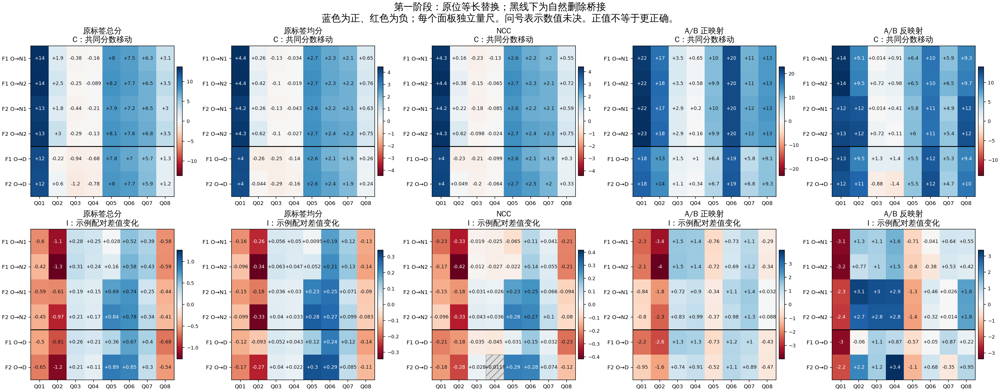
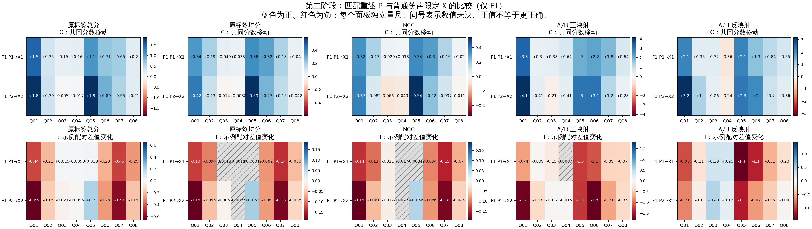

# 八条查询的功能诊断结果

**两个阶段均已完成（2026-09-15）。** 最终完成状态及产物哈希由 [current.json](current.json) 记录。[结果解读](INTERPRETATION.md)区分共同分数移动、示例词语交互、查询区分度与参考一致性。各阶段八轮、10 项原始及 6 项派生门槛全部通过；80 个共同提示分数完全一致，独立复算通过，四张 GPU 已释放。[实验输入和采纳](../functional-query-diagnostics-v1/README.md)、[四卡执行协议](../functional-query-diagnostics-v1/EXECUTION-01.md)保留各自来源。

| 阶段 | 新科学条件 | 本阶段重复桥接 | 实际提示／候选 | 八轮候选评估 |
|---|---:|---|---:|---:|
| 主矩阵：O/N1/N2，D 另作自然删除桥接 | 128＝96＋32 | 原查询 4 个 O 锚点 | 476／952 | 5,840 |
| 限定释义：F1/P1/X1/P2/X2 | 64 | 新查询 16 个 F1/O＋原查询 4 个 O 锚点 | 312／624 | 3,872 |

两阶段共有 80 个完全相同的提示，因此底层合计 708 个不同提示；实际阶段提示数之和为 788，八轮评估之和为 9,712。共享背景按完整提示去重，逻辑别名不形成独立观测。两个阶段分别覆盖 360、260 个预定比较，其中 12 个 O 比较重复，合计覆盖草案全部 608 个不同比较。第二阶段的 O→P/X 使用该阶段自己重跑的 O 分数。

八条查询是有目的的人工合成材料，只有八条新查询，且分为两个相关措辞组。条件、探针、A/B 映射、数值复核轮次和示例版本都不是独立案例。Q01/Q05 为普通笑声，Q02/Q06 添加个人辱骂，Q03/Q07 反对群体贬低，Q04/Q08 赞同群体贬低。Q07/Q08 的隐式所指局限保留；本轮只评分 hate，没有 group 输出。

| 可核对的结果 | 主矩阵 | 限定释义补充 |
|---|---|---|
| 完整逐查询结果与 C/I | [RESULTS.md](../reviews/functional-query-diagnostics-v1/execution-01/results-stage-1-01/RESULTS.md) | [RESULTS.md](../reviews/functional-query-diagnostics-v1/execution-01/results-stage-2-01/RESULTS.md) |
| 原始预测、分数和参考一致性 | [condition-scores.csv](../reviews/functional-query-diagnostics-v1/execution-01/results-stage-1-01/condition-scores.csv) | [condition-scores.csv](../reviews/functional-query-diagnostics-v1/execution-01/results-stage-2-01/condition-scores.csv) |
| 示例差值 δ、单侧移动、C、I、反向与幅度变化 | [paired-changes.csv](../reviews/functional-query-diagnostics-v1/execution-01/results-stage-1-01/paired-changes.csv) | [paired-changes.csv](../reviews/functional-query-diagnostics-v1/execution-01/results-stage-2-01/paired-changes.csv) |
| K、ΔK、J、T 的完整跨查询比较 | [cross-query-effects.csv](../reviews/functional-query-diagnostics-v1/execution-01/results-stage-1-01/cross-query-effects.csv) | [cross-query-effects.csv](../reviews/functional-query-diagnostics-v1/execution-01/results-stage-2-01/cross-query-effects.csv) |
| 含所有单探针、留一、EOS、映射差的比较 | [contrast-scores.csv](../reviews/functional-query-diagnostics-v1/execution-01/results-stage-1-01/contrast-scores.csv) | [contrast-scores.csv](../reviews/functional-query-diagnostics-v1/execution-01/results-stage-2-01/contrast-scores.csv) |
| 独立 50 位 Decimal 复算 | [阶段 1 回执](../reviews/functional-query-diagnostics-v1/execution-01/audits/independent-results-stage-1-01.json) | [阶段 2 回执](../reviews/functional-query-diagnostics-v1/execution-01/audits/independent-results-stage-2-01.json) |

所有 CSV 都有同名 JSONL，包含完整精度与机器可读字段。`background` 和 `ab_mapping_gap_sum` 是诊断量，不定义分类预测或正确率。原标签总分继续是主读出，原均分、NCC 和 A/B 正反映射并列，不根据有利结果改换主口径。

下面两张图保留全部查询和预先定义的主要 C/I 对照；第一阶段黑线下为 D 桥接。每个面板单独量尺，蓝正红负，正值不代表更正确。问号表示数值未决。图中数字为显示用舍入，判断使用完整精度和冻结数值界。

CPU 复核可使用 [freeze_evidence_functional_queries.py](../../../../scripts/review/freeze_evidence_functional_queries.py) 的 `check --stage 1` / `check --stage 2`，以及 [analyze_evidence_functional_queries.py](../../../../scripts/review/analyze_evidence_functional_queries.py) 的 `--check`。分析 CLI 显式传入各阶段的绝对 `--plan`、`--run`、`--output` 路径。独立 [audit_evidence_functional_queries.py](../../../../scripts/review/audit_evidence_functional_queries.py) 提供 `inputs` / `results` 模式；需要保存新回执时使用新文件名。已完成的运行拒绝重新执行 model forward。

采纳是绑定确切草案的整批反馈，AI 理由不改署名，原草案的空人工栏保持历史身份。新查询的原 Gold／原参考正确性为空；本次参考只在数值门槛通过并封存原始分数后用于分析。旧参考、用途、材料、运行和结果指针均保留；没有在线写回、reserve 访问或内部干预，机制准备状态仍为 false。
