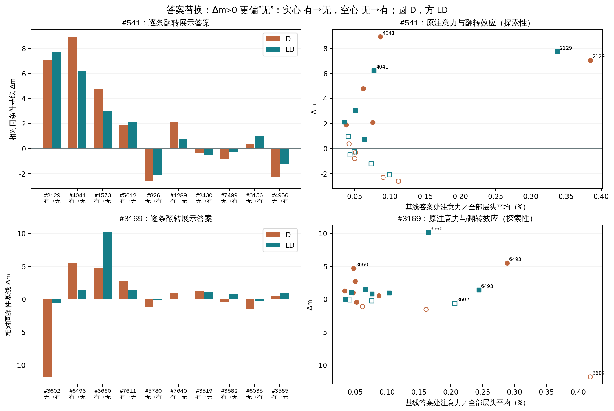
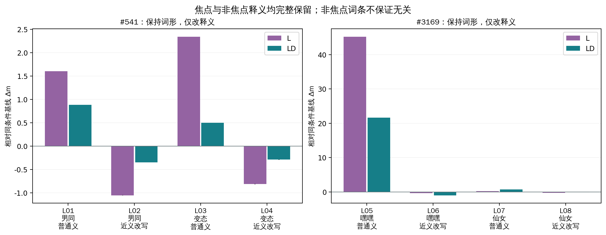
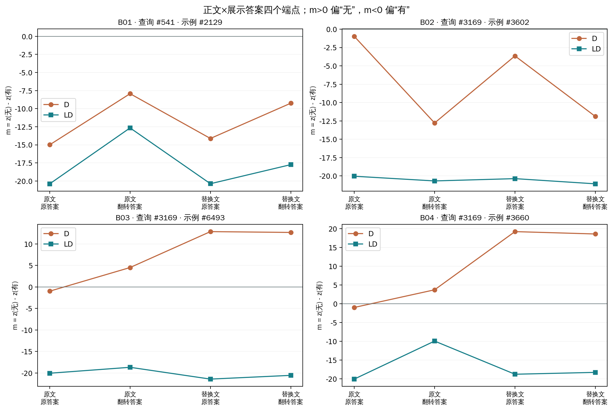
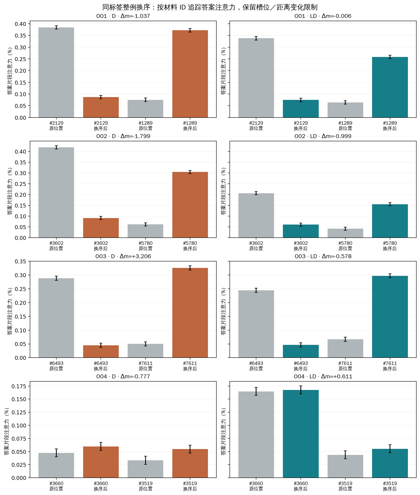

# 内容替换实验：完整结果

44 项经用户接受；88 个输入、258 个预先列明的配对读数。仅两个已暴露的查询，所有比较共享端点，不构成独立确认。分数 m＝z(无)−z(有)，正值偏“无”；两个既有参考均为“无”。

实际前向 832 次；88／88 格式检查通过。数值界限为本次设备和新输入重新取得的工程误差包络，不是统计置信区间。

[交互查看器](../results-01/index.html) · [完整 88 输入表](all-inputs.tsv) · [全部 258 比较](../results-01/comparisons.json) · [独立审计](../audits/results-01.json)

C0＝不加词典或示例；D＝仅示例；L＝仅词典；LD＝词典加示例。

## 这两个案例给出的证据

**#3169 对“嘿嘿”的释义内容敏感。** 将其改成普通义（L05），仅词典 L 的 m 从 -20.481339 变为 +24.734024，词典加示例 LD 从 -20.041424 变为 +1.620178，两者均从“有”转成与参考一致的“无”。保留原含义的 L06 改写只产生 -0.395405／-0.997803 的 Δm；非焦点“仙女”的普通义替换 L07 为 +0.247980／+0.685925。这是在本组固定输入中的内容替换效应，支持释义内容与判断有关；不等同于识别了内部读取路径。

**#541 的 #2129 展示答案确实影响分数，但单独改变它没有修复分类。** A01 的“有→无”使 D／LD 的 m 增加 +7.067593／+7.732040，新端点仍为 -7.929974／-12.662216。另一个同方向翻转 #4041（A02）在 D 下产生 +8.937767，超过 #2129，因此不能用最高注意力直接排序答案影响。男同普通义 L01 也产生 +1.605270／+0.883732 的变化；该读数不支持“词典完全没有影响”的字面结论。

**示例影响取决于是否提供词典。** #3169 中 #3602 的“无→有”（A11）在 D／LD 的 Δm 为 -11.805492／-0.639515；#3660 的“有→无”（A13）则为 +4.695942／+10.117794。两个方向和原标签不同，不能把原始效应直接合并成一条重要性排序。全部同方向对照和上下文差之差均见 258 条比较。

**正文与标签的作用并非简单相加。** 下方保留每个正文替换的四个端点及八个正文×标签交互项。相同标签的真实文本替换仍可能改变查询判断；“同标签”没有固定文本语义、攻击对象、强度或规则适用性。

**同标签换序也能改变输出。** O03 在 #3169 的 D 条件中使 m 从 -0.978149 变为 +2.227470，转为“无”；其 LD 效应为 -0.577965，没有对应的分类修复。整例换序改变的不仅是槽位，还包括距离和中间上下文，不能单凭它证明纯位置机制。

**部分高注意力随交换后的槽位转移。** 在 #541／LD 的 O01 中，#2129 从示例1移至示例6，其答案平均注意力从 0.33796% 降至 0.07485%；移到示例1的 #1289 则从 0.06401% 升至 0.25842%。同一比较的 Δm 仅 -0.005566。O02／O03 也出现这种转移；但 O04／LD 的 #3660 在换序前后仍保持相近的较高注意力（0.16474%→0.16757%）。因此，观察与位置及材料两类因素有关，不能统一解释为“模型只追随最相关示例”或“只看固定槽位”。这些百分数均为答案前、全部 36 层／32 头的片段总质量平均。

这些观察把原来的注意力关联推进到了特定输入内容的干预证据；仍未干预注意力头、权重或信息传递路径，也不能推广为模型在其他查询上的通用策略。下面完整保留全部端点和相反方向。

## 本轮重新评分的基线

| 查询 | 条件 | m | 模型答案 | 是否符合参考 |
|---|---|---|---|---|
| 541 | C0 | -13.150806 | 有 | False |
| 541 | D | -14.997566 | 有 | False |
| 541 | L | -17.966805 | 有 | False |
| 541 | LD | -20.394257 | 有 | False |
| 3169 | C0 | +27.993658 | 无 | True |
| 3169 | D | -0.978149 | 有 | False |
| 3169 | L | -20.481339 | 有 | False |
| 3169 | LD | -20.041424 | 有 | False |

## 逐条答案替换

两种翻转方向分开解释；同一查询同一方向的翻转保持相同的答案数量变化。散点保留全部点，仅标注正文替换的目标材料及 #4041 对照，所有编号见左侧柱图和下表。散点采用事先固定的答案前、全部 36 层／32 头平均注意力，仅作两个案例内的探索性对应。

### 查询 #541

| 条目 | 示例 | 翻转 | D Δm | D 变化 | LD Δm | LD 变化 |
|---|---|---|---|---|---|---|
| A01 | 2129 | 有→无 | +7.067593 | unchanged | +7.732040 | unchanged |
| A02 | 4041 | 有→无 | +8.937767 | unchanged | +6.225357 | unchanged |
| A03 | 1573 | 有→无 | +4.787384 | unchanged | +3.047939 | unchanged |
| A04 | 5612 | 有→无 | +1.905365 | unchanged | +2.126804 | unchanged |
| A05 | 826 | 无→有 | -2.591324 | unchanged | -2.071247 | unchanged |
| A06 | 1289 | 有→无 | +2.084988 | unchanged | +0.751778 | unchanged |
| A07 | 2430 | 无→有 | -0.327759 | unchanged | -0.477009 | unchanged |
| A08 | 7499 | 无→有 | -0.792194 | unchanged | -0.263485 | unchanged |
| A09 | 3156 | 无→有 | +0.382889 | unchanged | +0.975441 | unchanged |
| A10 | 4956 | 无→有 | -2.299648 | unchanged | -1.196178 | unchanged |

### 查询 #3169

| 条目 | 示例 | 翻转 | D Δm | D 变化 | LD Δm | LD 变化 |
|---|---|---|---|---|---|---|
| A11 | 3602 | 无→有 | -11.805492 | unchanged | -0.639515 | unchanged |
| A12 | 6493 | 有→无 | +5.491257 | repair | +1.377445 | unchanged |
| A13 | 3660 | 有→无 | +4.695942 | repair | +10.117794 | unchanged |
| A14 | 7611 | 有→无 | +2.706184 | repair | +1.418503 | unchanged |
| A15 | 5780 | 无→有 | -1.131897 | unchanged | -0.148331 | unchanged |
| A16 | 7640 | 有→无 | +0.971397 | unchanged | -0.036102 | unchanged |
| A17 | 3519 | 有→无 | +1.267647 | repair | +1.046719 | unchanged |
| A18 | 3582 | 有→无 | -0.462936 | unchanged | +0.789474 | unchanged |
| A19 | 6035 | 无→有 | -1.567478 | unchanged | -0.251949 | unchanged |
| A20 | 3585 | 有→无 | +0.509819 | unchanged | +0.943474 | unchanged |

## 释义替换

| 条目 | 查询 | 词条 | 类型 | L Δm | L 变化 | LD Δm | LD 变化 |
|---|---|---|---|---|---|---|---|
| L01 | 541 | 男同 | ordinary | +1.605270 | unchanged | +0.883732 | unchanged |
| L02 | 541 | 男同 | paraphrase | -1.054123 | unchanged | -0.349346 | unchanged |
| L03 | 541 | 变态 | ordinary | +2.340786 | unchanged | +0.499027 | unchanged |
| L04 | 541 | 变态 | paraphrase | -0.815918 | unchanged | -0.291046 | unchanged |
| L05 | 3169 | 嘿嘿 | ordinary | +45.215363 | repair | +21.661602 | repair |
| L06 | 3169 | 嘿嘿 | paraphrase | -0.395405 | unchanged | -0.997803 | unchanged |
| L07 | 3169 | 仙女 | ordinary | +0.247980 | unchanged | +0.685925 | unchanged |
| L08 | 3169 | 仙女 | paraphrase | -0.278913 | unchanged | -0.101181 | unchanged |

L06 使用经审核的数据稿半角引号；聊天排版的中文引号差异已在采用记录中说明。非焦点词条可能仍与示例或任务有关，不能把净差直接命名为纯语义机制。

## 正文与答案交叉

| 条目 | 条件 | 正文×标签差之差 | 数值界限 | 方向 |
|---|---|---|---|---|
| B01 | D | -2.192913 | 0.00146484 | negative |
| B01 | LD | -5.093555 | 0.00146484 | negative |
| B02 | D | +3.562229 | 0.00146484 | positive |
| B02 | LD | -0.067673 | 0.00146484 | negative |
| B03 | D | -5.682270 | 0.00146484 | negative |
| B03 | LD | -0.508854 | 0.00146484 | negative |
| B04 | D | -5.325340 | 0.00146484 | negative |
| B04 | LD | -9.624937 | 0.00146484 | negative |

B01 为已获接受的真实材料删词版；B02–B04 是原样真实文本。同标签没有固定攻击强度、对象、句式或规则适用性。B04 的边界 token 归属改变，质量／密度按各自真实分词计算。

## 同标签整例换序

| 条目 | 查询 | 条件 | 材料 | Δm | 分类变化 | A 原% | A 换序% | B 原% | B 换序% |
|---|---|---|---|---|---|---|---|---|---|
| O01 | 541 | D | 2129,1289 | -1.037392 | unchanged | 0.38443 | 0.08729 | 0.07560 | 0.37211 |
| O01 | 541 | LD | 2129,1289 | -0.005566 | unchanged | 0.33796 | 0.07485 | 0.06401 | 0.25842 |
| O02 | 3169 | D | 3602,5780 | -1.798904 | unchanged | 0.41910 | 0.09092 | 0.06145 | 0.30478 |
| O02 | 3169 | LD | 3602,5780 | -0.999371 | unchanged | 0.20636 | 0.06038 | 0.04130 | 0.15505 |
| O03 | 3169 | D | 6493,7611 | +3.205620 | repair | 0.28846 | 0.04471 | 0.05003 | 0.32573 |
| O03 | 3169 | LD | 6493,7611 | -0.577965 | unchanged | 0.24428 | 0.04672 | 0.06684 | 0.29719 |
| O04 | 3169 | D | 3660,3519 | -0.776546 | unchanged | 0.04757 | 0.05990 | 0.03345 | 0.05462 |
| O04 | 3169 | LD | 3660,3519 | +0.610958 | unchanged | 0.16474 | 0.16757 | 0.04387 | 0.05530 |

换序图同一行使用共同纵轴；误差线为本次工程数值界限，不是统计置信区间。换序保持答案序列和总长度，但会改变区间内绝对位置、距离和上下文。按材料／按槽位的查看器对齐均保留；这些数据不单独证明特定头或纯位置机制。

## 校验与文件

所有比较（含不利变化、相反方向和未决状态）均保留。repair／damage 仅表示该有序两端点比较发生参考一致性的翻转；分数变化和交互项不能直接称为修复。各比较不是独立样本，也未实施内部注意力头干预。

独立审计核对 832 个绝对向量、88 个预测、258 个表达式及其界限／方向／分类变化；重建 39762432 个注意力汇总数值，并用 60 位 Decimal 抽核 103548 个汇总／密度值。

PNG 同名 PDF 可用于导出。原始 FP64 注意力、FP32 全词表 logits、运行资格与格式回执保留在 run-01；展示副本为 FP32。
