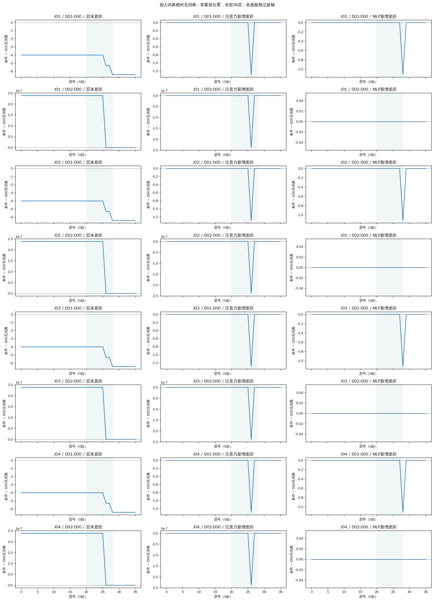
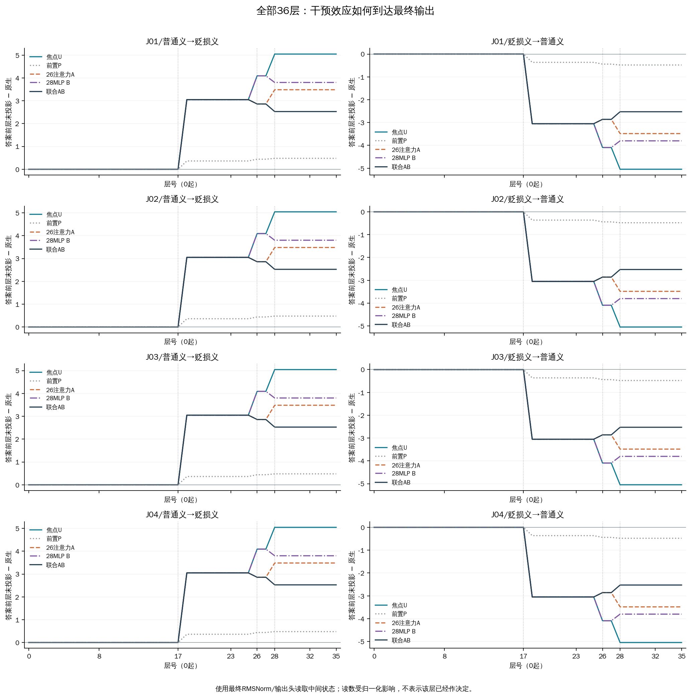
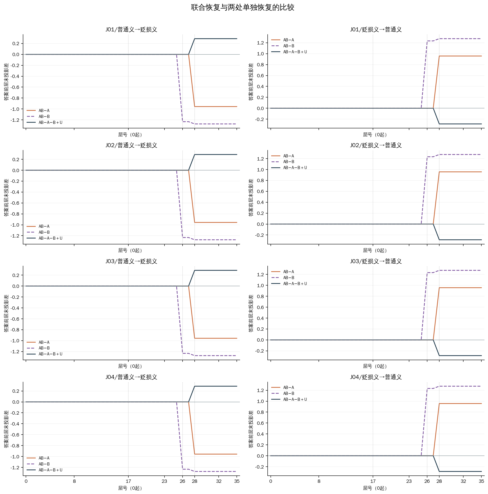
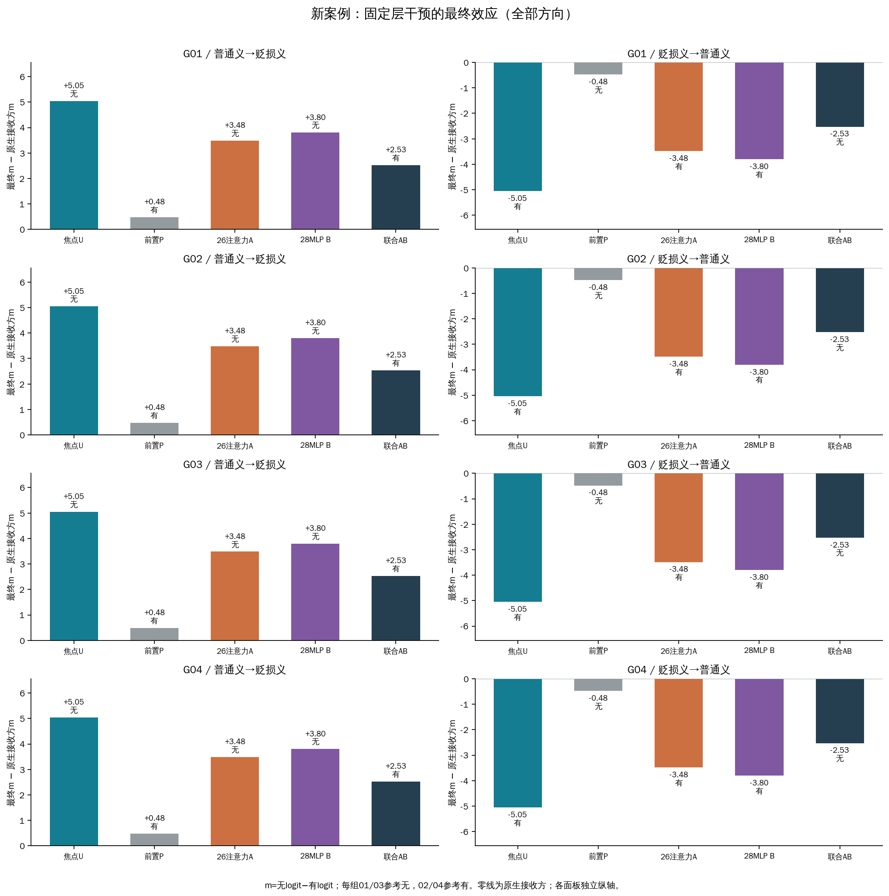
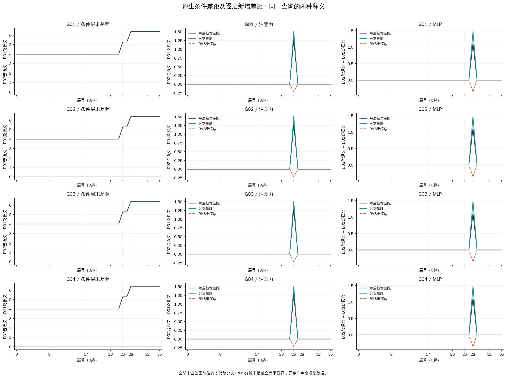
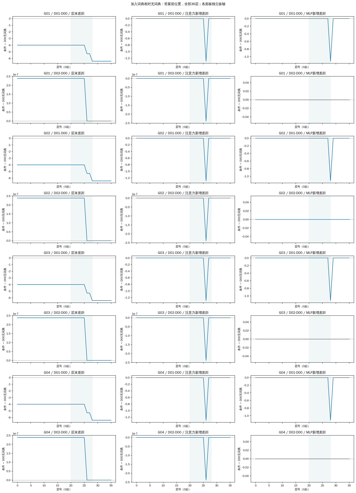
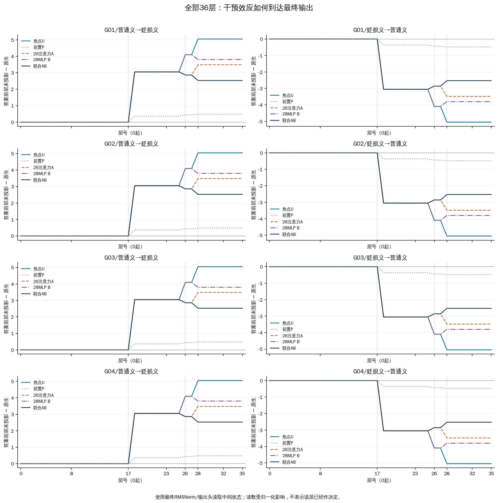
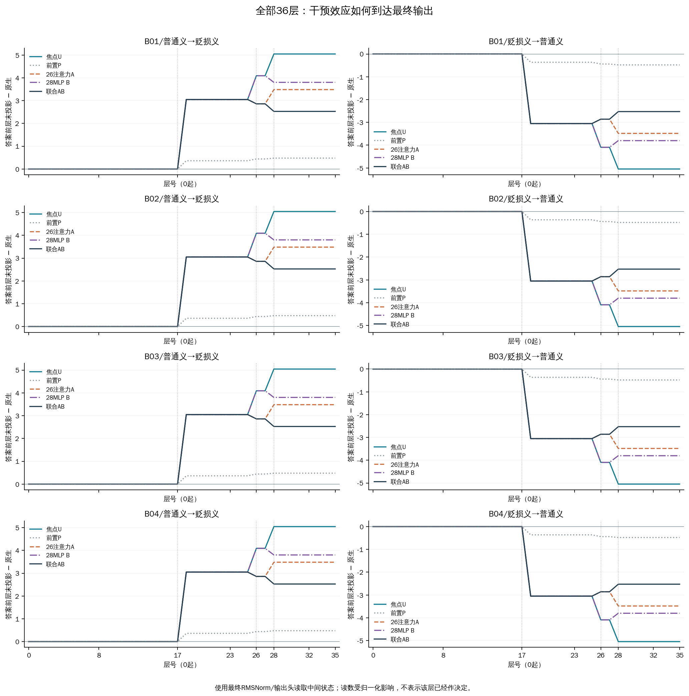

# 京巴、垃圾、公交车：固定层机制扩展结果

本轮3条普通义无攻击查询中，加入贬损义后由无变为有的有3条：J01、G01、B01。这描述当前固定材料中的行为，其他查询及未翻转情况见下表。
全部120个干预端点中，修复36个、损害36个；这是同一批12条查询的相关条件计数，不能作为独立样本准确率或通用修复率。

每个词条各有普通用法、直接辱人、反对辱称、普通用法且全文另有攻击四种语境。D00无词典；D01为已审核贬损义；D02为普通义，只提供该词条、无示例。G03按用户审核理解为反对概括贬损，保留原文无引号。所有原生与供体状态均在本次新运行产生。

m=z(无)−z(有)：正值更偏无，不是概率；参考无时增大有利，参考有时减小有利。

| 查询 | 原文 | 参考 | D00 输出 / m | D01 输出 / m | D02 输出 / m |
|---|---|---|---:|---:|---:|
| J01 | synthetic | 无 | 无 / +3.2060 | 有 / -3.2060 | 无 / +3.2060 |
| J02 | synthetic | 有 | 无 / +3.2060 | 有 / -3.2060 | 无 / +3.2060 |
| J03 | synthetic | 无 | 无 / +3.2060 | 有 / -3.2060 | 无 / +3.2060 |
| J04 | synthetic | 有 | 无 / +3.2060 | 有 / -3.2060 | 无 / +3.2060 |
| G01 | synthetic | 无 | 无 / +3.2060 | 有 / -3.2060 | 无 / +3.2060 |
| G02 | synthetic | 有 | 无 / +3.2060 | 有 / -3.2060 | 无 / +3.2060 |
| G03 | synthetic | 无 | 无 / +3.2060 | 有 / -3.2060 | 无 / +3.2060 |
| G04 | synthetic | 有 | 无 / +3.2060 | 有 / -3.2060 | 无 / +3.2060 |
| B01 | synthetic | 无 | 无 / +3.2060 | 有 / -3.2060 | 无 / +3.2060 |
| B02 | synthetic | 有 | 无 / +3.2060 | 有 / -3.2060 | 无 / +3.2060 |
| B03 | synthetic | 无 | 无 / +3.2060 | 有 / -3.2060 | 无 / +3.2060 |
| B04 | synthetic | 有 | 无 / +3.2060 | 有 / -3.2060 | 无 / +3.2060 |

答案方向投影用最终输出头读取中间状态，观察偏向有还是无，不表示该层已作决定。条件差距和每层新增差距均来自答案前位置，保留全部36层；0起第20–28层只是预先关注区间。注意力和MLP的代数分支投影、RMS重缩放及浮点余项完整保留，不当成独立因果份额。

U把另一释义条件下第17层目标词完整向量放入接收方；P替换同层等数量前置token。A、B分别在U上恢复第26层注意力、第28层MLP的原生接收方输出；AB恢复两处。注意力输出指o_proj后整个分支向量，不是注意力权重。供体与接收方按相同查询token映射，绝对位置不同；前置位置不作向量范数匹配。

| 查询 / 供体→接收方 | U Δm | P Δm | A Δm | B Δm | AB Δm |
|---|---:|---:|---:|---:|---:|
| J01 / 普通义→贬损义 | +5.0459 | +0.4787 | +3.4836 | +3.8014 | +2.5268 |
| J01 / 贬损义→普通义 | -5.0459 | -0.4787 | -3.4836 | -3.8014 | -2.5268 |
| J02 / 普通义→贬损义 | +5.0459 | +0.4787 | +3.4836 | +3.8014 | +2.5268 |
| J02 / 贬损义→普通义 | -5.0459 | -0.4787 | -3.4836 | -3.8014 | -2.5268 |
| J03 / 普通义→贬损义 | +5.0459 | +0.4787 | +3.4836 | +3.8014 | +2.5268 |
| J03 / 贬损义→普通义 | -5.0459 | -0.4787 | -3.4836 | -3.8014 | -2.5268 |
| J04 / 普通义→贬损义 | +5.0459 | +0.4787 | +3.4836 | +3.8014 | +2.5268 |
| J04 / 贬损义→普通义 | -5.0459 | -0.4787 | -3.4836 | -3.8014 | -2.5268 |
| G01 / 普通义→贬损义 | +5.0459 | +0.4787 | +3.4836 | +3.8014 | +2.5268 |
| G01 / 贬损义→普通义 | -5.0459 | -0.4787 | -3.4836 | -3.8014 | -2.5268 |
| G02 / 普通义→贬损义 | +5.0459 | +0.4787 | +3.4836 | +3.8014 | +2.5268 |
| G02 / 贬损义→普通义 | -5.0459 | -0.4787 | -3.4836 | -3.8014 | -2.5268 |
| G03 / 普通义→贬损义 | +5.0459 | +0.4787 | +3.4836 | +3.8014 | +2.5268 |
| G03 / 贬损义→普通义 | -5.0459 | -0.4787 | -3.4836 | -3.8014 | -2.5268 |
| G04 / 普通义→贬损义 | +5.0459 | +0.4787 | +3.4836 | +3.8014 | +2.5268 |
| G04 / 贬损义→普通义 | -5.0459 | -0.4787 | -3.4836 | -3.8014 | -2.5268 |
| B01 / 普通义→贬损义 | +5.0459 | +0.4787 | +3.4836 | +3.8014 | +2.5268 |
| B01 / 贬损义→普通义 | -5.0459 | -0.4787 | -3.4836 | -3.8014 | -2.5268 |
| B02 / 普通义→贬损义 | +5.0459 | +0.4787 | +3.4836 | +3.8014 | +2.5268 |
| B02 / 贬损义→普通义 | -5.0459 | -0.4787 | -3.4836 | -3.8014 | -2.5268 |
| B03 / 普通义→贬损义 | +5.0459 | +0.4787 | +3.4836 | +3.8014 | +2.5268 |
| B03 / 贬损义→普通义 | -5.0459 | -0.4787 | -3.4836 | -3.8014 | -2.5268 |
| B04 / 普通义→贬损义 | +5.0459 | +0.4787 | +3.4836 | +3.8014 | +2.5268 |
| B04 / 贬损义→普通义 | -5.0459 | -0.4787 | -3.4836 | -3.8014 | -2.5268 |

恢复结果回答的是：在这项上游替换已经发生时，恢复分支能改变多少效应。它不能直接识别唯一自然路径；联合比例也不是独立贡献之和。分母接近工程误差界时比例记NA，所有反向、未翻转和负结果保留。

## 京巴图表

图中层号0起，纵轴为原始分数差或投影差；各面板独立纵轴，不能凭线条高度比较不同查询效应。PDF/SVG同名文件可导出。

## 垃圾图表

图中层号0起，纵轴为原始分数差或投影差；各面板独立纵轴，不能凭线条高度比较不同查询效应。PDF/SVG同名文件可导出。

## 公交车图表

图中层号0起，纵轴为原始分数差或投影差；各面板独立纵轴，不能凭线条高度比较不同查询效应。PDF/SVG同名文件可导出。

## 解释边界与核对

- 12条开发查询，36个原生输入；5条已审核AI构造与7条真实语料，多个条件不是独立样本。
- 每组01/03参考无，02/04参考有；G03作者反对概括贬损，原文保持无引号。
- m=无logit−有logit；正向是否改善取决于参考答案。
- D00仅原生基线；D01贬损义和D02普通义双向干预。
- 固定17层焦点/前置，26注意力和28MLP单独/联合恢复；不重新挑层或头。
- 供体/接收方绝对位置分开映射；释义长度不同，保留位置和前缀长度混杂。
- 注意力分支为o_proj后的完整输出，不是注意力权重；投影受RMS归一化影响。
- 前置位置不是词性/向量大小匹配，不预设零效应。
- 全部原生库来自本次运行；不代入历史分数。
- 工程界不是统计置信区间；全向量恢复比例不是独立中介份额。

本轮检验固定方案能否跨词条重现。若有行为变化而固定层干预不对应，需区分词典作用和路径迁移；若没有标签翻转，仍检查分数、对照和恢复效应。不据结果重新筛案例或挑层。

[完整数值与来源](results.json)；[全部干预](all-interventions.tsv)；[恢复对比](restoration-contrasts.tsv)；[联合对比](joint-contrasts.tsv)；[原生分数](baselines.tsv)；[无词典对照轨迹](dictionary-addition-trajectories.tsv)；[资格门槛](qualification.json)。
本文件是CPU报告，须结合独立数值复核及科学收尾记录使用；旧实验和网站未由此改动。
