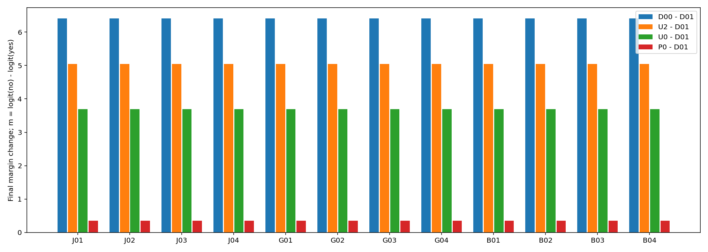
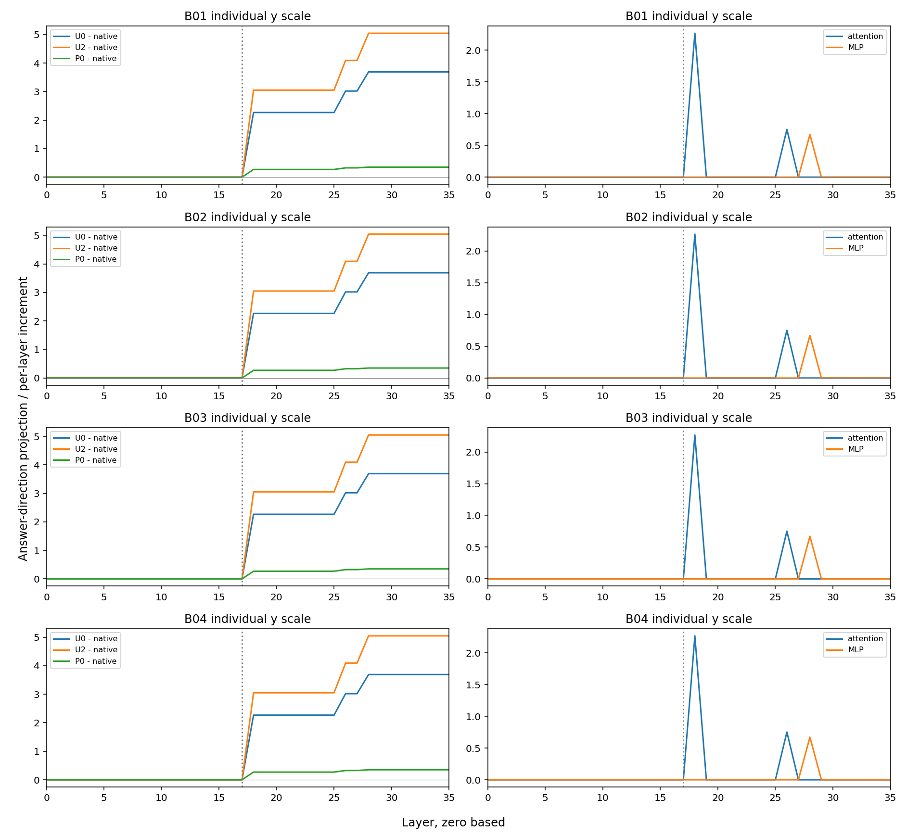

# 无词典供体的固定局部干预

固定第17层、目标词位置的无词典状态替换，正确数从原词典条件的6/12变为6/12。修复：['J01', 'J03', 'G01', 'G03', 'B01', 'B03']；损坏：['J02', 'J04', 'G02', 'G04', 'B02', 'B04']。这是已暴露开发材料，不能视为独立效果确认。

D01提供已审核贬损义；D00完全不提供词典，D02提供普通义。U0把同一查询D00运行中目标词的第17层完整状态，放入保留D01词典的运行；U2使用D02供体。P0/P2改换相邻等token前置位置。主规则固定用于全部12条，不读取参考答案、不按输出选方向，也不需要普通义释义。规则理论需要两次前向，本轮额外前向用于诊断和工程复核。

三类词条各四条：普通语境、直接攻击、反对贬损、普通义但全文另有攻击。当前人工参考依次无/有/无/有；G02/G03保留源标签与当前审核的差异。m=无logit−有logit，正值判无。增加m是否改善取决于参考答案。

| 查询 | 参考 | D01原生 | 直接D00 | 普通义U2 | 无词典U0 | 前置P0 | U0变化 |
|---|---|---:|---:|---:|---:|---:|---:|
| J01 | 无 | -3.206022（有） | +3.206022（无） | +1.839874（无） | +0.484627（无） | -2.855343（有） | +3.690649 |
| J02 | 有 | -3.206022（有） | +3.206022（无） | +1.839874（无） | +0.484627（无） | -2.855343（有） | +3.690649 |
| J03 | 无 | -3.206022（有） | +3.206022（无） | +1.839874（无） | +0.484627（无） | -2.855343（有） | +3.690649 |
| J04 | 有 | -3.206022（有） | +3.206022（无） | +1.839874（无） | +0.484627（无） | -2.855343（有） | +3.690649 |
| G01 | 无 | -3.206022（有） | +3.206022（无） | +1.839874（无） | +0.484627（无） | -2.855343（有） | +3.690649 |
| G02 | 有 | -3.206022（有） | +3.206022（无） | +1.839874（无） | +0.484627（无） | -2.855343（有） | +3.690649 |
| G03 | 无 | -3.206022（有） | +3.206022（无） | +1.839874（无） | +0.484627（无） | -2.855343（有） | +3.690649 |
| G04 | 有 | -3.206022（有） | +3.206022（无） | +1.839874（无） | +0.484627（无） | -2.855343（有） | +3.690649 |
| B01 | 无 | -3.206022（有） | +3.206022（无） | +1.839874（无） | +0.484627（无） | -2.855343（有） | +3.690649 |
| B02 | 有 | -3.206022（有） | +3.206022（无） | +1.839874（无） | +0.484627（无） | -2.855343（有） | +3.690649 |
| B03 | 无 | -3.206022（有） | +3.206022（无） | +1.839874（无） | +0.484627（无） | -2.855343（有） | +3.690649 |
| B04 | 有 | -3.206022（有） | +3.206022（无） | +1.839874（无） | +0.484627（无） | -2.855343（有） | +3.690649 |

| 条件 | 正确数 |
|---|---:|
| D01 | 6/12 |
| D00 | 6/12 |
| D02 | 6/12 |
| U2 | 6/12 |
| P2 | 6/12 |
| U0 | 6/12 |
| P0 | 6/12 |
| CPU_shifted | 6/12 |

CPU_shifted固定为D01的m+7，来自先前讨论，不在本轮拟合；对照简单统一偏移，不称独立基线优化。对照直接D00是必要的：若局部操作并无更好收益/损害组合，就不能仅因内部状态被改变而称方法有效。

## 全层传播与限制

答案方向投影用最终输出头读取中间状态，不是注意力权重或该层已作决定。全部36层保留；下图各查询/读数纵轴独立。分支投影、残差RMS缩放、余差详见all-trajectories.tsv。这里只在17层目标词处干预，后续曲线不等于逐层因果定位。

本轮756次前向、48自身控制、84格式端点。工程分数界1e-06，两项差界2ε；不是统计显著性或实际效应阈值。独立核对新鲜36原生+24旧U2/P2端点和36状态银行精确重放，旧分数不代替新数据。

无词典供体没有“正确答案来源”保证。去掉词典同时改变长度和位置；P0未按范数/语法匹配。即使多个标签变正确，也可能是一般分数移动和距离零点不同，尚不能称自动识别适用性。本批12条已暴露材料包含5条人工接受的AI构造及7条真实语料，样本不足以主张通用修复。

若此固定规则失败，不据新结果改层号或强度再称预注册成功。下一步回到正确参考同时包含适用与不适用示例的材料，冻结规则后另做未参与开发的验证。