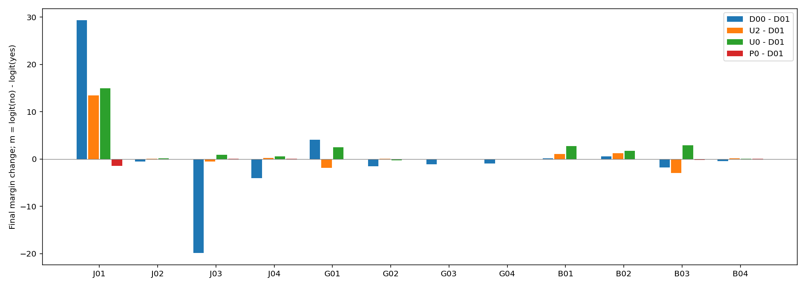
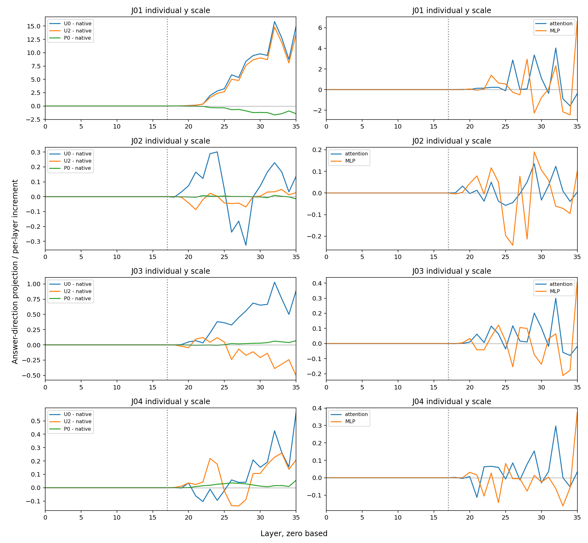
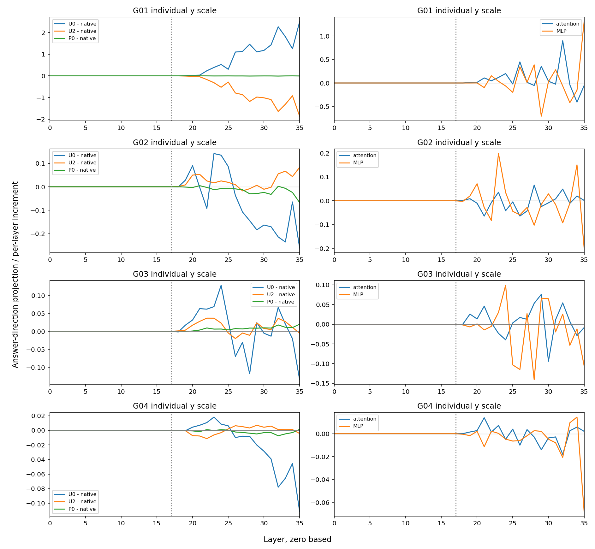
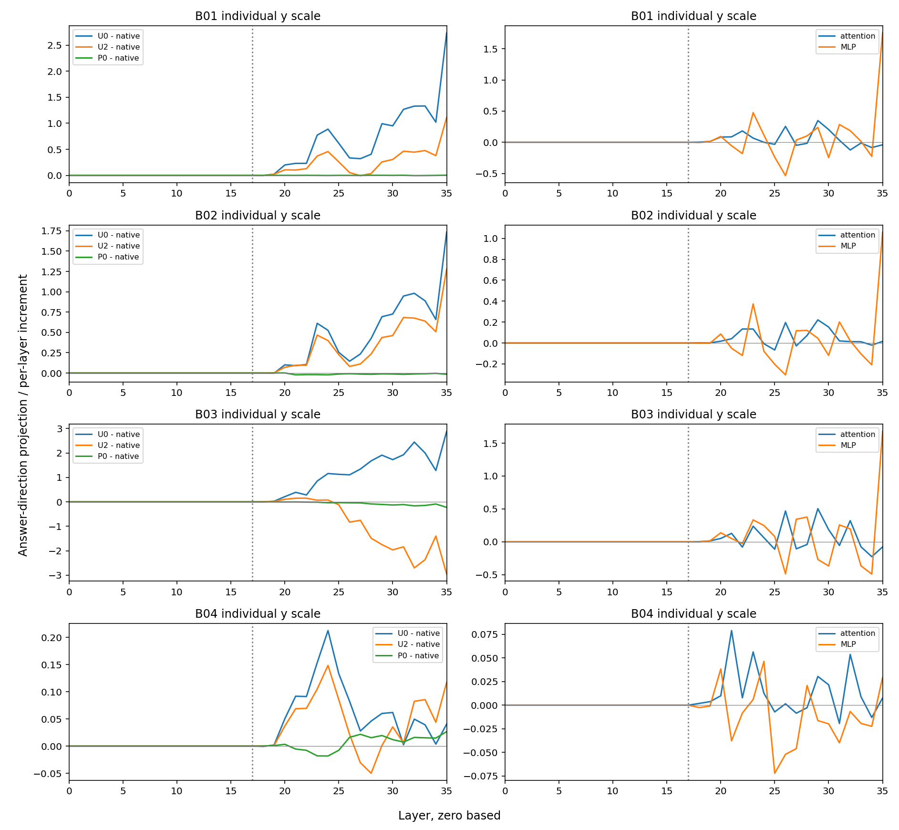

# 无词典供体的固定局部干预

固定第17层、目标词位置的无词典状态替换，正确数从原词典条件的8/12变为9/12。修复：['J01']；损坏：无。这是已暴露开发材料，不能视为独立效果确认。

D01提供已审核贬损义；D00完全不提供词典，D02提供普通义。U0把同一查询D00运行中目标词的第17层完整状态，放入保留D01词典的运行；U2使用D02供体。P0/P2改换相邻等token前置位置。主规则固定用于全部12条，不读取参考答案、不按输出选方向，也不需要普通义释义。规则理论需要两次前向，本轮额外前向用于诊断和工程复核。

三类词条各四条：普通语境、直接攻击、反对贬损、普通义但全文另有攻击。当前人工参考依次无/有/无/有；G02/G03保留源标签与当前审核的差异。m=无logit−有logit，正值判无。增加m是否改善取决于参考答案。

| 查询 | 参考 | D01原生 | 直接D00 | 普通义U2 | 无词典U0 | 前置P0 | U0变化 |
|---|---|---:|---:|---:|---:|---:|---:|
| J01 | 无 | -6.866451（有） | +22.465961（无） | +6.597324（无） | +8.090225（无） | -8.313137（有） | +14.956676 |
| J02 | 有 | -23.593681（有） | -24.084076（有） | -23.566795（有） | -23.457520（有） | -23.608604（有） | +0.136162 |
| J03 | 无 | +0.606007（无） | -19.273376（有） | +0.102795（无） | +1.493172（无） | +0.674438（无） | +0.887165 |
| J04 | 有 | -19.068363（有） | -23.105892（有） | -18.860767（有） | -18.505882（有） | -19.013531（有） | +0.562481 |
| G01 | 无 | +19.296299（无） | +23.419271（无） | +17.433125（无） | +21.794445（无） | +19.291462（无） | +2.498146 |
| G02 | 有 | -23.301708（有） | -24.791908（有） | -23.218697（有） | -23.562580（有） | -23.368946（有） | -0.260872 |
| G03 | 无 | -24.368801（有） | -25.433264（有） | -24.374018（有） | -24.503395（有） | -24.348951（有） | -0.134594 |
| G04 | 有 | -24.791382（有） | -25.703300（有） | -24.795731（有） | -24.902660（有） | -24.790062（有） | -0.111279 |
| B01 | 无 | -20.190071（有） | -20.052822（有） | -19.078373（有） | -17.454750（有） | -20.186428（有） | +2.735321 |
| B02 | 有 | -21.071758（有） | -20.526592（有） | -19.792500（有） | -19.338295（有） | -21.087242（有） | +1.733463 |
| B03 | 无 | -11.045586（有） | -12.849331（有） | -13.996807（有） | -8.163761（有） | -11.270950（有） | +2.881824 |
| B04 | 有 | -22.095043（有） | -22.519588（有） | -21.977718（有） | -22.054630（有） | -22.068527（有） | +0.040413 |

| 条件 | 正确数 |
|---|---:|
| D01 | 8/12 |
| D00 | 8/12 |
| D02 | 8/12 |
| U2 | 9/12 |
| P2 | 8/12 |
| U0 | 9/12 |
| P0 | 8/12 |
| CPU_shifted | 9/12 |

CPU_shifted固定为D01的m+7，来自先前讨论，不在本轮拟合；对照简单统一偏移，不称独立基线优化。对照直接D00是必要的：若局部操作并无更好收益/损害组合，就不能仅因内部状态被改变而称方法有效。

## 全层传播与限制

答案方向投影用最终输出头读取中间状态，不是注意力权重或该层已作决定。全部36层保留；下图各查询/读数纵轴独立。分支投影、残差RMS缩放、余差详见all-trajectories.tsv。这里只在17层目标词处干预，后续曲线不等于逐层因果定位。

本轮756次前向、48自身控制、84格式端点。工程分数界9.91821289e-05，两项差界2ε；不是统计显著性或实际效应阈值。独立核对新鲜36原生+24旧U2/P2端点和36状态银行精确重放，旧分数不代替新数据。

无词典供体没有“正确答案来源”保证。去掉词典同时改变长度和位置；P0未按范数/语法匹配。即使多个标签变正确，也可能是一般分数移动和距离零点不同，尚不能称自动识别适用性。本批12条已暴露材料包含5条人工接受的AI构造及7条真实语料，样本不足以主张通用修复。

若此固定规则失败，不据新结果改层号或强度再称预注册成功。下一步回到正确参考同时包含适用与不适用示例的材料，冻结规则后另做未参与开发的验证。