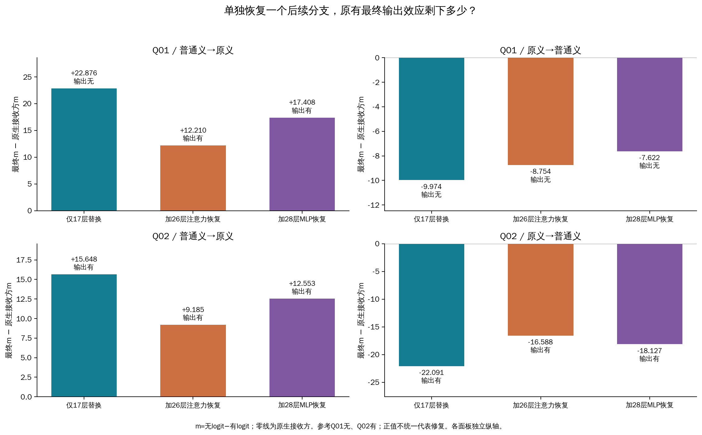

# 两处后续分支是否承接了第17层“嘿嘿”替换的效应？

单独恢复第26层注意力后，原有最终分数效应的有向移除比例为12.2%–46.6%（四个方向）。单独恢复第28层MLP后，原有最终分数效应的有向移除比例为17.9%–23.9%（四个方向）。这是对固定干预中组件作用的直接检验；尚未证明唯一的自然词义路径。

## 比较对象与操作

| 查询 | 既有文本 | 参考答案 |
|---|---|---|
| Q01（原#3169） | 我想回个嘿嘿嘿嘿。。。感觉好押韵 | 无 |
| Q02（原已审核#3660） | 主要是被嘿嘿玩过的，那不是一般的思想，那得多么的。。。 | 有 |

D01提供原侮辱义，D02提供普通笑声义。四份完整prompt、任务和单token有/无输出没有变化。普通义在原生运行中让两条查询都输出“无”，所以修复Q01，却使Q02误判。Q02还含其他贬损线索，两个查询不构成纯词义最小对。

先将第17层查询“嘿嘿”位置的完整内部状态，从另一释义条件放入接收方运行。Q01联合替换两个token，Q02一个。这称为上游替换。再分别把答案前最后一个prompt位置的第26层注意力输出、或第28层MLP输出恢复为接收方原生值；每次只恢复一处。注意力输出是整个子层经输出投影后的向量，与热图中的注意力权重不同。层号均从0开始。

这一步比上一轮仅观察曲线共同变化更直接：现在主动改变候选分支，再看已有上游干预的最终效果是否改变。供体、接收方和分支来源都由本轮重新计算。

## 最终输出发生了什么

下表的效应是“干预后m−原生接收方m”，其中m=无logit−有logit。越正越偏“无”，对Q01有利，对Q02不利。括号为最终输出。

| 查询/供体→接收方 | 原生接收方m | 仅17层替换的效应 | 加26注意力恢复后 | 加28MLP恢复后 |
|---|---:|---:|---:|---:|
| Q01/普通义→原义 | -20.4813 | +22.8765（无） | +12.2099（有） | +17.4081（有） |
| Q01/原义→普通义 | +24.7340 | -9.9737（无） | -8.7537（无） | -7.6219（无） |
| Q02/普通义→原义 | -20.5979 | +15.6483（有） | +9.1853（有） | +12.5531（有） |
| Q02/原义→普通义 | +10.5713 | -22.0909（有） | -16.5876（有） | -18.1273（有） |

“移除比例”用恢复后少掉的有向效应，除以原有上游效应。0代表保留原效应，1代表回到原生分数；负值表示增强，超过1表示越过原生值，因此还要核对绝对效应是否减小。它不是概率或独立中介份额，两处比例不能相加。全部8个比例和工程区间见[恢复比较表](restoration-contrasts.tsv)与[完整JSON](results.json)。

26层注意力恢复后，四个方向中有4个最终效应绝对值减小、0个增大；有1个输出相对仅17层替换发生翻转。分数变化和标签翻转回答不同问题，不能只用是否翻转判定组件有没有作用。

28层MLP恢复后，四个方向中有4个最终效应绝对值减小、0个增大；有1个输出相对仅17层替换发生翻转。分数变化和标签翻转回答不同问题，不能只用是否翻转判定组件有没有作用。

## 局部变化与后续计算

答案方向投影用最终RMSNorm及输出头读取中间状态，观察其偏向“有”还是“无”；不表示该层已经作出最终决定。下表将刚恢复分支后（26层注意力之后、28层MLP之后）的投影变化，与最终输出变化并列。两列均为“恢复后−仅17层替换”，含义和上表相对原生的效应不同。

| 查询/方向 | 恢复分支 | 刚恢复后的投影差 | 最终m差 |
|---|---|---:|---:|
| Q01/普通义→原义 | 26注意力 | -6.1037 | -10.6666 |
| Q01/普通义→原义 | 28MLP | -6.6731 | -5.4684 |
| Q01/原义→普通义 | 26注意力 | +1.0872 | +1.2199 |
| Q01/原义→普通义 | 28MLP | +1.1226 | +2.3518 |
| Q02/普通义→原义 | 26注意力 | -4.2605 | -6.4630 |
| Q02/普通义→原义 | 28MLP | -3.9785 | -3.0952 |
| Q02/原义→普通义 | 26注意力 | +4.0208 | +5.5034 |
| Q02/原义→普通义 | 28MLP | +4.4792 | +3.9637 |

局部投影变化与最终m差可能不同，因为后续注意力、MLP和归一化仍继续计算。两列差值不能直接当作某个后续组件的因果贡献；全部36层曲线用于定位哪里出现保留、放大或补偿。

[每种干预相对原生的全层曲线](remaining-trajectories.pdf) · [26注意力恢复的注意力/MLP增量](restore-L26-attention-normalization.pdf) · [28MLP恢复的注意力/MLP增量](restore-L28-mlp-normalization.pdf)

增量图保留新增分支投影与已有残差RMS重缩放，以及浮点余项。该分解采用更新后的尺度，是代数说明，不是独立因果份额。恢复之前全部层与上游运行逐元素相同，恢复层前半段也通过对应精确检查；因此新增差异的起点由操作和数组核对共同确定。

## 已支持的解释与下一步问题

效应减弱支持该组件的改变参与承接了这次上游替换的结果；仍有剩余则说明单独恢复这一处未消除全部效应。若没有减弱，可能涉及绕行、冗余或后续补偿，不能据此排除自然计算中的作用。干预混合了来自不同运行的整个向量，并未单独删除“词义”变量。

下一步应先根据这两处的逐方向结果，决定是否有必要检验“恢复两处是否比恢复一处进一步消除效应”。若两处单独均有作用但仍有剩余，联合恢复可以区分共同承接与明显交互；若某一处已有很强反方向差异，应先解释差异，暂缓扩大扫描。本轮未执行联合恢复或注意力头扫描，也未把四条既有材料当作独立确认集。

## 核查与完整材料

单卡152次前向；从第一阶段启动到最终释放约199.75秒，等待空闲时间不计入。两阶段工作进程均正常退出，释放已验证。12个原生自身控制、8个上游条件自身控制、全部16个标签后EOS端点、重复/逆序/左右padding/前缀/正式重放均通过。旧结果没有代入新运行：四个原生完整词表向量和四个上游完整向量及轨迹与前轮一致。

独立120位精度核算检查152个完整向量；独立扩展精度检查116份轨迹、22032个汇总数值。原数值门槛没有放宽。m工程界为1e-06，单候选投影工程界为1.90194733989e-05；这些不代表统计置信度。

[完整输入](../prepared-01/ALL-PROMPTS.md) · [协议](../prepared-01/PROTOCOL.md) · [独立审核](../result-audit-01.json) · [全部36层TSV](all-trajectories.tsv) · [完整JSON](results.json)

本报告只增加解释；复制的数据、TSV和图与results-01逐字节一致，旧版本均保留。
