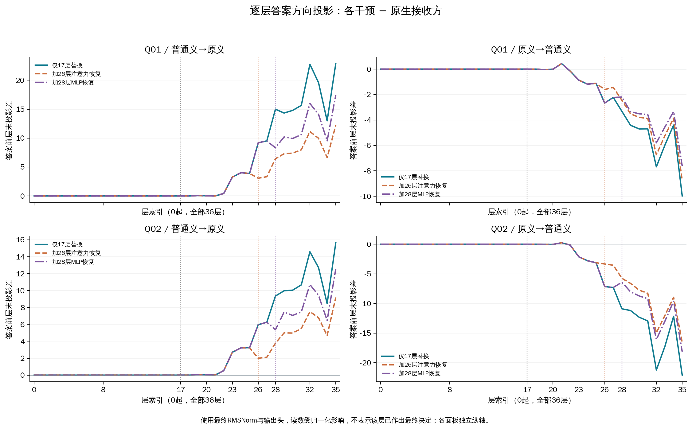
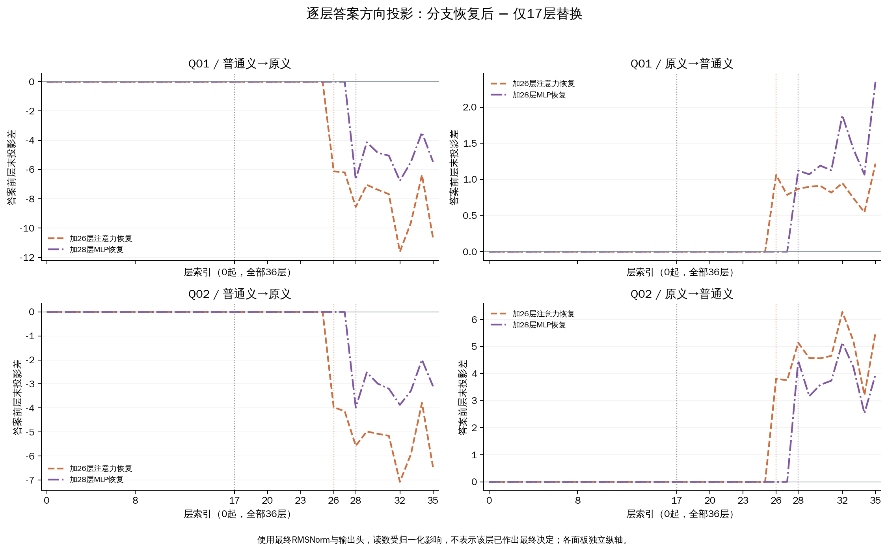

# 固定第17层替换后的单分支恢复

本轮将答案前第26层注意力输出、第28层MLP输出分别恢复为原生接收方的值。8个方向×组件比较中，8个的最终效应绝对值减小。这里检验的是这两个组件在已施加第17层干预后的作用，尚不能据此确认唯一的自然词义路径。

Q01是原#3169“我想回个嘿嘿嘿嘿。。。感觉好押韵”，参考“无”；Q02是原已审核#3660“主要是被嘿嘿玩过的，那不是一般的思想，那得多么的。。。”，参考“有”。D01只提供原侮辱义，D02只提供普通笑声义。四份prompt、任务和标签保持原样。Q02还有其他贬损线索，两个查询不是纯词义最小对。

激活替换是把另一释义条件下的内部向量放进当前运行。首先固定替换第17层查询“嘿嘿”位置的完整状态（Q01两个token、Q02一个），称为上游替换U。再分别把答案前最后一个prompt位置的第26层注意力输出，或第28层MLP输出，改回当前接收条件未受干预时的原生值，称为恢复R。两处独立测试；全部层号0起。

这里“注意力输出”是整个注意力子层经输出投影后的向量，不是热图中的注意力权重。恢复发生在残差相加之前；其余位置保留U的计算，后续层重新计算。

## 最终输出效应

m=无logit−有logit，数值越大越偏向“无”。表中的效应均减去原生接收方m；因此正数对Q01有利、对Q02不利。“移除比例”比较恢复前后少了多少原干预效应，0表示保留、1表示回到原生分数，负值表示沿原方向增强；超过1表示越过原生值，需同时看剩余效应。它不是概率，也不能把两组件比例相加。

| 查询/供体→接收方 | 恢复位置 | 上游效应 | 恢复后效应 | 移除比例 | 输出 U→R |
|---|---|---:|---:|---:|---|
| Q01/普通义→原义 | 26注意力 | +22.8765 | +12.2099 | 46.6% | 无→有 |
| Q01/普通义→原义 | 28MLP | +22.8765 | +17.4081 | 23.9% | 无→有 |
| Q01/原义→普通义 | 26注意力 | -9.9737 | -8.7537 | 12.2% | 无→无 |
| Q01/原义→普通义 | 28MLP | -9.9737 | -7.6219 | 23.6% | 无→无 |
| Q02/普通义→原义 | 26注意力 | +15.6483 | +9.1853 | 41.3% | 有→有 |
| Q02/普通义→原义 | 28MLP | +15.6483 | +12.5531 | 19.8% | 有→有 |
| Q02/原义→普通义 | 26注意力 | -22.0909 | -16.5876 | 24.9% | 有→有 |
| Q02/原义→普通义 | 28MLP | -22.0909 | -18.1273 | 17.9% | 有→有 |

若恢复使效应减弱，支持该处改变参与了承接这次上游干预的结果。效应仍保留，意味着这一个位置和子层未承接全部变化；不能直接认定剩余量都来自某条特定路径。若效应未减弱或增强，则需结合后续补偿判断，不能仅因原来的轨迹峰值较大就把该组件视为必要中介。

## 变化从哪里出现，后来如何发展

答案方向投影用最终RMSNorm与输出头读取中间状态，测量其偏向“有/无”，不表示该层已作出最终决定。第一张轨迹图比较每个干预与原生接收方；第二张只显示分支恢复对U的新增变化。读数均来自答案前位置，保留全部36层；恢复之前的数组须逐元素相同，这与图上看起来接近不同。

注意力/MLP前后的投影增量同时受新增向量和RMS尺度变化影响。附图采用更新后尺度分解为新增分支投影、已有残差重缩放，并保存浮点余项；这是代数分解，不是两份独立因果贡献。晚层的补偿、放大与反方向变化保留在完整图和TSV中。

[26注意力恢复：全部增量与归一化分解](restore-L26-attention-normalization.pdf) · [28MLP恢复：全部增量与归一化分解](restore-L28-mlp-normalization.pdf)

## 核查与解释边界

12个原生自身控制及8个条件自身控制均要求完整向量和全部轨迹精确不变。后者保留跨条件上游替换，但回填U自己的分支输出，检查回填操作本身是否引入额外变化。完整采集器开关、重复、逆序、左右padding、供体真实前缀、正式重放及16个有/无后EOS端点均通过后才生成本报告。

正常预算152次前向，两阶段工作耗时合计168.87秒。GPU工作进程正常退出并验证释放后才合并参考标签。本轮m工程界为1e-06，单候选投影工程界为1.90194733989e-05。比值区间同时扰动三个分数并保留共享上游分数依赖，不是统计置信区间。

四份材料已在前几轮反复观察；本轮8个比较不构成8个独立样本。恢复整个向量也不等同于只删除“词义信息”，与原生值混合后可能出现交互。只测试了两处单独恢复，未测试联合恢复或整个层/所有位置，不能宣布组件全局必要、无效或得到完整中介比例。

[完整JSON](results.json) · [12个干预端点](all-interventions.tsv) · [8个恢复比较](restoration-contrasts.tsv) · [全部36层数值](all-trajectories.tsv) · [完整原文](../prepared-01/ALL-PROMPTS.md) · [协议](../prepared-01/PROTOCOL.md)
