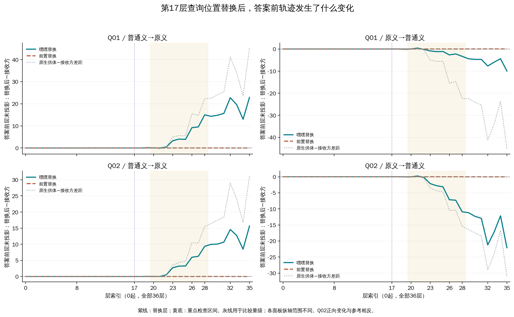
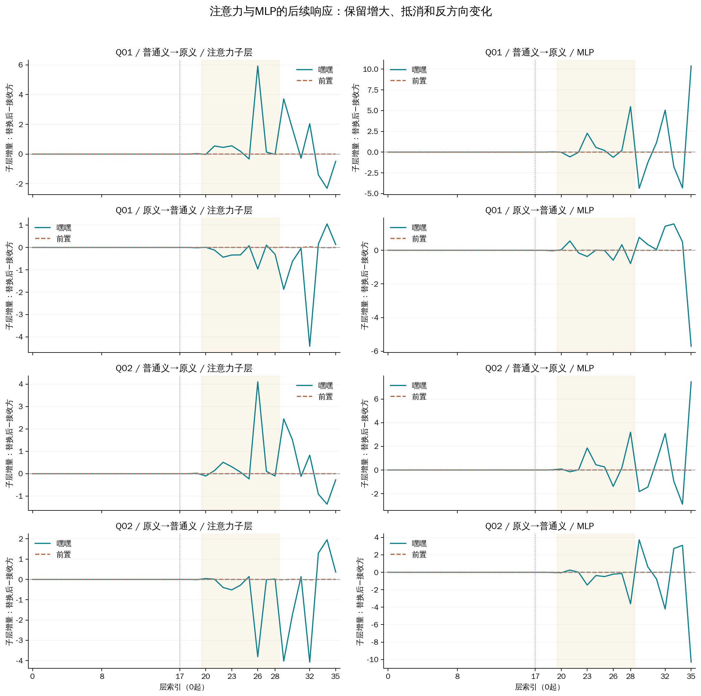

# 第17层“嘿嘿”状态替换与后续答案轨迹

**本轮把此前的两条线索连接起来了：改变第17层“嘿嘿”位置的状态，会改变后续答案前的方向投影；第23层MLP、第26层注意力、第28层MLP在四个替换方向上都出现与最终输出移动方向一致的响应。** 这支持早期词位置干预影响后续答案计算；这些子层是否是必要中介，仍需直接干预。

[完整数值JSON](results.json) · [8个端点](all-interventions.tsv) · [全部36层差值](all-trajectories.tsv) · [原始审核与结果](../results-01/REPORT.md)

## 比较了什么

| 编号 | 既有材料与含义 | 参考答案 |
|---|---|---|
| Q01 | 原#3169：“我想回个嘿嘿嘿嘿。。。感觉好押韵”，日常聊天语境 | 无 |
| Q02 | 原已审核#3660：“主要是被嘿嘿玩过的，那不是一般的思想，那得多么的。。。” | 有 |

D01只提供原侮辱义，D02只提供普通笑声义。四份完整prompt、任务指令和单token“有/无”输出保持原样。原生条件中，普通义使两条查询的输出都由“有”转为“无”，因此修复Q01，却使Q02误判。

本轮的激活替换不改prompt：先取得同一查询在另一种释义下的第17层状态，再把它放入接收方运行中的指定位置。Q01联合替换两个“嘿嘿”token，Q02替换一个；前置对照分别是“回／个”和“被”。共8个跨条件配置，另有8个自身替换控制。

测量位置是**答案前最后一个prompt token**，与被替换的查询词位置不同。答案方向投影用最终输出头读取中间状态，观察其偏向“有”还是“无”；它不表示该层已经作出最终决定。所有层号均0起算。

## 1. 早期替换确实改变了后续轨迹

四个嘿嘿替换方向，首次超出本轮投影工程界的变化均出现在**第18层注意力之后**。其量级约为0.00022–0.00119，随后在22–23层及26、28层出现更大的变化。第0–17层以及第18层入口全部逐元素相同，这是采集器必须满足、也实际通过的结构检查。

这并不等于第18层才开始“理解词义”。它说明第17层查询位置的状态干预，已经在下一层影响了我们测量的答案前状态。轨迹也不是单调增长：Q01最初的小变化可与最终方向相反，两个反向替换在第21层还出现暂时反向变化；32–35层仍有增大和抵消。

| 查询 | 供体→接收方 | 嘿嘿替换Δm | 前置Δm | 替换后的输出 |
|---|---|---:|---:|---|
| Q01 | 普通义→原义 | +22.876492 | -0.020834 | 无（修复） |
| Q01 | 原义→普通义 | -9.973671 | +0.060915 | 无（未翻转） |
| Q02 | 普通义→原义 | +15.648319 | -0.017044 | 有（未翻转） |
| Q02 | 原义→普通义 | -22.090942 | -0.028992 | 有（修复） |

m=z(无)−z(有)，Δm是替换后减接收方原生输出。正向对Q01有利，对Q02不利。本轮第17层前置对照的最大绝对Δm为0.060915，四个前置对照都未翻转；但它们并非零效应或与嘿嘿位置等范数的控制。

新计算的四个原生端点和八个替换端点，与上一轮对应结果的**完整词表logits逐元素一致**。所以此次增加的是干预后的内部轨迹证据，没有借用旧分数来代替新运行。

## 2. 原先关注的三个子层都响应了这次干预

每层新增差距表示一个子层之前与之后的投影变化，再比较替换运行和原生接收方。下面的注意力指注意力子层输出，单位为投影logit差；它不是之前热图中的注意力权重。

| 查询/供体方向 | 23层MLP | 26层注意力 | 28层MLP |
|---|---:|---:|---:|
| Q01/普通义→原义 | +2.276328 | +5.923464 | +5.492609 |
| Q01/原义→普通义 | -0.369938 | -0.959906 | -0.789213 |
| Q02/普通义→原义 | +1.864456 | +4.104209 | +3.197083 |
| Q02/原义→普通义 | -1.459799 | -3.806777 | -3.619133 |

在这三个预先关注的位置，四个方向的响应都与最终Δm同号。前置对照相应变化的绝对值均小于0.008。这比两组原生曲线恰好在相似层分离更进一步：现在同一次早期干预确实改变了这些后续读数。

不过，第26层不是所有方向上最大的注意力响应。Q01原义→普通义时，第32层注意力的变化约为−4.420，明显大于第26层的−0.960；第29层、第32层及末层的补偿和放大也都保留。不能把图概括成只有23→26→28这三个环节。

## 3. 归一化仍影响“大峰值”的解释

RMS归一化会随状态大小调整读数。因此，“MLP前后投影变化”同时包含新增MLP输出的方向投影，以及已有残差因归一化尺度改变而产生的变化。我们按更新后的RMS尺度拆开这两项，并保存浮点余项；这是一种代数分解约定，不是两项独立的因果贡献。

例如Q01普通义→原义的第35层MLP，观测增量变化约为+10.379，其中新增分支投影约−3.564，已有残差重缩放约+13.942。因此这一正峰值不能直接写成“MLP写入了10.379的无方向信息”。23层MLP、26层注意力、28层MLP在该分解下仍有同向的分支投影变化。

[全部36层归一化分解图（PDF）](normalization-effects.pdf) · [SVG](normalization-effects.svg)

## 下一步只需检验一个更具体的问题

优先检查第26层注意力输出和第28层MLP输出，是否承接了第17层干预的最终输出效应。一个小规模做法是保留第17层嘿嘿替换，再分别把这两个候选子层在答案前位置的输出回填为原生接收方值，观察原有Δm是否减弱。这样直接检验候选子层在当前干预效果中的作用，继续沿用四份材料；先不扩展到注意力头。第23、32层仍保留在完整监测图中。此后续干预尚未执行。

即便回填能减弱效应，也应解释为这个固定干预设置中的组件作用，不直接推广为唯一的自然词义路径。本轮四个prompt来自已曝光材料，8个配置也不是新增独立样本。

## 核查与下载

单张L20完成108次前向。从第一阶段启动到最终工作进程释放约132.736秒，工程与正式工作进程均退出0；释放时四卡显存和利用率均为0，无计算进程。
重复、逆序、左右padding、正式重放的状态和投影差异均为0；8个自身替换、12个单标签后EOS端点、完整供体前缀及结构检查通过。独立审计核对108个完整词表向量、80份轨迹、12,096个汇总数值及全部8个效应。初期CPU报告测试中字体发现命令被测试进程替身误拦截，修正测试作用范围后完整检查通过；失败记录保留，科学数值门槛未变。

新margin工程界为1e-06；单候选投影工程界为1.52587890625e-05。两运行投影差的保守传播界为6.103515625e-05，子层增量差为0.0001220703125。这些不是统计置信区间。

[完整原文与准备](../prepared-01/ALL-PROMPTS.md) · [实验协议](../prepared-01/PROTOCOL.md) · [独立审核](../result-audit-01.json) · [历史端点复核](../historical-replay-audit-01.json)

本报告只新增展示与解读。results.json和两份TSV与results-01逐字节相同；原报告保留，新图修正了相邻16/17刻度拥挤的问题。
