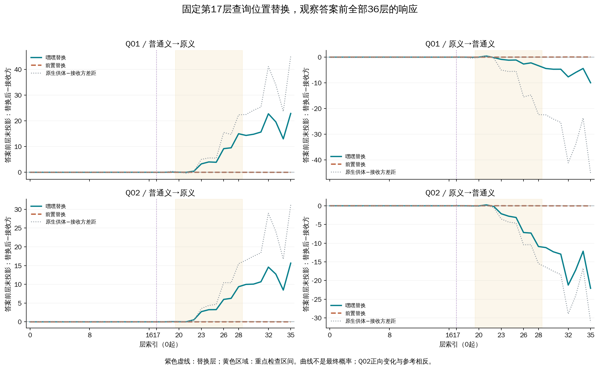
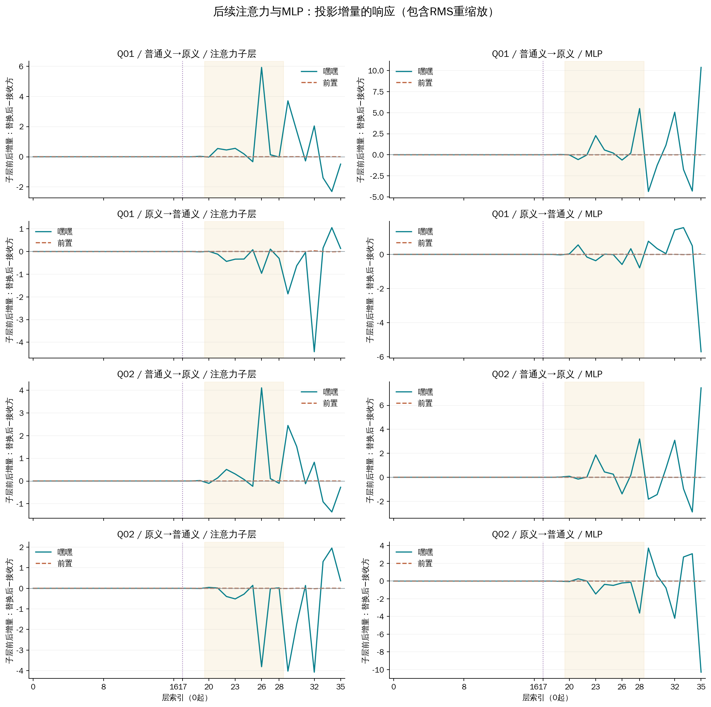

# 第17层查询位置替换之后，答案前的逐层响应

本轮固定已有四份输入，检验较早的查询位置状态变化是否会改变后面的答案方向轨迹。“嘿嘿”替换的答案前投影首次超过工程界的层索引为18–18；完整双向结果、前置对照和最终输出列在下面。

Q01是原#3169的日常聊天文本，参考答案“无”；Q02是原已审核#3660文本，参考“有”。D01提供侮辱义，D02提供普通笑声义。两种释义会使两条查询的原生输出都从“有”变成“无”，所以普通义修复Q01，却损害Q02。

激活替换是把同一查询在供体释义下的内部状态，放入另一释义条件的运行。本轮只替换第17层查询“嘿嘿”位置或既定前置位置，然后重新测量后续计算。供体与接收方均由本次运行重新计算，四份prompt没有改动。全部层号0起算。

[全部端点](all-interventions.tsv) · [全部逐层差值](all-trajectories.tsv) · [完整JSON](results.json)

## 最终输出与位置对照

| 查询 | 供体→接收方 | 位置 | 最终m | Δm | 输出 | 分类变化 |
|---|---|---|---:|---:|---|---|
| Q01 | 普通义→原义 | 嘿嘿 | +2.395153 | +22.876492 | 无 | 修复 |
| Q01 | 普通义→原义 | 前置 | -20.502172 | -0.020834 | 有 | 未翻转 |
| Q01 | 原义→普通义 | 嘿嘿 | +14.760353 | -9.973671 | 无 | 未翻转 |
| Q01 | 原义→普通义 | 前置 | +24.794939 | +0.060915 | 无 | 未翻转 |
| Q02 | 普通义→原义 | 嘿嘿 | -4.949589 | +15.648319 | 有 | 未翻转 |
| Q02 | 普通义→原义 | 前置 | -20.614952 | -0.017044 | 有 | 未翻转 |
| Q02 | 原义→普通义 | 嘿嘿 | -11.519623 | -22.090942 | 有 | 修复 |
| Q02 | 原义→普通义 | 前置 | +10.542328 | -0.028992 | 无 | 未翻转 |

m是“无”的logit减“有”的logit；正向变化对Q01有利，对Q02不利。Δm是替换后的m减接收方原生m，不能把未翻转等同于没有作用。

## 替换如何影响后面的读数

答案方向投影用最终输出头读取某个中间状态，衡量它偏向“有”还是“无”。图中实线为嘿嘿替换的层末投影减接收方原生投影，虚线为前置对照；灰线为原生供体与接收方的差距，供比较量级。它不是各层已经作出的最终决定，也不是概率。

| 查询/方向 | 首个超出工程界的位置 | 最终Δm |
|---|---|---:|
| Q01 / 普通义→原义 | 第18层 / 注意力之后 | +22.876492 |
| Q01 / 原义→普通义 | 第18层 / 注意力之后 | -9.973671 |
| Q02 / 普通义→原义 | 第18层 / 注意力之后 | +15.648319 |
| Q02 / 原义→普通义 | 第18层 / 注意力之后 | -22.090942 |

“首个”依据固定最终输出头和本轮数值工程界，不是首次形成词义信息的层。所有替换都通过结构检查：答案前第0–17层、以及第18层入口完全保持原生值。

## 注意力与MLP的后续变化

每个子层的增量是该子层之后与之前的投影差；再比较替换运行和接收方原生运行，得到图中的增量变化。下面列出事先关注的23层MLP、26层注意力、28层MLP；图和数据保留全部36层。

| 查询/方向/位置 | 23层MLP | 26层注意力 | 28层MLP |
|---|---:|---:|---:|
| Q01/普→原/嘿嘿 | +2.276328 | +5.923464 | +5.492609 |
| Q01/普→原/前置 | -0.003303 | -0.001840 | -0.002461 |
| Q01/原→普/嘿嘿 | -0.369938 | -0.959906 | -0.789213 |
| Q01/原→普/前置 | +0.006971 | +0.002351 | +0.003482 |
| Q02/普→原/嘿嘿 | +1.864456 | +4.104209 | +3.197083 |
| Q02/普→原/前置 | -0.001505 | +0.002974 | +0.007070 |
| Q02/原→普/嘿嘿 | -1.459799 | -3.806777 | -3.619133 |
| Q02/原→普/前置 | +0.001718 | -0.001690 | +0.001174 |

投影增量包含新增分支向量以及RMS归一化对已有残差的重缩放。完整JSON同时提供这两项：采用更新后状态的RMS尺度，分别计算分支方向投影、已有残差缩放和浮点余项。这种分解是代数记账，不能把其中一项直接当作独立因果贡献。35层等较大归一化变化也完整保留。

## 证据能够支持到哪里

本轮把词位置的状态干预与后续答案前轨迹放在同一次运行中测量。若两者发生变化，支持这个早期干预影响后续计算；仍需对具体子层进行干预，才能判断其在最终输出变化中的作用。轨迹与最终输出同步变化本身，不证明某个投影是必要中介或存在唯一传递路径。

前置位置不是等范数控制，也可能读取词典。Q01同时替换两个token，Q02一个；完整状态差异不能等同于纯词义变量。只有四个既有prompt，没有新增独立确认样本。

## 数值与执行核查

新最终margin工程界为1e-06；单候选投影工程界为1.52587890625e-05。两运行投影差的保守传播界为其4倍，子层增量差为8倍。这些都不是统计置信区间。
本次检查包括原生/带钩子、重复/逆序、左右padding、真实供体前缀、8个自身替换、12个标签后EOS端点、独立生产重放及提前变化检查。GPU正常退出并释放后才合入参考标签。

完整准备与原文在相邻prepared-01，原始数组和运行记录在run-01。所有旧实验保持终态，旧结果没有被替代。
