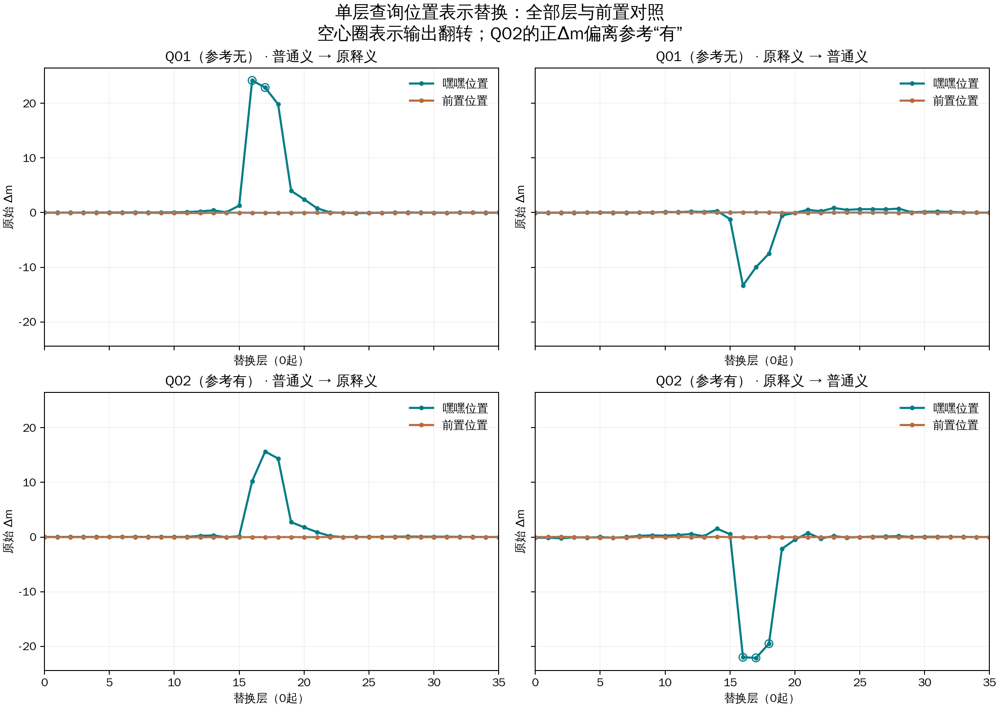

# 查询焦点表示替换：实验结果

[逐层交互图](index.html) · [全部干预TSV](all-interventions.tsv) · [原始汇总JSON](results.json) · [图表PDF](patch-effects.pdf)

## 此次可直接观察的结果

- Q01，普通义状态移入原释义：嘿嘿位置翻转层为16、17；前置位置翻转层为无。嘿嘿位置最大绝对效应出现在层16，Δm=+24.170292；同层前置对照Δm=-0.018194。
- Q01，原释义状态移入普通义：嘿嘿位置翻转层为无；前置位置翻转层为无。嘿嘿位置最大绝对效应出现在层16，Δm=-13.337856；同层前置对照Δm=+0.059362。
- Q02，普通义状态移入原释义：嘿嘿位置翻转层为无；前置位置翻转层为无。嘿嘿位置最大绝对效应出现在层17，Δm=+15.648319；同层前置对照Δm=-0.017044。
- Q02，原释义状态移入普通义：嘿嘿位置翻转层为16、17、18；前置位置翻转层为无。嘿嘿位置最大绝对效应出现在层17，Δm=-22.090942；同层前置对照Δm=-0.028992。

上面的峰值层属于事后描述。比较完整曲线、两个方向和前置对照，避免只挑一个最大值。输出翻转在Q01/Q02的含义不同，下面保留参考标签及全部修复/损害记录。

## 方法与完整概览

[交互逐层图](index.html) · [完整JSON](results.json) · [全部干预TSV](all-interventions.tsv)

仅使用四份既有prompt，在D01原释义与D02普通义之间双向替换查询位置的单层块输出。所有层和位置对照均保留。

## 新测量的基线

|查询|词典|参考|输出|m|
|---|---|---|---|---:|
|Q01|D01|无|有|-20.481339|
|Q01|D02|无|无|+24.734024|
|Q02|D01|有|有|-20.597908|
|Q02|D02|有|无|+10.571320|

## 全层结果概览

最大绝对变化的层是事后描述，不是预先选定的因果层；完整曲线和全部端点见交互图/下载。

|接收方 ← 供体|位置|翻转层（0起）|最大绝对Δm所在层|Δm|donor-gap比例|
|---|---|---|---:|---:|---:|
|hfp-Q01-D01 ← hfp-Q01-D02|查询“嘿嘿”|16, 17|16|+24.170292|+0.534559|
|hfp-Q01-D01 ← hfp-Q01-D02|前置位置对照|无|12|-0.076420|-0.001690|
|hfp-Q01-D02 ← hfp-Q01-D01|查询“嘿嘿”|无|16|-13.337856|+0.294985|
|hfp-Q01-D02 ← hfp-Q01-D01|前置位置对照|无|12|+0.066027|-0.001460|
|hfp-Q02-D01 ← hfp-Q02-D02|查询“嘿嘿”|无|17|+15.648319|+0.502044|
|hfp-Q02-D01 ← hfp-Q02-D02|前置位置对照|无|11|-0.039871|-0.001279|
|hfp-Q02-D02 ← hfp-Q02-D01|查询“嘿嘿”|16, 17, 18|17|-22.090942|+0.708742|
|hfp-Q02-D02 ← hfp-Q02-D01|前置位置对照|无|6|-0.106960|+0.003432|

## 解释边界

- 仅四个既有输入：Q01/Q02 × D01/D02；144个焦点干预和144个前置位置对照不是独立样本。
- 层号从0开始。在单层decoder块输出处，用同一查询另一释义条件的完整原生向量替换所选位置。每次仅替换一层。
- Q01焦点联合替换两个“嘿嘿”token，Q02替换一个；前置对照分别为“回／个”和“被”。前置位置可以读取词典，不假定其效应为零。
- m=z(无)−z(有)，正值偏无。Q01参考无、Q02参考有，所以Q02的正Δm可能造成损害。
- Δm=替换后−接收方；donor-gap比例=Δm/(供体−接收方)，不截断，分母接近数值界为NA。范围是工程误差传播，不是统计置信区间。
- 焦点减前置=两种替换后的m之差，共享的接收方抵消。所有层、方向和不利结果均保留。
- 完整向量替换可造成混合上下文状态；位置、token数及扰动范数均影响结果。不能将一个有效位置解释为唯一语义路径。
- 末层所选位置之后没有跨token层，预期零效果；自替换也应为零。零结果不排除词典直接作用于后续位置的路径。

本次干预若改变输出，支持“这个固定位置集合在该层的状态替换足以影响此prompt的输出”。它不自动证明自然运行中仅靠该位置，也不把完整状态差异等同于单一词义。
前置对照并非中性基线：其状态已经能读取词典；焦点与前置不同还包含位置和扰动范数差异。Q01为两token联合替换，不能定位到其中某一个。

## 工程与数值验证

新margin工程界为 1e-06；差值界为 2e-06。
只读捕获、自替换、重复、逆序、左右padding、真实前缀、独立生产重放和所有替换端点的“单标签后EOS”均在本次运行内验证。
自替换 288 个；末层结构零对照 8 个。数值界不是统计置信区间。
新donor和基线来自同一run，完整FP32词表向量与供体行均有哈希绑定；参考标签在raw seal及GPU进程正常退出后才加入。
没有重新采集注意力；本轮检验状态替换的输出效应，不能直接归因到某个注意头。

## 可支持的机制判断

此实验检验固定查询位置集合的状态替换能否改变最终输出。若出现翻转，这比单看注意力大小更直接地说明该干预可以影响决策；仍不能据此将状态差异归结为一个纯词义变量、唯一词典路径或特定注意头。
若前置对照也有较大效果，说明词典条件差异在读到“嘿嘿”之前已能通过其他位置影响后续计算。若没有较大效果，也不能当作所有非焦点位置都无作用。
若效应只有一个方向明显，需保留这种不对称；完整上下文仍属于接收方，供体向量移植并不等价于把整个prompt换成供体条件。

审核材料：[完整四份prompt](ALL-PROMPTS.md) · [冻结方案](PROTOCOL.md) · [全部干预登记](interventions.json)。
