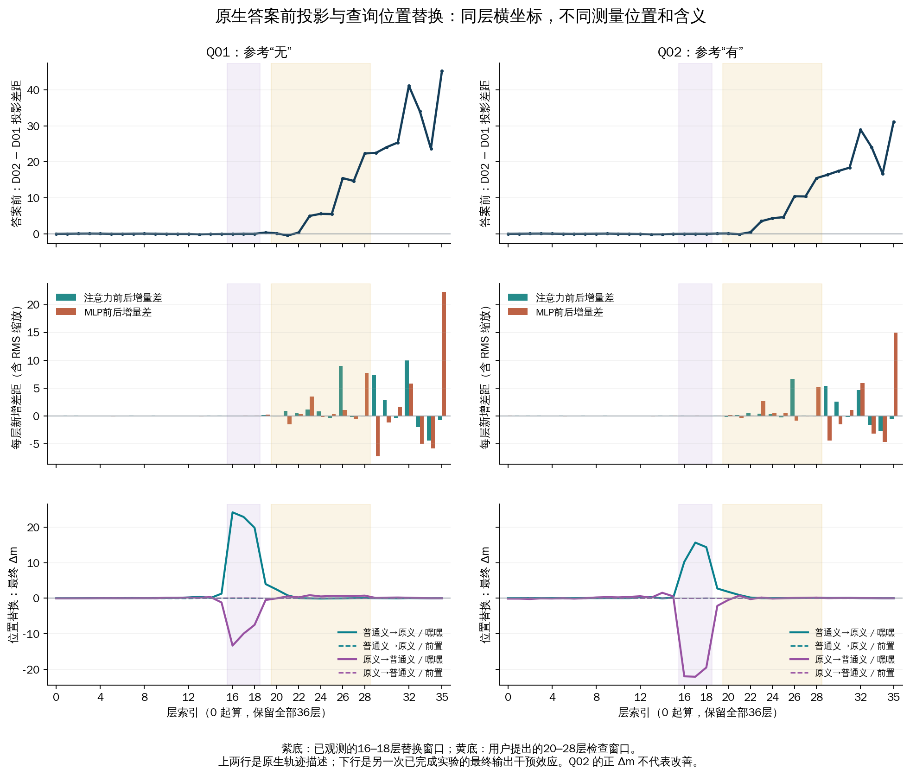
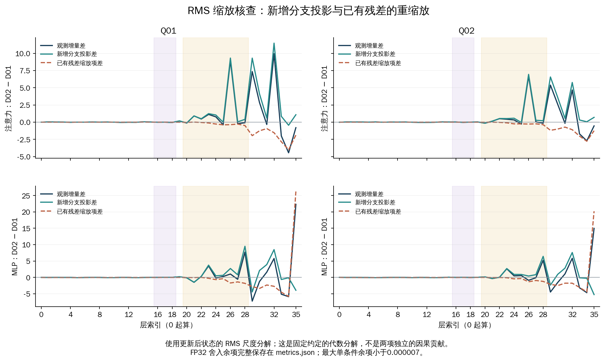

# 现有投影差距与位置替换的对照：CPU 补充分析

这份分析只读取已封存结果。没有增加材料、标签、模型前向、GPU任务或网站部署；旧数据、报告和选择器保持不变。所有层号均为网站一致的0起算索引（0–35）。

建议保留用户提出的三步框架，但把“两类证据吻合”解释为位置和先后关系相容，并进一步测量早期替换对后续轨迹的作用，不能要求不同位置的峰值出现在同一层。

## 读数和对照

主对照只用已完成双向替换覆盖的Q01/Q02、D02普通义减D01原义。m=z(无)−z(有)，Q02的参考对齐方向与m相反。原生投影来自答案前位置，替换在查询“嘿嘿”或其前置位置的完整decoder block输出实施，两者位置和指标不同。

令P为当前隐藏状态经过固定最终RMSNorm参数和输出头得到的有/无logit差。G_pre、G_mid、G_post分别为两个条件在层入口、注意力残差相加后、MLP残差相加后的P差。注意力增量差=G_mid−G_pre，MLP增量差=G_post−G_mid。保留正负号、初始差距和所有36层，不对绝对值做差，也不把已选择层重新归一化。

18条原生轨迹的相邻层状态读数严格连续。全部24个原注册线性比较的864个逐层差分通过精确Fraction检查，增量之和还原终点减起点。全部比较见[TSV](all-contrasts.tsv)，包括Q03、双义条件及交互项；双义换序另见[补充图](presentation-order-gaps.pdf)。它们未获得D01/D02位置替换之外的新因果证据。

| 层及子层 | Q01 新增差距 | Q02 新增差距 |
|---|---:|---:|
| 23 / MLP | +3.501692 | +2.632423 |
| 26 / 注意力 | +8.951463 | +6.672949 |
| 28 / MLP | +7.714802 | +5.227866 |
| 32 / 注意力 | +9.950387 | +4.677675 |
| 32 / MLP | +5.788844 | +5.858239 |
| 35 / MLP | +22.322464 | +14.985063 |

22–23层附近开始出现较大的最终答案方向差距，26–28层继续扩大；但32、35层也有很大的变化，33–34层出现收缩。因此不能将20–28层视为完整的处理区间。早期投影接近并不意味着隐藏状态没有可用差异。

## 归一化改变了什么解释

P(h)=w_eff·h/s(h)，其中w_eff=(w_无−w_有)⊙gamma，s(h)=sqrt(mean(h²)+eps)。对分支输出b，采用“更新后尺度”这一固定约定：

ΔP = w_eff·b/s(h_next) + w_eff·h·[1/s(h_next)−1/s(h)] + 舍入余项。

第一项是该分支在指定尺度下的方向投影，第二项是已有残差投影因尺度改变而产生的变化。两项不是相互独立的因果贡献；归一化变化本身仍受分支输出影响。当前工具的“MLP前后变化”应按这个完整定义解读，不能直接称为MLP写入量。

| 位置 | 观测增量差 | 新增分支投影差 | 已有残差缩放项差 |
|---|---:|---:|---:|
| Q01 / 23 / MLP | +3.501692 | +3.759557 | -0.257864 |
| Q01 / 26 / 注意力 | +8.951463 | +9.315694 | -0.364230 |
| Q01 / 28 / MLP | +7.714802 | +9.515116 | -1.800316 |
| Q01 / 35 / MLP | +22.322464 | -3.911645 | +26.234101 |
| Q02 / 23 / MLP | +2.632423 | +2.719588 | -0.087166 |
| Q02 / 26 / 注意力 | +6.672949 | +6.945159 | -0.272208 |
| Q02 / 28 / MLP | +5.227866 | +6.437281 | -1.209420 |
| Q02 / 35 / MLP | +14.985063 | -5.231315 | +20.216381 |

23层MLP、26层注意力、28层MLP的正向差距仍有同向的新增分支投影支持。35层MLP的大正向增量则主要体现在缩放项；该约定下新增分支投影差反为负。不能据其增量峰值直接声称“35层MLP大量写入无方向信息”。这也不是归一化无关或MLP无因果作用的证据。

四个原始NPZ经原记录SHA256核对；重新提取的原生logit读数与汇总严格相同。FP64公式与原生读数的最大差小于0.000005，分解单条件余项最大约0.00000654，完整值保留在metrics.json。未对已冻结容差做调整。原有probe工程包络按线性表达传播，不是统计置信区间。

## 与位置替换的关系

| 查询/供体方向 | 嘿嘿替换峰值层 | 峰值Δm | 20–28层最大绝对Δm |
|---|---:|---:|---:|
| Q01 / 普通义→原义 | 16 | +24.170292 | 2.447220 |
| Q01 / 原义→普通义 | 16 | -13.337856 | 0.853687 |
| Q02 / 普通义→原义 | 17 | +15.648319 | 1.792065 |
| Q02 / 原义→普通义 | 17 | -22.090942 | 0.739182 |

前置位置全部未翻转，最大绝对Δm为0.106960；它们并非与嘿嘿位置等范数的控制，不能据此把全部差异归为词义。两次运行四条输入的prompt、token、角色位置及有/无logits逐项相同，适合并排比较；这里没有替代新运行分数。

16–18层在嘿嘿位置的干预有较强最终输出效应，而该时段答案前的固定输出头投影差仍很小。这支持进一步检验“较早的查询状态差异影响较晚的答案方向读出”的假设。它还没有证明具体传递路径、唯一机制、在哪层理解了词义，或低效应层在其他位置无作用。

## 建议的最小下一步（尚未执行）

1. 本次CPU差距图作为选点依据，主对照继续是四条既有Q01/Q02×D01/D02输入。双义顺序只作为独立描述性补充，不同步扩大GPU材料。
2. 先做一个连接两类证据的测量：固定共同有效的第17层，在嘿嘿及已接受的前置位置，保留两条查询、两个方向；共8种跨条件替换配置。配套原生及同条件替换控制。新增的是在替换后记录答案前全部36层pre/mid/post状态、注意力/MLP分支、RMS尺度和最终m。工程验证和重复前向另计，8不是总forward数。原实验保持终态，新测量须使用新的运行版本。结构检查应要求答案前第0–17层保持原生值：第17层block输出的跨位置替换最早只能影响后续层的答案前状态。
3. 看嘿嘿替换是否改变第23层MLP、第26层注意力、第28层MLP的轨迹，并同时报告其余层和前置对照。双向变化不必等幅、未翻转也不记为零。若晚期峰值在干预后不跟随变化，不把它们强行串成机制链。
4. 若后续轨迹响应与最终m共同支持这个联系，再冻结少数层和明确位置做注意力/MLP分支输出替换。候选23/26/28是基于已观测数据的探索性候选；32层保持对照可见。该细分仍不能单独证明唯一的自然传递路径，必要时再设计路径干预。

目前只需决定是否开展第2步，不需要同时展开新文本、双义条件、头扫描或大规模子层网格。

输出头直接解码中间状态具有可读性限制，见[Tuned Lens原论文](https://arxiv.org/abs/2303.08112)。干预方向不对称、组件定位与路径验证的区别，见[How to use and interpret activation patching](https://arxiv.org/abs/2404.15255)。这些文献提供方法背景；以上数值均来自本项目封存结果。

来源SHA256、计算定义、全部24个对照、原生分解、全部288条跨条件替换及核查记录见[metrics.json](metrics.json)。
