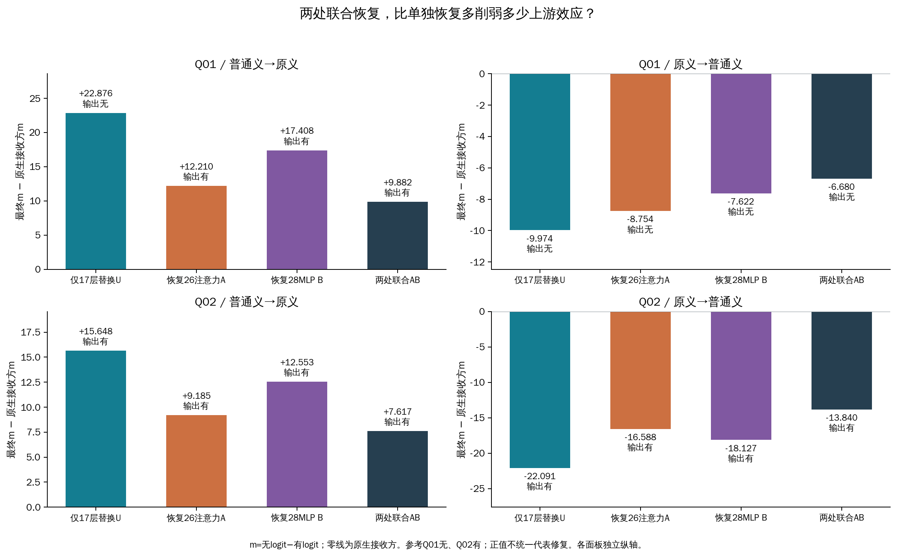
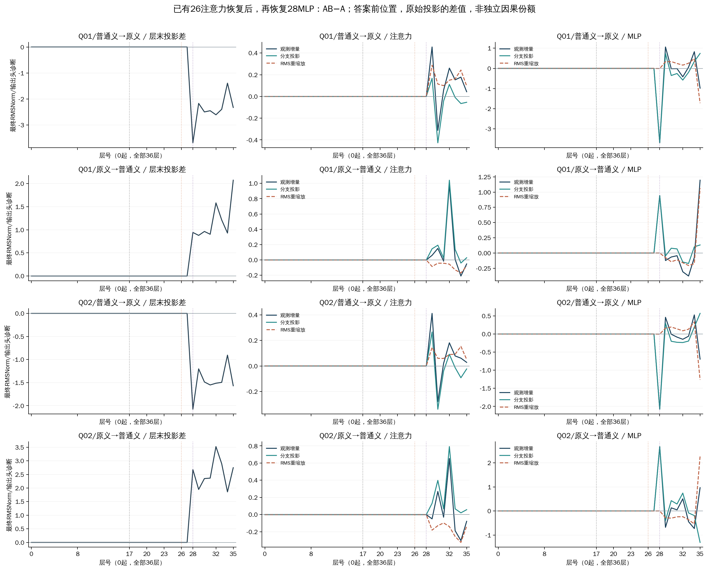

# 两处联合恢复：是否比单独恢复进一步削弱上游效应？

四个方向中，联合恢复有4个方向比两种单独恢复都进一步减小最终效应的绝对值；有4个方向在最终分数上明确偏离简单相加。这检验了两处在固定上游干预下的联合效应，尚不能单独判断是否存在唯一的串行词义路径。

## 比较对象与操作

| 查询 | 原文 | 参考答案 |
|---|---|---|
| Q01（#3169） | 我想回个嘿嘿嘿嘿。。。感觉好押韵 | 无 |
| Q02（已审核#3660） | 主要是被嘿嘿玩过的，那不是一般的思想，那得多么的。。。 | 有 |

D01提供原侮辱义，D02提供普通笑声义；四份完整prompt、任务、单token有/无输出均与前轮相同。Q02还有其他贬损线索，两个查询不是纯词义最小对。方向“普通义→原义”表示从普通义运行取内部向量，放入原义运行；反向亦然。

N是没有干预的原生接收方。U首先在第17层，将查询“嘿嘿”的完整内部状态替换为另一释义条件的状态（Q01两个token、Q02一个）。A在U基础上，把答案前第26层注意力输出恢复成N的值；B独立恢复第28层MLP输出。新增AB在同一运行依次恢复这两处，来源始终是N。全部层号从0开始。

这里的注意力输出是经o_proj后、残差相加前的整个4096维向量，与热图注意力权重不同。MLP亦在残差相加前恢复。恢复发生在原始prompt最后位置，不是生成答案token的位置。两处恢复会影响其后的计算；尤其A改变了28层收到的状态，因此不能简单把单独恢复的比例相加。N/U/A/B/AB都在本轮重新计算，旧分数未代入。

## 最终效应与标签

m=无logit−有logit，越正越偏“无”；正向对Q01有利，对Q02不利。下表列相对N的分数差，括号是最终输出。零效应表示回到N的分数，并不统一表示正确。

| 查询/供体→接收方 | 原生N的m | U效应 | A效应 | B效应 | 联合AB效应 |
|---|---:|---:|---:|---:|---:|
| Q01/普通义→原义 | -20.4813 | +22.8765（无） | +12.2099（有） | +17.4081（有） | +9.8825（有） |
| Q01/原义→普通义 | +24.7340 | -9.9737（无） | -8.7537（无） | -7.6219（无） | -6.6798（无） |
| Q02/普通义→原义 | -20.5979 | +15.6483（有） | +9.1853（有） | +12.5531（有） | +7.6165（有） |
| Q02/原义→普通义 | +10.5713 | -22.0909（有） | -16.5876（有） | -18.1273（有） | -13.8397（有） |

移除比例=(U分数−恢复后分数)/(U分数−N分数)。0表示没有移除原干预效应，1表示回到N；负值或超过1也保留。比例不是概率，不能作为独立中介份额；同时检查相对N的绝对效应，以免越过N后反而离得更远。

| 查询/方向 | A移除比例 | B移除比例 | AB移除比例 | 比A/B都进一步减弱 |
|---|---:|---:|---:|---|
| Q01/普通义→原义 | 46.6% | 23.9% | 56.8% | 是 |
| Q01/原义→普通义 | 12.2% | 23.6% | 33.0% | 是 |
| Q02/普通义→原义 | 41.3% | 19.8% | 51.3% | 是 |
| Q02/原义→普通义 | 24.9% | 17.9% | 37.4% | 是 |

标签是否翻转还取决于恢复前离零点有多远；只看有/无，可能漏掉已经明确发生的分数变化。完整m、参考对齐变化及未翻转方向见附表。

## 联合效果是否可以简单相加

先比较AB−A：已有26层注意力恢复之后，再恢复28层MLP，最终分数还改变多少。AB−B则比较联合恢复与仅恢复28层。交互量I=mAB−mA−mB+mU衡量联合变化偏离两种单独变化之和的程度；它不是额外的一份独立因果贡献。

| 查询/方向 | AB−A | AB−B | 交互I | I/原U效应 |
|---|---:|---:|---:|---:|
| Q01/普通义→原义 | -2.3274 | -7.5256 | +3.1410 | 13.7% |
| Q01/原义→普通义 | +2.0739 | +0.9421 | -0.2779 | 2.8% |
| Q02/普通义→原义 | -1.5687 | -4.9366 | +1.5265 | 9.8% |
| Q02/原义→普通义 | +2.7478 | +4.2875 | -1.2158 | 5.5% |

I/原U效应为正，表示联合移除量小于两个单独移除量之和；为负表示超过该和。这里仅描述最终m这个尺度上的交互。非零可以来自前后依赖、非线性或后续补偿，不能据此确认冗余或串行中介；即使接近零也不代表两处独立。

## 全部36层发生了什么

答案方向投影使用最终RMSNorm和输出头读取中间状态，衡量当时偏向“有/无”的程度，不表示该层已经作出决定。所有曲线来自答案前位置，层号0起。主图画差值以区分新增变化，保留全部36层和晚层补偿；没有仅选看起来有效的层。

左列为AB−A的层末投影差；中、右列为注意力与MLP部分的增量差。新增分支投影和已有残差RMS重缩放是采用更新后尺度的代数分解，浮点余项也保留在完整数据中。这几项不能解释成独立因果份额。AB与A在28层MLP恢复前必须逐元素相同，这是操作正确性的核查；恢复后的变化才是需要解释的结果。

[联合与仅B的差值](joint-minus-B.pdf) · [逐层交互](joint-interaction.pdf) · [所有配置相对N](remaining-trajectories.pdf) · [所有恢复相对U](restore-minus-upstream-trajectories.pdf) · [联合恢复RMS分解](restore-joint-normalization.pdf)

## 核查、边界与后续问题

16个原生自身控制和12个条件自身控制要求完整输出向量及全层轨迹精确不变。条件自身控制保留跨释义上游替换，但把两处分支恢复成U自身的值，以检查双重回填操作。采集器开关、重复、逆序、左右padding、真实供体前缀、正式重放及全部20个单标签后EOS端点，均按原门槛通过后才分析。AB的26层恢复前与U相同、28层MLP恢复前与A相同；安装的两个向量均来自本轮N。

预期且核验192次前向；GPU两阶段工作耗时合计193.26秒，工作进程退出并验证释放后才合并人工参考。m工程界为1e-06，单候选投影界为1.90194733989e-05；I的保守工程界为4倍m界。归一化交互的区间枚举五个分数的端点并保留共享U依赖；这些不是统计置信区间。独立审计另行对全部原始向量、轨迹与派生数值核验后才完成科学封存。

四份材料已在前轮观察，四个方向不是独立确认样本。恢复整个向量混合了不同运行状态，并没有单独删去词义信息。联合恢复后即使仍有剩余，也不能把剩余归于某个未测试的唯一模块。

本轮回答的最小问题是“两处一起恢复是否比单独恢复更充分”。如果更充分但仍有剩余，应先将该结论作为这四份输入的机制证据保留；若继续追问串行联系，需要明确区分26层改变经28层传递的部分与其他后续影响。不据当前结果自动扩展头扫描、材料或新GPU配置。

[完整输入](../prepared-01/ALL-PROMPTS.md) · [预先协议](../prepared-01/PROTOCOL.md) · [所有干预](all-interventions.tsv) · [恢复比较](restoration-contrasts.tsv) · [联合交互](joint-contrasts.tsv) · [全层TSV](all-trajectories.tsv) · [JSON](results.json) · [独立审计](../result-audit-01.json)
