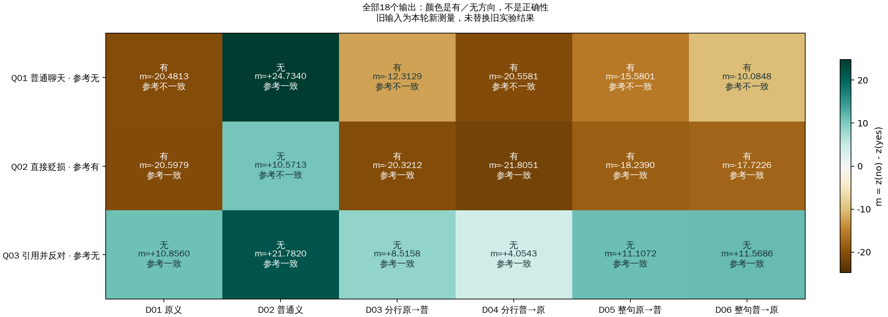
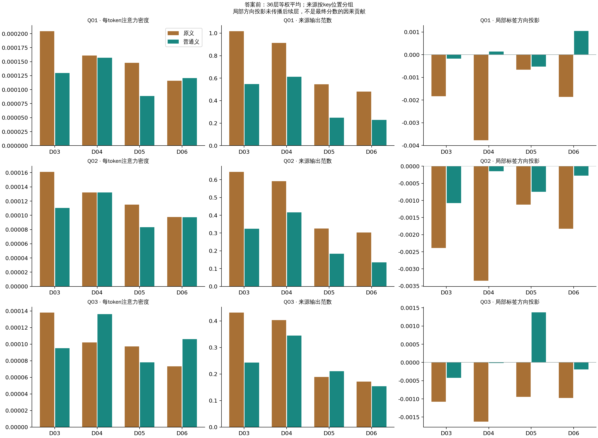
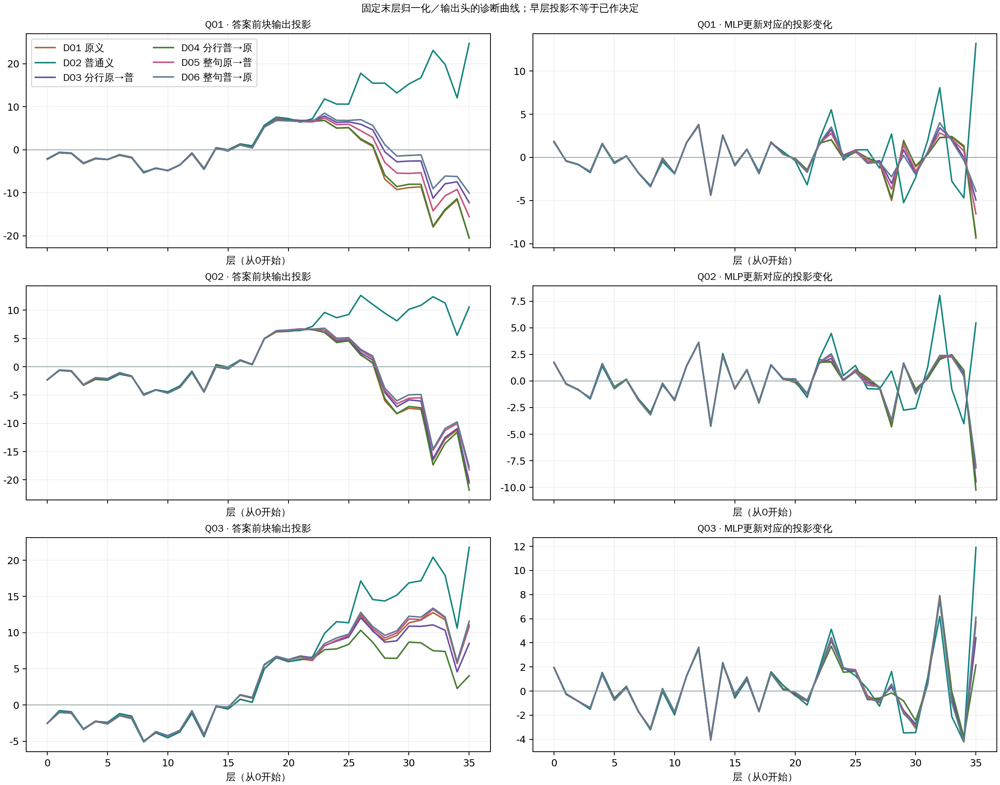

# 释义顺序、表达形式与中间表示：本轮结果

本轮第一阶段已完成，GPU工作进程已正常退出。下面保留全部18个输出、24个比较及完整逐层机制读数；激活替换尚未执行。

四种双义呈现的输出均相同：Q01为有，Q02为有，Q03为无。倒序和整句改写均未修复Q01；仍只有单独普通义D02修复Q01，同时使Q02误判。

| 查询 | 参考 | D01 | D02 | D03 | D04 | D05 | D06 |
|---|---|---|---|---|---|---|---|
| Q01 | 无 | 有 (-20.481339) | 无 (+24.734024) | 有 (-12.312939) | 有 (-20.558064) | 有 (-15.580090) | 有 (-10.084812) |
| Q02 | 有 | 有 (-20.597908) | 无 (+10.571320) | 有 (-20.321224) | 有 (-21.805141) | 有 (-18.238964) | 有 (-17.722553) |
| Q03 | 无 | 无 (+10.855965) | 无 (+21.782015) | 无 (+8.515823) | 无 (+4.054256) | 无 (+11.107170) | 无 (+11.568649) |

m = z(无) − z(有)，Q02的参考对齐方向与m相反。

## 顺序与表达形式

- Q01：分行原义在前→普通义在前（D03→D04），输出 有→有，Δm=-8.245125；整句同方向换序（D05→D06），输出 有→有，Δm=+5.495277。
- Q02：分行原义在前→普通义在前（D03→D04），输出 有→有，Δm=-1.483917；整句同方向换序（D05→D06），输出 有→有，Δm=+0.516411。
- Q03：分行原义在前→普通义在前（D03→D04），输出 无→无，Δm=-4.461567；整句同方向换序（D05→D06），输出 无→无，Δm=+0.461479。

这两个对照分别约束相应表达内的顺序敏感性。D03/D04等长，D05/D06等长；整句相对分行还改变连接词、词形重复、标点并增加1 token，表达效应不能单独归为换行。
本组3条查询的分行换序均使m降低，整句换序均使m升高。顺序作用依赖表达方式，不支持“把普通义放前面或后面就会一致改善”的简单规则；三条依赖查询也不构成总体规律。
 
| 全部注册比较 | Δm | 参考方向Δ | 分类变化 |
|---|---|---|---|
| Q01-D02-minus-D01 | +45.215363 | +45.215363 | repair |
| Q01-D03-minus-D01 | +8.168400 | +8.168400 | unchanged |
| Q01-D03-minus-D02 | -37.046963 | -37.046963 | damage |
| Q01-D04-minus-D03 | -8.245125 | -8.245125 | unchanged |
| Q01-D06-minus-D05 | +5.495277 | +5.495277 | unchanged |
| Q01-D05-minus-D03 | -3.267151 | -3.267151 | unchanged |
| Q01-D06-minus-D04 | +10.473251 | +10.473251 | unchanged |
| Q01-order-by-expression | +13.740402 | +13.740402 | 交互量 |
| Q02-D02-minus-D01 | +31.169228 | -31.169228 | damage |
| Q02-D03-minus-D01 | +0.276684 | -0.276684 | unchanged |
| Q02-D03-minus-D02 | -30.892544 | +30.892544 | repair |
| Q02-D04-minus-D03 | -1.483917 | +1.483917 | unchanged |
| Q02-D06-minus-D05 | +0.516411 | -0.516411 | unchanged |
| Q02-D05-minus-D03 | +2.082260 | -2.082260 | unchanged |
| Q02-D06-minus-D04 | +4.082588 | -4.082588 | unchanged |
| Q02-order-by-expression | +2.000328 | -2.000328 | 交互量 |
| Q03-D02-minus-D01 | +10.926050 | +10.926050 | unchanged |
| Q03-D03-minus-D01 | -2.340141 | -2.340141 | unchanged |
| Q03-D03-minus-D02 | -13.266191 | -13.266191 | unchanged |
| Q03-D04-minus-D03 | -4.461567 | -4.461567 | unchanged |
| Q03-D06-minus-D05 | +0.461479 | +0.461479 | unchanged |
| Q03-D05-minus-D03 | +2.591347 | +2.591347 | unchanged |
| Q03-D06-minus-D04 | +7.514393 | +7.514393 | unchanged |
| Q03-order-by-expression | +4.923046 | +4.923046 | 交互量 |

## 注意力与传入向量

下表只摘录原义和普通义两个来源，完整8个来源及NA见机制页面。注意力沿全部层和头等权平均，向量指标沿36层平均；未按当前显示片段重新归一化。

| 输入 | 来源 | 可见token | 注意力质量% | 每token密度% | 来源输出范数 | 局部方向投影 |
|---|---|---|---|---|---|---|
| hpm-Q01-D01 | 原释义子句 | 21 | 0.422936 | 0.020140 | 0.973107 | -0.002688 |
| hpm-Q01-D02 | 普通义子句 | 21 | 0.423405 | 0.020162 | 1.063387 | +0.005022 |
| hpm-Q01-D03 | 原释义子句 | 21 | 0.429285 | 0.020442 | 1.017928 | -0.001834 |
| hpm-Q01-D03 | 普通义子句 | 21 | 0.272020 | 0.012953 | 0.547503 | -0.000175 |
| hpm-Q01-D04 | 原释义子句 | 21 | 0.337937 | 0.016092 | 0.912513 | -0.003769 |
| hpm-Q01-D04 | 普通义子句 | 21 | 0.329738 | 0.015702 | 0.611544 | +0.000139 |
| hpm-Q01-D05 | 原释义子句 | 20 | 0.295932 | 0.014797 | 0.544758 | -0.000662 |
| hpm-Q01-D05 | 普通义子句 | 18 | 0.159315 | 0.008851 | 0.248477 | -0.000525 |
| hpm-Q01-D06 | 原释义子句 | 20 | 0.231432 | 0.011572 | 0.480312 | -0.001858 |
| hpm-Q01-D06 | 普通义子句 | 18 | 0.217437 | 0.012080 | 0.229247 | +0.001049 |
| hpm-Q02-D01 | 原释义子句 | 21 | 0.364947 | 0.017378 | 0.712046 | -0.002957 |
| hpm-Q02-D02 | 普通义子句 | 21 | 0.379722 | 0.018082 | 0.735515 | +0.003464 |
| hpm-Q02-D03 | 原释义子句 | 21 | 0.338158 | 0.016103 | 0.643595 | -0.002388 |
| hpm-Q02-D03 | 普通义子句 | 21 | 0.231591 | 0.011028 | 0.323927 | -0.001078 |
| hpm-Q02-D04 | 原释义子句 | 21 | 0.277227 | 0.013201 | 0.591463 | -0.003345 |
| hpm-Q02-D04 | 普通义子句 | 21 | 0.277587 | 0.013218 | 0.415800 | -0.000148 |
| hpm-Q02-D05 | 原释义子句 | 20 | 0.230092 | 0.011505 | 0.325112 | -0.001120 |
| hpm-Q02-D05 | 普通义子句 | 18 | 0.149983 | 0.008332 | 0.183311 | -0.000748 |
| hpm-Q02-D06 | 原释义子句 | 20 | 0.195289 | 0.009764 | 0.303499 | -0.001828 |
| hpm-Q02-D06 | 普通义子句 | 18 | 0.175220 | 0.009734 | 0.135104 | -0.000277 |
| hpm-Q03-D01 | 原释义子句 | 21 | 0.279157 | 0.013293 | 0.424759 | -0.001124 |
| hpm-Q03-D02 | 普通义子句 | 21 | 0.270363 | 0.012874 | 0.301381 | -0.000076 |
| hpm-Q03-D03 | 原释义子句 | 21 | 0.289791 | 0.013800 | 0.430863 | -0.001079 |
| hpm-Q03-D03 | 普通义子句 | 21 | 0.199775 | 0.009513 | 0.243053 | -0.000425 |
| hpm-Q03-D04 | 原释义子句 | 21 | 0.214222 | 0.010201 | 0.403029 | -0.001627 |
| hpm-Q03-D04 | 普通义子句 | 21 | 0.286087 | 0.013623 | 0.344782 | -0.000014 |
| hpm-Q03-D05 | 原释义子句 | 20 | 0.194899 | 0.009745 | 0.188896 | -0.000943 |
| hpm-Q03-D05 | 普通义子句 | 18 | 0.140619 | 0.007812 | 0.210672 | +0.001373 |
| hpm-Q03-D06 | 原释义子句 | 20 | 0.146905 | 0.007345 | 0.171294 | -0.000974 |
| hpm-Q03-D06 | 普通义子句 | 18 | 0.190895 | 0.010605 | 0.153859 | -0.000191 |

一个直接线索是Q01/D06：普通义每token密度为0.012080%，原义为0.011572%；来源输出范数却分别为0.229247和0.480312，最终仍输出有。因此即便普通义在这一读数上稍高，也不等于其传入向量更大或模型已采用普通义。
这些量回答不同问题：质量表示取样权重，AV/输出范数表示加权向量大小，局部方向投影表示该层来源输出相对有/无输出方向的对齐。value已包含此前上下文，后续层仍会处理这些向量，因此均不能单独认定最终分类由哪段内容导致。

## 全文语境的层间线索

答案前位置已能读取全文。曲线展示块输出投影及MLP更新前后差值；pre/mid/post、注意力更新和每个来源的全部36层在机制页面保留。

Q03的焦点在反对句之前，任何层的焦点状态都不能读取后面的反对句。Q02/Q03差异还包含引述标记、位置和长度，因此它们的表示差异只能提出候选层，不能独立证明立场消歧路径。

表示距离最大的层作为描述性候选完整记录在metrics.json；阶段二仍保留已注册的36层双向焦点替换、自替换和等数量其他查询位置控制，避免只报告挑选的“有效层”。末层焦点替换应为结构性零，阴性结果不排除词典直接到答案的路线。

## 验证与运行

9个历史输入全部按本轮新测量保存；与历史输出的对照见metrics.json，未用旧分数替换新值。
独立审计核对162份绝对向量、126个margin、18个预测和24个比较；机制重建核对39,313,332个数值。
数值界：margin=1e-06，attention mass=1e-07。来源与残差重建最大缩放误差=1.2414179e-06，投影最大绝对误差=1.52587891e-05。均为工程误差界，不是统计置信区间。
工程与正式两个阶段耗时分别为[185.10304188728333, 92.86679744720459]秒，从首次启动到末次释放共331.94秒，释放时间2026-09-19T20:29:09.432587+08:00。
真实结果浏览器核对注意力210,636个值和机制56,412个值，并验证NA、顺序差分、SVG和手机布局。

[完整材料](ALL-PROMPTS.md) · [交互注意力](index.html) · [机制页面](mechanism.html) · [全部分数](scores.json) · [全部比较](comparisons.json) · [独立审计](audit.json) · [浏览器审计](browser-audit.json)

本轮为两个已暴露的真实来源和一个用户采用的AI派生文本；条件互相依赖，不能据此估计总体准确率或宣称统计显著。后续的内部机制结论仍需激活干预支持。
