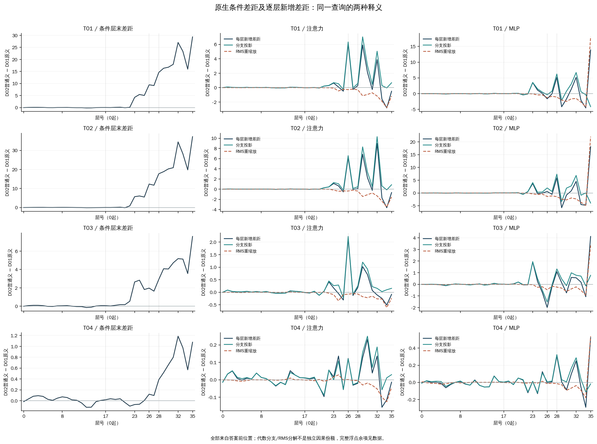
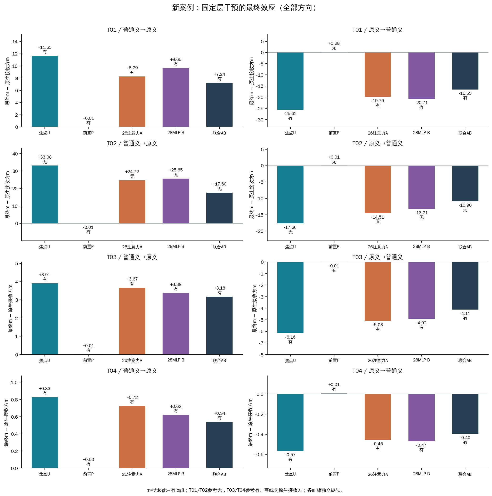
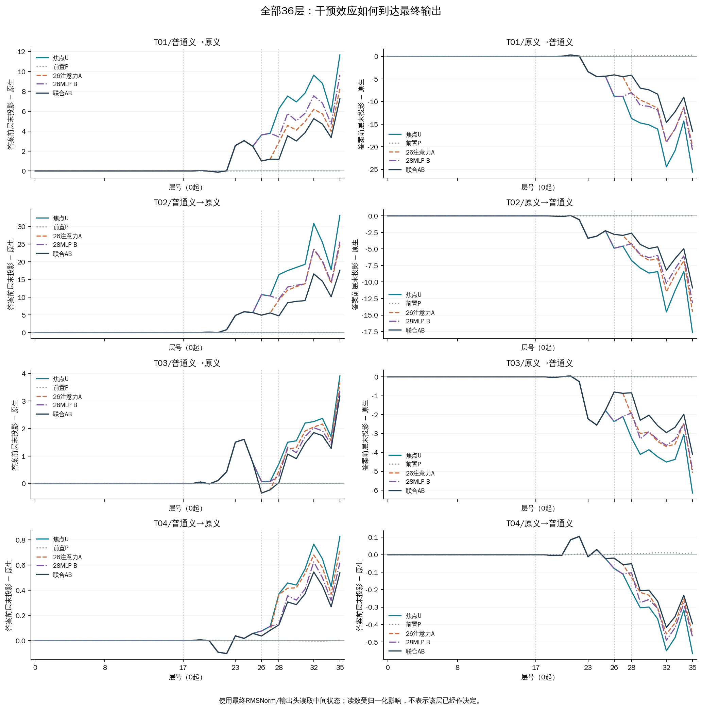
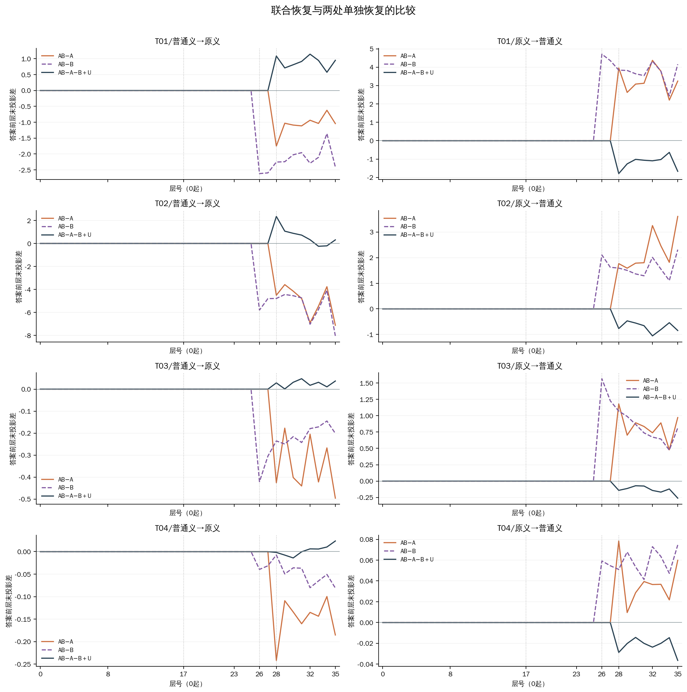

# 四条新案例：固定层机制能否延伸？

两条普通笑声案例中，2/2条重现“原释义答有、普通义答无”的行为模式。全部8个替换方向中，焦点效应绝对值比前置对照大且超出工程界的有8个；联合恢复比两种单独恢复都进一步减小绝对效应的有8个。这些是四条材料的具体结果，不是总体成功率，也不能仅凭这些计数确认同一条自然词义路径。

## 比较对象

T01/T02为普通笑声（参考无）；T03是#7050，按用户明确要求继承原标签有；T04是笑声之外另有攻击（参考有）的边界。T03的二元参考已经采用，但这不是新增族群身份、严重度或纯词义裁决。T04不算第二条旧Q02同类复现。

| 查询 | 完整原文 | 参考 |
|---|---|---|
| T01 | 山东人莫名自豪一把，嘿嘿 | 无 |
| T02 | 看到有人拿老实举例，我还是挺高兴的，因为我也想用老实举例来着，嘿嘿。 | 无 |
| T03 | 你去帮你的嘿嘿打工吧 | 有 |
| T04 | 我并没有瞧不起少数民族，就是瞧不起某个把中国拖入痛苦深渊的种族，旗装，嘿嘿，最适合满人大姑娘抽烟袋的时候穿 | 有 |

同一查询只替换嘿嘿的词典释义：D01为原侮辱义，D02为普通笑声义。其余五词、当前任务、Qwen3-8B、无示例设置保持一致。四条真实语料未改写，没有依据模型输出筛掉案例。

## 原生输出与条件差距

m=z(无)−z(有)，衡量输出更偏哪一个字；正向对T01/T02有利、对T03/T04不利。下表分数是原始logit差，不是概率。

| 查询 | D01输出 / m | D02输出 / m | 普通义−原义 | 参考对齐变化 |
|---|---:|---:|---:|---:|
| T01 | 有 / -20.5854 | 无 / +8.7760 | +29.3614 | +29.3614 |
| T02 | 有 / -15.3390 | 无 / +21.9099 | +37.2488 | +37.2488 |
| T03 | 有 / -22.9376 | 有 / -15.3372 | +7.6004 | -7.6004 |
| T04 | 有 / -20.4090 | 有 / -19.3320 | +1.0770 | -1.0770 |

答案方向投影使用最终RMSNorm和输出头读取中间状态，测量它当时偏向有还是无，不表示该层已经作决定。左列是答案前位置的层末条件差；中、右列分别展示注意力与MLP的每层新增差距，以及分支投影和残差重缩放分解。层号从0开始，保留全部36层；不从新结果里另挑干预层。

## 固定第17层：焦点与前置对照

U把另一释义条件下第17层嘿嘿的完整向量放进当前运行，P只替换紧邻前置位置。T01/T02/T04前置为逗号，T03为你的；均一个token。对照可以受词典影响，并非词性或向量大小匹配，不能预设为零。方向普通义→原义表示供体D02、接收方D01。

| 查询/方向 | U相对原生效应 / 输出 | P相对原生效应 / 输出 | U−P |
|---|---:|---:|---:|
| T01/普通义→原义 | +11.6475 / 有 | +0.0067 / 有 | +11.6407 |
| T01/原义→普通义 | -25.6195 / 有 | +0.2751 / 无 | -25.8946 |
| T02/普通义→原义 | +33.0795 / 无 | -0.0075 / 有 | +33.0870 |
| T02/原义→普通义 | -17.6611 / 无 | +0.0074 / 无 | -17.6686 |
| T03/普通义→原义 | +3.9097 / 有 | +0.0105 / 有 | +3.8993 |
| T03/原义→普通义 | -6.1553 / 有 | -0.0064 / 有 | -6.1488 |
| T04/普通义→原义 | +0.8280 / 有 | +0.0021 / 有 | +0.8259 |
| T04/原义→普通义 | -0.5661 / 有 | +0.0105 / 有 | -0.5766 |

U/P/A/B/AB柱高都是相对各自原生接收方N的差值。正值不统一代表修复；标签是否翻转还取决于距离决策零点有多远。

## 下游单独与联合恢复

A在U基础上把答案前26层注意力输出恢复成N的向量；B独立恢复28层MLP；AB同时依次恢复两处。这里的注意力输出是o_proj后、残差相加前的整个4096维向量，与注意力热图权重不同。两处来源始终是同次运行的N。

| 查询/方向 | U效应 | A剩余 | B剩余 | AB剩余 | A/B/AB移除比例 |
|---|---:|---:|---:|---:|---|
| T01/普通义→原义 | +11.6475 | +8.2867 | +9.6541 | +7.2446 | 28.9% / 17.1% / 37.8% |
| T01/原义→普通义 | -25.6195 | -19.7920 | -20.7082 | -16.5479 | 22.7% / 19.2% / 35.4% |
| T02/普通义→原义 | +33.0795 | +24.7246 | +25.6455 | +17.6030 | 25.3% / 22.5% / 46.8% |
| T02/原义→普通义 | -17.6611 | -14.5058 | -13.2096 | -10.8990 | 17.9% / 25.2% / 38.3% |
| T03/普通义→原义 | +3.9097 | +3.6714 | +3.3769 | +3.1755 | 6.1% / 13.6% / 18.8% |
| T03/原义→普通义 | -6.1553 | -5.0814 | -4.9232 | -4.1098 | 17.4% / 20.0% / 33.2% |
| T04/普通义→原义 | +0.8280 | +0.7235 | +0.6192 | +0.5383 | 12.6% / 25.2% / 35.0% |
| T04/原义→普通义 | -0.5661 | -0.4551 | -0.4698 | -0.3953 | 19.6% / 17.0% / 30.2% |

移除比例=(U−恢复后)/(U−N)。负值、超过100%和无效结果均保留；分母靠近工程界时记NA。尤其小U效应下，比例很大不代表绝对作用很大，应先看分数差。移除比例不能相加成独立中介贡献。

| 查询/方向 | AB−A | AB−B | 交互I=AB−A−B＋U | 比两处单独都进一步减弱 |
|---|---:|---:|---:|---|
| T01/普通义→原义 | -1.0421 | -2.4095 | +0.9513 | 是 |
| T01/原义→普通义 | +3.2442 | +4.1603 | -1.6672 | 是 |
| T02/普通义→原义 | -7.1217 | -8.0426 | +0.3123 | 是 |
| T02/原义→普通义 | +3.6068 | +2.3106 | -0.8447 | 是 |
| T03/普通义→原义 | -0.4959 | -0.2014 | +0.0370 | 是 |
| T03/原义→普通义 | +0.9716 | +0.8134 | -0.2605 | 是 |
| T04/普通义→原义 | -0.1852 | -0.0809 | +0.0236 | 是 |
| T04/原义→普通义 | +0.0598 | +0.0746 | -0.0364 | 是 |

交互量衡量当前m尺度上偏离简单相加的部分；非零不能单独确定串行中介、冗余或后续补偿。AB在26注意力前与U相同、28MLP前与A相同，是操作边界核查，不作为额外的机制发现。全部RMS分解和浮点余项保留在JSON/TSV。

## 验证与结论范围

64个自身控制、采集开关、重复/逆序、左右padding、真实前缀、正式重放，以及48个单标签后EOS端点通过原门槛。所有原生、干预与恢复来源均新计算，未代入旧分数；工作进程正常退出并核实释放后才合并参考标签。

通常且本轮完整协议要求456次前向；两阶段工作耗时合计388.01秒。m工程界1e-06，候选投影界2.28881835938e-05。这些误差界反映工程精度，不是统计置信区间。独立120位分数与扩展精度轨迹审计通过后才科学封存。

固定层不出现旧案例的效应，也是本轮需要保留的结果。全向量替换可能混合不同上下文状态，未隔离纯词义变量；新案例的反例不能自动归为层号不对，也不能为追求复现而更换层或材料。当前四条内容筛选案例不支持总体频率估计。

[完整输入](../prepared-01/ALL-PROMPTS.md) · [预先协议](../prepared-01/PROTOCOL.md) · [原生分数](baselines.tsv) · [全部干预](all-interventions.tsv) · [前置比较](position-differences.tsv) · [恢复比较](restoration-contrasts.tsv) · [联合交互](joint-contrasts.tsv) · [原生条件全层差距](condition-gap-trajectories.tsv) · [干预全层TSV](all-trajectories.tsv) · [完整JSON](results.json) · [独立审计](../result-audit-01.json)
