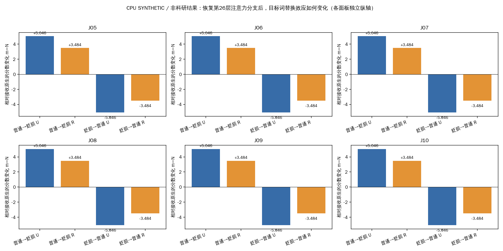
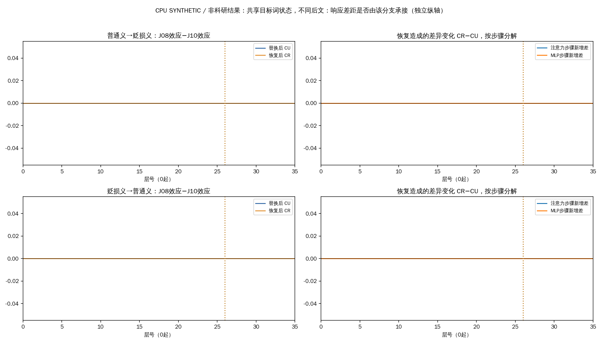
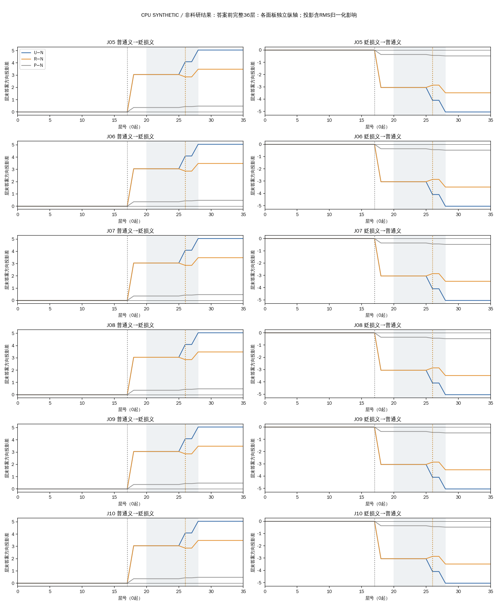
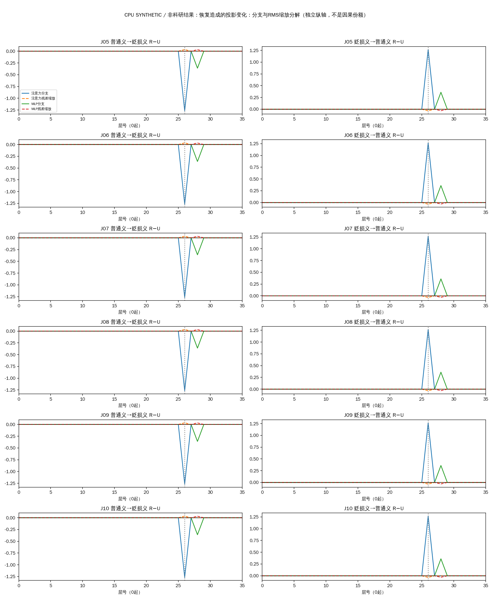

# 京巴：第26层注意力分支恢复

CPU SYNTHETIC：以下全部为合成测试，禁止解释为科研结果。

在第17层“京巴”状态替换后，恢复答案前第26层注意力分支，使12个方向中的12个效应绝对值减小、0个增大。两条普通犬种查询J05/J06的四个方向中有4个减小；恢复前后有0个标签改变。这里只判断该分支是否参与传递此前干预的影响，不能直接等同于修复误判。

J05/J06谈宠物，J07/J08反对地域辱称，参考答案都是“无”；J09自己实施辱称，J10认可他人辱称，参考为“有”。沿用六条已经审核的构造材料，任务、标签、释义和全文不变。D00无词典，D01提供地域贬损义，D02提供普通犬种义；不提供示例。

N是当前接收条件原生运行。U把另一释义条件第17层“京巴”两个token的完整状态放进接收条件。R在U基础上，将答案前第26层注意力合并后的完整输出恢复为N在同处的输出，然后继续计算。P是第17层紧邻前置位置的等token数替换。全部状态在本轮重新计算，两种方向和全部36层均保留，层号从0开始。

m是“无”与“有”的logit之差：正数偏向无，负数偏向有，并不是概率。比较U−N与R−N是在问：恢复该分支后，原先替换造成的影响还剩多少。恢复为原生值未必更正确，因为原生判断本身可能有误。

| 查询 | 参考 | 替换方向 | N分数 | U分数 | R分数 | U−N | R−N | 有向效应消减 | N/U/R标签 |
|---|---|---|---:|---:|---:|---:|---:|---:|---|
| J05 | 无 | 普通义→贬损义 | -3.206 | +1.840 | +0.278 | +5.045896 | +3.483639 | 31.0% | 有/无/无 |
| J05 | 无 | 贬损义→普通义 | +3.206 | -1.840 | -0.278 | -5.045896 | -3.483639 | 31.0% | 无/有/有 |
| J06 | 无 | 普通义→贬损义 | -3.206 | +1.840 | +0.278 | +5.045896 | +3.483639 | 31.0% | 有/无/无 |
| J06 | 无 | 贬损义→普通义 | +3.206 | -1.840 | -0.278 | -5.045896 | -3.483639 | 31.0% | 无/有/有 |
| J07 | 无 | 普通义→贬损义 | -3.206 | +1.840 | +0.278 | +5.045896 | +3.483639 | 31.0% | 有/无/无 |
| J07 | 无 | 贬损义→普通义 | +3.206 | -1.840 | -0.278 | -5.045896 | -3.483639 | 31.0% | 无/有/有 |
| J08 | 无 | 普通义→贬损义 | -3.206 | +1.840 | +0.278 | +5.045896 | +3.483639 | 31.0% | 有/无/无 |
| J08 | 无 | 贬损义→普通义 | +3.206 | -1.840 | -0.278 | -5.045896 | -3.483639 | 31.0% | 无/有/有 |
| J09 | 有 | 普通义→贬损义 | -3.206 | +1.840 | +0.278 | +5.045896 | +3.483639 | 31.0% | 有/无/无 |
| J09 | 有 | 贬损义→普通义 | +3.206 | -1.840 | -0.278 | -5.045896 | -3.483639 | 31.0% | 无/有/有 |
| J10 | 有 | 普通义→贬损义 | -3.206 | +1.840 | +0.278 | +5.045896 | +3.483639 | 31.0% | 有/无/无 |
| J10 | 有 | 贬损义→普通义 | +3.206 | -1.840 | -0.278 | -5.045896 | -3.483639 | 31.0% | 无/有/有 |

消减比例=(U−R)/(U−N)，保留符号，不裁剪为0—100%。负数表示相对原效应进一步扩大，超过100%表示跨过原生分数；不是准确率或可相加的中介份额。小效应对应的大比例仍须结合绝对分数阅读。

J08和J10在“京巴”之前共享完整前缀，后文分别反对、认可辱称。下表比较两条的替换效应差：先计算各自相对N的变化，再做J08减J10。若恢复后差距缩小，支持这处注意力输出参与承接不同后文下的响应差异；若仍有差距或扩大，说明该处不能独自解释这种差异。

| 方向 | 恢复前差距 CU | 恢复后差距 CR | 恢复引起的变化 | 绝对差距减小 |
|---|---:|---:|---:|---|
| 普通义→贬损义 | +0.000000 | +0.000000 | +0.000000 | 否 |
| 贬损义→普通义 | +0.000000 | +0.000000 | +0.000000 | 否 |

二者后文的措辞、长度和答案位置也不同，不能将差距直接归结为“正确识别作者立场”。共享前缀与全层局部状态的重新核验如下。

| 词典条件 | 真正截到目标词的前缀状态36层相同 | 完整prompt焦点状态36层相同 |
|---|---|---|
| D00 | True | True |
| D01 | True | True |
| D02 | True | True |

答案方向投影是用最终输出头读取答案前中间状态，观察偏向有或无；它不表示该层已经完成判断。完整轨迹如下，展示层末相对N的投影差。26层之前R与U应一致，这是干预实施位置决定的结构性质，不能据此说差异天然“起源于26层”。

所有图的面板使用独立纵轴，横向比较前请看刻度。后续层可能补偿、扩大或反转前面的变化；RMS归一化对已有残差的缩放也会改变投影，分解如下。注意力分支输出与注意力权重是不同读数。

工程检查保留48个自身控制和54个单token有/无后EOS端点；m的工程误差界为1e-06，单logit中间投影界为1e-06。差值与比例按共享分数依赖计算边界，不是统计置信区间。独立高精度复核、上轮42端点完整向量与轨迹一致性由关闭记录另行证明，不能用报告本身的自检代替。

结论范围：这是一项在固定第17层替换之上的条件性恢复实验。它能检验第26层注意力完整输出在此干预效应中的作用，不能证明唯一或必要的自然语义通路，也未识别具体注意力头。D01/D02相差18token，前置对照不是范数或词性匹配；六条是相关构造材料。所有反例和两方向保留，没有新增头/层扫描。

[全部干预](all-interventions.tsv) · [恢复对比](restoration-contrasts.tsv) · [36层差值](all-trajectories.tsv) · [原生分数](baselines.tsv) · [完整结构化数据](results.json)

全文材料：

J05（参考无）：synthetic

J06（参考无）：synthetic

J07（参考无）：synthetic

J08（参考无）：synthetic

J09（参考有）：synthetic

J10（参考有）：synthetic

