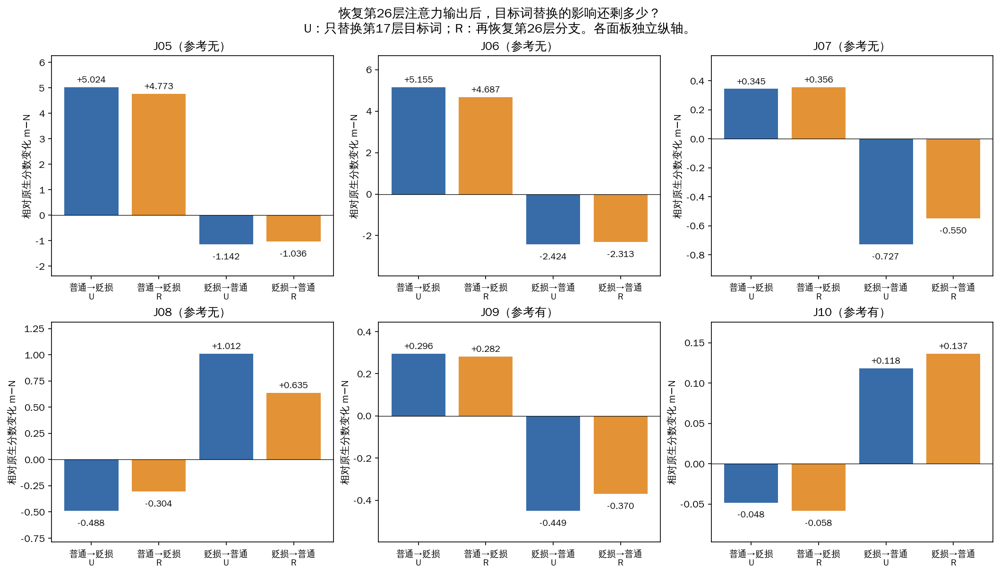
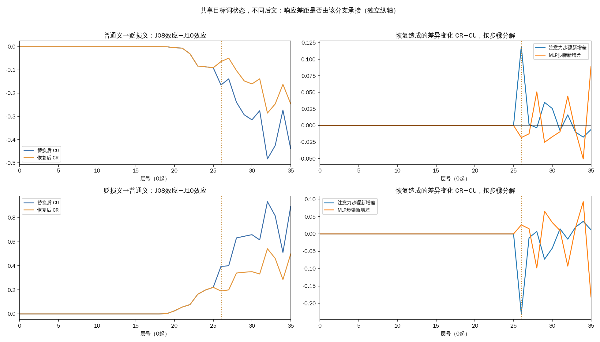

# 第26层参与语境差异，但作用并不通用

本轮支持一个更具体的解释：**在第17层“京巴”状态替换已经发生的情况下，第26层注意力输出参与了J08/J10对同一替换的不同反应。** 把这处输出恢复为接收条件原本的值后，两条的最终响应差距在两个方向都缩小约44%。但它对普通犬种J05/J06的作用明显较小，也没有修复任何错误判断。

这里仍是原来六条材料。J05/J06谈宠物，J07/J08反对辱称，参考均为“无”；J09实施辱称、J10认可他人辱称，参考均为“有”。J08/J10直到“京巴”为止的完整前缀相同，本轮再次核实三种词典条件下，目标词36层内部状态都完全相同。后续文字、长度和答案位置不同。

D01提供地域贬损义，D02提供普通犬种义。N表示原生运行；U表示把另一条件第17层目标词状态换进来；R在U基础上，再把答案前第26层注意力合并后的完整输出恢复为N的原生值。层号从0开始。注意力输出是参与后续计算的向量，与热图中的注意力权重不同。

m为“无”减“有”的logit，正数偏无、负数偏有；不是概率。下面的“效应”是相对同一个N的分数变化，比较的是U−N与R−N。**恢复原生输出，不等于恢复正确答案。**

| 材料 | 普通义→贬损义：恢复前 → 后 | 贬损义→普通义：恢复前 → 后 | 含义 |
|---|---:|---:|---|
| J05 | +5.024 → +4.773 | -1.142 → -1.036 | 减弱5.0% / 9.3%，大部分效应仍在 |
| J06 | +5.155 → +4.687 | -2.424 → -2.313 | 减弱9.1% / 4.6%，大部分效应仍在 |
| J07 | +0.345 → +0.356 | -0.727 → -0.550 | 前向小幅增大，反向减弱24.4% |
| J08 | -0.488 → -0.304 | +1.012 → +0.635 | 两方向都减弱约37%，仍有剩余 |
| J09 | +0.296 → +0.282 | -0.449 → -0.370 | 减弱4.6% / 17.6% |
| J10 | -0.048 → -0.058 | +0.118 → +0.137 | 两方向小幅增大；原效应本来较小 |

四个普通犬种方向都减弱了，但只减弱4.6%—9.3%。因此，第26层确实影响这些干预结果，却没有消除大部分最终分数变化。J07的前向以及J10的两个方向反而增大，说明不能把它概括成所有语境都一致的传递环节。J10的增大只有约0.010和0.019，不能被较大的百分比夸大。

更集中的线索来自J08/J10。它们收到相同的目标词状态替换，却表现出不同响应。把两条各自相对N的变化再相减，得到：

| 替换方向 | 恢复前响应差距 | 恢复后响应差距 | 绝对差距缩小 |
|---|---:|---:|---:|
| 普通义→贬损义 | -0.439869 | -0.245941 | 44.1% |
| 贬损义→普通义 | +0.893650 | +0.498379 | 44.2% |

这约44%的缩小主要来自J08效应减弱；J10的小幅增大也使二者更接近。它表示本次具体恢复操作改变了两条的响应差异，**不是“44%的语境理解由第26层完成”**，也不是不同层之间可相加的因果份额。

图中左列是两条干预效应的差距，右列拆开注意力与MLP步骤，显示恢复造成的新增差。各面板纵轴独立。答案方向投影用最终输出头读取中间状态的有/无倾向，不代表该层已经做出最终决定；数值也受RMS归一化影响。

恢复前，两条的响应在第22—23层附近已经出现可见差异；第25层末差距约为−0.091和+0.221。第26层恢复削弱了后续放大，但差距并未消失。后面的28、32、35层仍有扩大与补偿。因此不能把26层当成差异唯一的起点，或把后续变化当成单调传递。R与U在26层之前相同，是干预边界所要求的结果，本身不是新的机制发现。

本轮12个方向中9个减弱、3个增大，全部判断标签保持不变：J05/J06仍正确，J07/J08仍误判，J09/J10仍正确，各为4/6。J08参考为“无”，所有端点仍偏“有”，反对辱称的误判未修复；J10所有端点仍为“有”，保持正确。所以这里得到的是内部处理差异的证据，没有得到通用修复手段。

这使“同样的局部替换如何被后文不同地处理”成为更值得继续聚焦的问题。若下一轮细分第26层注意力头，适合以J08/J10的响应差距为目标，并把J05/J06与其余材料全部保留作对照。当前尚未运行或授权新的逐头实验；也不能凭本轮百分比先认定某个头负责理解立场。词典长度相差18token，J08/J10后文的措辞和长度共同改变，结论仍限于这些相关的构造材料。

本轮只使用GPU 0，共498次前向，首次阶段启动至最终释放约6分25秒。48个自身控制、54个单token答案后EOS检查通过。独立120位十进制与扩展精度审计核对全部498个输出向量、372份轨迹、96处恢复边界和120条安装来源证明；本轮18个原生与24个U/P端点的完整向量及轨迹，均与前轮完全一致。没有旧分数代入、失败重试或门槛调整。

m误差界为10⁻⁶；配对差距及其变化的边界为4×10⁻⁶，绝对差距缩小判据为8×10⁻⁶。这里的44%为这次确定性结果的描述比例，不是统计置信结论。独立审计通过后科学结果已关闭；主机确认本轮全部进程退出，四卡空闲。网站与旧科学结果选择器保持原样。

[全部结果与全文材料](../results-01/REPORT.md) · [12个恢复端点](../results-01/restoration-contrasts.tsv) · [完整36层数据](../results-01/all-trajectories.tsv) · [独立数值复核](../result-audit-01.json) · [关闭记录](../closeout-01/closeout.json) · [事先固定的协议](../prepared-01/PROTOCOL.md)
