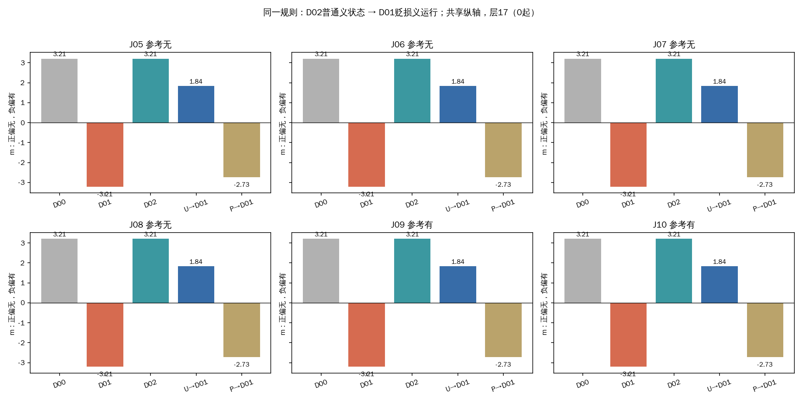
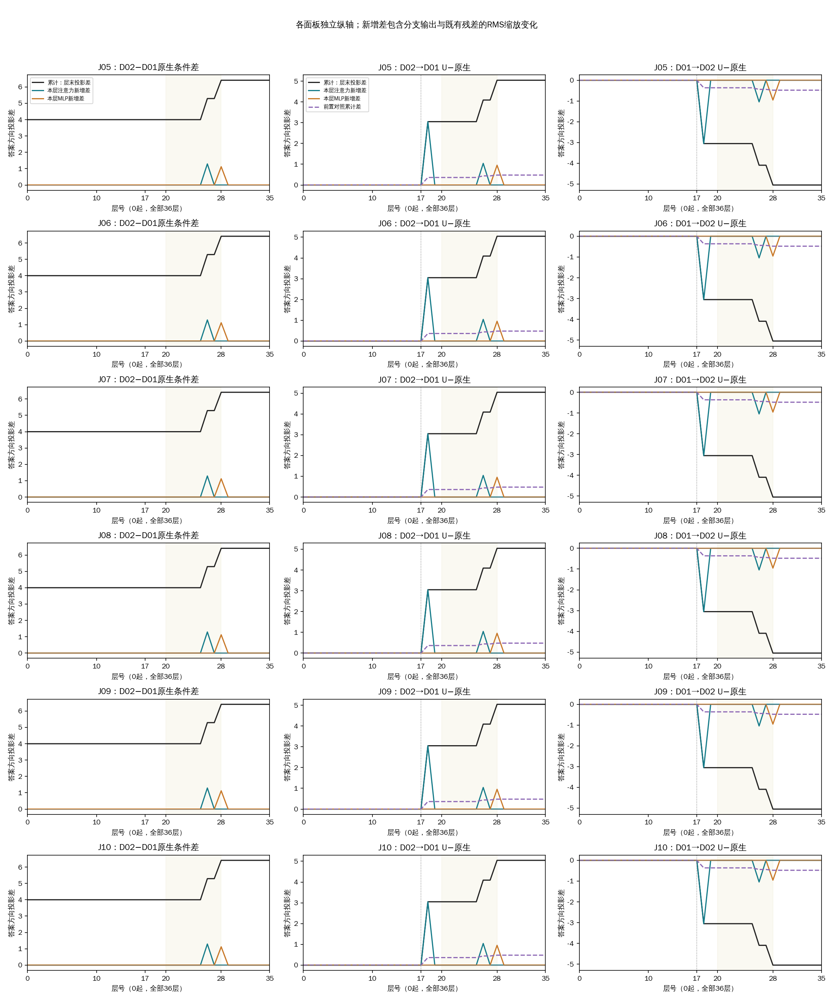
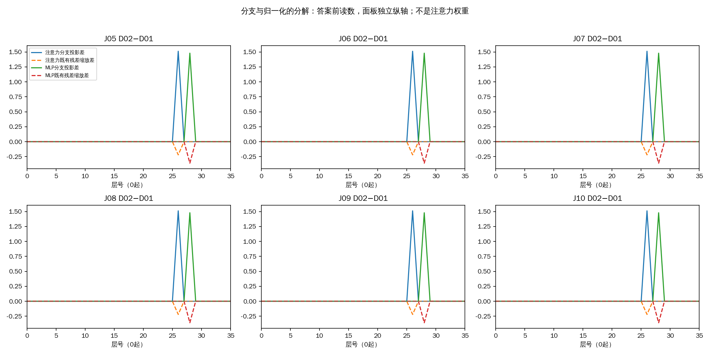

# 六条新增京巴查询：固定规则的语境复现

固定使用“普通义→贬损义、第17层京巴位置替换”后，这六条材料中正确判断由2/6变为4/6。修复：J05,J06,J07,J08；新增误判：J09,J10。这是固定规则在六条已审核构造材料上的结果，尚不能作为通用修复的证明。

J05/J06中的京巴是宠物；J07/J08反对地域辱称，四条参考均为无。J09自己使用辱称，J10认可他人辱称，参考均为有。六条均为本次新构造，原文与答案经用户一次性全部通过；没有根据新模型输出筛选材料。

D00不提供词典；D01提供已审核的地域贬损义；D02提供家犬的普通义。所有条件使用相同任务指令，不提供示例，只提供京巴词条。U把D02运行中第17层“京巴”两个token的完整内部状态放入同一句D01运行；P以同样方式替换紧邻前方的两个token，作为位置对照。层号均从0开始。

m是模型对“无”的logit减去“有”的logit；正数偏无、负数偏有，它不是概率。正向变化对参考无的材料有利，对参考有的材料可能有害。

| 查询 | 参考 | 无词典D00 | 贬损义D01 | 普通义D02 | 普通义→贬损义 U | 同方向P |
|---|---|---|---|---|---|---|
| J05 | 无 | 无（+3.206） | 有（-3.206） | 无（+3.206） | 无（+1.840） | 有（-2.727） |
| J06 | 无 | 无（+3.206） | 有（-3.206） | 无（+3.206） | 无（+1.840） | 有（-2.727） |
| J07 | 无 | 无（+3.206） | 有（-3.206） | 无（+3.206） | 无（+1.840） | 有（-2.727） |
| J08 | 无 | 无（+3.206） | 有（-3.206） | 无（+3.206） | 无（+1.840） | 有（-2.727） |
| J09 | 有 | 无（+3.206） | 有（-3.206） | 无（+3.206） | 无（+1.840） | 有（-2.727） |
| J10 | 有 | 无（+3.206） | 有（-3.206） | 无（+3.206） | 无（+1.840） | 有（-2.727） |

括号为m，所有六条保留。相同替换规则没有借助参考答案选择供体、层或方向。

反向替换也全部保留，用来检查方向不对称；它不与正向规则混在一起挑选最佳答案。

| 查询 | 方向 | U的分数变化 | P的分数变化 | U结果 | 参考方向上的结果变化 |
|---|---|---:|---:|---|---|
| J05 | 普通义→贬损义 | +5.045896 | +0.478674 | 无 | 修复 |
| J05 | 贬损义→普通义 | -5.045896 | -0.478674 | 有 | 新增误判 |
| J06 | 普通义→贬损义 | +5.045896 | +0.478674 | 无 | 修复 |
| J06 | 贬损义→普通义 | -5.045896 | -0.478674 | 有 | 新增误判 |
| J07 | 普通义→贬损义 | +5.045896 | +0.478674 | 无 | 修复 |
| J07 | 贬损义→普通义 | -5.045896 | -0.478674 | 有 | 新增误判 |
| J08 | 普通义→贬损义 | +5.045896 | +0.478674 | 无 | 修复 |
| J08 | 贬损义→普通义 | -5.045896 | -0.478674 | 有 | 新增误判 |
| J09 | 普通义→贬损义 | +5.045896 | +0.478674 | 无 | 新增误判 |
| J09 | 贬损义→普通义 | -5.045896 | -0.478674 | 有 | 修复 |
| J10 | 普通义→贬损义 | +5.045896 | +0.478674 | 无 | 新增误判 |
| J10 | 贬损义→普通义 | -5.045896 | -0.478674 | 有 | 修复 |

答案方向投影用最终输出头读取答案前的中间状态，观察其偏向有还是无；不表示这一层已经完成最终决定。下面同时展示层末累计差和注意力、MLP两个子步骤带来的新增差，保留全部36层。20—28层的底色沿用已有观察窗口，不重新选择有效层。

上图各面板纵轴独立，比较高度前应读取刻度。注意力分支指o_proj后的完整输出，不能理解为“关注量”。新增投影差还受RMS归一化对既有残差的缩放影响，分解如下；它不是可相加的因果中介份额。

J08/J10直到京巴的完整token前缀相同，后面的文字才分别表达反对与认可。以下核对局部状态是否已不同：

| 条件 | 真正截到目标词的前缀：36层状态相同 | 完整prompt：焦点最大绝对差 | 完整prompt：第17层焦点差 |
|---|---|---:|---:|
| D00 | True | 0 | 0 |
| D01 | True | 0 | 0 |
| D02 | True | 0 | 0 |

该比较区分相同因果前缀与不同后文的处理。完整前向的细微差别可能来自不同长度的浮点计算；是否改变最终判断须对照干预效应，不能仅凭曲线认定某个注意力头负责识别立场。

工程检查：24个自替换控制全部保留；42个原生/跨条件端点验证单token有或无后EOS。分数工程误差界为1e-06，中间单logit投影误差界为1e-06。独立高精度复核记录由科学关闭步骤另行链接，不将本报告自检冒充独立复核。

限制：D01/D02长度相差18token，词义、位置与前缀长度共同变化；P不是词性或范数匹配。J08/J10也同时改变后文长度与措辞。这六条包含成对构造，不是六个独立抽样，更不能把多个条件和方向算成新增样本。所有来源与完整数值保留，没有新增头/层搜索。

[全部分数](baselines.tsv) · [全部干预](all-interventions.tsv) · [36层干预差](all-trajectories.tsv) · [条件差距](condition-gap-trajectories.tsv) · [词典加入差距](dictionary-addition-trajectories.tsv) · [结构化结果](results.json)

原文如下，便于不查前文即可理解：

J05（参考无）：synthetic

J06（参考无）：synthetic

J07（参考无）：synthetic

J08（参考无）：synthetic

J09（参考有）：synthetic

J10（参考有）：synthetic

