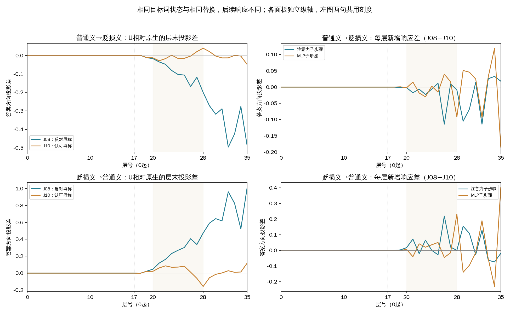

本轮支持“宠物语境中的目标词状态会影响最终分数”，但没有复现新的“误判后被固定干预修好”。两条反对辱称的句子在无词典时已经误判，所有释义与本轮替换均未修复；因此，旧京巴J01/J03上同时判断正确的结果没有稳定延伸到这六条新表述。

此次六条均为新构造、已审核的开发材料，原文没有经过模型输出筛选。J05/J06谈实际宠物，J07/J08反对以地域辱称他人，参考无；J09自己使用辱称、J10认可他人辱称，参考有。D00不提供词典，D01提供地域贬损义，D02提供家犬普通义。沿用当前任务、无示例、单token有／无。U是在第17层将同一句普通义条件下“京巴”两个token的完整内部状态，替换到贬损义运行中；这套规则对六条一律应用，没有按答案挑方向或层。层号均从0开始。

| 材料 | 三种原生条件 | 固定普通义→贬损义U | 本轮能说明什么 |
|---|---|---|---|
| J05/J06：宠物 | 都为无，正确 | 仍为无，正确 | 复现分数干扰与局部干预效应，未复现标签误判/修复 |
| J07/J08：反对辱称 | 都为有，错误 | 仍为有，错误 | 当前规则未解决这两条立场语境中的错误 |
| J09/J10：实施或认可攻击 | 都为有，正确 | 仍为有，正确 | 本轮没有损坏这两条攻击判断 |

三个原生条件和固定规则都是4/6正确；全部24个跨条件端点，包括反向和前置位置对照，都没有翻转标签。“没有翻转”不等于“内部没有发生作用”。下面的分数m是无logit减有logit，正数偏无、负数偏有，不能理解为概率。

在J05/J06中，加入贬损义使m分别从无词典的+25.89/+29.46降至+9.08/+7.14，但尚未越过误判边界。固定目标词替换再将m提高约+5.02/+5.15，达到+14.10/+12.30；对应前置对照仅提高+0.26/+0.16。普通义→贬损义的局部效应约为整段释义替换造成分数差的31.1%/25.4%，这里是分数比值，不是准确率或可分配的中介贡献。反向替换分别为−1.14/−2.42，方向保留但幅度不对称。这支持旧J01的“词典会干扰普通用法、目标词状态参与变化”这一部分，不能称为两次新的纠错复现。

在J07/J08中，贬损义相对无词典也会把分数向正确方向移动一些，但从未让输出变成无。目标词正向替换分别只有+0.345与−0.488；一条略接近正确方向，一条反而更远。不能把这类错误全部归因于新加入的释义，也不能把第17层普通义状态当作立场理解的通用修复。这里保持已审核答案，不因为模型持续判有而改标签。

最值得保留的机制线索来自预先选定的J08/J10对照。两句直到“评论区有人管那个北京网友叫京巴”都完全相同，后面才分别质疑辱称、认可辱称。模型只能向前读取，所以局部状态在尚未看到不同后文时应当相同；本次还实际核对了三个条件下全部36层的京巴状态，真正截断前缀与完整输入捕获均逐元素完全相同。因此，“相同前缀产生相同状态”本身是预期的校验结果。

新增的实验证据是：把同样的局部状态变化放进两句运行，得到不同的后续响应。

| 相同局部替换 | J08：反对辱称的分数变化 | J10：认可辱称的分数变化 |
|---|---:|---:|
| 普通义→贬损义 | −0.488 | −0.048 |
| 贬损义→普通义 | +1.012 | +0.118 |

这说明局部替换的最终效应依赖后面的语境和运行状态，不能直接把词处某个向量等同于最后答案。两方向的响应差分别约−0.440和+0.894，超过本轮分数工程界。可是J08仍错、J10仍对；观察到不同处理并不表示模型已正确理解了两种立场。两句后文长度、措辞与答案位置同时不同，此对照也不把差异全部归于纯粹的立场因素。

图中测量的是答案前位置的答案方向投影：用最终输出头读取每一层的状态，观察有／无倾向。它不等于该层已经作出的决定，也不是注意力权重。左图中J08/J10共用纵轴；四个面板之间纵轴独立，不能只凭曲线高度跨面板比较。右图是两句的干预响应之差在每层注意力、MLP子步骤上的新增量。全部36层保留，20—28层底色沿用既有观察窗口。

在J05/J06的正向替换轨迹中，已有关注的第23层MLP、第26层注意力、第28层MLP仍向最终正效应方向增加分数，但第29/32层注意力及更晚的缩放也很明显；立场语境不呈现同样整齐的模式。本轮没有对这些分支再次干预，所以这是轨迹线索，不是新证明的必要通路。尤其J06第35层MLP子步骤的投影新增约+2.905，其中分支自身投影差约+0.095、既有残差受RMS归一化的缩放差约+2.809。不能把曲线末端的大跳变直接解释成该MLP单独产生了全部判断变化。

12个释义方向中，目标词替换的绝对分数效应均超过配对前置对照，差异超过保守工程界。但前置对照只匹配token数量，没有匹配词性或向量范数；D01/D02仍相差18个token。位置、长度和内容混杂，以及六条相关构造材料的范围，均限制进一步概括。J10两个方向的目标词效应还与供体原生分数差方向相反，提醒我们：局部替换也不等于复制整个供体条件的结论。

下一步更适合围绕一个问题：相同词处改动，为什么在反对与认可的后文中产生不同响应，又为什么没有帮助J08纠错？本报告已用现有数据完成对应的36层响应差，暂不需要再增加句子或进行全头扫描。若继续做GPU机制实验，应先根据这一对照选择少量明确的后续位置或分支并另行冻结，检验改变后文处理能否帮助反对句、同时保留认可句；只有这样的条件性作用站得住，细化到注意力头才更有针对性。这个建议尚未实施，也不声称某个头负责立场识别。

本轮已正常完成378次前向，首次阶段开始至最后GPU释放约4.5分钟；工程加正式阶段合计约3.9分钟。只使用一张L20，控制器与两名工作进程均已退出，主机复查四卡均为空闲。独立复核通过378个完整词表向量、276份轨迹、58,752个汇总数值、24个自身控制和42个单token有／无后EOS端点；没有放宽门槛、重试或重启旧实验。m工程误差界为10⁻⁶，中间单logit读数误差界约3.05×10⁻⁵；这些界用于辨别计算误差，不是统计置信区间。

[完整结果与原文](../results-01/REPORT.md) · [本页统计依据](analysis-summary.json) · [独立审计](../result-audit-01.json) · [固定协议](../prepared-01/PROTOCOL.md) · [旧J01/J03研究结果](../../cross-term-mechanism-v1/interpretation-01/REPORT.md)
