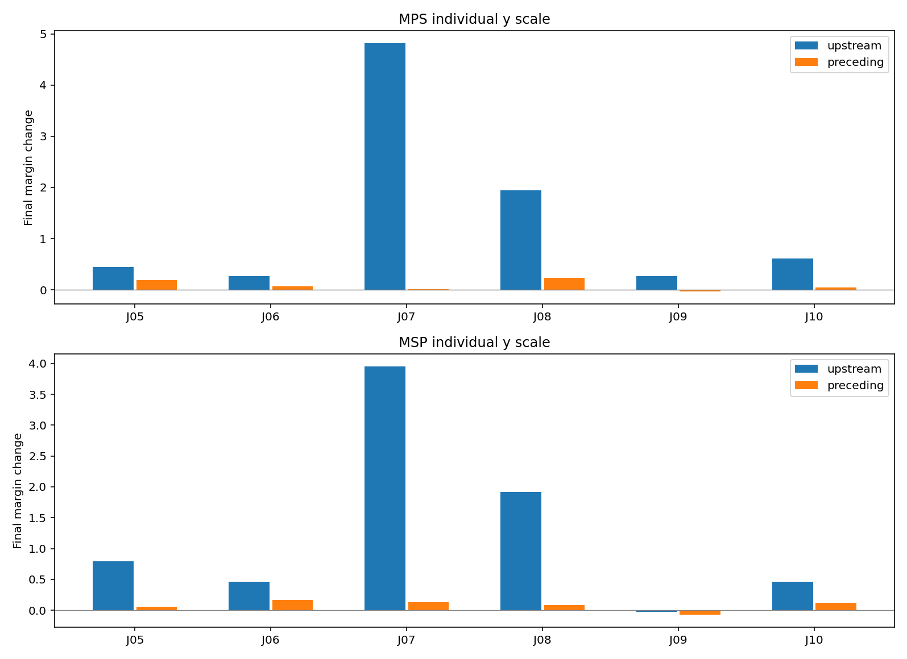
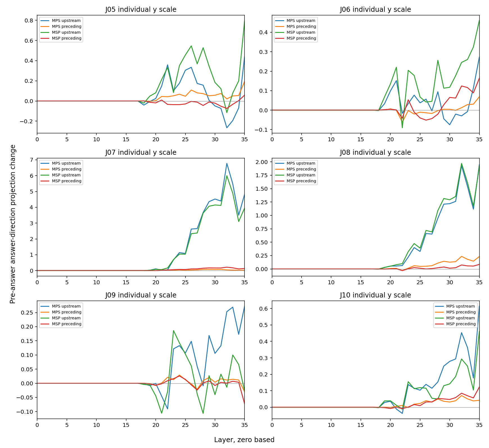

# 无参考局部供体：示例帮助保留检验

固定第17层（0起算）全部京巴两token完整block输出，供体为同句无参考M00，接收MPS/MSP保留四条正确示例。U换京巴；P换紧邻等token前置。所有条件均无词典；没有新文本、关系标签、层或头搜索。

J05/J06宠物、J07/J08反对辱称，参考无；J09/J10实施或赞同攻击，参考有。m=无logit−有logit，正值判无。下表逐条区分参考帮助是否保留；两种混合次序不能当作两份独立查询。

| 查询 | 参考 | 接收组 | 无参考M00 | 混合原生N | U最终 | U−N | P最终 | P−N | U变化 |
|---|---|---|---:|---:|---:|---:|---:|---:|---|
| J05 | 无 | MPS | +25.893070 | +29.604763 | +30.045637 | +0.440874 | +29.799191 | +0.194427 | unchanged |
| J05 | 无 | MSP | +25.893070 | +27.329325 | +28.126669 | +0.797344 | +27.387590 | +0.058266 | unchanged |
| J06 | 无 | MPS | +29.461159 | +28.926952 | +29.198854 | +0.271902 | +28.995718 | +0.068766 | unchanged |
| J06 | 无 | MSP | +29.461159 | +27.123255 | +27.583467 | +0.460213 | +27.286892 | +0.163637 | unchanged |
| J07 | 无 | MPS | -22.529621 | -6.282730 | -1.463211 | +4.819519 | -6.269402 | +0.013329 | unchanged |
| J07 | 无 | MSP | -22.529621 | -5.496624 | -1.546082 | +3.950542 | -5.370804 | +0.125820 | unchanged |
| J08 | 无 | MPS | -14.836433 | +1.677540 | +3.621655 | +1.944115 | +1.909214 | +0.231674 | unchanged |
| J08 | 无 | MSP | -14.836433 | +0.016209 | +1.928268 | +1.912060 | +0.100391 | +0.084183 | unchanged |
| J09 | 有 | MPS | -24.095852 | -20.323421 | -20.051186 | +0.272236 | -20.353474 | -0.030052 | unchanged |
| J09 | 有 | MSP | -24.095852 | -20.073254 | -20.100567 | -0.027313 | -20.145874 | -0.072620 | unchanged |
| J10 | 有 | MPS | -21.539829 | -19.706299 | -19.092346 | +0.613953 | -19.664082 | +0.042217 | unchanged |
| J10 | 有 | MSP | -21.539829 | -17.675556 | -17.215374 | +0.460182 | -17.553173 | +0.122383 | unchanged |

| 条件 | 原生正确 | U正确 | P正确 | U修复 | U损害 | 固定+7正确 |
|---|---:|---:|---:|---|---|---:|
| MPS | 5/6 | 5/6 | 5/6 | 无 | 无 | 6/6 |
| MSP | 5/6 | 5/6 | 5/6 | 无 | 无 | 6/6 |

全层图为答案前中间状态的最终输出头读数，不是注意力权重或后续层的独立因果干预；各子图纵轴独立。attention/MLP新增及RMS分解保存在完整表。

本轮只检验既有示例帮助是否保留，没有建立有害示例条件。即使改善，也不能直接称正确适用性选择；失败则是此固定规则的边界。位置控制未范数/词性匹配，移除示例改变长度/位置；所有材料已暴露且构造相关，没有独立泛化证据。固定+7沿用早期诊断，未在此次拟合，不是参考选择方法。

378次前向；24自身、42精确标签后EOS端点；旧18原生完整向量、状态、轨迹精确重放。独立审计另列。没有网站发布。

[执行协议](../prepared-01/PROTOCOL.md) · [全部输入](../prepared-01/ALL-PROMPTS.md)