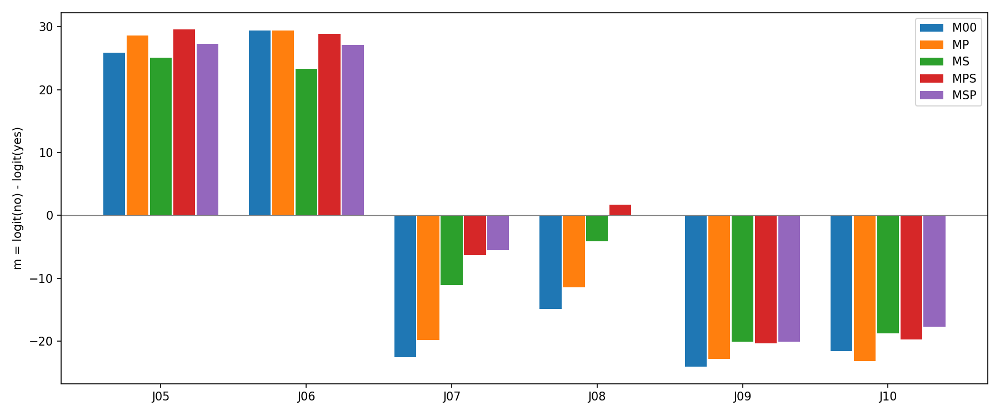
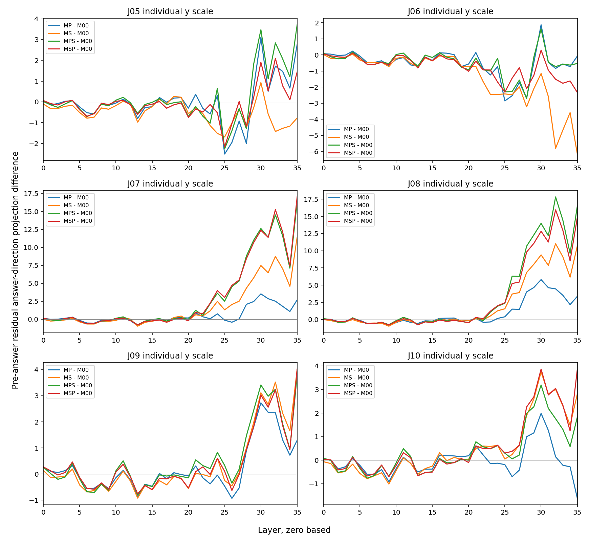

# 正确示例分组与混合：行为入口

本轮只重新组合已审核示例，不新增文本或标签，也没有内部干预。每条查询固定比较五个条件，完整保留失败和顺序差异。

MP是宠物用法组：J01普通宠物无、J04宠物但另有个人攻击有。MS是辱称用法组：J03反对辱称无、J02直接辱称有。M00无示例；MPS先MP后MS，MSP先MS后MP。所有条件都无词典。两条示例组均为无/有，混合组均为无/有/无/有；两个混合组使用同四条文字和同标签位置。

J05/J06普通宠物、J07/J08反对辱称，参考无；J09/J10实施或赞同攻击，参考有。m=无logit−有logit，正值判无。示例正确与对查询是否适用分开，P/S只是用法组，并非已审核的二元适用标签。

| 查询 | 参考 | M00 | MP | MS | MPS | MSP |
|---|---|---:|---:|---:|---:|---:|
| J05 | 无 | +25.893070（无） | +28.653212（无） | +25.116579（无） | +29.604763（无） | +27.329325（无） |
| J06 | 无 | +29.461159（无） | +29.386658（无） | +23.295137（无） | +28.926952（无） | +27.123255（无） |
| J07 | 无 | -22.529621（有） | -19.853443（有） | -11.104652（有） | -6.282730（有） | -5.496624（有） |
| J08 | 无 | -14.836433（有） | -11.463810（有） | -4.121380（有） | +1.677540（无） | +0.016209（无） |
| J09 | 有 | -24.095852（有） | -22.803822（有） | -20.097496（有） | -20.323421（有） | -20.073254（有） |
| J10 | 有 | -21.539829（有） | -23.159492（有） | -18.730312（有） | -19.706299（有） | -17.675556（有） |

正确数：M00=4/6；MP=4/6；MS=4/6；MPS=5/6；MSP=5/6。

| 条件相对M00 | 修复 | 损害 |
|---|---|---|
| MP | 无 | 无 |
| MS | 无 | 无 |
| MPS | J08 | 无 |
| MSP | J08 | 无 |

答案方向投影只是用最终输出头读取答案前中间状态，不能视为注意力权重、该层已经决定答案或示例因果贡献。各查询的全层图纵轴独立；attention/MLP新增及RMS分解在all-trajectories.tsv保存。没有按曲线选层或头。

MP/MS标签数相同但内容及长度不同；两条与四条示例也改变数量和长度。因此不能把它们的差异直接命名为纯适用性或竞争效应。MPS/MSP可检查相同四例对内容块顺序的敏感性，但仍改变各示例的绝对位置。六条相关已暴露查询及四例均不是独立确认样本。

无论混合条件是否修复，都不能单凭这一步宣称模型选择了正确示例。若出现清晰的收益/损害差异，下一步在同一混合prompt中做有限示例位置的内部干预及位置/标签控制；若没有可操控差异，则保留阴性结果，避免直接全头扫描。

工程分数界1e-06、两项差界2ε，不是统计显著性。270次前向、30精确有/无后EOS端点、原生重复/反序/padding/前缀/正式重放均保留；六条M00与旧D00完整输出精确比较。参考答案只在释放GPU后用于判分。

[执行协议](../prepared-01/PROTOCOL.md) · [全部30份prompt](../prepared-01/ALL-PROMPTS.md)