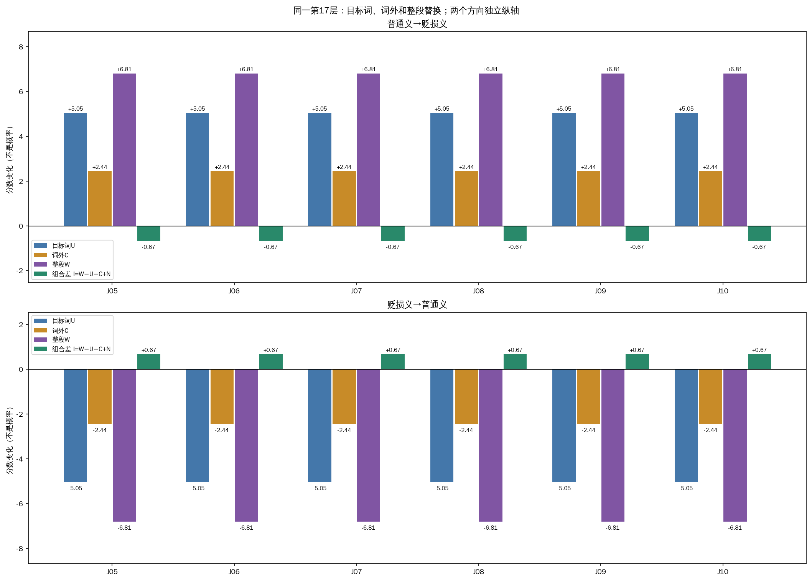
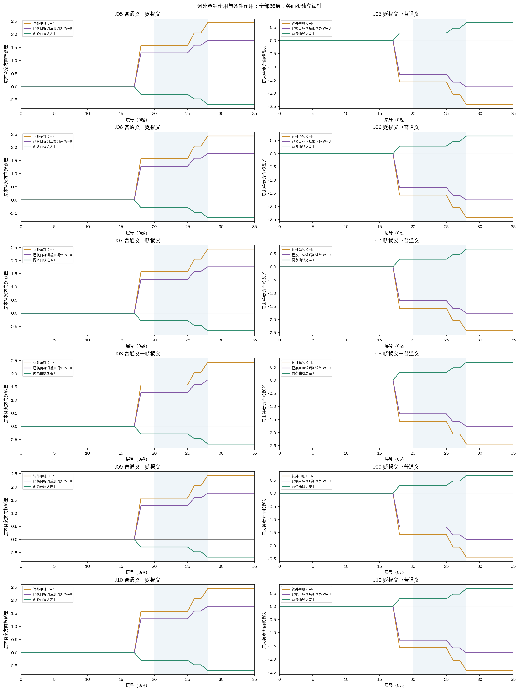
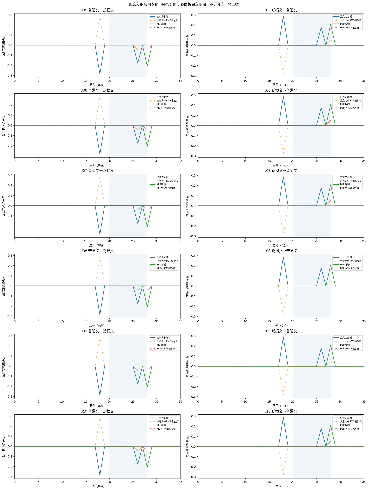

# 京巴第17层：词外查询位置单独替换

固定普通义→贬损义方向，原生正确2/6；目标词U为4/6、词外C为2/6、整段W为4/6。新增C修复：无；新增误判：无。

本轮补的是：不改京巴自身，只换待判断文本中其他位置的第17层完整内部状态。C包含词前、词后以及查询内标点，共15—23token；U只换京巴2token；W把U和C一起换；N不干预。层号从0开始。供体为同一句在另一词典条件下的本轮新鲜状态；词典、任务、模板及答案前位置不换。P仍是前置2token对照，而且属于C，不能作为独立区域与C相加。

D00无词典，D01已审核地域贬损义，D02宠物家犬义。J05/J06宠物、J07/J08反对辱称，参考无；J09/J10实施或认可攻击，参考有。全部是原先已审核且多次观测的开发材料，18份模型prompt保持逐字/token一致。

m=无logit−有logit，正偏无负偏有。我们关注两个量：C−N是词外单独作用；W−U是已经换过目标词后再加入词外的作用。它们之差I=W−U−C+N，表示这两个背景下词外作用的差异。只看到I不为零不构成完整机制解释，需同时看绝对效应、方向、案例差异和标签收益。

| 查询 | 方向 | 目标词 U−N | 词外 C−N | 整段 W−N | 已换目标词后加词外 W−U | 组合差I | C标签 |
|---|---|---:|---:|---:|---:|---:|---|
| J05 | 普通义→贬损义 | +5.045896 | +2.435020 | +6.807179 | +1.761283 | -0.673737 | 有 |
| J05 | 贬损义→普通义 | -5.045896 | -2.435020 | -6.807179 | -1.761283 | +0.673737 | 无 |
| J06 | 普通义→贬损义 | +5.045896 | +2.435020 | +6.807179 | +1.761283 | -0.673737 | 有 |
| J06 | 贬损义→普通义 | -5.045896 | -2.435020 | -6.807179 | -1.761283 | +0.673737 | 无 |
| J07 | 普通义→贬损义 | +5.045896 | +2.435020 | +6.807179 | +1.761283 | -0.673737 | 有 |
| J07 | 贬损义→普通义 | -5.045896 | -2.435020 | -6.807179 | -1.761283 | +0.673737 | 无 |
| J08 | 普通义→贬损义 | +5.045896 | +2.435020 | +6.807179 | +1.761283 | -0.673737 | 有 |
| J08 | 贬损义→普通义 | -5.045896 | -2.435020 | -6.807179 | -1.761283 | +0.673737 | 无 |
| J09 | 普通义→贬损义 | +5.045896 | +2.435020 | +6.807179 | +1.761283 | -0.673737 | 有 |
| J09 | 贬损义→普通义 | -5.045896 | -2.435020 | -6.807179 | -1.761283 | +0.673737 | 无 |
| J10 | 普通义→贬损义 | +5.045896 | +2.435020 | +6.807179 | +1.761283 | -0.673737 | 有 |
| J10 | 贬损义→普通义 | -5.045896 | -2.435020 | -6.807179 | -1.761283 | +0.673737 | 无 |

I也等于“已有词外时目标词的作用(W−C)−目标词单独作用(U−N)”。正I仅表示分数尺度上的额外正向差，不能自动称为协同或改善；负I也不能自动称为相互抑制。完整四格分数见[交互数据表](query-interactions.tsv)。

| 查询 | 参考 | D00 | D01 | D02 | U→D01 | C→D01 | W→D01 | P→D01 |
|---|---|---:|---:|---:|---:|---:|---:|---:|
| J05 | 无 | +3.206022 | -3.206022 | +3.206022 | +1.839874 | -0.771002 | +3.601157 | -2.727348 |
| J06 | 无 | +3.206022 | -3.206022 | +3.206022 | +1.839874 | -0.771002 | +3.601157 | -2.727348 |
| J07 | 无 | +3.206022 | -3.206022 | +3.206022 | +1.839874 | -0.771002 | +3.601157 | -2.727348 |
| J08 | 无 | +3.206022 | -3.206022 | +3.206022 | +1.839874 | -0.771002 | +3.601157 | -2.727348 |
| J09 | 有 | +3.206022 | -3.206022 | +3.206022 | +1.839874 | -0.771002 | +3.601157 | -2.727348 |
| J10 | 有 | +3.206022 | -3.206022 | +3.206022 | +1.839874 | -0.771002 | +3.601157 | -2.727348 |

J07/J08在三个原生词典条件下均误判；这里没有一个已判断正确的原生供体。因此没有修复不能直接等同于没有传递，分数传递也不能直接等同于选择性正确利用。

图中读数在答案前位置，最终输出头对中间状态的投影并非每层已完成的最终决定。保留所有36层，20—28底色只沿用旧观察窗口。所有轨迹面板独立纵轴。

新增差同时受注意力/MLP分支和已有残差的RMS归一化缩放影响；注意力分支不是注意力关注量。这些曲线本身没有新增分支、头或层干预，不能据此命名因果模块。

| 查询 | 接收条件 | U/C/W token数 | U扰动L2 | C扰动L2 | W扰动L2 |
|---|---|---|---:|---:|---:|
| J05 | D01 | 2/3/5 | 32.000000 | 39.191836 | 50.596443 |
| J05 | D02 | 2/3/5 | 32.000000 | 39.191836 | 50.596443 |
| J06 | D01 | 2/3/5 | 32.000000 | 39.191836 | 50.596443 |
| J06 | D02 | 2/3/5 | 32.000000 | 39.191836 | 50.596443 |
| J07 | D01 | 2/3/5 | 32.000000 | 39.191836 | 50.596443 |
| J07 | D02 | 2/3/5 | 32.000000 | 39.191836 | 50.596443 |
| J08 | D01 | 2/3/5 | 32.000000 | 39.191836 | 50.596443 |
| J08 | D02 | 2/3/5 | 32.000000 | 39.191836 | 50.596443 |
| J09 | D01 | 2/3/5 | 32.000000 | 39.191836 | 50.596443 |
| J09 | D02 | 2/3/5 | 32.000000 | 39.191836 | 50.596443 |
| J10 | D01 | 2/3/5 | 32.000000 | 39.191836 | 50.596443 |
| J10 | D02 | 2/3/5 | 32.000000 | 39.191836 | 50.596443 |

U/C位置不重叠且恰好覆盖W，扰动平方范数可相加是几何事实，不要求最终分数可相加。两组并未匹配token数、范数或词性；C混合多个位置，不能直接归因于某个后文词或立场表示。两定义长度相差18token，位置/长度混杂仍保留。注入组合状态可能偏离自然前向，I是本干预条件下的有限交互，不能当作自然通路的分摊比例。

工程分数界为1e-06；两个分数差界2ε，I的四项界4ε=4e-06。I有12/12项可在该工程界外分辨，但这不是统计显著性或实际重要性的阈值。中间单logit投影界1e-06。

沿用纯CPU固定m+7对照，主方向正确4/6；没有新拟合或模型前向，来源仍是旧暴露开发结果上的事后诊断，不是独立方法验证。

本轮通常594次前向，48自身控制与66格式端点；正常释放后独立核查全部分数/轨迹/交互，18原生+36旧U/P/W完整向量与轨迹和18完整状态银行必须精确重放上一轮。旧数据不代替新结果。所有六条、双向、例外及无收益结果都保留，没有按新结果筛层/词/条件。

[全部干预](all-interventions.tsv) · [交互和四格分数](query-interactions.tsv) · [全部36层轨迹](all-trajectories.tsv) · [原生分数](baselines.tsv) · [结构化结果](results.json) · [协议](../prepared-01/PROTOCOL.md)

本轮原文：

J05（参考无）：synthetic

J06（参考无）：synthetic

J07（参考无）：synthetic

J08（参考无）：synthetic

J09（参考有）：synthetic

J10（参考有）：synthetic

