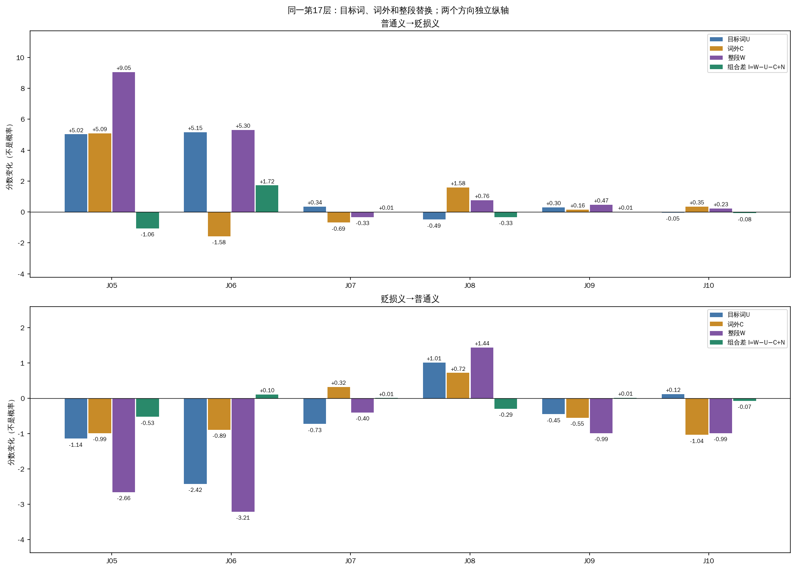

# 词外位置单独替换：这一步多知道了什么？

**这一轮把“模型过程复杂”缩小成了可以核查的案例差异：有些句子中两部分的最终效应接近相加；有些句子中，词外位置单独替换与在目标词已替换后再加入词外，作用明显不同。** 但它仍没有带来新的正确判断。

本轮只新增C：在第17层（从0开始），把待判断文本中除京巴以外的所有token，换成同一句在另一释义条件下的内部状态。沿用六条原文、参考、任务和词典。U只换京巴；C只换词外；W两部分一起换；N不干预。词外同时包含前文、后文和查询内标点，不等于某个单独语义因素。

下面先看固定主方向：普通家犬义状态→贬损义运行。m=无logit−有logit，增加偏无、减少偏有。表中数值均为相对原生的变化，最后一列是整体变化减去两部分单独变化之和。

| 查询 | 只换京巴 U−N | 只换词外 C−N | 一起换 W−N | 组合差 I |
|---|---:|---:|---:|---:|
| J05 | +5.024063 | +5.087406 | +9.051056 | -1.060413 |
| J06 | +5.154789 | -1.575848 | +5.300022 | +1.721081 |
| J07 | +0.344563 | -0.687492 | -0.329533 | +0.013397 |
| J08 | -0.488094 | +1.582916 | +0.763264 | -0.331558 |
| J09 | +0.295750 | +0.159218 | +0.467190 | +0.012222 |
| J10 | -0.048225 | +0.354164 | +0.228867 | -0.077072 |

**J06最能说明为什么不能把“整段只多了一点”读成“词外几乎没有作用”。** 只换京巴使分数增加+5.155；只换词外反而减少−1.576。若把两项单独变化直接相加，会得到+3.579；实际一起换是+5.300，多出+1.721。等价地，在京巴已经换过的背景下，再加入词外的作用是+0.145，和它单独替换时的−1.576不同，连方向也变了。

这里能说的是：在这次具体干预下，词外的效果取决于目标词是否已经替换。不能把“−1.576与+1.721”当成两条分别测得的自然通路，也不能由此命名为正确词义选择。反向仍保留：J06只换词外−0.893，已换目标词后加入词外−0.789，组合差只有+0.104；较大的+1.721并没有在反向等幅复现。J06原文还有北京地名，C把它与宠物后文一起纳入，当前无法区分各自作用。

**J05与J06的普通宠物语境并不共享同一种数值关系。** J05目标词和词外单独都约+5，一起是+9.051，比简单相加的+10.111少1.060。反向组合差−0.525则使整体负向变化比两项相加更大。因此负的I不能一概叫作“抑制”，正的I也不能自动叫作“改善”。

**J07和J09在最终分数上接近相加。** J07主方向两项之和−0.343，实际整体−0.330，差+0.013；J09之和+0.455，实际+0.467，差+0.012。反向差也仅+0.006和+0.013。它们都超过工程误差界，但绝对量很小。复杂模型在这些具体干预和分数尺度上仍可以呈现近似相加；这不证明全部层或整个模型线性。

**J08和J10上一轮出现的方向变化，更多可由词外单独作用的方向解释。** J08主方向目标词−0.488、词外+1.583，整体+0.763，组合差−0.332。J10主方向目标词−0.048、词外+0.354，整体+0.229；反向目标词+0.118、词外−1.035，整体−0.990。这些数据支持词外位置作为整体有不同于目标词的影响，仍不能定位到某个词或注意力头。

图的两个方向使用独立纵轴。全部双向数值、两类条件效应和36层轨迹在[完整报告](../results-01/REPORT.md)中保留。主方向相加表没有替代反向对照，也没有按本轮结果剔除查询。

**层曲线还提醒我们，不要把末层的投影变化全部理解成某个分支新写入的信息。** 例如J06主方向第35层MLP步骤对组合差的新增约+0.911，分解为分支投影−0.183、已有残差RMS缩放+1.094和很小的浮点余项。这里只是已采集轨迹的代数分解，不是新的MLP因果干预；不能据此直接宣称找到一个产生+1.094语义贡献的模块。

**任务结果没有改善：N、U、C、W、P主方向仍全部4/6正确。** 新增C的双向12个端点均无标签翻转，J07/J08仍误判。它们在无词典、贬损义和普通义下原本都错，当前也没有正确供体这个前提。统一加7的旧CPU诊断仍4/6；没有新增拟合。

因此，这一步新增的是对具体效应组成的约束：J06的近零额外变化掩盖了条件作用差异，J07/J09最终差异则很小；它没有建立统一纠错方法。C包含15—23token，U仅2token，范数/词性不匹配；两定义位置差18token、相关构造材料与内部组合状态的限制都保留。

若后续仍按最小步幅推进，可优先围绕J06这个明确的条件差异提出单一可检验假设，同时保留J05等对照；本轮没有启动下一项材料、位置、层或头实验。不能仅凭“哪里曲线最大”决定下一步，也不把12个方向当作12个独立案例。

核查记录：594次真实前向、48自身控制、66格式端点全部通过。独立120位小数/扩展精度复核444条轨迹、102816个汇总标量及12个组合对比；18原生+36旧U/P/W的完整向量、54条轨迹和18完整状态银行与上轮逐值相等。全部I都可超出4ε=4e−6的工程界分辨，但工程可分辨不等于科学重要或统计显著。GPU所属进程已正常退出，四卡均空闲；没有网站发布。

[完整报告](../results-01/REPORT.md) · [独立复核](../result-audit-01.json) · [运行协议](../prepared-01/PROTOCOL.md) · [资源释放](../process-release-check.json)
