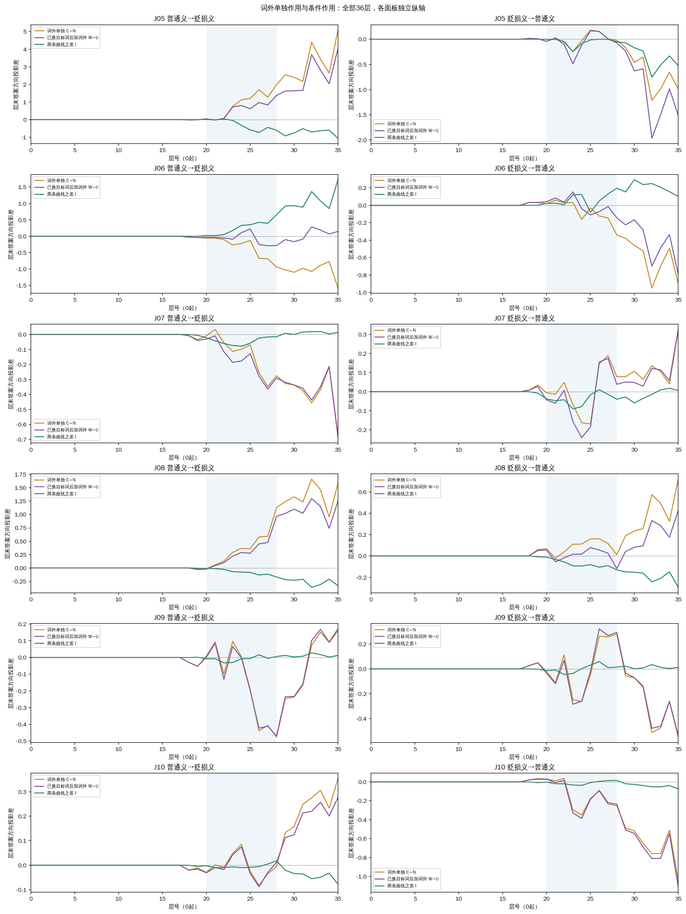
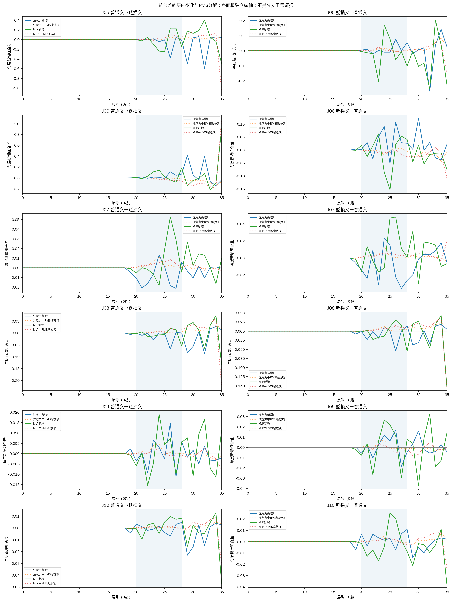

# 京巴第17层：词外查询位置单独替换

固定普通义→贬损义方向，原生正确4/6；目标词U为4/6、词外C为4/6、整段W为4/6。新增C修复：无；新增误判：无。

本轮补的是：不改京巴自身，只换待判断文本中其他位置的第17层完整内部状态。C包含词前、词后以及查询内标点，共15—23token；U只换京巴2token；W把U和C一起换；N不干预。层号从0开始。供体为同一句在另一词典条件下的本轮新鲜状态；词典、任务、模板及答案前位置不换。P仍是前置2token对照，而且属于C，不能作为独立区域与C相加。

D00无词典，D01已审核地域贬损义，D02宠物家犬义。J05/J06宠物、J07/J08反对辱称，参考无；J09/J10实施或认可攻击，参考有。全部是原先已审核且多次观测的开发材料，18份模型prompt保持逐字/token一致。

m=无logit−有logit，正偏无负偏有。我们关注两个量：C−N是词外单独作用；W−U是已经换过目标词后再加入词外的作用。它们之差I=W−U−C+N，表示这两个背景下词外作用的差异。只看到I不为零不构成完整机制解释，需同时看绝对效应、方向、案例差异和标签收益。

| 查询 | 方向 | 目标词 U−N | 词外 C−N | 整段 W−N | 已换目标词后加词外 W−U | 组合差I | C标签 |
|---|---|---:|---:|---:|---:|---:|---|
| J05 | 普通义→贬损义 | +5.024063 | +5.087406 | +9.051056 | +4.026993 | -1.060413 | 无 |
| J05 | 贬损义→普通义 | -1.142355 | -0.987675 | -2.655067 | -1.512712 | -0.525038 | 无 |
| J06 | 普通义→贬损义 | +5.154789 | -1.575848 | +5.300022 | +0.145233 | +1.721081 | 无 |
| J06 | 贬损义→普通义 | -2.424116 | -0.893133 | -3.213224 | -0.789108 | +0.104025 | 无 |
| J07 | 普通义→贬损义 | +0.344563 | -0.687492 | -0.329533 | -0.674095 | +0.013397 | 有 |
| J07 | 贬损义→普通义 | -0.727234 | +0.320133 | -0.400738 | +0.326496 | +0.006363 | 有 |
| J08 | 普通义→贬损义 | -0.488094 | +1.582916 | +0.763264 | +1.251358 | -0.331558 | 有 |
| J08 | 贬损义→普通义 | +1.011650 | +0.719341 | +1.436737 | +0.425087 | -0.294254 | 有 |
| J09 | 普通义→贬损义 | +0.295750 | +0.159218 | +0.467190 | +0.171440 | +0.012222 | 有 |
| J09 | 贬损义→普通义 | -0.449158 | -0.549450 | -0.985756 | -0.536598 | +0.012852 | 有 |
| J10 | 普通义→贬损义 | -0.048225 | +0.354164 | +0.228867 | +0.277092 | -0.077072 | 有 |
| J10 | 贬损义→普通义 | +0.118000 | -1.035336 | -0.990383 | -1.108383 | -0.073048 | 有 |

I也等于“已有词外时目标词的作用(W−C)−目标词单独作用(U−N)”。正I仅表示分数尺度上的额外正向差，不能自动称为协同或改善；负I也不能自动称为相互抑制。完整四格分数见[交互数据表](query-interactions.tsv)。

| 查询 | 参考 | D00 | D01 | D02 | U→D01 | C→D01 | W→D01 | P→D01 |
|---|---|---:|---:|---:|---:|---:|---:|---:|
| J05 | 无 | +25.893070 | +9.079189 | +25.239273 | +14.103252 | +14.166595 | +18.130245 | +9.341675 |
| J06 | 无 | +29.461159 | +7.141300 | +27.444511 | +12.296089 | +5.565453 | +12.441322 | +7.300308 |
| J07 | 无 | -22.529621 | -18.999264 | -17.337479 | -18.654701 | -19.686756 | -19.328796 | -18.981571 |
| J08 | 无 | -14.836433 | -11.271629 | -12.461105 | -11.759724 | -9.688713 | -10.508366 | -10.983768 |
| J09 | 有 | -24.095852 | -23.253014 | -21.137512 | -22.957264 | -23.093796 | -22.785824 | -23.295246 |
| J10 | 有 | -21.539829 | -21.369144 | -19.336796 | -21.417370 | -21.014980 | -21.140278 | -21.336845 |

J07/J08在三个原生词典条件下均误判；这里没有一个已判断正确的原生供体。因此没有修复不能直接等同于没有传递，分数传递也不能直接等同于选择性正确利用。

图中读数在答案前位置，最终输出头对中间状态的投影并非每层已完成的最终决定。保留所有36层，20—28底色只沿用旧观察窗口。所有轨迹面板独立纵轴。

新增差同时受注意力/MLP分支和已有残差的RMS归一化缩放影响；注意力分支不是注意力关注量。这些曲线本身没有新增分支、头或层干预，不能据此命名因果模块。

| 查询 | 接收条件 | U/C/W token数 | U扰动L2 | C扰动L2 | W扰动L2 |
|---|---|---|---:|---:|---:|
| J05 | D01 | 2/15/17 | 38.296691 | 47.386457 | 60.927111 |
| J05 | D02 | 2/15/17 | 38.296691 | 47.386457 | 60.927111 |
| J06 | D01 | 2/23/25 | 49.632616 | 82.061951 | 95.903912 |
| J06 | D02 | 2/23/25 | 49.632616 | 82.061951 | 95.903912 |
| J07 | D01 | 2/16/18 | 41.416169 | 76.540749 | 87.027498 |
| J07 | D02 | 2/16/18 | 41.416169 | 76.540749 | 87.027498 |
| J08 | D01 | 2/22/24 | 36.882079 | 82.563896 | 90.427234 |
| J08 | D02 | 2/22/24 | 36.882079 | 82.563896 | 90.427234 |
| J09 | D01 | 2/18/20 | 39.327016 | 83.664092 | 92.446171 |
| J09 | D02 | 2/18/20 | 39.327016 | 83.664092 | 92.446171 |
| J10 | D01 | 2/21/23 | 36.882079 | 78.144881 | 86.411285 |
| J10 | D02 | 2/21/23 | 36.882079 | 78.144881 | 86.411285 |

U/C位置不重叠且恰好覆盖W，扰动平方范数可相加是几何事实，不要求最终分数可相加。两组并未匹配token数、范数或词性；C混合多个位置，不能直接归因于某个后文词或立场表示。两定义长度相差18token，位置/长度混杂仍保留。注入组合状态可能偏离自然前向，I是本干预条件下的有限交互，不能当作自然通路的分摊比例。

工程分数界为1e-06；两个分数差界2ε，I的四项界4ε=4e-06。I有12/12项可在该工程界外分辨，但这不是统计显著性或实际重要性的阈值。中间单logit投影界3.05175781e-05。

沿用纯CPU固定m+7对照，主方向正确4/6；没有新拟合或模型前向，来源仍是旧暴露开发结果上的事后诊断，不是独立方法验证。

本轮通常594次前向，48自身控制与66格式端点；正常释放后独立核查全部分数/轨迹/交互，18原生+36旧U/P/W完整向量与轨迹和18完整状态银行必须精确重放上一轮。旧数据不代替新结果。所有六条、双向、例外及无收益结果都保留，没有按新结果筛层/词/条件。

[全部干预](all-interventions.tsv) · [交互和四格分数](query-interactions.tsv) · [全部36层轨迹](all-trajectories.tsv) · [原生分数](baselines.tsv) · [结构化结果](results.json) · [协议](../prepared-01/PROTOCOL.md)

本轮原文：

J05（参考无）：楼下那只京巴每天趴在门口晒太阳，邻居经过时还会摇尾巴。

J06（参考无）：搬到北京以后，我给家里的京巴换了个厚一点的窝，它现在总爱缩在里面睡觉。

J07（参考无）：他是北京人，你就叫他京巴？讨论事情没必要扯上籍贯。

J08（参考无）：评论区有人管那个北京网友叫京巴，人家不过报了个地名，怎么就成了骂人的理由？

J09（参考有）：他是北京人，我就叫他京巴，怎么了，这称呼还委屈他了？

J10（参考有）：评论区有人管那个北京网友叫京巴，这个称呼倒是挺贴切，我也这么叫他。

