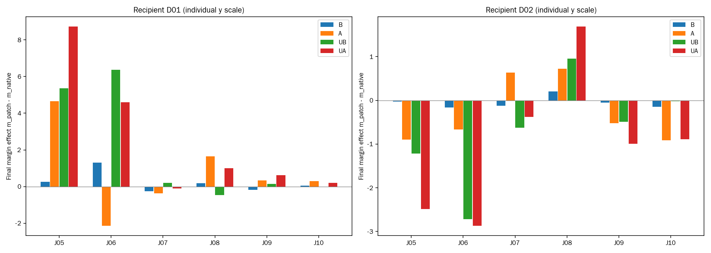

# 查询前后分解：把差异缩小到哪里？

**J06此前较大的组合差，主要体现为目标词与后文之间的条件依赖；前文单独的作用方向与后文相反。** 但这并没有带来新的正确判断，也没有得到适用于所有宠物语境的同向规律。

本轮仍用J05—J10。J05/J06描述宠物，J07/J08反对辱称，参考无；J09/J10实施或赞同攻击，参考有。将同一句普通犬义条件的状态放入贬损义条件，固定第17层（0起算）完整block输出。B换京巴前面全部查询token，U换京巴两token，A换后面全部查询token；另做UB、UA以及既有词外C=B+A、整段W。反方向全部保留。

m=无logit−有logit。下表都是相对不干预的分数变化，正值偏向无。

| 查询 | 只换前文 B | 只换后文 A | 已换京巴后，再加前文 | 已换京巴后，再加后文 |
|---|---:|---:|---:|---:|
| J05 | +0.262486 | +4.654953 | +0.327160 | +3.696056 |
| J06 | +1.304829 | -2.130562 | +1.207092 | -0.552765 |
| J07 | -0.248005 | -0.360435 | -0.132191 | -0.443165 |
| J08 | +0.192867 | +1.641098 | +0.021172 | +1.497738 |
| J09 | -0.172226 | +0.347557 | -0.142673 | +0.336411 |
| J10 | +0.050072 | +0.300129 | +0.029442 | +0.255127 |

**J06不是“词外几乎不重要”，也不能简单归因于前文中的北京地名。** 前文B单独使分数增加1.305，后文A单独使分数减少2.131；目标词已替换后，后文的作用缩小为约−0.553。两者相差+1.578，解释了此前词内与词外交互+1.721中的主要数值部分。与前文的对应交互约−0.098，三区域剩余有限差分约+0.241；三项恰好合成+1.721。

这里“主要”指这些预先定义比较在最终分数上的大小，不是中介比例。B仍包含北京及其他词，A包含其余宠物叙述、标点等多个位置；本轮没有单独干预北京或某个后文词，也不能把后文集合命名为某一条语义通路。

**J05说明这不是统一的宠物处理规则。** 它后文单独为+4.655，目标词替换后再加后文为+3.696，对应交互−0.959，与J06的+1.578相反。反向也保留：J05对应交互−0.442，J06+0.221，不能把主方向较大的数值当成双向等幅规律。

**J07的小总差包含抵消。** 主方向前文相关交互+0.116、后文相关交互−0.083、三区域剩余−0.020，合成约+0.013。反向为+0.219、−0.281、+0.068，合成约+0.006。总结果接近相加，并不意味着拆开后每一项都接近零。

图中B/A/UB/UA是四种完整干预相对原生的效应；两个方向的纵轴独立。全部36层交互轨迹见[完整报告](../results-01/REPORT.md)。全层图在17层之后才开始偏离；后续投影是传播读数，不等于对某个后续层或头的因果证明。

**任务层面仍是4/6，96个跨条件端点均没有翻转标签。** 两条反对辱称的J07/J08仍错；普通与攻击语境原来正确的判断也保持。此次结果进一步约束了前后区域的具体效应，但没有增加通用修复证据。因此不继续沿着最大曲线做逐头搜索；窗口内下一项转向固定无词典供体，检验更易复用的规则能否改善修复与损害的组合。

该规则不依赖当前这组交互值去选层、强度或查询，层17沿用此前选择。无词典也不保证供体正确，将在已有12条跨词条材料上与直接去掉词典、普通义供体和位置控制比较。

独立120位十进制/扩展精度审计通过1026完整输出、780轨迹、190944汇总标量和全部区域分解；66旧端点与18状态银行精确重放。J05的B与P位置相同，其完整输出与轨迹也相同。截止守护未触发，GPU进程正常退出；未发布网站。材料、范数/词性及定义长度混杂等限制在完整协议中保留。

[完整报告](../results-01/REPORT.md) · [独立复核](../result-audit-01.json) · [协议](../prepared-01/PROTOCOL.md)
