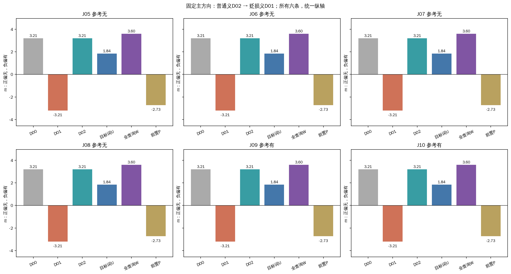
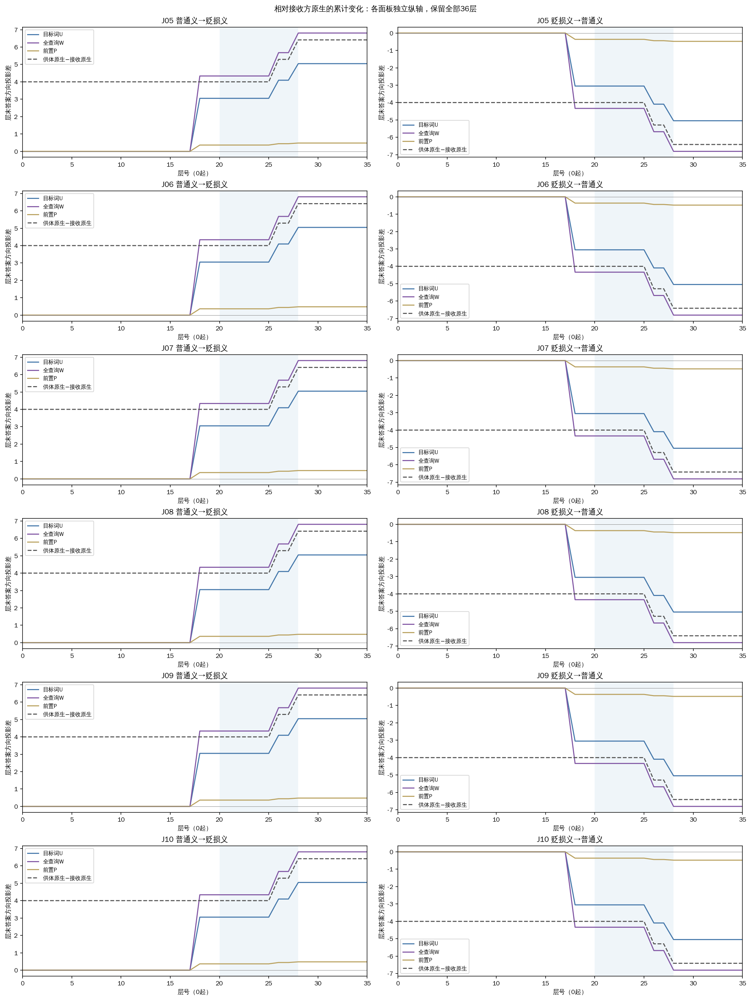
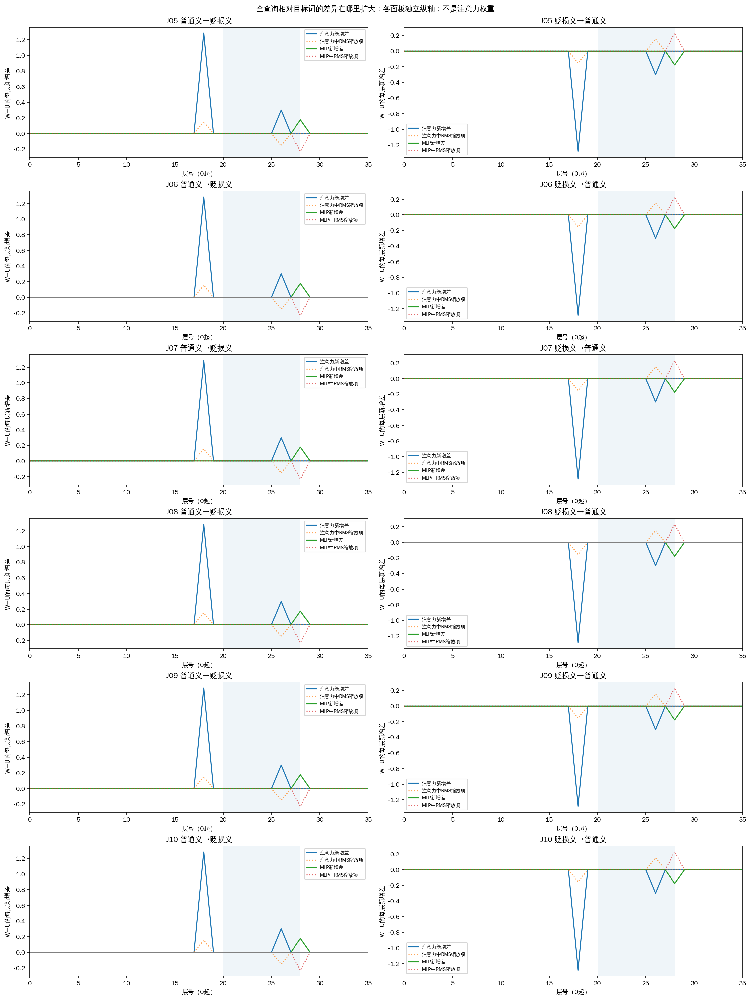

# 京巴第17层：目标词与整段查询替换

在六条已审核且已观测的开发材料上，固定普通义→贬损义方向，原生正确2/6；替换京巴两个token后正确4/6；替换整段查询后正确4/6。全查询替换修复：J05,J06,J07,J08；新增误判：J09,J10。

本轮问的是：只改目标词时传递不充分的释义影响，是否分布在查询的其他位置？W把同一查询在另一释义条件下第17层的整段查询状态搬入，U只搬入京巴两个token；P搬入紧邻前方的两个token。层号从0开始。词典、任务指令、聊天模板和答案前位置不在替换范围。

D00无词典；D01为已审核的地域贬损义；D02为宠物家犬义。普通义→贬损义表示接收方仍看到贬损义词典，只在内部注入普通义条件的查询状态。m=无logit−有logit，正偏无，负偏有。分数不是概率；方向是否有利要结合参考答案。

| 查询 | 参考 | D00 | D01 | D02 | U→D01 | W→D01 | P→D01 |
|---|---|---:|---:|---:|---:|---:|---:|
| J05 | 无 | +3.206022 | -3.206022 | +3.206022 | +1.839874 | +3.601157 | -2.727348 |
| J06 | 无 | +3.206022 | -3.206022 | +3.206022 | +1.839874 | +3.601157 | -2.727348 |
| J07 | 无 | +3.206022 | -3.206022 | +3.206022 | +1.839874 | +3.601157 | -2.727348 |
| J08 | 无 | +3.206022 | -3.206022 | +3.206022 | +1.839874 | +3.601157 | -2.727348 |
| J09 | 有 | +3.206022 | -3.206022 | +3.206022 | +1.839874 | +3.601157 | -2.727348 |
| J10 | 有 | +3.206022 | -3.206022 | +3.206022 | +1.839874 | +3.601157 | -2.727348 |

下面同时保留双向绝对变化。最后一列为“U到供体原生的距离−W到供体原生的距离”，正数表示W更接近供体结果。它不等于准确率、独立路径贡献或中介份额。

| 查询 | 方向 | U−原生 | W−原生 | W−U | 距供体缩短 | W标签 |
|---|---|---:|---:|---:|---:|---|
| J05 | 普通义→贬损义 | +5.045896 | +6.807179 | +1.761283 | +0.971012 | 无 |
| J05 | 贬损义→普通义 | -5.045896 | -6.807179 | -1.761283 | +0.971012 | 有 |
| J06 | 普通义→贬损义 | +5.045896 | +6.807179 | +1.761283 | +0.971012 | 无 |
| J06 | 贬损义→普通义 | -5.045896 | -6.807179 | -1.761283 | +0.971012 | 有 |
| J07 | 普通义→贬损义 | +5.045896 | +6.807179 | +1.761283 | +0.971012 | 无 |
| J07 | 贬损义→普通义 | -5.045896 | -6.807179 | -1.761283 | +0.971012 | 有 |
| J08 | 普通义→贬损义 | +5.045896 | +6.807179 | +1.761283 | +0.971012 | 无 |
| J08 | 贬损义→普通义 | -5.045896 | -6.807179 | -1.761283 | +0.971012 | 有 |
| J09 | 普通义→贬损义 | +5.045896 | +6.807179 | +1.761283 | +0.971012 | 无 |
| J09 | 贬损义→普通义 | -5.045896 | -6.807179 | -1.761283 | +0.971012 | 有 |
| J10 | 普通义→贬损义 | +5.045896 | +6.807179 | +1.761283 | +0.971012 | 无 |
| J10 | 贬损义→普通义 | -5.045896 | -6.807179 | -1.761283 | +0.971012 | 有 |

W在12/12个方向比U更接近供体原生分数，0/12个方向更远。两个方向不是两份独立样本。

曲线用最终输出头读取答案前的中间状态，不能当作该层已经作出的最终决定。各面板纵轴独立。每层新增差可能来自分支输出，也可能来自RMS归一化对已有残差的缩放；两部分都保留。

为了判断标签表现是否仅相当于整体更偏向无，另做了纯CPU的m+7对照。常数7来自之前讨论对旧12条跨词条结果的事后检查，本轮在GPU执行前固定，未对新结果调参。它没有新的模型前向，也不是模型实际输出。

| 查询 | 原生D01 m | 加7后m | 加7标签 | 参考 | W标签 |
|---|---:|---:|---|---|---|
| J05 | -3.206022 | +3.793978 | 无 | 无 | 无 |
| J06 | -3.206022 | +3.793978 | 无 | 无 | 无 |
| J07 | -3.206022 | +3.793978 | 无 | 无 | 无 |
| J08 | -3.206022 | +3.793978 | 无 | 无 | 无 |
| J09 | -3.206022 | +3.793978 | 无 | 有 | 无 |
| J10 | -3.206022 | +3.793978 | 无 | 有 | 无 |

统一加7正确4/6。相同正确数或标签并不证明内部效应就是常数偏移；它只限制能从标签收益得出的结论。材料均已暴露，不能称为独立方法验证。

| 查询 | 接收条件 | U token数 | W token数 | U扰动L2 | W扰动L2 |
|---|---|---:|---:|---:|---:|
| J05 | D01 | 2 | 5 | 32.000000 | 50.596443 |
| J05 | D02 | 2 | 5 | 32.000000 | 50.596443 |
| J06 | D01 | 2 | 5 | 32.000000 | 50.596443 |
| J06 | D02 | 2 | 5 | 32.000000 | 50.596443 |
| J07 | D01 | 2 | 5 | 32.000000 | 50.596443 |
| J07 | D02 | 2 | 5 | 32.000000 | 50.596443 |
| J08 | D01 | 2 | 5 | 32.000000 | 50.596443 |
| J08 | D02 | 2 | 5 | 32.000000 | 50.596443 |
| J09 | D01 | 2 | 5 | 32.000000 | 50.596443 |
| J09 | D02 | 2 | 5 | 32.000000 | 50.596443 |
| J10 | D01 | 2 | 5 | 32.000000 | 50.596443 |
| J10 | D02 | 2 | 5 | 32.000000 | 50.596443 |

W改变17—25token，U只改变2token，扰动范数也不同。W与U的差不能直接归给某一个后文位置；本轮未做“其余位置单独替换”，也没有范数匹配，因此不能分解非加性交互。W后续仍可读取接收方原词典，和从头使用另一种词典也不是同一运行。

J08/J10直到京巴的token前缀相同，但整段查询不同。捕获银行扩展到查询全文，本轮真正截断前向到查询末尾；焦点前缀相等与焦点状态比较另行保留，不能把它说成再次运行了仅到京巴的前缀。

工程分数界1e-06，单logit投影界1e-06；W−U为2倍分数界，与供体距离改善保守用4倍。486次前向的正常预算含36自身控制和54标签/EOS端点。高精度独立审计、旧42端点重放和进程释放凭据在科学关闭时另外保存。

所有六条和双向保留；18份prompt与已审核版本逐字/token相同。没有新层、头或下游分支恢复，没有网站发布。相关构造材料、释义长度相差18token、后文措辞和长度同时变化等限制仍存在。研究最终仍须走向不依赖测试金标签的选择性利用方法及独立任务验证，不能用本轮局部机制结果代替。

[绝对分数](baselines.tsv) · [所有干预及范数](all-interventions.tsv) · [W与U比较](scope-comparisons.tsv) · [全部36层](all-trajectories.tsv) · [CPU偏移对照](CPU-score-shift.tsv) · [结构化结果](results.json)

本轮原文：

J05（参考无）：synthetic

J06（参考无）：synthetic

J07（参考无）：synthetic

J08（参考无）：synthetic

J09（参考有）：synthetic

J10（参考有）：synthetic

